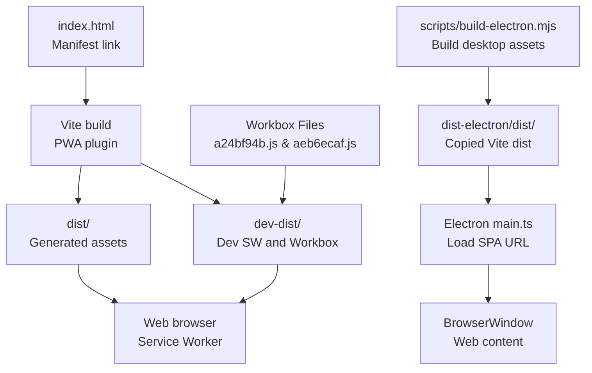
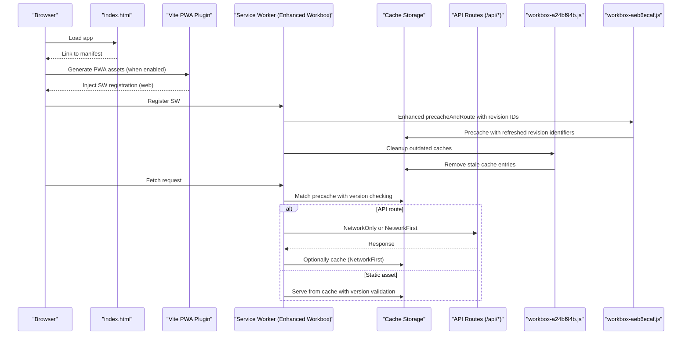
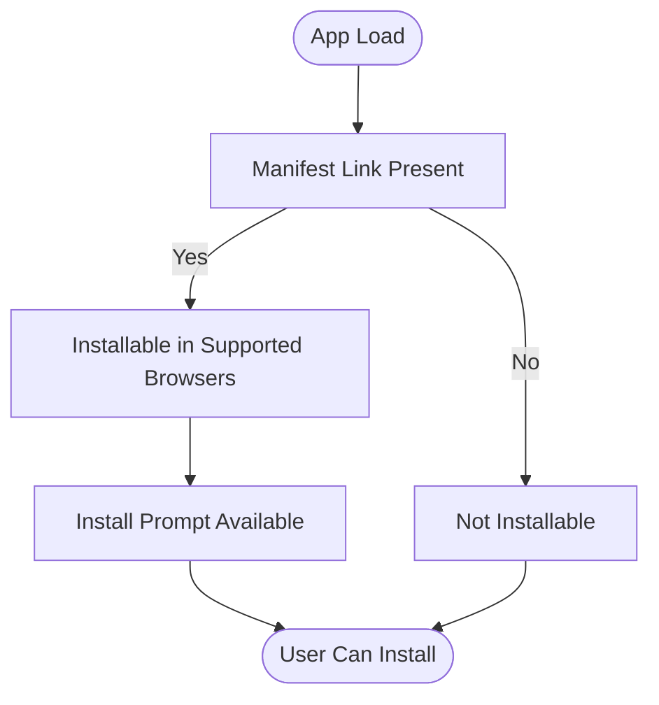
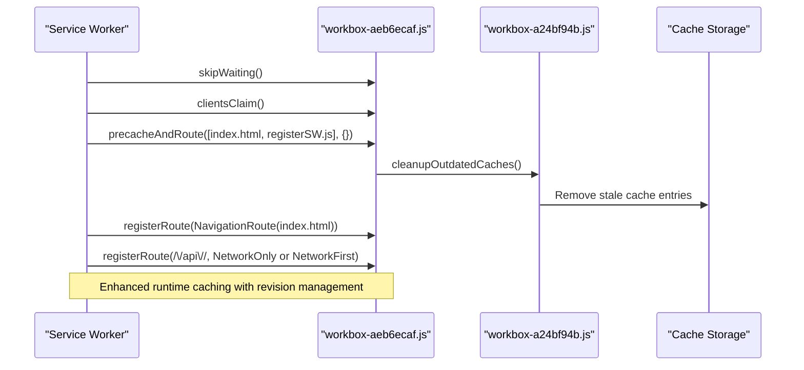
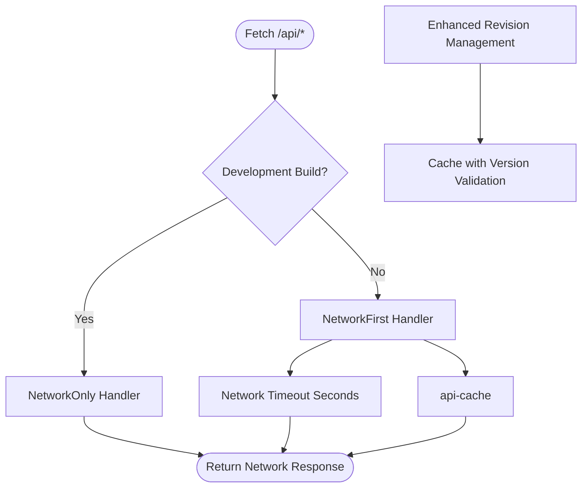
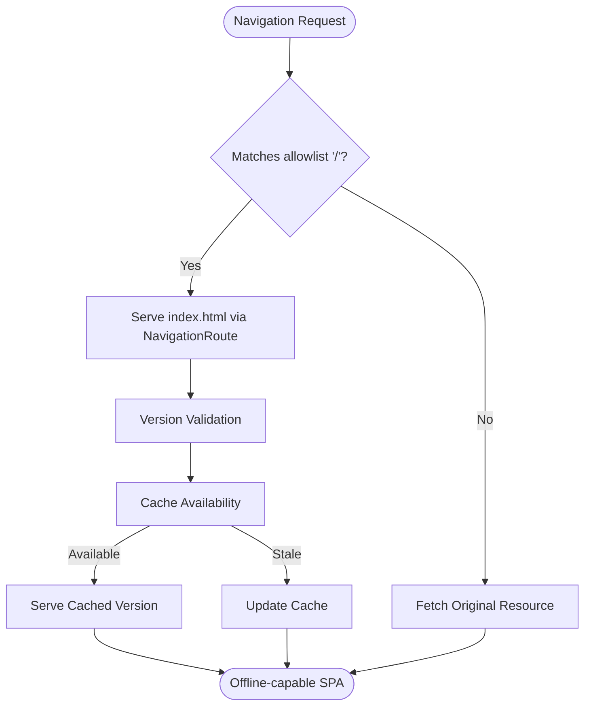
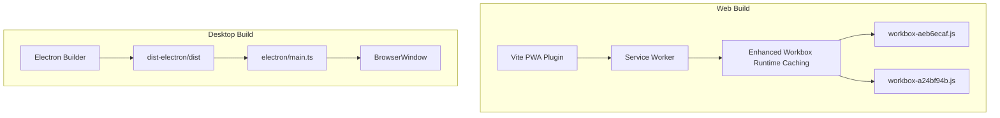
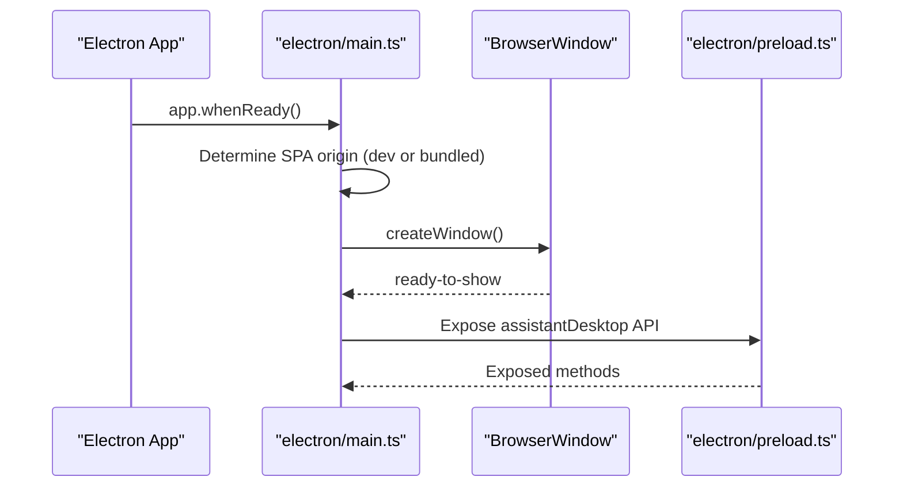
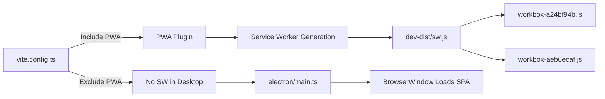

# PWA and Offline Capabilities

<cite>
**Referenced Files in This Document**
- [index.html](file://index.html)
- [vite.config.ts](file://vite.config.ts)
- [package.json](file://package.json)
- [dev-dist/sw.js](file://dev-dist/sw.js)
- [dev-dist/registerSW.js](file://dev-dist/registerSW.js)
- [dev-dist/workbox-a24bf94b.js](file://dev-dist/workbox-a24bf94b.js)
- [dev-dist/workbox-aeb6ecaf.js](file://dev-dist/workbox-aeb6ecaf.js)
- [scripts/build-electron.mjs](file://scripts/build-electron.mjs)
- [electron/main.ts](file://electron/main.ts)
- [electron/preload.ts](file://electron/preload.ts)
- [metadata.json](file://metadata.json)
</cite>

## Update Summary
**Changes Made**
- Updated service worker caching strategies section to reflect enhanced caching logic with refreshed revision identifiers
- Added documentation for dual workbox file implementation with different revision IDs
- Enhanced offline capabilities documentation for development builds
- Updated caching strategy diagrams to show improved asset versioning

## Table of Contents
1. [Introduction](#introduction)
2. [Project Structure](#project-structure)
3. [Core Components](#core-components)
4. [Architecture Overview](#architecture-overview)
5. [Detailed Component Analysis](#detailed-component-analysis)
6. [Dependency Analysis](#dependency-analysis)
7. [Performance Considerations](#performance-considerations)
8. [Troubleshooting Guide](#troubleshooting-guide)
9. [Conclusion](#conclusion)
10. [Appendices](#appendices)

## Introduction
This document explains the Progressive Web App (PWA) capabilities and offline functionality of the project. It covers the service worker implementation using Workbox, enhanced caching strategies for static assets and API responses, offline page delivery, and the dual deployment model supporting both web browsers and Electron desktop. The implementation now features improved caching logic with refreshed revision identifiers and dual workbox file support for better asset versioning and offline capabilities.

## Project Structure
The PWA implementation spans several areas:
- Web build pipeline and PWA generation via Vite and the PWA plugin
- Service worker and Workbox runtime caching with enhanced revision management
- Electron desktop packaging and runtime behavior
- Build scripts that prepare assets for both web and desktop

**Diagram sources**
- [index.html:10](file://index.html#L10)
- [vite.config.ts:21-78](file://vite.config.ts#L21-L78)
- [dev-dist/sw.js:70-92](file://dev-dist/sw.js#L70-L92)
- [dev-dist/workbox-a24bf94b.js:1-50](file://dev-dist/workbox-a24bf94b.js#L1-L50)
- [dev-dist/workbox-aeb6ecaf.js:1-50](file://dev-dist/workbox-aeb6ecaf.js#L1-L50)
- [scripts/build-electron.mjs:49-55](file://scripts/build-electron.mjs#L49-L55)
- [electron/main.ts:259-297](file://electron/main.ts#L259-L297)

**Section sources**
- [index.html:10](file://index.html#L10)
- [vite.config.ts:21-78](file://vite.config.ts#L21-L78)
- [dev-dist/sw.js:70-92](file://dev-dist/sw.js#L70-L92)
- [dev-dist/workbox-a24bf94b.js:1-50](file://dev-dist/workbox-a24bf94b.js#L1-L50)
- [dev-dist/workbox-aeb6ecaf.js:1-50](file://dev-dist/workbox-aeb6ecaf.js#L1-L50)
- [scripts/build-electron.mjs:49-55](file://scripts/build-electron.mjs#L49-L55)
- [electron/main.ts:259-297](file://electron/main.ts#L259-L297)

## Core Components
- PWA Manifest and Installability: Configured via Vite PWA plugin with name, description, theme/background colors, standalone display, start URL, and icon sets.
- Service Worker and Workbox: Generated and registered by the PWA plugin in web builds; a minimal dev-time SW is included in dev-dist for development with enhanced caching logic.
- Runtime Caching Strategies:
  - Network-only for API routes in development to avoid caching proxy error pages.
  - Network-first with a dedicated cache name and network timeout for API routes in production.
  - Enhanced revision management with dual workbox file support for better asset versioning.
- Electron Desktop Integration: Desktop builds exclude the PWA plugin and SW; the app loads the SPA via a local HTTP server or packaged backend, depending on mode.

**Section sources**
- [vite.config.ts:28-54](file://vite.config.ts#L28-L54)
- [vite.config.ts:55-77](file://vite.config.ts#L55-L77)
- [dev-dist/sw.js:70-92](file://dev-dist/sw.js#L70-L92)
- [electron/main.ts:16-21](file://electron/main.ts#L16-L21)

## Architecture Overview
The system supports two primary runtime environments with enhanced caching capabilities:
- Web browser with a service worker and precache manifest featuring improved revision management
- Electron desktop with a BrowserWindow loading the SPA locally

**Diagram sources**
- [index.html:10](file://index.html#L10)
- [vite.config.ts:21-78](file://vite.config.ts#L21-L78)
- [dev-dist/sw.js:70-92](file://dev-dist/sw.js#L70-L92)
- [dev-dist/workbox-a24bf94b.js:1-50](file://dev-dist/workbox-a24bf94b.js#L1-L50)
- [dev-dist/workbox-aeb6ecaf.js:1-50](file://dev-dist/workbox-aeb6ecaf.js#L1-L50)

## Detailed Component Analysis

### PWA Manifest and Installability
- Manifest fields include name, short_name, description, theme_color, background_color, display, start_url, and multiple icon entries.
- Icons include 192x192, 512x512 PNGs, and a maskable variant.
- The HTML manifest link is present in the root HTML template.

**Diagram sources**
- [index.html:10](file://index.html#L10)
- [vite.config.ts:28-54](file://vite.config.ts#L28-L54)

**Section sources**
- [index.html:10](file://index.html#L10)
- [vite.config.ts:28-54](file://vite.config.ts#L28-L54)

### Service Worker and Workbox Implementation
- The service worker is generated by the PWA plugin in web builds and registers precache entries for static assets with enhanced revision management.
- Navigation requests are routed to the app shell (index.html) with a navigation route.
- API routes are configured as NetworkOnly in development and NetworkFirst in production.
- Enhanced caching logic includes dual workbox file support for improved asset versioning and cache invalidation.

**Updated** Enhanced with dual workbox file implementation and refreshed revision identifiers for better cache management

**Diagram sources**
- [dev-dist/sw.js:70-92](file://dev-dist/sw.js#L70-L92)
- [vite.config.ts:55-77](file://vite.config.ts#L55-L77)
- [dev-dist/workbox-a24bf94b.js:1-50](file://dev-dist/workbox-a24bf94b.js#L1-L50)
- [dev-dist/workbox-aeb6ecaf.js:1-50](file://dev-dist/workbox-aeb6ecaf.js#L1-L50)

**Section sources**
- [dev-dist/sw.js:70-92](file://dev-dist/sw.js#L70-L92)
- [vite.config.ts:55-77](file://vite.config.ts#L55-L77)
- [dev-dist/workbox-a24bf94b.js:1-50](file://dev-dist/workbox-a24bf94b.js#L1-L50)
- [dev-dist/workbox-aeb6ecaf.js:1-50](file://dev-dist/workbox-aeb6ecaf.js#L1-L50)

### Enhanced Runtime Caching Strategies
- Development mode excludes API caching to prevent proxy error pages from being cached.
- Production mode uses NetworkFirst for API routes with a dedicated cache name and a network timeout to handle slow networks gracefully.
- Enhanced revision management ensures proper cache invalidation when assets change.
- Dual workbox file support provides fallback mechanisms and improved caching reliability.

**Updated** Enhanced with improved revision management and dual workbox file support

**Diagram sources**
- [vite.config.ts:60-76](file://vite.config.ts#L60-L76)
- [dev-dist/sw.js:79-85](file://dev-dist/sw.js#L79-L85)

**Section sources**
- [vite.config.ts:60-76](file://vite.config.ts#L60-L76)
- [dev-dist/sw.js:79-85](file://dev-dist/sw.js#L79-L85)

### Offline Page Delivery and Navigation
- A navigation route is registered to serve the app shell for top-level navigations, enabling offline browsing of the SPA.
- The precache manifest includes index.html with refreshed revision identifiers, ensuring it is available offline.
- Enhanced caching logic validates asset versions to prevent serving stale content.

**Updated** Enhanced with improved revision validation for better offline experience

**Diagram sources**
- [dev-dist/sw.js:87-89](file://dev-dist/sw.js#L87-L89)
- [dev-dist/sw.js:79-85](file://dev-dist/sw.js#L79-L85)

**Section sources**
- [dev-dist/sw.js:87-89](file://dev-dist/sw.js#L87-L89)
- [dev-dist/sw.js:79-85](file://dev-dist/sw.js#L79-L85)

### Background Sync and Advanced Features
- The current service worker configuration does not include background sync registration.
- To add background sync, integrate a background sync plugin and define a sync tag for offline actions. This would involve extending the service worker to listen for sync events and replay failed network requests.
- Enhanced caching strategies provide better foundation for future background sync implementation.

[No sources needed since this section provides general guidance]

### Cross-Platform Deployment Considerations
- Web builds: PWA plugin generates assets and registers the service worker automatically in development mode to surface install prompts.
- Desktop builds: The PWA plugin is disabled to reduce bundle size and improve packaging speed. The Electron main process serves the SPA via a local HTTP server or packaged backend.
- Enhanced caching logic ensures consistent offline experience across platforms.

**Diagram sources**
- [vite.config.ts:21-27](file://vite.config.ts#L21-L27)
- [vite.config.ts:93](file://vite.config.ts#L93)
- [scripts/build-electron.mjs:49-55](file://scripts/build-electron.mjs#L49-L55)
- [electron/main.ts:259-297](file://electron/main.ts#L259-L297)
- [dev-dist/workbox-a24bf94b.js:1-50](file://dev-dist/workbox-a24bf94b.js#L1-L50)
- [dev-dist/workbox-aeb6ecaf.js:1-50](file://dev-dist/workbox-aeb6ecaf.js#L1-L50)

**Section sources**
- [vite.config.ts:18-19](file://vite.config.ts#L18-L19)
- [vite.config.ts:93](file://vite.config.ts#L93)
- [scripts/build-electron.mjs:49-55](file://scripts/build-electron.mjs#L49-L55)
- [electron/main.ts:259-297](file://electron/main.ts#L259-L297)

### Electron Desktop Integration
- The Electron main process determines whether to use a Vite dev server or a bundled API backend.
- It creates a BrowserWindow and loads the SPA URL, optionally with DevTools.
- The preload script exposes a desktop API to the renderer process for window management and communication.
- Desktop builds benefit from enhanced caching strategies through shared asset management.

**Diagram sources**
- [electron/main.ts:389-406](file://electron/main.ts#L389-L406)
- [electron/main.ts:259-297](file://electron/main.ts#L259-L297)
- [electron/preload.ts:3-20](file://electron/preload.ts#L3-L20)

**Section sources**
- [electron/main.ts:16-21](file://electron/main.ts#L16-L21)
- [electron/main.ts:259-297](file://electron/main.ts#L259-L297)
- [electron/preload.ts:3-20](file://electron/preload.ts#L3-L20)

### Service Worker Registration in Development
- A small registration script is included in dev-dist to register the service worker during development for testing PWA features.
- Enhanced registration supports dual workbox file loading for improved reliability.

**Section sources**
- [dev-dist/registerSW.js:1](file://dev-dist/registerSW.js#L1)

### Build Scripts and Desktop Packaging
- The Electron build script bundles main, preload, and the API into dist-electron and copies the Vite dist into dist-electron/dist.
- Fonts exceeding a threshold are removed from the desktop bundle by default to speed up packaging.
- Enhanced caching strategies ensure optimal asset delivery across both web and desktop platforms.

**Section sources**
- [scripts/build-electron.mjs:26-47](file://scripts/build-electron.mjs#L26-L47)
- [scripts/build-electron.mjs:57-73](file://scripts/build-electron.mjs#L57-L73)

## Dependency Analysis
- The PWA plugin is conditionally included based on the build target (web vs. desktop).
- The service worker is generated only for web builds; desktop builds rely on the Electron runtime.
- The desktop build excludes the PWA plugin and SW to minimize bundle size and simplify distribution.
- Enhanced dependency management includes dual workbox file support for improved caching reliability.

**Diagram sources**
- [vite.config.ts:18-19](file://vite.config.ts#L18-L19)
- [vite.config.ts:93](file://vite.config.ts#L93)
- [dev-dist/sw.js:70-92](file://dev-dist/sw.js#L70-L92)
- [dev-dist/workbox-a24bf94b.js:1-50](file://dev-dist/workbox-a24bf94b.js#L1-L50)
- [dev-dist/workbox-aeb6ecaf.js:1-50](file://dev-dist/workbox-aeb6ecaf.js#L1-L50)
- [electron/main.ts:259-297](file://electron/main.ts#L259-L297)

**Section sources**
- [vite.config.ts:18-19](file://vite.config.ts#L18-L19)
- [vite.config.ts:93](file://vite.config.ts#L93)
- [dev-dist/sw.js:70-92](file://dev-dist/sw.js#L70-L92)
- [dev-dist/workbox-a24bf94b.js:1-50](file://dev-dist/workbox-a24bf94b.js#L1-L50)
- [dev-dist/workbox-aeb6ecaf.js:1-50](file://dev-dist/workbox-aeb6ecaf.js#L1-L50)
- [electron/main.ts:259-297](file://electron/main.ts#L259-L297)

## Performance Considerations
- Maximum file size for precaching is increased to accommodate large font assets, preventing them from being excluded by default limits.
- Desktop builds disable the PWA plugin and SW to reduce bundle size and improve packaging performance.
- Desktop builds remove large bundled fonts by default to accelerate asar/zip creation; an environment variable can preserve them if needed.
- Enhanced caching strategies with dual workbox files improve cache reliability and asset versioning.
- Improved revision management reduces cache conflicts and ensures users receive updated content promptly.

**Updated** Enhanced with improved caching strategies and revision management

**Section sources**
- [vite.config.ts:57](file://vite.config.ts#L57)
- [vite.config.ts:18-19](file://vite.config.ts#L18-L19)
- [scripts/build-electron.mjs:57-73](file://scripts/build-electron.mjs#L57-L73)
- [dev-dist/sw.js:79-85](file://dev-dist/sw.js#L79-L85)

## Troubleshooting Guide
- Service worker not installing:
  - Ensure the PWA plugin is enabled in development mode to register the service worker for installability checks.
  - Verify the service worker registration script is present in dev-dist and executed during development.
  - Check that both workbox files are properly loaded for enhanced caching functionality.
- API caching issues:
  - Confirm runtime caching mode matches the environment (NetworkOnly in development, NetworkFirst in production).
  - Check that the API cache name and network timeout settings are applied as configured.
  - Verify revision identifiers are properly managed to prevent cache conflicts.
- Desktop not using SW:
  - By design, desktop builds exclude the PWA plugin and SW; verify the desktop origin and window loading logic.
- Large font removal in desktop:
  - If fonts appear missing in the desktop app, use the environment variable to keep bundled fonts.
- Cache invalidation problems:
  - Ensure enhanced revision management is working correctly with dual workbox files.
  - Check that stale cache entries are being cleaned up properly during service worker updates.

**Updated** Enhanced troubleshooting guidance for new caching features

**Section sources**
- [vite.config.ts:24-26](file://vite.config.ts#L24-L26)
- [dev-dist/registerSW.js:1](file://dev-dist/registerSW.js#L1)
- [vite.config.ts:60-76](file://vite.config.ts#L60-L76)
- [electron/main.ts:16-21](file://electron/main.ts#L16-L21)
- [scripts/build-electron.mjs:57-73](file://scripts/build-electron.mjs#L57-L73)
- [dev-dist/sw.js:79-85](file://dev-dist/sw.js#L79-L85)

## Conclusion
The project implements a robust PWA for web browsers with Workbox-based precaching and runtime caching strategies tailored to development and production. The enhanced implementation now features improved caching logic with refreshed revision identifiers and dual workbox file support for better asset versioning and offline capabilities. The Electron desktop deployment intentionally bypasses the PWA plugin and service worker to streamline packaging and performance. Together, these approaches deliver a consistent user experience across platforms while preserving installability and offline readiness on the web with enhanced reliability.

## Appendices
- Metadata for the assistant workbench is available for contextual understanding of the application's purpose.

**Section sources**
- [metadata.json:1-6](file://metadata.json#L1-L6)