# Page Components

<cite>
**Referenced Files in This Document**
- [Dashboard.tsx](file://src/pages/Dashboard.tsx)
- [Tasks.tsx](file://src/pages/Tasks.tsx)
- [Deployment.tsx](file://src/pages/Deployment.tsx)
- [ArtisticAssistant.tsx](file://src/pages/ArtisticAssistant.tsx)
- [Settings.tsx](file://src/pages/Settings.tsx)
- [SkillsLibrary.tsx](file://src/pages/SkillsLibrary.tsx)
- [Startup.tsx](file://src/pages/Startup.tsx)
- [Automations.tsx](file://src/pages/Automations.tsx)
- [Summary.tsx](file://src/pages/Summary.tsx)
- [Cleanup.tsx](file://src/pages/Cleanup.tsx)
- [FloatDock.tsx](file://src/pages/FloatDock.tsx)
- [PageHeader.tsx](file://src/components/PageHeader.tsx)
- [daily-todos-storage.ts](file://src/lib/daily-todos-storage.ts)
- [deploy-api-url.ts](file://src/lib/deploy-api-url.ts)
- [float-command/deploy-parse-extract.ts](file://src/lib/float-command/deploy-parse-extract.ts)
- [float-command/deploy-template-resolve.ts](file://src/lib/float-command/deploy-template-resolve.ts)
- [float-command/float-deploy-payload.ts](file://src/lib/float-command/float-deploy-payload.ts)
- [float-command/recent.ts](file://src/lib/float-command/recent.ts)
- [float-command/startup-resolve.ts](file://src/lib/float-command/startup-resolve.ts)
- [index.css](file://src/index.css)
</cite>

## Update Summary
**Changes Made**
- Enhanced Settings.tsx with keyboard shortcuts (Cmd/Ctrl + S), group-based configuration organization, validation system, and connection testing for Jenkins/Jira/Confluence services
- Updated Startup.tsx with improved terminal management, multi-tab support, and responsive design elements

## Table of Contents
1. [Introduction](#introduction)
2. [Project Structure](#project-structure)
3. [Core Components](#core-components)
4. [Architecture Overview](#architecture-overview)
5. [Detailed Component Analysis](#detailed-component-analysis)
6. [Dependency Analysis](#dependency-analysis)
7. [Performance Considerations](#performance-considerations)
8. [Troubleshooting Guide](#troubleshooting-guide)
9. [Conclusion](#conclusion)

## Introduction
This document explains the page-based component architecture of the application. It covers the major pages (Dashboard, Tasks, Deployment, ArtisticAssistant, Settings, SkillsLibrary, Startup, Automations, Summary, Cleanup, and FloatDock), detailing component structure, data fetching patterns, state management, user interaction handling, styling/layout, backend integration, forms, data visualization, real-time updates, error handling, lifecycle, performance, and accessibility.

## Project Structure
- Pages are located under src/pages and are React functional components with page-level styling and layout.
- Shared UI elements (e.g., PageHeader) are in src/components.
- Utilities for cross-page concerns (e.g., daily todos storage, deploy API URL helpers, float command resolution) live under src/lib.

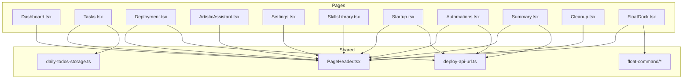

**Diagram sources**
- [Dashboard.tsx:1-114](file://src/pages/Dashboard.tsx#L1-L114)
- [Tasks.tsx:1-542](file://src/pages/Tasks.tsx#L1-L542)
- [Deployment.tsx:1-1068](file://src/pages/Deployment.tsx#L1-L1068)
- [ArtisticAssistant.tsx:1-349](file://src/pages/ArtisticAssistant.tsx#L1-L349)
- [Settings.tsx:1-552](file://src/pages/Settings.tsx#L1-L552)
- [SkillsLibrary.tsx:1-599](file://src/pages/SkillsLibrary.tsx#L1-L599)
- [Startup.tsx:1-818](file://src/pages/Startup.tsx#L1-L818)
- [Automations.tsx:1-661](file://src/pages/Automations.tsx#L1-L661)
- [Summary.tsx:1-653](file://src/pages/Summary.tsx#L1-L653)
- [Cleanup.tsx:1-26](file://src/pages/Cleanup.tsx#L1-L26)
- [FloatDock.tsx:1-638](file://src/pages/FloatDock.tsx#L1-L638)
- [PageHeader.tsx](file://src/components/PageHeader.tsx)
- [daily-todos-storage.ts](file://src/lib/daily-todos-storage.ts)
- [deploy-api-url.ts](file://src/lib/deploy-api-url.ts)
- [float-command/deploy-parse-extract.ts](file://src/lib/float-command/deploy-parse-extract.ts)
- [float-command/deploy-template-resolve.ts](file://src/lib/float-command/deploy-template-resolve.ts)
- [float-command/float-deploy-payload.ts](file://src/lib/float-command/float-deploy-payload.ts)
- [float-command/recent.ts](file://src/lib/float-command/recent.ts)
- [float-command/startup-resolve.ts](file://src/lib/float-command/startup-resolve.ts)

**Section sources**
- [Dashboard.tsx:1-114](file://src/pages/Dashboard.tsx#L1-L114)
- [Tasks.tsx:1-542](file://src/pages/Tasks.tsx#L1-L542)
- [Deployment.tsx:1-1068](file://src/pages/Deployment.tsx#L1-L1068)
- [ArtisticAssistant.tsx:1-349](file://src/pages/ArtisticAssistant.tsx#L1-L349)
- [Settings.tsx:1-552](file://src/pages/Settings.tsx#L1-L552)
- [SkillsLibrary.tsx:1-599](file://src/pages/SkillsLibrary.tsx#L1-L599)
- [Startup.tsx:1-818](file://src/pages/Startup.tsx#L1-L818)
- [Automations.tsx:1-661](file://src/pages/Automations.tsx#L1-L661)
- [Summary.tsx:1-653](file://src/pages/Summary.tsx#L1-L653)
- [Cleanup.tsx:1-26](file://src/pages/Cleanup.tsx#L1-L26)
- [FloatDock.tsx:1-638](file://src/pages/FloatDock.tsx#L1-L638)

## Core Components
- PageHeader: Reusable header component used across pages for consistent branding and navigation cues.
- Daily Todos Storage: Shared utilities for reading/writing daily todo lists in localStorage.
- Deploy API URL Helper: Centralized helper to compute API endpoints for Jira and other deploy-related services.
- Float Command Utilities: Shared logic for parsing commands, resolving templates/profiles, and session payloads for the floating dock.

**Section sources**
- [PageHeader.tsx](file://src/components/PageHeader.tsx)
- [daily-todos-storage.ts](file://src/lib/daily-todos-storage.ts)
- [deploy-api-url.ts](file://src/lib/deploy-api-url.ts)
- [float-command/deploy-parse-extract.ts](file://src/lib/float-command/deploy-parse-extract.ts)
- [float-command/deploy-template-resolve.ts](file://src/lib/float-command/deploy-template-resolve.ts)
- [float-command/float-deploy-payload.ts](file://src/lib/float-command/float-deploy-payload.ts)
- [float-command/recent.ts](file://src/lib/float-command/recent.ts)
- [float-command/startup-resolve.ts](file://src/lib/float-command/startup-resolve.ts)

## Architecture Overview
High-level runtime flows:
- Pages fetch data from backend APIs via fetch and manage state with React hooks.
- Real-time updates are handled via Server-Sent Events (SSE) for deployment pipelines, startup runs, and automation logs.
- Electron Float Dock integrates with desktop IPC to enable window dragging and opening main app views.

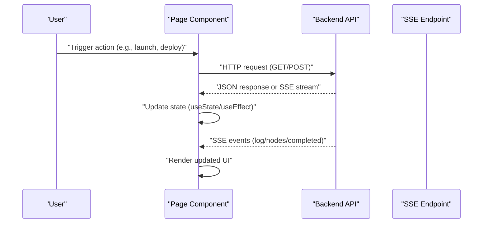

**Diagram sources**
- [Deployment.tsx:155-202](file://src/pages/Deployment.tsx#L155-L202)
- [Startup.tsx:232-264](file://src/pages/Startup.tsx#L232-L264)
- [Automations.tsx:195-229](file://src/pages/Automations.tsx#L195-L229)

## Detailed Component Analysis

### Dashboard
- Purpose: Entry hub to navigate to major workflows (Deployment, Startup, Cleanup, Summary, Tasks).
- Structure: Renders a grid of cards with icons, titles, subtitles, and descriptions; links route to respective pages.
- Styling/Layout: Uses CSS grid responsive classes and card-based layout with hover effects and gradients.
- Interaction: Clickable cards route via react-router Link.

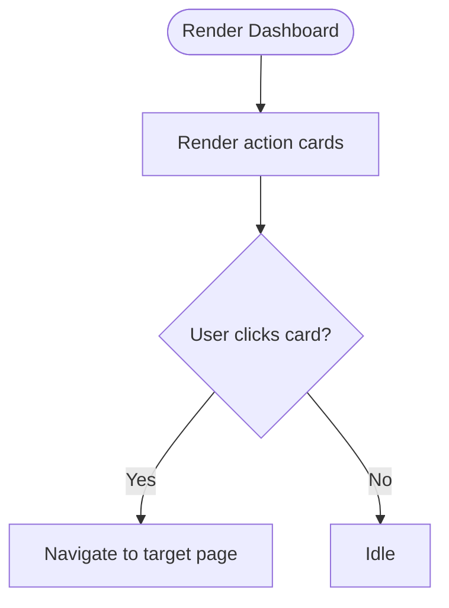

**Diagram sources**
- [Dashboard.tsx:48-113](file://src/pages/Dashboard.tsx#L48-L113)

**Section sources**
- [Dashboard.tsx:1-114](file://src/pages/Dashboard.tsx#L1-L114)

### Tasks
- Purpose: Manage daily todo items per date with persistence in localStorage.
- Data Fetching: Loads todos from localStorage on mount; writes back on state change.
- State Management: Uses useState for store, selected date, drafts, editing state; memoization for derived lists.
- Interaction: Add/remove/toggle/edit items; drag-and-drop reordering; keyboard shortcuts; Jira integration via API.
- Backend Integration: Fetches Jira server URL for rendering clickable links; uses deploy API URL helper.
- Real-time Updates: None for this page.
- Accessibility: Proper ARIA roles and labels for buttons and inputs.

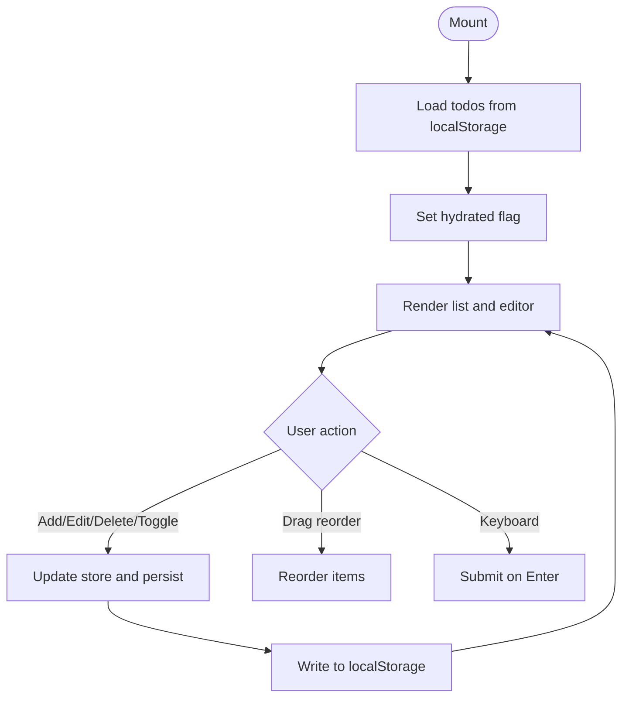

**Diagram sources**
- [Tasks.tsx:136-301](file://src/pages/Tasks.tsx#L136-L301)

**Section sources**
- [Tasks.tsx:1-542](file://src/pages/Tasks.tsx#L1-L542)
- [daily-todos-storage.ts](file://src/lib/daily-todos-storage.ts)

### Deployment
- Purpose: Natural language to pipeline orchestration with template matching and real-time execution feedback.
- Data Fetching: Health/status, task stats, pipeline snapshots, and SSE events.
- State Management: Tracks phase (idle/draft/executing/completed), pipeline nodes, logs, parsed Jira/branch, templates, favorites, recent IDs.
- Interaction: Command input resolves to pipeline; templates can be saved/favorited/deleted; execution starts a run and attaches SSE.
- Backend Integration: Uses VITE_DEPLOY_API_BASE for endpoints; SSE endpoint streams logs and node status; snapshot hydration on resume.
- Real-time Updates: EventSource for live logs and node status; auto-scroll to latest log.
- Error Handling: Graceful fallbacks for missing health, invalid payloads, and network errors; displays hints and warnings.

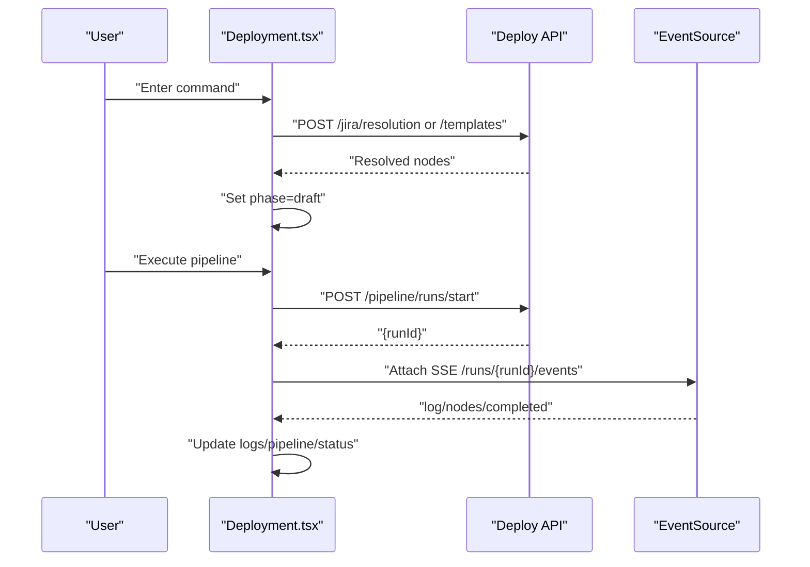

**Diagram sources**
- [Deployment.tsx:351-432](file://src/pages/Deployment.tsx#L351-L432)
- [Deployment.tsx:510-532](file://src/pages/Deployment.tsx#L510-L532)
- [Deployment.tsx:155-202](file://src/pages/Deployment.tsx#L155-L202)

**Section sources**
- [Deployment.tsx:1-1068](file://src/pages/Deployment.tsx#L1-L1068)

### ArtisticAssistant
- Purpose: Chat with configurable LLM providers (Gemini, OpenAI, Ollama) with optional knowledge retrieval.
- Data Fetching: Loads assistant options and chat replies via POST to /api/assistant endpoints; knowledge search via /api/knowledge/search.
- State Management: Tracks options, model choice, knowledge toggle, messages, draft, loading, errors, and preview hits.
- Interaction: Send messages, preview knowledge hits, select model, toggle knowledge retrieval.
- Backend Integration: Calls assistant and knowledge endpoints; handles provider-specific model selection.
- Real-time Updates: None for this page.
- Accessibility: Proper labels, disabled states, and live regions for status.

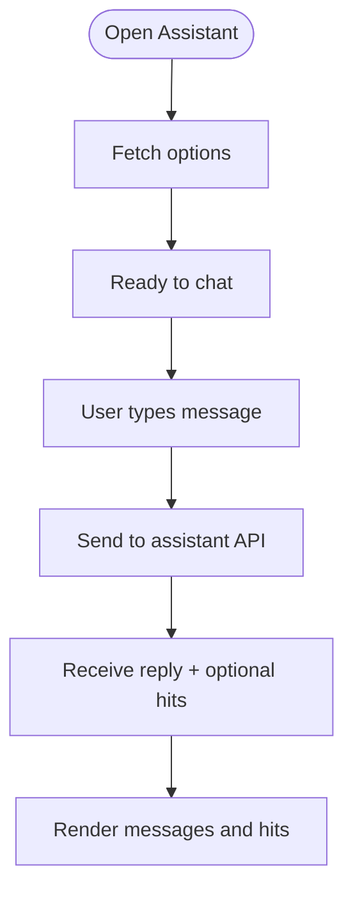

**Diagram sources**
- [ArtisticAssistant.tsx:70-95](file://src/pages/ArtisticAssistant.tsx#L70-L95)
- [ArtisticAssistant.tsx:115-174](file://src/pages/ArtisticAssistant.tsx#L115-L174)
- [ArtisticAssistant.tsx:176-199](file://src/pages/ArtisticAssistant.tsx#L176-L199)

**Section sources**
- [ArtisticAssistant.tsx:1-349](file://src/pages/ArtisticAssistant.tsx#L1-L349)

### Settings
- Purpose: Maintain project catalog and environment credentials (.env) for Jenkins/Jira/Wiki with enhanced keyboard shortcuts and validation.
- Data Fetching: Loads project catalog and environment UI metadata; saves updates via PUT/POST.
- State Management: Tracks catalog entries, plain/secret values, clear flags, saving/loading states, validation errors, connection test results, and expanded groups.
- Interaction: Add/remove/update catalog rows; save catalog; configure secrets and clear existing ones; save env with validation; keyboard shortcuts (Cmd/Ctrl + S); group-based configuration organization; connection testing for Jenkins/Jira/Confluence.
- Backend Integration: Reads/writes to assistant endpoints for project catalog and environment UI; connection testing endpoints for service verification.
- Real-time Updates: None for this page.
- Accessibility: Clear labels, disabled states during saving, validation error messaging, and group expansion controls.

**Updated** Enhanced with keyboard shortcuts (Cmd/Ctrl + S), group-based configuration organization, validation system, and connection testing for Jenkins/Jira/Confluence services.

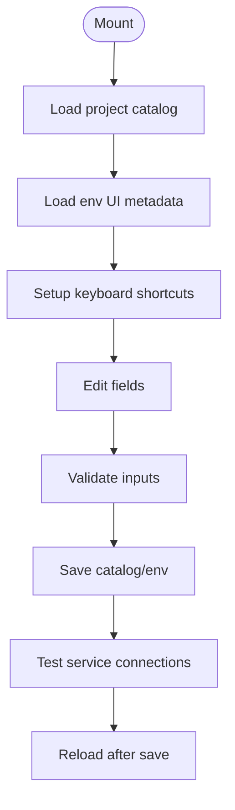

**Diagram sources**
- [Settings.tsx:119-130](file://src/pages/Settings.tsx#L119-L130)
- [Settings.tsx:132-144](file://src/pages/Settings.tsx#L132-L144)
- [Settings.tsx:146-168](file://src/pages/Settings.tsx#L146-L168)
- [Settings.tsx:208-252](file://src/pages/Settings.tsx#L208-L252)

**Section sources**
- [Settings.tsx:1-552](file://src/pages/Settings.tsx#L1-L552)

### SkillsLibrary
- Purpose: Discover and manage local skills, MCP servers, and local models.
- Data Fetching: Concurrently loads skills, MCP, and models via /api/local-* endpoints; shows warnings/errors.
- State Management: Tracks active tab, filters, selections, loading states, and clipboard copy feedback.
- Interaction: Search/filter across tabs; copy paths; refresh scan; badges per source/type.
- Backend Integration: Calls local skills/MCP/models endpoints; uses motion animations for smooth transitions.
- Real-time Updates: None for this page.
- Accessibility: Tabs, chips, and buttons with proper ARIA attributes.

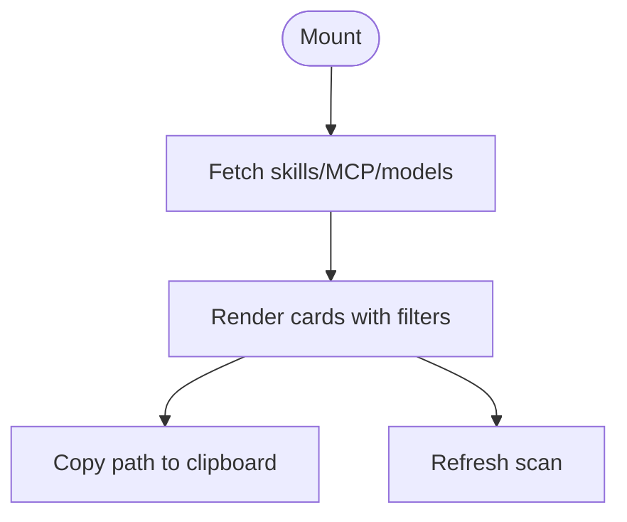

**Diagram sources**
- [SkillsLibrary.tsx:216-254](file://src/pages/SkillsLibrary.tsx#L216-L254)

**Section sources**
- [SkillsLibrary.tsx:1-599](file://src/pages/SkillsLibrary.tsx#L1-L599)

### Startup
- Purpose: Define and execute development environment startup profiles with IDE integration and real-time logs with enhanced terminal management.
- Data Fetching: Loads project catalog; launches runs and subscribes to SSE events for logs.
- State Management: Profiles, active profile, run state, logs, terminal UI state, multi-tab management, batch selection, and search filtering.
- Interaction: Create/edit profiles; launch/run; stop current run; preview plan; edit mode; multi-tab terminal switching; batch selection; search filtering; fullscreen terminal mode.
- Backend Integration: Uses /api/startup endpoints; SSE /runs/{runId}/events; EventSource lifecycle management; project catalog integration.
- Real-time Updates: Live logs via SSE; auto-scroll; status transitions (bootstrapping/running/completed/failed/stopped).
- Accessibility: Disabled states during runs, clear labels, terminal-like presentation, batch selection controls, and search interface.

**Updated** Enhanced with improved terminal management, multi-tab support, and responsive design elements.

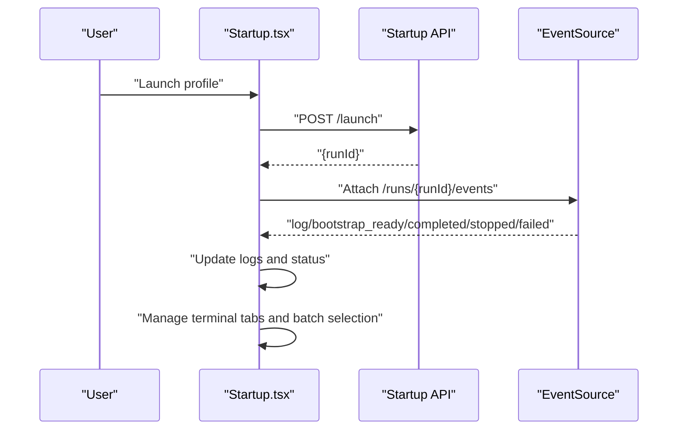

**Diagram sources**
- [Startup.tsx:250-313](file://src/pages/Startup.tsx#L250-L313)

**Section sources**
- [Startup.tsx:1-818](file://src/pages/Startup.tsx#L1-L818)

### Automations
- Purpose: Configure and run scheduled automation tasks with workflow editor and live terminal.
- Data Fetching: Loads initial tasks; reads/writes task edits in localStorage; starts runs and subscribes to SSE.
- State Management: Tasks, search filter, modal states, terminal logs, manual input prompts.
- Interaction: Toggle tasks, open workflow editor, create tasks from prompt, run tasks, submit manual solutions.
- Backend Integration: Starts automation runs and streams events via SSE; supports waiting for manual input.
- Real-time Updates: Live terminal logs via SSE; waiting prompts for manual intervention.
- Accessibility: Modals with focus traps, clear labels, and disabled states.

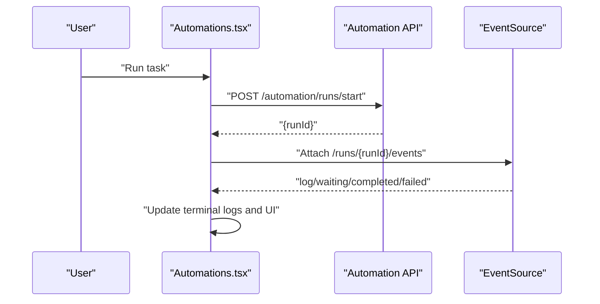

**Diagram sources**
- [Automations.tsx:184-234](file://src/pages/Automations.tsx#L184-L234)

**Section sources**
- [Automations.tsx:1-661](file://src/pages/Automations.tsx#L1-L661)

### Summary
- Purpose: Pull Jira open issues and generate weekly report drafts.
- Data Fetching: Loads Jira status, open issues, and weekly markdown via deploy API URL helper.
- State Management: Status, open issues, weekly markdown, week offset, copy feedback, context menu state.
- Interaction: Context menu on issues (add to today, submit test), copy weekly markdown, navigate weeks.
- Backend Integration: Uses deploy API endpoints for Jira; handles connectivity hints and credential configuration.
- Real-time Updates: None for this page.
- Accessibility: Context menus, keyboard support, and screen-reader-friendly status announcements.

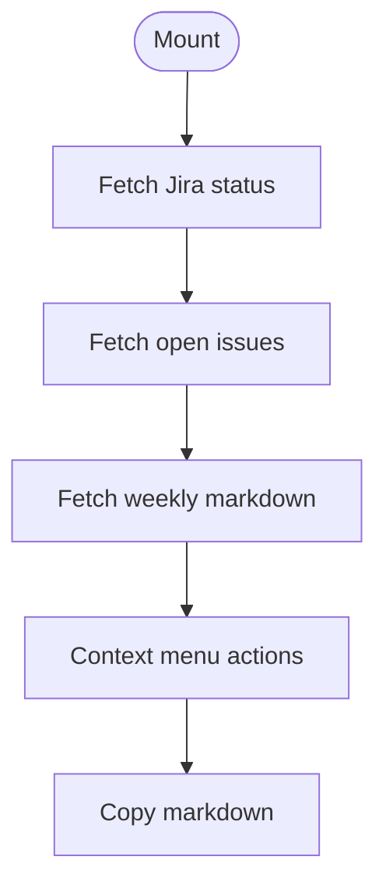

**Diagram sources**
- [Summary.tsx:135-172](file://src/pages/Summary.tsx#L135-L172)
- [Summary.tsx:174-207](file://src/pages/Summary.tsx#L174-L207)
- [Summary.tsx:209-251](file://src/pages/Summary.tsx#L209-L251)

**Section sources**
- [Summary.tsx:1-653](file://src/pages/Summary.tsx#L1-L653)
- [deploy-api-url.ts](file://src/lib/deploy-api-url.ts)

### Cleanup
- Purpose: Placeholder page for workspace cleanup functionality.
- Current State: Minimal UI indicating future development.

**Section sources**
- [Cleanup.tsx:1-26](file://src/pages/Cleanup.tsx#L1-L26)

### FloatDock
- Purpose: Electron floating dock providing quick actions for adding todos, deploying, and starting projects.
- Data Fetching: Resolves startup profiles and deployment templates from memory and localStorage; uses recent usage records.
- State Management: Panel open/closed, active tab, input line, toast notifications, resolution UI phases.
- Interaction: Double-click toggles panel; single-tap does nothing; drag moves window via IPC; selects and confirms actions.
- Backend Integration: Opens main window with query params; writes session payloads for deployment; uses desktop IPC for window resizing and dragging.
- Real-time Updates: None for this page.
- Accessibility: Pointer and keyboard event handling; debug mode for development.

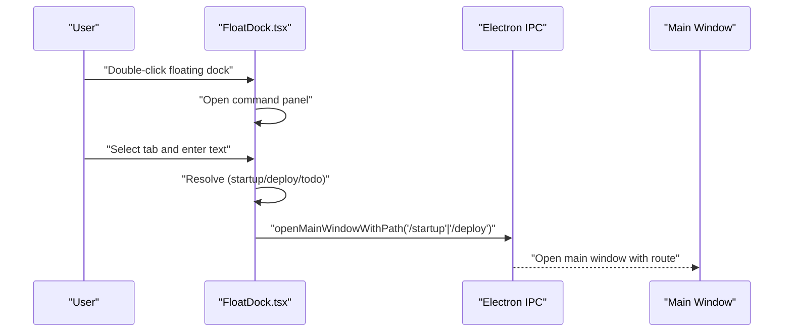

**Diagram sources**
- [FloatDock.tsx:210-215](file://src/pages/FloatDock.tsx#L210-L215)
- [FloatDock.tsx:285-293](file://src/pages/FloatDock.tsx#L285-L293)
- [FloatDock.tsx:295-312](file://src/pages/FloatDock.tsx#L295-L312)

**Section sources**
- [FloatDock.tsx:1-638](file://src/pages/FloatDock.tsx#L1-L638)
- [index.css](file://src/index.css)

## Dependency Analysis
- Cross-cutting utilities:
  - daily-todos-storage: Used by Tasks and FloatDock (todo actions).
  - deploy-api-url: Used by Summary, Deployment, Automations for endpoint construction.
  - float-command/*: Used by FloatDock for command parsing and resolution.
- Page-to-shared dependencies:
  - All pages depend on PageHeader for consistent header UI.
  - Deployment, Startup, Automations rely on SSE for real-time updates.
  - FloatDock depends on Electron IPC for window management.

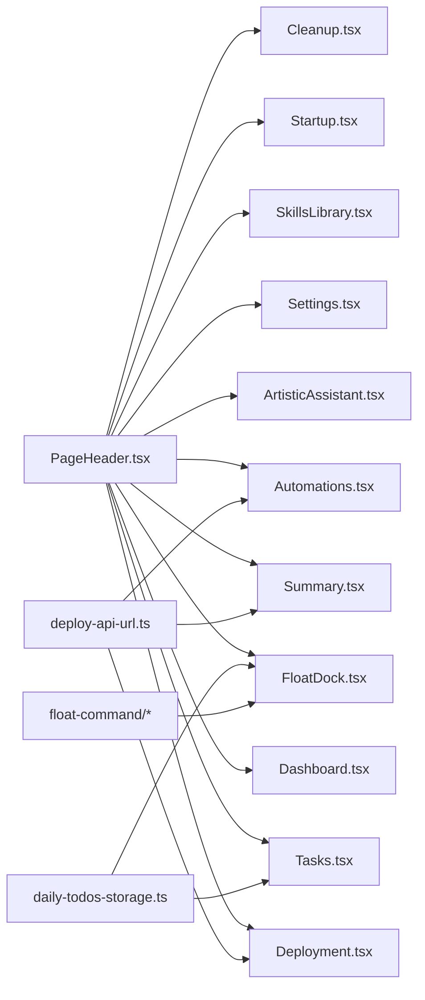

**Diagram sources**
- [PageHeader.tsx](file://src/components/PageHeader.tsx)
- [daily-todos-storage.ts](file://src/lib/daily-todos-storage.ts)
- [deploy-api-url.ts](file://src/lib/deploy-api-url.ts)
- [float-command/deploy-parse-extract.ts](file://src/lib/float-command/deploy-parse-extract.ts)
- [float-command/deploy-template-resolve.ts](file://src/lib/float-command/deploy-template-resolve.ts)
- [float-command/float-deploy-payload.ts](file://src/lib/float-command/float-deploy-payload.ts)
- [float-command/recent.ts](file://src/lib/float-command/recent.ts)
- [float-command/startup-resolve.ts](file://src/lib/float-command/startup-resolve.ts)

**Section sources**
- [Dashboard.tsx:1-114](file://src/pages/Dashboard.tsx#L1-L114)
- [Tasks.tsx:1-542](file://src/pages/Tasks.tsx#L1-L542)
- [Deployment.tsx:1-1068](file://src/pages/Deployment.tsx#L1-L1068)
- [ArtisticAssistant.tsx:1-349](file://src/pages/ArtisticAssistant.tsx#L1-L349)
- [Settings.tsx:1-552](file://src/pages/Settings.tsx#L1-L552)
- [SkillsLibrary.tsx:1-599](file://src/pages/SkillsLibrary.tsx#L1-L599)
- [Startup.tsx:1-818](file://src/pages/Startup.tsx#L1-L818)
- [Automations.tsx:1-661](file://src/pages/Automations.tsx#L1-L661)
- [Summary.tsx:1-653](file://src/pages/Summary.tsx#L1-L653)
- [Cleanup.tsx:1-26](file://src/pages/Cleanup.tsx#L1-L26)
- [FloatDock.tsx:1-638](file://src/pages/FloatDock.tsx#L1-L638)

## Performance Considerations
- Rendering
  - Use of memoization (useMemo) in Tasks and SkillsLibrary reduces unnecessary re-renders.
  - Motion animations in SkillsLibrary are optimized with layout animations and exit transitions.
- Data Fetching
  - Deployment and Automations use concurrent requests and SSE streaming; ensure cleanup to avoid leaks.
  - Startup manages multiple EventSource instances keyed by profile ID to prevent conflicts.
- State Updates
  - Prefer immutable updates (e.g., spreading arrays/objects) to keep React diffing efficient.
  - Debounce or throttle frequent updates (e.g., logs) to avoid excessive renders.
- Storage
  - Tasks persists to localStorage; batch writes to minimize IO overhead.
- Accessibility
  - Provide ARIA labels and roles for interactive elements; ensure focus management in modals.
- Styling
  - Use CSS custom properties for theming and reduce heavy repaints; leverage CSS grid/flex for layouts.

## Troubleshooting Guide
- Deployment
  - Health checks failing: Verify VITE_DEPLOY_API_BASE and backend availability; check SSE connection.
  - Pipeline stuck: Inspect runId in sessionStorage and attached EventSource lifecycle.
- Startup
  - No logs: Confirm SSE endpoint and that runId is present; check for connection errors.
  - Running state not updating: Ensure bootstrap_ready/completed events are received.
  - Terminal tabs not working: Verify activeTerminalTab state and serviceLogs structure.
  - Batch selection issues: Check selectedProfileIds Set operations and isBatchMode state.
- Automations
  - Waiting for input: Provide manual solution via continue endpoint; verify runId.
- Summary
  - Jira not configured: Check environment variables and server URL; review hint messages for connectivity issues.
- Settings
  - Keyboard shortcuts not working: Verify event listener setup and metaKey/ctrlKey detection.
  - Connection testing failing: Check test-connection endpoints and network connectivity.
  - Validation errors: Review validation logic for Jenkins/Jira required fields.
- FloatDock
  - Dragging not working: Ensure floatDragDelta IPC is available; verify Electron preload integration.
  - Panel not resizing: Confirm setFloatWindowSize IPC is present; build desktop app for production behavior.

**Section sources**
- [Deployment.tsx:316-338](file://src/pages/Deployment.tsx#L316-L338)
- [Deployment.tsx:155-202](file://src/pages/Deployment.tsx#L155-L202)
- [Startup.tsx:232-264](file://src/pages/Startup.tsx#L232-L264)
- [Startup.tsx:144-148](file://src/pages/Startup.tsx#L144-L148)
- [Startup.tsx:240-248](file://src/pages/Startup.tsx#L240-L248)
- [Automations.tsx:195-229](file://src/pages/Automations.tsx#L195-L229)
- [Summary.tsx:135-172](file://src/pages/Summary.tsx#L135-L172)
- [Settings.tsx:119-130](file://src/pages/Settings.tsx#L119-L130)
- [Settings.tsx:146-168](file://src/pages/Settings.tsx#L146-L168)
- [FloatDock.tsx:314-378](file://src/pages/FloatDock.tsx#L314-L378)

## Conclusion
The page components are cohesive, following consistent patterns for state, data fetching, and UI. They integrate with backend APIs, leverage SSE for real-time updates where applicable, and maintain accessibility and performance through thoughtful design choices. The shared utilities centralize cross-page concerns, enabling reuse and maintainability. Recent enhancements to Settings and Startup demonstrate continued evolution toward better user experience with keyboard shortcuts, validation, connection testing, multi-tab terminals, and responsive design.