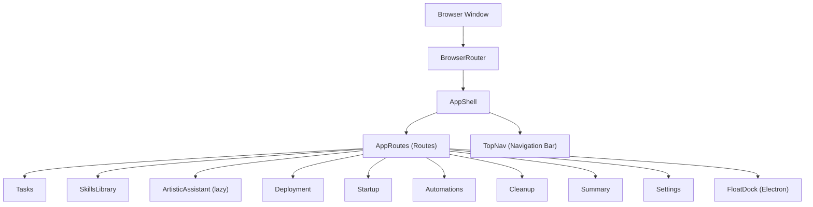
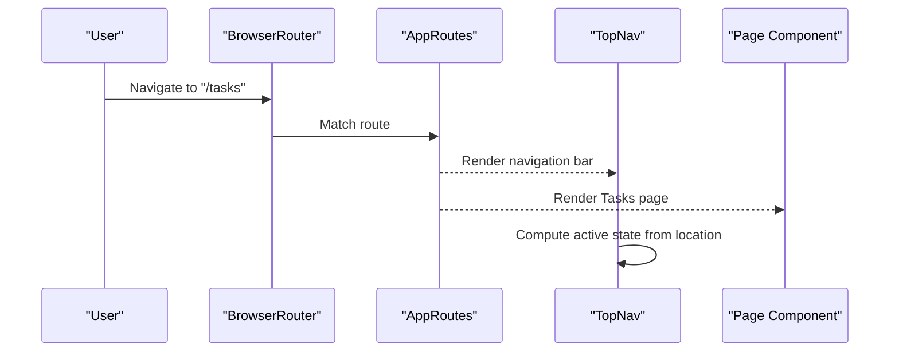
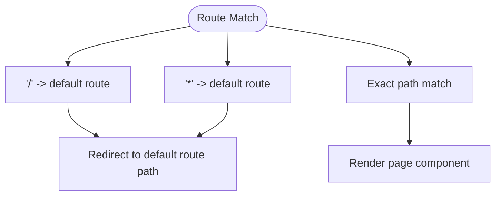
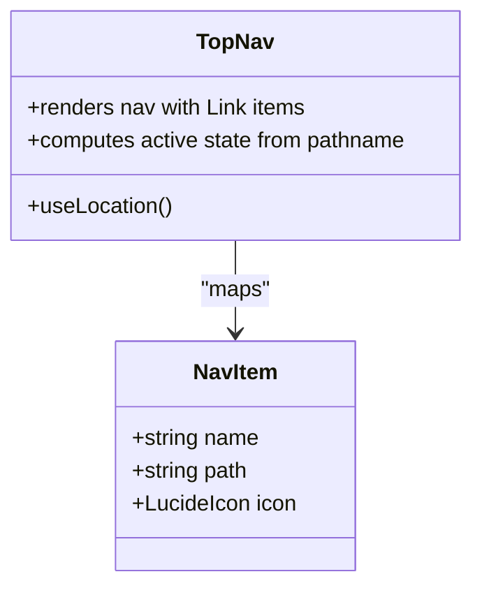
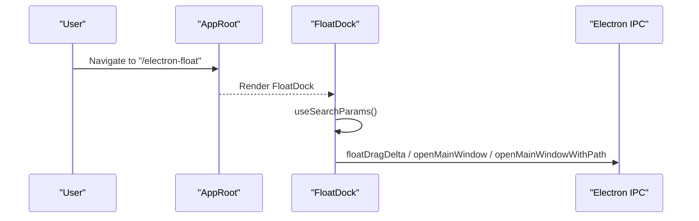
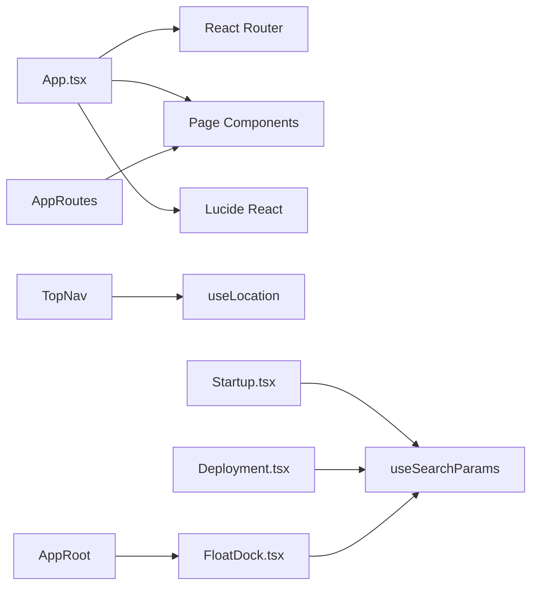

# Routing and Navigation

<cite>
**Referenced Files in This Document**
- [App.tsx](file://src/App.tsx)
- [main.tsx](file://src/main.tsx)
- [FloatDock.tsx](file://src/pages/FloatDock.tsx)
- [Dashboard.tsx](file://src/pages/Dashboard.tsx)
- [Tasks.tsx](file://src/pages/Tasks.tsx)
- [Settings.tsx](file://src/pages/Settings.tsx)
- [ArtisticAssistant.tsx](file://src/pages/ArtisticAssistant.tsx)
- [Startup.tsx](file://src/pages/Startup.tsx)
- [Deployment.tsx](file://src/pages/Deployment.tsx)
- [Automations.tsx](file://src/pages/Automations.tsx)
- [Cleanup.tsx](file://src/pages/Cleanup.tsx)
- [Summary.tsx](file://src/pages/Summary.tsx)
</cite>

## Table of Contents
1. [Introduction](#introduction)
2. [Project Structure](#project-structure)
3. [Core Components](#core-components)
4. [Architecture Overview](#architecture-overview)
5. [Detailed Component Analysis](#detailed-component-analysis)
6. [Dependency Analysis](#dependency-analysis)
7. [Performance Considerations](#performance-considerations)
8. [Troubleshooting Guide](#troubleshooting-guide)
9. [Conclusion](#conclusion)

## Introduction
This document explains the routing and navigation system of the application. It covers the React Router configuration with BrowserRouter, route definitions for all application pages, the TopNav component and its active state management, Lucide React icon integration, default and wildcard route handling, Electron-specific floating dock integration, and lazy loading strategy for performance. It also outlines programmatic navigation patterns and query string handling.

## Project Structure
The routing and navigation logic centers around a single Router instance wrapping the application shell. Pages are organized under src/pages, and routes are declared in AppRoutes. A top navigation bar renders links to each page, with active state derived from the current location. An Electron-specific floating dock page is rendered conditionally based on the pathname.

**Diagram sources**
- [App.tsx:131-135](file://src/App.tsx#L131-L135)
- [App.tsx:110-119](file://src/App.tsx#L110-L119)
- [App.tsx:78-108](file://src/App.tsx#L78-L108)
- [App.tsx:49-76](file://src/App.tsx#L49-L76)
- [FloatDock.tsx:111](file://src/pages/FloatDock.tsx#L111)

**Section sources**
- [App.tsx:131-135](file://src/App.tsx#L131-L135)
- [App.tsx:110-119](file://src/App.tsx#L110-L119)
- [App.tsx:78-108](file://src/App.tsx#L78-L108)
- [App.tsx:49-76](file://src/App.tsx#L49-L76)
- [FloatDock.tsx:111](file://src/pages/FloatDock.tsx#L111)

## Core Components
- BrowserRouter wrapper: The entire app is wrapped in a single BrowserRouter instance.
- AppRoutes: Declares all routes, including a default redirect and a wildcard redirect.
- TopNav: Renders a bottom navigation bar with links to each page, deriving active state from the current location.
- Lazy loading: The ArtisticAssistant page is loaded lazily with a Suspense fallback.
- Electron integration: A dedicated FloatDock page is shown when the pathname matches the Electron floating dock route.

**Section sources**
- [App.tsx:131-135](file://src/App.tsx#L131-L135)
- [App.tsx:78-108](file://src/App.tsx#L78-L108)
- [App.tsx:49-76](file://src/App.tsx#L49-L76)
- [App.tsx:24](file://src/App.tsx#L24)
- [App.tsx:121-127](file://src/App.tsx#L121-L127)

## Architecture Overview
The routing architecture is centralized in App.tsx. It defines:
- A default route that redirects to the tasks page.
- Explicit routes for each page.
- A wildcard route that redirects to the default route.
- A top navigation bar that reflects the active route.
- A conditional render for the Electron floating dock page.

**Diagram sources**
- [App.tsx:131-135](file://src/App.tsx#L131-L135)
- [App.tsx:78-108](file://src/App.tsx#L78-L108)
- [App.tsx:49-76](file://src/App.tsx#L49-L76)

## Detailed Component Analysis

### React Router Configuration and Route Definitions
- BrowserRouter is mounted at the root via main.tsx.
- App.tsx wraps the app shell inside the router and defines AppRoutes.
- Default route: "/" redirects to the default route path.
- Explicit routes: dashboard, deploy, startup, automations, cleanup, summary, settings, tasks, skills, and artistic assistant.
- Wildcard route: "*" redirects to the default route.
- Lazy loading: ArtisticAssistant is imported lazily with a Suspense fallback.

**Diagram sources**
- [App.tsx:78-108](file://src/App.tsx#L78-L108)
- [App.tsx:35](file://src/App.tsx#L35)
- [App.tsx:24](file://src/App.tsx#L24)

**Section sources**
- [main.tsx:6-10](file://src/main.tsx#L6-L10)
- [App.tsx:131-135](file://src/App.tsx#L131-L135)
- [App.tsx:78-108](file://src/App.tsx#L78-L108)
- [App.tsx:35](file://src/App.tsx#L35)
- [App.tsx:24](file://src/App.tsx#L24)

### TopNav Component and Active State Management
- TopNav reads the current location and computes active state per navigation item.
- Each nav item is a Link to its path; active state is indicated by aria-current.
- Icons are Lucide React components mapped from the nav items array.

**Diagram sources**
- [App.tsx:49-76](file://src/App.tsx#L49-L76)
- [App.tsx:29-47](file://src/App.tsx#L29-L47)

**Section sources**
- [App.tsx:49-76](file://src/App.tsx#L49-L76)
- [App.tsx:29-47](file://src/App.tsx#L29-L47)

### Route Protection Mechanisms
- No explicit route guards are implemented in the routing configuration.
- Authentication or session checks would typically be performed inside individual pages or via higher-order components/middleware outside the scope of the provided files.

[No sources needed since this section does not analyze specific files]

### Default Route Handling and Wildcard Management
- Default route: "/" redirects to the default route path constant.
- Wildcard route: "*" redirects to the default route path.
- The default route path is exported and used consistently.

**Section sources**
- [App.tsx:81](file://src/App.tsx#L81)
- [App.tsx:105](file://src/App.tsx#L105)
- [App.tsx:35](file://src/App.tsx#L35)

### Programmatic Navigation and Query String Handling
- Programmatic navigation is not explicitly implemented in the routing layer shown here.
- Query string handling is demonstrated in pages that consume URL parameters:
  - Startup page reads a profile identifier from URL search params and normalizes it.
  - Deployment page reads a flag from URL query string to hydrate from a floating dock session snapshot.
  - FloatDock page reads a debug flag from URL search params.

**Section sources**
- [Startup.tsx:127-168](file://src/pages/Startup.tsx#L127-L168)
- [Deployment.tsx:275-314](file://src/pages/Deployment.tsx#L275-L314)
- [FloatDock.tsx:112-113](file://src/pages/FloatDock.tsx#L112-L113)

### Electron Floating Dock Integration
- The AppRoot conditionally renders FloatDock when the pathname matches the Electron floating dock route.
- FloatDock uses useSearchParams to read query parameters and integrates with Electron IPC for window movement and main window opening.

**Diagram sources**
- [App.tsx:121-127](file://src/App.tsx#L121-L127)
- [FloatDock.tsx:111-199](file://src/pages/FloatDock.tsx#L111-199)

**Section sources**
- [App.tsx:121-127](file://src/App.tsx#L121-L127)
- [FloatDock.tsx:111-199](file://src/pages/FloatDock.tsx#L111-199)

### Lazy Loading Strategy
- ArtisticAssistant is imported lazily using React.lazy and wrapped in a Suspense boundary with a fallback UI.
- This reduces initial bundle size and improves perceived performance for larger pages.

**Section sources**
- [App.tsx:24](file://src/App.tsx#L24)
- [App.tsx:94-103](file://src/App.tsx#L94-L103)

### Navigation Menu Implementation Details
- The navigation items array defines the menu structure with name, path, and Lucide icon.
- TopNav iterates over navItems to render links and compute active state based on the current pathname.

**Section sources**
- [App.tsx:29-47](file://src/App.tsx#L29-L47)
- [App.tsx:49-76](file://src/App.tsx#L49-L76)

### Route-Specific Notes
- Dashboard: Uses Link to navigate to deployment and startup pages.
- Tasks: Provides date navigation and editing interactions; no route parameters in this file.
- Settings: Manages project catalog and environment variables; no route parameters in this file.
- ArtisticAssistant: Implements chat and knowledge retrieval; no route parameters in this file.
- Startup: Reads a profile identifier from URL search params and normalizes it.
- Deployment: Hydrates from a floating dock session snapshot when a query flag is present.
- Automations: Uses SSE for automation run logs; no route parameters in this file.
- Cleanup: Placeholder page; no route parameters in this file.
- Summary: Fetches Jira status and weekly reports; no route parameters in this file.

**Section sources**
- [Dashboard.tsx:56-58](file://src/pages/Dashboard.tsx#L56-L58)
- [Startup.tsx:127-168](file://src/pages/Startup.tsx#L127-L168)
- [Deployment.tsx:275-314](file://src/pages/Deployment.tsx#L275-L314)

## Dependency Analysis
- App.tsx depends on React Router for routing and Lucide React for icons.
- TopNav depends on useLocation to compute active state.
- AppRoutes depends on page components and lazy-loaded components.
- AppRoot conditionally renders FloatDock based on pathname.
- Pages depend on React Router hooks for navigation and query string handling.

**Diagram sources**
- [App.tsx:131-135](file://src/App.tsx#L131-L135)
- [App.tsx:78-108](file://src/App.tsx#L78-L108)
- [App.tsx:49-76](file://src/App.tsx#L49-L76)
- [Startup.tsx:127](file://src/pages/Startup.tsx#L127)
- [Deployment.tsx:275](file://src/pages/Deployment.tsx#L275)
- [FloatDock.tsx:112](file://src/pages/FloatDock.tsx#L112)

**Section sources**
- [App.tsx:131-135](file://src/App.tsx#L131-L135)
- [App.tsx:78-108](file://src/App.tsx#L78-L108)
- [App.tsx:49-76](file://src/App.tsx#L49-L76)
- [Startup.tsx:127](file://src/pages/Startup.tsx#L127)
- [Deployment.tsx:275](file://src/pages/Deployment.tsx#L275)
- [FloatDock.tsx:112](file://src/pages/FloatDock.tsx#L112)

## Performance Considerations
- Lazy loading is applied to the ArtisticAssistant page to reduce initial load time.
- Using a single BrowserRouter at the root avoids unnecessary re-mounts.
- The navigation bar is lightweight and recomputes active state based on the current location.

[No sources needed since this section provides general guidance]

## Troubleshooting Guide
- Default and wildcard routes: If navigation seems incorrect, verify the default route and wildcard redirection logic.
- Active state: If the active state does not reflect the current page, check that TopNav derives active state from the current pathname.
- Electron floating dock: If the floating dock page does not appear, ensure the pathname matches the expected route and that query parameters are correctly parsed.
- Query string handling: If URL parameters are not processed as expected, verify the use of useSearchParams and parameter normalization logic in the respective pages.

**Section sources**
- [App.tsx:81](file://src/App.tsx#L81)
- [App.tsx:105](file://src/App.tsx#L105)
- [App.tsx:49-76](file://src/App.tsx#L49-L76)
- [App.tsx:121-127](file://src/App.tsx#L121-L127)
- [Startup.tsx:127-168](file://src/pages/Startup.tsx#L127-L168)
- [Deployment.tsx:275-314](file://src/pages/Deployment.tsx#L275-L314)
- [FloatDock.tsx:112-113](file://src/pages/FloatDock.tsx#L112-L113)

## Conclusion
The routing and navigation system is centralized and straightforward. It uses a single BrowserRouter, explicit route definitions, a top navigation bar with active state detection, and a lazy-loaded page for improved performance. Electron-specific integration is handled via a dedicated page that responds to a specific pathname and query parameters. There are no explicit route guards; authentication or session checks would be implemented at the page level or via external middleware.