# Styling and Theming

<cite>
**Referenced Files in This Document**
- [package.json](file://package.json)
- [vite.config.ts](file://vite.config.ts)
- [index.html](file://index.html)
- [src/main.tsx](file://src/main.tsx)
- [src/index.css](file://src/index.css)
- [src/App.tsx](file://src/App.tsx)
- [src/components/PageHeader.tsx](file://src/components/PageHeader.tsx)
- [src/pages/Dashboard.tsx](file://src/pages/Dashboard.tsx)
- [src/pages/Tasks.tsx](file://src/pages/Tasks.tsx)
- [src/pages/Settings.tsx](file://src/pages/Settings.tsx)
- [src/pages/ArtisticAssistant.css](file://src/pages/ArtisticAssistant.css)
- [src/pages/SkillsLibrary.css](file://src/pages/SkillsLibrary.css)
- [themes/pkmer-doc-highlightr/variables.css](file://themes/pkmer-doc-highlightr/variables.css)
- [themes/pkmer-doc-highlightr/theme.css](file://themes/pkmer-doc-highlightr/theme.css)
- [themes/pkmer-doc-highlightr/tokens.json](file://themes/pkmer-doc-highlightr/tokens.json)
</cite>

## Table of Contents
1. [Introduction](#introduction)
2. [Project Structure](#project-structure)
3. [Core Components](#core-components)
4. [Architecture Overview](#architecture-overview)
5. [Detailed Component Analysis](#detailed-component-analysis)
6. [Dependency Analysis](#dependency-analysis)
7. [Performance Considerations](#performance-considerations)
8. [Troubleshooting Guide](#troubleshooting-guide)
9. [Conclusion](#conclusion)

## Introduction
This document explains the styling and theming system built with TailwindCSS v4.14. It covers the theme configuration, custom utility classes, responsive design patterns, glassmorphism effects, navigation styling, component-specific CSS classes, syntax highlighting theme integration, and custom CSS overrides. It also documents responsive breakpoints, dark mode considerations, and cross-browser compatibility, along with CSS-in-JS patterns and styled-components usage where applicable.

## Project Structure
The styling system centers around:
- TailwindCSS v4 plugin integration via Vite
- A shared design token layer imported from a dedicated theme folder
- Global CSS that defines semantic tokens, typography, spacing, shadows, and component classes
- Page-specific CSS modules that augment global styles with layout and component classes
- React components that apply Tailwind utility classes and rely on global semantic tokens

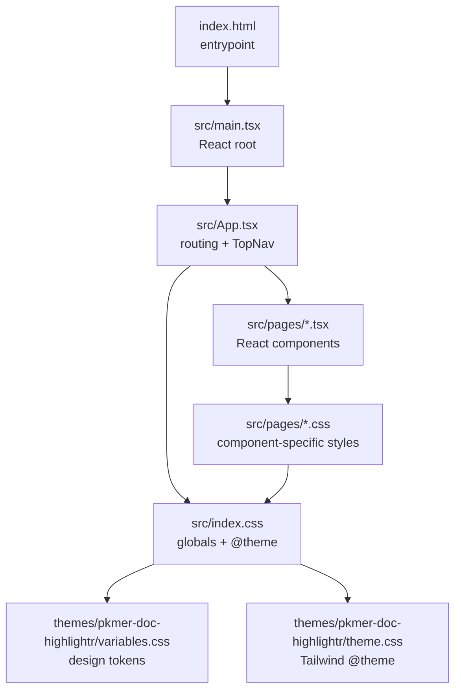

**Diagram sources**
- [index.html](file://index.html)
- [src/main.tsx](file://src/main.tsx)
- [src/App.tsx](file://src/App.tsx)
- [src/index.css](file://src/index.css)
- [themes/pkmer-doc-highlightr/variables.css](file://themes/pkmer-doc-highlightr/variables.css)
- [themes/pkmer-doc-highlightr/theme.css](file://themes/pkmer-doc-highlightr/theme.css)

**Section sources**
- [package.json](file://package.json)
- [vite.config.ts](file://vite.config.ts)
- [index.html](file://index.html)
- [src/main.tsx](file://src/main.tsx)
- [src/index.css](file://src/index.css)
- [themes/pkmer-doc-highlightr/variables.css](file://themes/pkmer-doc-highlightr/variables.css)
- [themes/pkmer-doc-highlightr/theme.css](file://themes/pkmer-doc-highlightr/theme.css)

## Core Components
- TailwindCSS v4 plugin: Integrated via Vite to compile design tokens and utilities.
- Theme tokens: Centralized in a dedicated theme folder with semantic variables and Tailwind @theme blocks.
- Global CSS: Defines semantic tokens mapped to theme variables, typography, spacing, shadows, and reusable component classes.
- Navigation shell: Bottom-fixed floating navigation with glass-like appearance and hover/focus states.
- Component CSS modules: Page-level styles that extend global tokens with layout and component-specific classes.
- Dark mode: Implemented via a root class switch that redefines token values in the theme variables.

**Section sources**
- [package.json](file://package.json)
- [vite.config.ts](file://vite.config.ts)
- [src/index.css](file://src/index.css)
- [themes/pkmer-doc-highlightr/variables.css](file://themes/pkmer-doc-highlightr/variables.css)
- [themes/pkmer-doc-highlightr/theme.css](file://themes/pkmer-doc-highlightr/theme.css)
- [src/App.tsx](file://src/App.tsx)

## Architecture Overview
The styling pipeline integrates TailwindCSS v4 with a design token layer and React components:

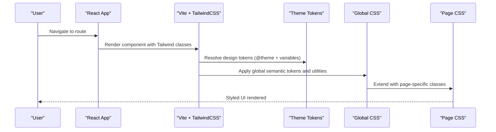

**Diagram sources**
- [vite.config.ts](file://vite.config.ts)
- [src/index.css](file://src/index.css)
- [themes/pkmer-doc-highlightr/theme.css](file://themes/pkmer-doc-highlightr/theme.css)
- [themes/pkmer-doc-highlightr/variables.css](file://themes/pkmer-doc-highlightr/variables.css)
- [src/pages/ArtisticAssistant.css](file://src/pages/ArtisticAssistant.css)
- [src/pages/SkillsLibrary.css](file://src/pages/SkillsLibrary.css)

## Detailed Component Analysis

### Theme Configuration and Design Tokens
- Semantic tokens: Global CSS maps theme variables to semantic CSS custom properties for colors, text, backgrounds, borders, shadows, and spacing.
- Tailwind @theme: The theme layer defines color palettes, typography scales, spacing steps, radii, and shadow values aligned with the design system.
- Tokens JSON: A structured token definition file documents color families, typography, dimensions, and shadows for tooling and consistency.

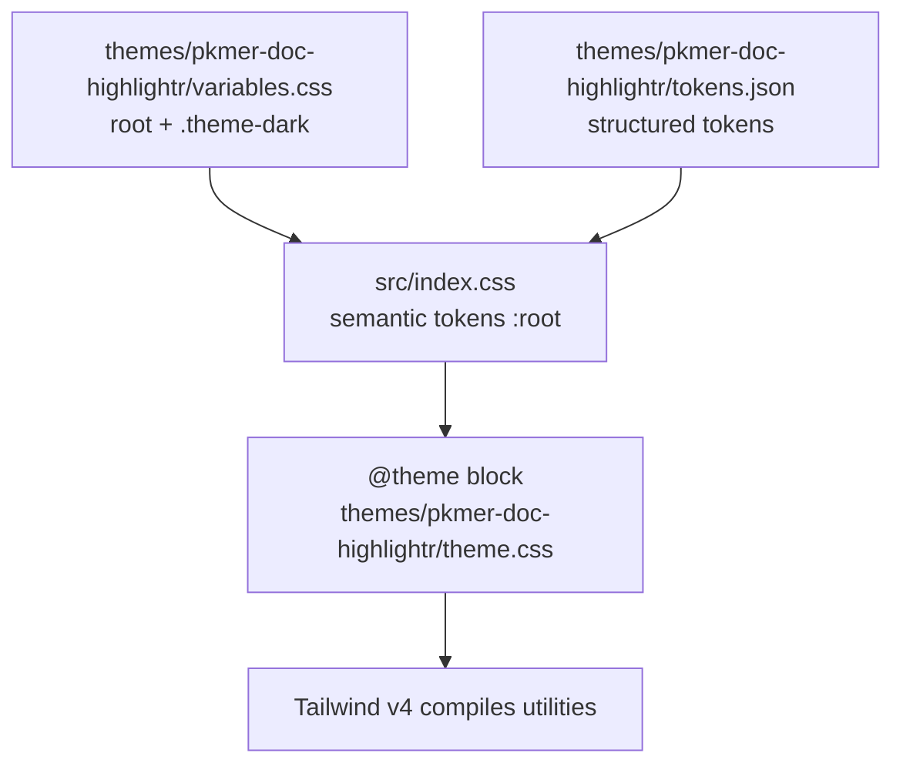

**Diagram sources**
- [themes/pkmer-doc-highlightr/variables.css](file://themes/pkmer-doc-highlightr/variables.css)
- [src/index.css](file://src/index.css)
- [themes/pkmer-doc-highlightr/theme.css](file://themes/pkmer-doc-highlightr/theme.css)
- [themes/pkmer-doc-highlightr/tokens.json](file://themes/pkmer-doc-highlightr/tokens.json)

**Section sources**
- [src/index.css](file://src/index.css)
- [themes/pkmer-doc-highlightr/variables.css](file://themes/pkmer-doc-highlightr/variables.css)
- [themes/pkmer-doc-highlightr/theme.css](file://themes/pkmer-doc-highlightr/theme.css)
- [themes/pkmer-doc-highlightr/tokens.json](file://themes/pkmer-doc-highlightr/tokens.json)

### Glassmorphism Effects and Navigation Styling
- Bottom navigation shell: Fixed bottom navigation with a glass-like card using backdrop filters when supported, falling back to solid backgrounds otherwise.
- Hover and focus states: Smooth transitions and focus rings leverage semantic tokens for consistent interaction feedback.
- Active state indicator: Underline indicator for the current page using primary brand colors.

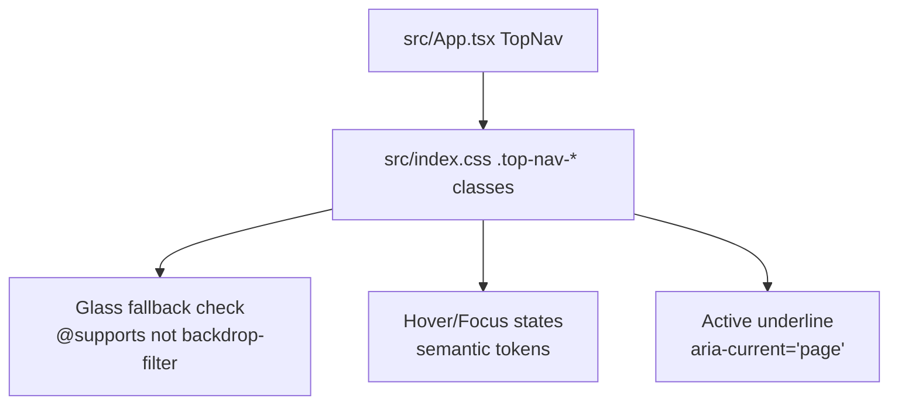

**Diagram sources**
- [src/App.tsx](file://src/App.tsx)
- [src/index.css](file://src/index.css)

**Section sources**
- [src/App.tsx](file://src/App.tsx)
- [src/index.css](file://src/index.css)

### Component-Specific CSS Classes
- Artistic Assistant page: Uses scoped CSS with semantic variables and custom radius tokens to style composer bars, bubbles, buttons, and previews.
- Skills Library page: Extends global tokens with grid layouts, cards, badges, and interactive states for chips and tabs.

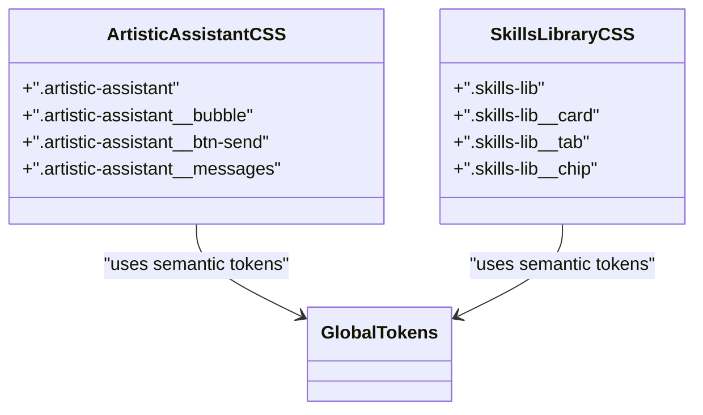

**Diagram sources**
- [src/pages/ArtisticAssistant.css](file://src/pages/ArtisticAssistant.css)
- [src/pages/SkillsLibrary.css](file://src/pages/SkillsLibrary.css)
- [src/index.css](file://src/index.css)

**Section sources**
- [src/pages/ArtisticAssistant.css](file://src/pages/ArtisticAssistant.css)
- [src/pages/SkillsLibrary.css](file://src/pages/SkillsLibrary.css)
- [src/index.css](file://src/index.css)

### Responsive Design Patterns
- Breakpoints and grids: Tailwind’s responsive modifiers are used extensively in components (e.g., grid columns, spacing, typography).
- Page containers: Inner wrappers adapt padding and max widths at different viewport sizes.
- Navigation responsiveness: Tracks and links adapt to narrow screens with reduced padding and font sizes.

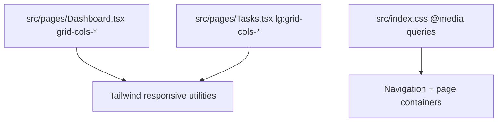

**Diagram sources**
- [src/pages/Dashboard.tsx](file://src/pages/Dashboard.tsx)
- [src/pages/Tasks.tsx](file://src/pages/Tasks.tsx)
- [src/index.css](file://src/index.css)

**Section sources**
- [src/pages/Dashboard.tsx](file://src/pages/Dashboard.tsx)
- [src/pages/Tasks.tsx](file://src/pages/Tasks.tsx)
- [src/index.css](file://src/index.css)

### Dark Mode Considerations
- Root class switching: The theme variables define a dark variant under a root class selector, allowing seamless light/dark toggling.
- Visual parity: Shadows, backgrounds, and text colors adjust to maintain contrast and readability in dark mode.

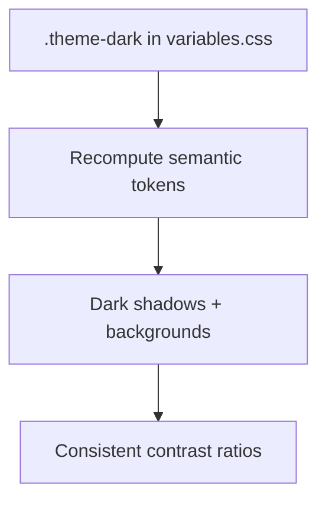

**Diagram sources**
- [themes/pkmer-doc-highlightr/variables.css](file://themes/pkmer-doc-highlightr/variables.css)
- [src/index.css](file://src/index.css)

**Section sources**
- [themes/pkmer-doc-highlightr/variables.css](file://themes/pkmer-doc-highlightr/variables.css)
- [src/index.css](file://src/index.css)

### Cross-Browser Compatibility
- Backdrop filter fallback: A support query ensures the navigation glass effect degrades gracefully when backdrop filters are unavailable.
- Scrollbar hiding: Vendor-prefixed and standard approaches hide scrollbars for a consistent look.
- Focus visibility: Focus rings and outlines are applied to ensure keyboard accessibility across browsers.

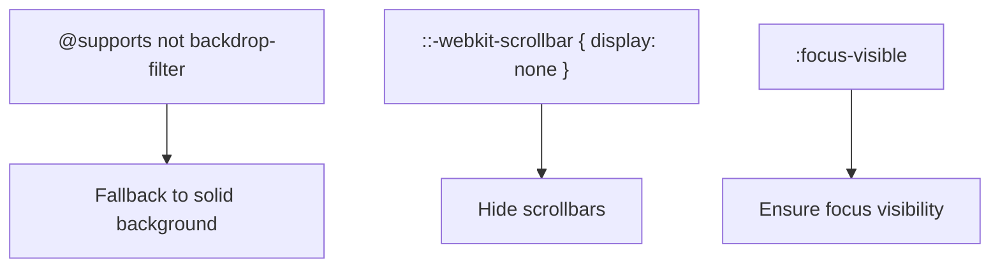

**Diagram sources**
- [src/index.css](file://src/index.css)

**Section sources**
- [src/index.css](file://src/index.css)

### Syntax Highlighting Theme Integration
- Token alignment: The theme defines code background, text, and inline highlight colors aligned with syntax highlighting expectations.
- Inline code and pre blocks: Leverage semantic tokens for consistent code presentation across components.

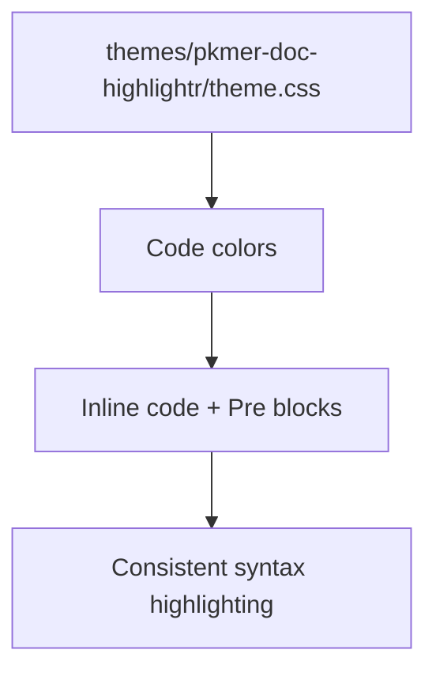

**Diagram sources**
- [themes/pkmer-doc-highlightr/theme.css](file://themes/pkmer-doc-highlightr/theme.css)
- [src/index.css](file://src/index.css)

**Section sources**
- [themes/pkmer-doc-highlightr/theme.css](file://themes/pkmer-doc-highlightr/theme.css)
- [src/index.css](file://src/index.css)

### CSS-in-JS and Styled-Components Usage
- Inline styles: Some components apply dynamic colors via inline styles while still referencing semantic tokens for consistency.
- Utility-first classes: The majority of styling relies on Tailwind utilities and global CSS classes, minimizing CSS-in-JS usage.

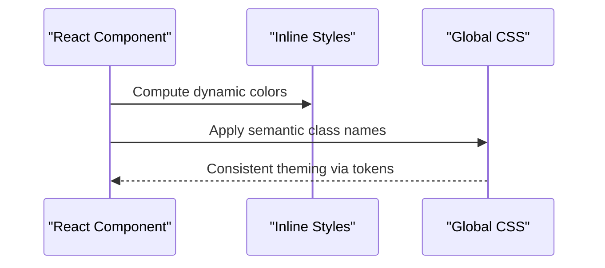

**Diagram sources**
- [src/pages/Dashboard.tsx](file://src/pages/Dashboard.tsx)
- [src/pages/Tasks.tsx](file://src/pages/Tasks.tsx)
- [src/pages/Settings.tsx](file://src/pages/Settings.tsx)
- [src/index.css](file://src/index.css)

**Section sources**
- [src/pages/Dashboard.tsx](file://src/pages/Dashboard.tsx)
- [src/pages/Tasks.tsx](file://src/pages/Tasks.tsx)
- [src/pages/Settings.tsx](file://src/pages/Settings.tsx)
- [src/index.css](file://src/index.css)

## Dependency Analysis
TailwindCSS v4 is integrated via the official Vite plugin. The build configuration enables PWA features for web builds and disables them for Electron clients.

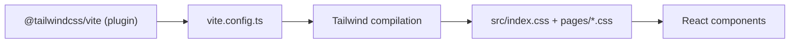

**Diagram sources**
- [package.json](file://package.json)
- [vite.config.ts](file://vite.config.ts)
- [src/index.css](file://src/index.css)

**Section sources**
- [package.json](file://package.json)
- [vite.config.ts](file://vite.config.ts)
- [src/index.css](file://src/index.css)

## Performance Considerations
- Minimal CSS-in-JS: Favoring Tailwind utilities and global CSS reduces runtime style computation.
- Scoped page CSS: Component-specific styles avoid global cascade bloat while remaining maintainable.
- Token reuse: Centralized semantic tokens minimize duplication and improve consistency.

## Troubleshooting Guide
- Navigation glass effect missing: Verify browser support for backdrop filters; the fallback applies a strong background when unsupported.
- Dark mode not activating: Ensure the root class switch updates the theme variables and semantic tokens accordingly.
- Focus indicators not visible: Confirm :focus-visible styles are not overridden by page-specific CSS.

**Section sources**
- [src/index.css](file://src/index.css)
- [themes/pkmer-doc-highlightr/variables.css](file://themes/pkmer-doc-highlightr/variables.css)

## Conclusion
The styling and theming system leverages TailwindCSS v4 with a robust design token layer, enabling consistent, responsive, and accessible UIs. Glassmorphism, navigation styling, and component-specific classes are implemented using semantic tokens and global CSS, while dark mode and cross-browser compatibility are addressed through targeted fallbacks and focus strategies. The architecture balances utility-first CSS with minimal CSS-in-JS, ensuring maintainability and performance.