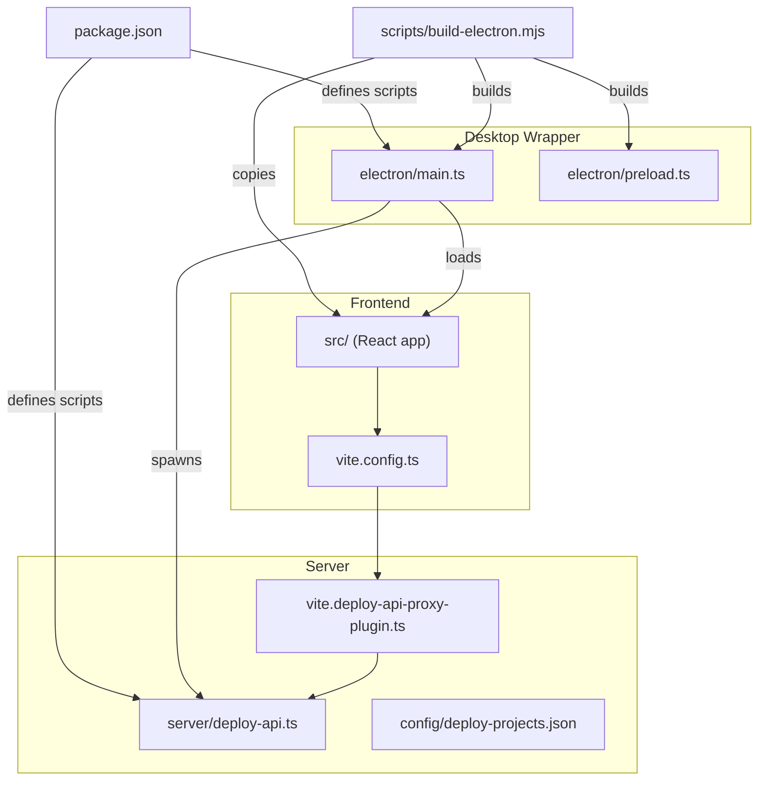
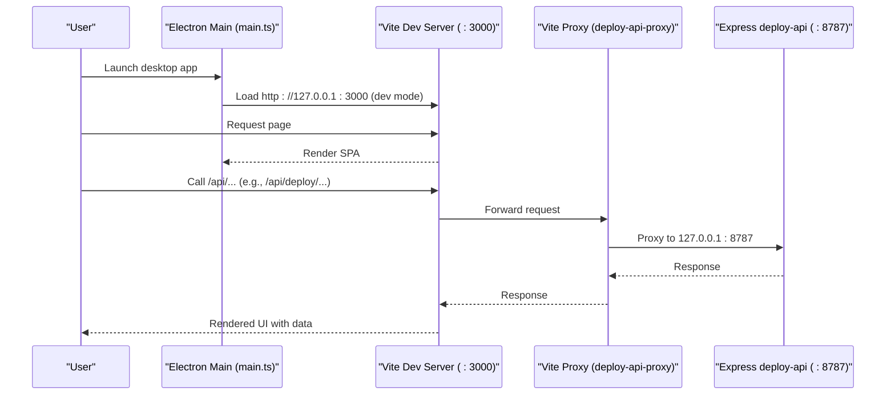
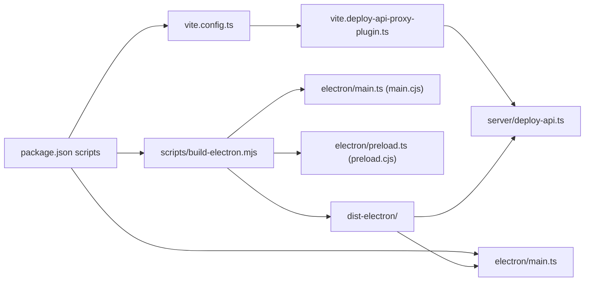

# Getting Started

<cite>
**Referenced Files in This Document**
- [README.md](file://README.md)
- [package.json](file://package.json)
- [vite.config.ts](file://vite.config.ts)
- [vite.deploy-api-proxy-plugin.ts](file://vite.deploy-api-proxy-plugin.ts)
- [scripts/build-electron.mjs](file://scripts/build-electron.mjs)
- [electron/main.ts](file://electron/main.ts)
- [server/deploy-api.ts](file://server/deploy-api.ts)
- [config/deploy-projects.json](file://config/deploy-projects.json)
- [.npmrc](file://.npmrc)
- [.yarnrc](file://.yarnrc)
- [tsconfig.json](file://tsconfig.json)
</cite>

## Table of Contents
1. [Introduction](#introduction)
2. [Project Structure](#project-structure)
3. [Core Components](#core-components)
4. [Architecture Overview](#architecture-overview)
5. [Detailed Component Analysis](#detailed-component-analysis)
6. [Dependency Analysis](#dependency-analysis)
7. [Performance Considerations](#performance-considerations)
8. [Troubleshooting Guide](#troubleshooting-guide)
9. [Conclusion](#conclusion)
10. [Appendices](#appendices)

## Introduction
This guide helps you set up and run Work Helper (Dottie-Assistant) from scratch. It covers prerequisites, installation, environment configuration, development workflows, builds, and distribution. The project consists of:
- A React + Vite web client
- An Electron desktop wrapper
- A Node.js Express server (deploy-api) handling deployment integrations and sensitive operations
- Scripts orchestrating concurrent development and packaging

## Project Structure
At a high level, the repository is organized into:
- Frontend: React + Vite under src/ and built to dist/
- Electron: main and preload entry points under electron/
- Server: Express-based deploy-api under server/
- Build and packaging: scripts and configuration under scripts/, package.json, and vite.config.ts
- Configurations: environment and project mappings under config/

**Diagram sources**
- [electron/main.ts:1-434](file://electron/main.ts#L1-L434)
- [vite.config.ts:1-111](file://vite.config.ts#L1-L111)
- [vite.deploy-api-proxy-plugin.ts:1-166](file://vite.deploy-api-proxy-plugin.ts#L1-L166)
- [scripts/build-electron.mjs:1-76](file://scripts/build-electron.mjs#L1-L76)
- [server/deploy-api.ts:1-200](file://server/deploy-api.ts#L1-L200)
- [config/deploy-projects.json:1-78](file://config/deploy-projects.json#L1-L78)
- [package.json:1-99](file://package.json#L1-L99)

**Section sources**
- [README.md:1-91](file://README.md#L1-L91)
- [package.json:1-99](file://package.json#L1-L99)
- [vite.config.ts:1-111](file://vite.config.ts#L1-L111)
- [scripts/build-electron.mjs:1-76](file://scripts/build-electron.mjs#L1-L76)
- [electron/main.ts:1-434](file://electron/main.ts#L1-L434)
- [server/deploy-api.ts:1-200](file://server/deploy-api.ts#L1-L200)
- [config/deploy-projects.json:1-78](file://config/deploy-projects.json#L1-L78)

## Core Components
- Desktop launcher and lifecycle: electron/main.ts manages the main window, floating dock, and child process for deploy-api.
- Web client: Vite with React and Tailwind; PWA plugin included for web builds.
- Development proxy: vite.deploy-api-proxy-plugin.ts forwards /api/* requests to the running deploy-api.
- Build pipeline: scripts/build-electron.mjs bundles main/preload and copies Vite dist into dist-electron for Electron.
- Server: server/deploy-api.ts exposes APIs for deployment orchestration, Jira/Jenkins integrations, and local skills/models.

**Section sources**
- [electron/main.ts:1-434](file://electron/main.ts#L1-L434)
- [vite.config.ts:1-111](file://vite.config.ts#L1-L111)
- [vite.deploy-api-proxy-plugin.ts:1-166](file://vite.deploy-api-proxy-plugin.ts#L1-L166)
- [scripts/build-electron.mjs:1-76](file://scripts/build-electron.mjs#L1-L76)
- [server/deploy-api.ts:1-200](file://server/deploy-api.ts#L1-L200)

## Architecture Overview
The desktop app runs a local Express server (deploy-api) and serves a React SPA via Electron. During development, Vite runs on port 3000 and the proxy forwards backend API calls to deploy-api (default 8787). Packaging bundles the web assets and server into Electron’s dist-electron folder.

**Diagram sources**
- [electron/main.ts:1-434](file://electron/main.ts#L1-L434)
- [vite.config.ts:1-111](file://vite.config.ts#L1-L111)
- [vite.deploy-api-proxy-plugin.ts:1-166](file://vite.deploy-api-proxy-plugin.ts#L1-L166)
- [server/deploy-api.ts:1-200](file://server/deploy-api.ts#L1-L200)

## Detailed Component Analysis

### Prerequisites
- Node.js 22.x: The project expects Node 22 for development scripts and builds. Scripts use nvm to switch to Node 22 automatically.
- Package manager: Yarn is supported; registry settings are configured to avoid enterprise mirrors that may miss optional binaries.
- macOS: The scripts and defaults assume macOS (bash + nvm path). Other platforms require manual adjustments.

Environment variables to prepare:
- GEMINI_API_KEY: Required for Gemini integration.
- Jenkins credentials: JENKINS_USER and JENKINS_TOKEN for deployment automation.
- Optional integrations: Jira, knowledge bridge, and local model settings as documented in .env.example.

Notes:
- The project uses esbuild to compile Electron main/preload to CJS for Node 22.
- Desktop packaging uses electron-builder with a zip target for distribution.

**Section sources**
- [README.md:5-23](file://README.md#L5-L23)
- [package.json:11-16](file://package.json#L11-L16)
- [scripts/build-electron.mjs:17-47](file://scripts/build-electron.mjs#L17-L47)
- [electron/main.ts:96-110](file://electron/main.ts#L96-L110)
- [server/deploy-api.ts:65-73](file://server/deploy-api.ts#L65-L73)
- [.npmrc:1-5](file://.npmrc#L1-L5)
- [.yarnrc:1-3](file://.yarnrc#L1-L3)

### Step-by-Step Installation
1. Install dependencies
   - Use your package manager to install dependencies. The repository is configured to use the official npm registry to avoid missing optional binaries.
   - Reference: [package.json:14-16](file://package.json#L14-L16), [.npmrc:1-5](file://.npmrc#L1-L5), [.yarnrc:1-3](file://.yarnrc#L1-L3)

2. Prepare environment variables
   - Copy .env.example to .env or .env.local in the project root.
   - Configure at least GEMINI_API_KEY, JENKINS_USER, and JENKINS_TOKEN.
   - Reference: [README.md:18-22](file://README.md#L18-L22)

3. Initial configuration
   - Review and adjust config/deploy-projects.json for Jenkins job mappings and defaults.
   - Reference: [config/deploy-projects.json:1-78](file://config/deploy-projects.json#L1-L78)

4. Verify TypeScript configuration
   - The project targets ES2022 and uses bundler module resolution; ensure your editor recognizes tsconfig.json.
   - Reference: [tsconfig.json:1-28](file://tsconfig.json#L1-L28)

**Section sources**
- [README.md:12-23](file://README.md#L12-L23)
- [config/deploy-projects.json:1-78](file://config/deploy-projects.json#L1-L78)
- [tsconfig.json:1-28](file://tsconfig.json#L1-L28)
- [.npmrc:1-5](file://.npmrc#L1-L5)
- [.yarnrc:1-3](file://.yarnrc#L1-L3)

### Development Environment Setup
- Concurrent development mode
  - Run both Vite (frontend) and deploy-api (backend) concurrently with a single command.
  - The script switches to Node 22 via nvm and starts Vite on port 3000 and the API server on port 8787.
  - Reference: [package.json:11-13](file://package.json#L11-L13)

- Desktop development mode
  - Starts Vite, deploy-api, and Electron in parallel, waiting for both to be healthy before launching the desktop app.
  - Reference: [package.json:15-17](file://package.json#L15-L17), [electron/main.ts:389-406](file://electron/main.ts#L389-L406)

- Web-only development
  - Start only the frontend without the backend server.
  - Reference: [package.json](file://package.json#L14)

- Proxy behavior
  - Vite forwards /api/* routes to deploy-api using a dynamic proxy plugin that reads the current port from .deploy-api-port or environment.
  - Reference: [vite.config.ts:15-17](file://vite.config.ts#L15-L17), [vite.deploy-api-proxy-plugin.ts:43-55](file://vite.deploy-api-proxy-plugin.ts#L43-L55)

**Section sources**
- [package.json:11-17](file://package.json#L11-L17)
- [vite.config.ts:15-17](file://vite.config.ts#L15-L17)
- [vite.deploy-api-proxy-plugin.ts:43-55](file://vite.deploy-api-proxy-plugin.ts#L43-L55)
- [electron/main.ts:389-406](file://electron/main.ts#L389-L406)

### Build Process
- Web build
  - Builds the React client to dist/ using Vite.
  - Reference: [package.json](file://package.json#L18), [vite.config.ts:1-111](file://vite.config.ts#L1-L111)

- Desktop build
  - First builds the Electron client (ELECTRON=1) and then compiles Electron main/preload and copies Vite dist into dist-electron.
  - Reference: [package.json:19-21](file://package.json#L19-L21), [scripts/build-electron.mjs:1-76](file://scripts/build-electron.mjs#L1-L76)

- Distribution packaging
  - Produces a zip distribution for macOS using electron-builder.
  - Reference: [package.json](file://package.json#L26), [README.md:74-85](file://README.md#L74-L85)

**Section sources**
- [package.json:18-26](file://package.json#L18-L26)
- [vite.config.ts:1-111](file://vite.config.ts#L1-L111)
- [scripts/build-electron.mjs:1-76](file://scripts/build-electron.mjs#L1-L76)
- [README.md:74-85](file://README.md#L74-L85)

### First Launch Procedures
- Desktop first launch
  - Electron checks whether to connect to Vite dev server or start the bundled deploy-api internally.
  - It waits for the backend health endpoint and then loads the SPA.
  - Reference: [electron/main.ts:16-21](file://electron/main.ts#L16-L21), [electron/main.ts:389-406](file://electron/main.ts#L389-L406)

- Backend readiness
  - The backend server listens on the configured port and serves health checks for the desktop app to wait on.
  - Reference: [server/deploy-api.ts:78-80](file://server/deploy-api.ts#L78-L80)

- Verifying components
  - Open the desktop app and navigate to features like Deployment, Tasks, and Settings to confirm the UI loads.
  - Ensure the floating dock appears and responds to interactions.
  - Reference: [electron/main.ts:311-387](file://electron/main.ts#L311-L387), [src/App.tsx:1-136](file://src/App.tsx#L1-L136)

**Section sources**
- [electron/main.ts:16-21](file://electron/main.ts#L16-L21)
- [electron/main.ts:389-406](file://electron/main.ts#L389-L406)
- [server/deploy-api.ts:78-80](file://server/deploy-api.ts#L78-L80)
- [src/App.tsx:1-136](file://src/App.tsx#L1-L136)

### Basic Configuration Steps
- Configure Gemini
  - Set GEMINI_API_KEY in your environment file.
  - Reference: [README.md:18-22](file://README.md#L18-L22)

- Configure Jenkins
  - Provide JENKINS_USER and JENKINS_TOKEN.
  - Adjust defaults and projects in config/deploy-projects.json as needed.
  - Reference: [README.md:39-72](file://README.md#L39-L72), [config/deploy-projects.json:1-78](file://config/deploy-projects.json#L1-L78)

- Optional integrations
  - Configure Jira, knowledge bridge, and local models per .env.example guidance.
  - Reference: [README.md:18-22](file://README.md#L18-L22)

**Section sources**
- [README.md:18-22](file://README.md#L18-L22)
- [README.md:39-72](file://README.md#L39-L72)
- [config/deploy-projects.json:1-78](file://config/deploy-projects.json#L1-L78)

## Dependency Analysis
The build and runtime dependencies are orchestrated by package.json scripts and Vite configuration. The Electron build depends on esbuild to produce CJS artifacts and copies the Vite dist into dist-electron. The desktop app spawns the bundled deploy-api and connects to it via localhost.

**Diagram sources**
- [package.json:1-99](file://package.json#L1-L99)
- [vite.config.ts:1-111](file://vite.config.ts#L1-L111)
- [vite.deploy-api-proxy-plugin.ts:1-166](file://vite.deploy-api-proxy-plugin.ts#L1-L166)
- [scripts/build-electron.mjs:1-76](file://scripts/build-electron.mjs#L1-L76)
- [electron/main.ts:1-434](file://electron/main.ts#L1-L434)
- [server/deploy-api.ts:1-200](file://server/deploy-api.ts#L1-L200)

**Section sources**
- [package.json:1-99](file://package.json#L1-L99)
- [vite.config.ts:1-111](file://vite.config.ts#L1-L111)
- [vite.deploy-api-proxy-plugin.ts:1-166](file://vite.deploy-api-proxy-plugin.ts#L1-L166)
- [scripts/build-electron.mjs:1-76](file://scripts/build-electron.mjs#L1-L76)
- [electron/main.ts:1-434](file://electron/main.ts#L1-L434)
- [server/deploy-api.ts:1-200](file://server/deploy-api.ts#L1-L200)

## Performance Considerations
- Desktop packaging optimizations
  - The Electron build removes a large bundled font to speed up asar and zip creation; you can keep it if needed.
  - Reference: [scripts/build-electron.mjs:57-73](file://scripts/build-electron.mjs#L57-L73)

- PWA caching behavior
  - PWA caching is disabled for Electron clients and adjusted for web dev to avoid caching proxy errors.
  - Reference: [vite.config.ts:55-77](file://vite.config.ts#L55-L77)

- Proxy timeouts
  - The proxy sets a generous timeout for backend requests to accommodate long-running operations.
  - Reference: [vite.deploy-api-proxy-plugin.ts](file://vite.deploy-api-proxy-plugin.ts#L111)

**Section sources**
- [scripts/build-electron.mjs:57-73](file://scripts/build-electron.mjs#L57-L73)
- [vite.config.ts:55-77](file://vite.config.ts#L55-L77)
- [vite.deploy-api-proxy-plugin.ts](file://vite.deploy-api-proxy-plugin.ts#L111)

## Troubleshooting Guide
- Node.js version mismatch
  - Ensure Node 22 is active. The scripts use nvm to switch to 22 automatically; if you do not use nvm, align your environment accordingly.
  - Reference: [package.json:11-13](file://package.json#L11-L13)

- Port conflicts
  - The backend runs on port 8787 by default. If it is taken, the proxy reads .deploy-api-port and the desktop app waits for the health endpoint; ensure the port is free or update the port variable.
  - Reference: [vite.deploy-api-proxy-plugin.ts:43-55](file://vite.deploy-api-proxy-plugin.ts#L43-L55), [electron/main.ts:126-148](file://electron/main.ts#L126-L148)

- macOS-specific scripts
  - The scripts assume bash and nvm path; on other platforms, adapt the commands manually.
  - Reference: [README.md:7-8](file://README.md#L7-L8)

- Registry issues with optional binaries
  - Use the official npm registry to avoid missing optional binaries for lightningcss and tailwind.
  - Reference: [.npmrc:1-5](file://.npmrc#L1-L5), [.yarnrc:1-3](file://.yarnrc#L1-L3)

- Desktop app fails to start backend
  - Confirm the backend is reachable at the configured port and that the health endpoint responds.
  - Reference: [electron/main.ts:389-406](file://electron/main.ts#L389-L406), [server/deploy-api.ts:78-80](file://server/deploy-api.ts#L78-L80)

**Section sources**
- [package.json:11-13](file://package.json#L11-L13)
- [vite.deploy-api-proxy-plugin.ts:43-55](file://vite.deploy-api-proxy-plugin.ts#L43-L55)
- [electron/main.ts:126-148](file://electron/main.ts#L126-L148)
- [README.md:7-8](file://README.md#L7-L8)
- [.npmrc:1-5](file://.npmrc#L1-L5)
- [.yarnrc:1-3](file://.yarnrc#L1-L3)
- [electron/main.ts:389-406](file://electron/main.ts#L389-L406)
- [server/deploy-api.ts:78-80](file://server/deploy-api.ts#L78-L80)

## Conclusion
You now have the essentials to install, configure, develop, and package Work Helper. Start with installing dependencies, preparing environment variables, and running the concurrent development stack. Use the desktop development mode for end-to-end testing, and the distribution commands to package the app for macOS.

## Appendices
- Additional commands
  - Type checking and tests: npm run lint and npm test.
  - Preview production build locally: npm run preview.
  - Reference: [package.json:28-29](file://package.json#L28-L29)

**Section sources**
- [package.json:28-29](file://package.json#L28-L29)