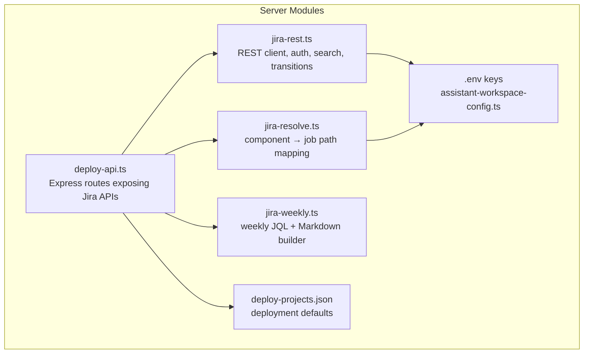
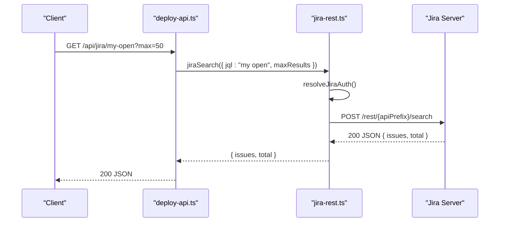
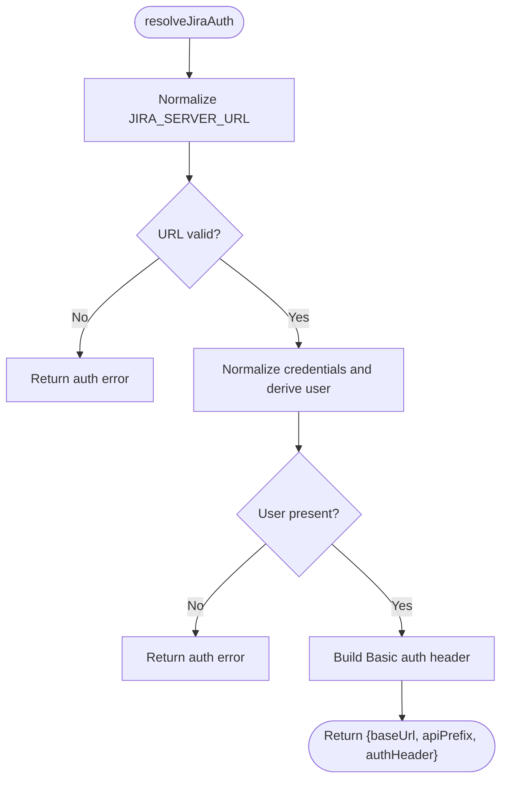
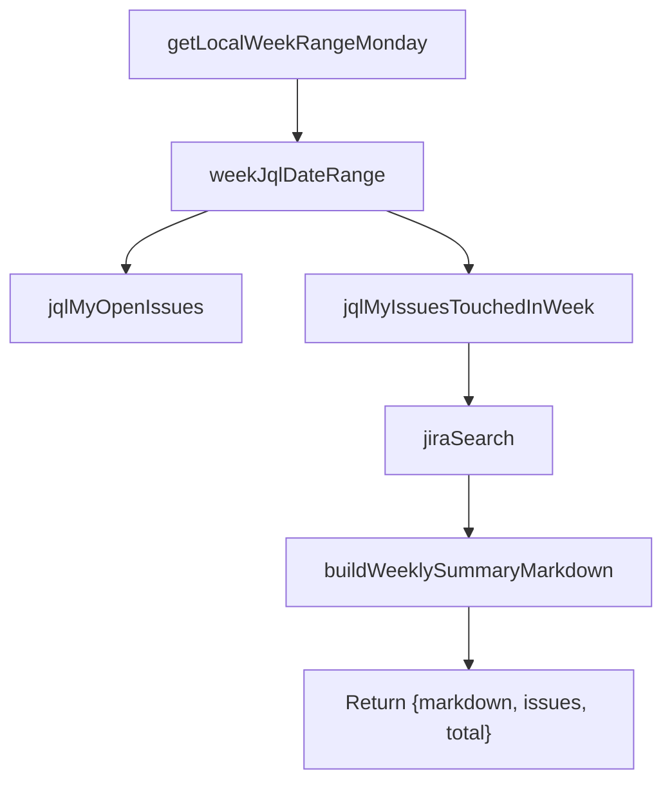
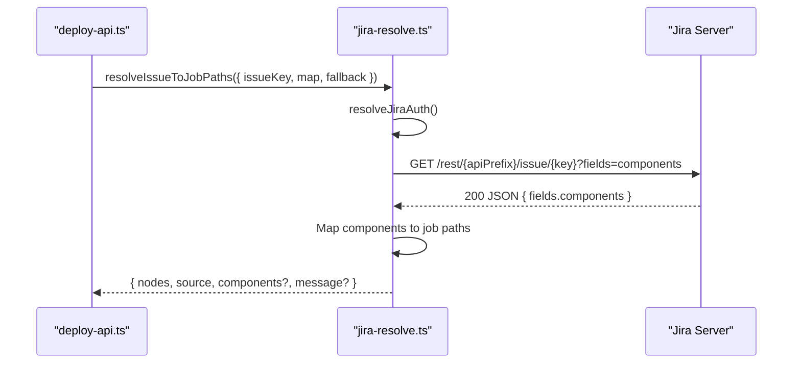
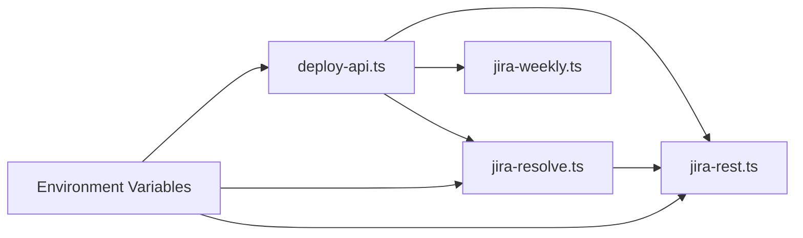

# Jira Integration

<cite>
**Referenced Files in This Document**
- [jira-rest.ts](file://server/jira-rest.ts)
- [jira-resolve.ts](file://server/jira-resolve.ts)
- [jira-weekly.ts](file://server/jira-weekly.ts)
- [deploy-api.ts](file://server/deploy-api.ts)
- [assistant-workspace-config.ts](file://server/assistant-workspace-config.ts)
- [deploy-projects.json](file://config/deploy-projects.json)
- [jira-rest.test.ts](file://test/server/jira-rest.test.ts)
- [jira-weekly.test.ts](file://test/server/jira-weekly.test.ts)
</cite>

## Table of Contents
1. [Introduction](#introduction)
2. [Project Structure](#project-structure)
3. [Core Components](#core-components)
4. [Architecture Overview](#architecture-overview)
5. [Detailed Component Analysis](#detailed-component-analysis)
6. [Dependency Analysis](#dependency-analysis)
7. [Performance Considerations](#performance-considerations)
8. [Troubleshooting Guide](#troubleshooting-guide)
9. [Conclusion](#conclusion)
10. [Appendices](#appendices)

## Introduction
This document explains the Jira integration system implemented in the backend server. It covers:
- REST API integration: authentication, request/response handling, error management, and automatic API path fallback
- Weekly report generation: JQL construction, issue collection, processing, and Markdown formatting
- Resolution mapping: translating Jira issue components to Jenkins job path segments with fallbacks
- API client implementation: request building, response parsing, and data transformation
- Integration patterns with the task management system for synchronized issue tracking
- Configuration requirements, rate limiting, caching, offline handling, synchronization, and conflict resolution
- Common workflows and troubleshooting guidance

## Project Structure
The Jira integration is implemented in dedicated modules under the server directory and exposed via Express routes in the deployment API server.

**Diagram sources**
- [deploy-api.ts:1-200](file://server/deploy-api.ts#L1-L200)
- [jira-rest.ts:1-85](file://server/jira-rest.ts#L1-L85)
- [jira-resolve.ts:1-45](file://server/jira-resolve.ts#L1-L45)
- [jira-weekly.ts:1-50](file://server/jira-weekly.ts#L1-L50)
- [assistant-workspace-config.ts:80-95](file://server/assistant-workspace-config.ts#L80-L95)
- [deploy-projects.json:1-20](file://config/deploy-projects.json#L1-L20)

**Section sources**
- [deploy-api.ts:1-200](file://server/deploy-api.ts#L1-L200)
- [jira-rest.ts:1-85](file://server/jira-rest.ts#L1-L85)
- [jira-resolve.ts:1-45](file://server/jira-resolve.ts#L1-L45)
- [jira-weekly.ts:1-50](file://server/jira-weekly.ts#L1-L50)
- [assistant-workspace-config.ts:80-95](file://server/assistant-workspace-config.ts#L80-L95)
- [deploy-projects.json:1-20](file://config/deploy-projects.json#L1-L20)

## Core Components
- REST client and authentication
  - Authentication via Basic auth using Jira username plus either a password or an API token
  - Automatic normalization of credentials and URLs
  - Fallback to legacy API path when modern path returns 404/410
  - Robust error parsing for HTML vs JSON responses
- Search and transitions
  - Search issues via POST /rest/{apiPrefix}/search with configurable fields and maxResults
  - Workflow transitions for “submit for test” with flexible matching by transition name or explicit ID
- Weekly report generator
  - Local week calculation aligned to Monday–Sunday
  - JQL builders for open issues and issues touched in a week
  - Markdown formatter grouping by status and listing details
- Resolution mapper
  - Fetch issue components and map to Jenkins job path segments via a JSON component map
  - Fallback to default nodes when mapping is unavailable
- API surface
  - Routes for status check, my open issues, weekly report, submit-test transition, and resolution mapping

**Section sources**
- [jira-rest.ts:34-85](file://server/jira-rest.ts#L34-L85)
- [jira-rest.ts:181-278](file://server/jira-rest.ts#L181-L278)
- [jira-rest.ts:282-482](file://server/jira-rest.ts#L282-L482)
- [jira-weekly.ts:4-50](file://server/jira-weekly.ts#L4-L50)
- [jira-weekly.ts:67-112](file://server/jira-weekly.ts#L67-L112)
- [jira-resolve.ts:47-129](file://server/jira-resolve.ts#L47-L129)
- [deploy-api.ts:1165-1283](file://server/deploy-api.ts#L1165-L1283)

## Architecture Overview
The integration exposes REST endpoints backed by internal modules. The server loads environment variables from a prioritized .env location and uses them to configure Jira connectivity and optional mapping/fallbacks.

**Diagram sources**
- [deploy-api.ts:1181-1202](file://server/deploy-api.ts#L1181-L1202)
- [jira-rest.ts:181-278](file://server/jira-rest.ts#L181-L278)

**Section sources**
- [deploy-api.ts:1165-1283](file://server/deploy-api.ts#L1165-L1283)
- [jira-rest.ts:181-278](file://server/jira-rest.ts#L181-L278)

## Detailed Component Analysis

### REST Client and Authentication
- Authentication configuration
  - Supports JIRA_SERVER_URL, JIRA_USERNAME, JIRA_PASSWORD, JIRA_API_TOKEN, JIRA_REST_PATH_PREFIX
  - Username fallback: if JIRA_USERNAME is not set but JIRA_PASSWORD or JIRA_API_TOKEN is present, JENKINS_USER can be used as the login name
  - Normalization removes stray quotes, trailing commas, and whitespace from URLs and credentials
- Request building
  - Uses Basic auth header derived from username and password/token
  - POST /rest/{apiPrefix}/search with configurable fields and bounded maxResults
  - Optional logging context prints sanitized request metadata
- Error handling
  - Detects HTML responses (common for 401/403) and augments messages with actionable hints
  - Parses JSON error messages and falls back to raw previews
  - On 404/410 with default modern API path, retries with legacy API path (rest/api/2) unless overridden
- Transition support
  - GET transitions and POST transition execution
  - Flexible matching by transition name or explicit ID via environment variables

**Diagram sources**
- [jira-rest.ts:34-85](file://server/jira-rest.ts#L34-L85)

**Section sources**
- [jira-rest.ts:34-85](file://server/jira-rest.ts#L34-L85)
- [jira-rest.ts:106-148](file://server/jira-rest.ts#L106-L148)
- [jira-rest.ts:161-179](file://server/jira-rest.ts#L161-L179)
- [jira-rest.ts:181-278](file://server/jira-rest.ts#L181-L278)
- [jira-rest.ts:292-482](file://server/jira-rest.ts#L292-L482)
- [assistant-workspace-config.ts:80-95](file://server/assistant-workspace-config.ts#L80-L95)

### Weekly Report Generation
- Week calculation
  - Local week boundaries: Monday 00:00:00.000 to next Monday 00:00:00.000 (left-closed, right-open)
  - Date formatting helpers for JQL
- JQL builders
  - My open issues: unresolved and assigned to current user
  - Issues touched in a week: updated within the calculated date range
- Markdown builder
  - Aggregates counts per status and lists issues with project/type/status/summary
  - Includes a note clarifying auto-generation

**Diagram sources**
- [jira-weekly.ts:4-50](file://server/jira-weekly.ts#L4-L50)
- [jira-weekly.ts:67-112](file://server/jira-weekly.ts#L67-L112)
- [deploy-api.ts:1236-1283](file://server/deploy-api.ts#L1236-L1283)

**Section sources**
- [jira-weekly.ts:4-50](file://server/jira-weekly.ts#L4-L50)
- [jira-weekly.ts:67-112](file://server/jira-weekly.ts#L67-L112)
- [deploy-api.ts:1236-1283](file://server/deploy-api.ts#L1236-L1283)

### Resolution Mapping (Jira Components → Jenkins Job Paths)
- Purpose
  - Given a Jira issue key, fetch components and map them to Jenkins job path segments using a JSON map
  - Provide fallback nodes when mapping is absent or issue lacks components
- Behavior
  - Reads JIRA_COMPONENT_JOB_MAP (JSON) and JIRA_RESOLUTION_FALLBACK_NODES (CSV)
  - Normalizes component names for lookup
  - Returns deduplicated job path segments and source of resolution

**Diagram sources**
- [jira-resolve.ts:47-129](file://server/jira-resolve.ts#L47-L129)
- [deploy-api.ts:1285-1303](file://server/deploy-api.ts#L1285-L1303)

**Section sources**
- [jira-resolve.ts:47-129](file://server/jira-resolve.ts#L47-L129)
- [deploy-api.ts:1285-1303](file://server/deploy-api.ts#L1285-L1303)

### API Client Implementation Details
- Request building
  - Base URL and API prefix derived from environment
  - Authorization header built from normalized credentials
  - Fields and maxResults are bounded and defaulted
- Response parsing
  - JSON parsing with robust error extraction
  - Special handling for HTML responses (common for auth failures)
- Data transformation
  - Transforms raw Jira search results into typed structures
  - Builds JQL strings for weekly reports and open issues
  - Converts component arrays into job path segments

**Section sources**
- [jira-rest.ts:161-179](file://server/jira-rest.ts#L161-L179)
- [jira-rest.ts:257-278](file://server/jira-rest.ts#L257-L278)
- [jira-weekly.ts:60-65](file://server/jira-weekly.ts#L60-L65)

### Integration Patterns with Task Management
- Weekly report route integrates with the deployment pipeline by providing JQL and Markdown output suitable for automation or manual review
- Submit-test transition ties Jira workflow steps to downstream tasks
- Resolution mapping connects Jira components to Jenkins job paths for automated triggers

**Section sources**
- [deploy-api.ts:1236-1283](file://server/deploy-api.ts#L1236-L1283)
- [deploy-api.ts:1204-1234](file://server/deploy-api.ts#L1204-L1234)
- [deploy-api.ts:1285-1303](file://server/deploy-api.ts#L1285-L1303)

## Dependency Analysis
- Internal dependencies
  - deploy-api.ts depends on jira-rest.ts, jira-resolve.ts, and jira-weekly.ts
  - jira-resolve.ts depends on jira-rest.ts for authentication
- Environment variables
  - Jira: JIRA_SERVER_URL, JIRA_USERNAME, JIRA_PASSWORD, JIRA_API_TOKEN, JIRA_REST_PATH_PREFIX
  - Resolution mapping: JIRA_COMPONENT_JOB_MAP, JIRA_RESOLUTION_FALLBACK_NODES
  - Workspace configuration keys are declared centrally

**Diagram sources**
- [deploy-api.ts:1-200](file://server/deploy-api.ts#L1-L200)
- [jira-rest.ts:1-85](file://server/jira-rest.ts#L1-L85)
- [jira-resolve.ts:1-45](file://server/jira-resolve.ts#L1-L45)
- [assistant-workspace-config.ts:80-95](file://server/assistant-workspace-config.ts#L80-L95)

**Section sources**
- [deploy-api.ts:1-200](file://server/deploy-api.ts#L1-L200)
- [jira-rest.ts:1-85](file://server/jira-rest.ts#L1-L85)
- [jira-resolve.ts:1-45](file://server/jira-resolve.ts#L1-L45)
- [assistant-workspace-config.ts:80-95](file://server/assistant-workspace-config.ts#L80-L95)

## Performance Considerations
- Rate limiting
  - The integration does not implement client-side rate limiting; rely on upstream Jira limits and consider adding delays or queues if encountering throttling
- Caching
  - No built-in caching; consider memoizing repeated queries for the same JQL and week ranges
- Offline handling
  - On HTTP errors, the system returns structured errors; callers should handle 502/503 responses gracefully
- Concurrency
  - Search requests are currently synchronous; batch or parallelize only if safe and necessary

[No sources needed since this section provides general guidance]

## Troubleshooting Guide
- Authentication failures
  - 401 Unauthorized often indicates incorrect username/password or API token; verify normalization of credentials and confirm the account has REST permissions
  - 403 Forbidden suggests insufficient permissions; ensure the account can browse projects and use REST
- API path mismatch
  - If 404/410 occurs with the default modern API path, the system retries with the legacy path; set JIRA_REST_PATH_PREFIX explicitly if needed
- HTML responses
  - When Jira returns HTML instead of JSON, the system detects this and provides actionable hints
- Environment configuration
  - Ensure JIRA_SERVER_URL, JIRA_USERNAME, and either JIRA_PASSWORD or JIRA_API_TOKEN are set; if JIRA_USERNAME is omitted, JENKINS_USER can be used only when a secret is provided
- Testing
  - Tests demonstrate credential normalization and API token acceptance

**Section sources**
- [jira-rest.ts:106-148](file://server/jira-rest.ts#L106-L148)
- [jira-rest.ts:223-242](file://server/jira-rest.ts#L223-L242)
- [jira-rest.test.ts:5-29](file://test/server/jira-rest.test.ts#L5-L29)
- [jira-weekly.test.ts:12-36](file://test/server/jira-weekly.test.ts#L12-L36)

## Conclusion
The Jira integration provides a robust foundation for:
- Secure, normalized authentication and REST communication
- Reliable search and workflow transition operations with graceful fallbacks
- Weekly reporting and resolution mapping for seamless task and deployment workflows
Future enhancements could include client-side rate limiting, caching, and offline persistence for improved resilience.

[No sources needed since this section summarizes without analyzing specific files]

## Appendices

### Configuration Requirements
- Jira connectivity and authentication
  - JIRA_SERVER_URL: Jira base URL
  - JIRA_USERNAME: Jira username (or JENKINS_USER if JIRA_USERNAME is not set and a secret is provided)
  - JIRA_PASSWORD or JIRA_API_TOKEN: choose one
  - JIRA_REST_PATH_PREFIX: optional override for API path (default: rest/api/3)
- Resolution mapping
  - JIRA_COMPONENT_JOB_MAP: JSON mapping component names to job path segments
  - JIRA_RESOLUTION_FALLBACK_NODES: CSV fallback nodes when mapping is unavailable
- Environment variable handling
  - Keys are declared for UI exposure and secret masking

**Section sources**
- [jira-rest.ts:34-85](file://server/jira-rest.ts#L34-L85)
- [jira-resolve.ts:15-41](file://server/jira-resolve.ts#L15-L41)
- [assistant-workspace-config.ts:80-95](file://server/assistant-workspace-config.ts#L80-L95)

### API Surface and Examples
- Status check
  - GET /api/jira/status: returns configured mode and server URL
- My open issues
  - GET /api/jira/my-open?max=N: returns up to N issues
- Weekly report
  - GET /api/jira/weekly?weekOffset=0: returns issues and Markdown summary for the week
- Submit test transition
  - POST /api/jira/issue/{issueKey}/submit-test: executes a “submit for test” transition
- Resolution mapping
  - GET /api/deploy/jira/resolution/{issueKey}: resolves components to job paths

**Section sources**
- [deploy-api.ts:1165-1283](file://server/deploy-api.ts#L1165-L1283)
- [deploy-api.ts:1285-1303](file://server/deploy-api.ts#L1285-L1303)

### Data Synchronization and Conflict Resolution
- Synchronization
  - The integration reads Jira state via REST; no persistent state is maintained
- Conflict resolution
  - When mapping is missing or invalid, fallback nodes are used; callers should reconcile discrepancies by updating the component map

**Section sources**
- [jira-resolve.ts:104-129](file://server/jira-resolve.ts#L104-L129)