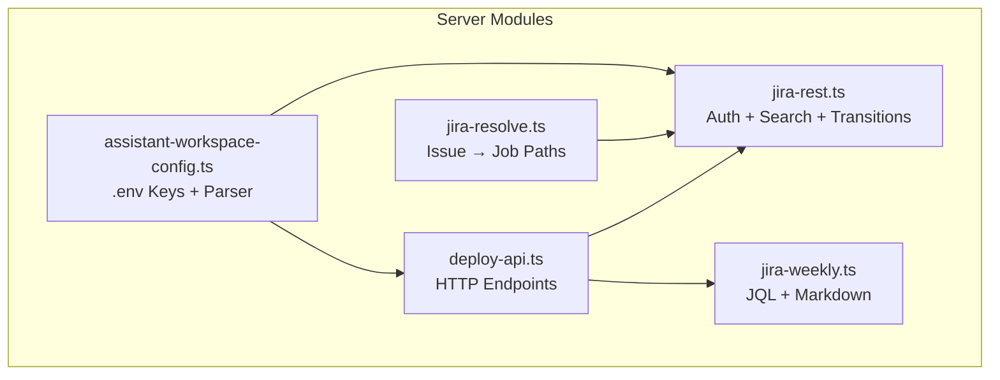
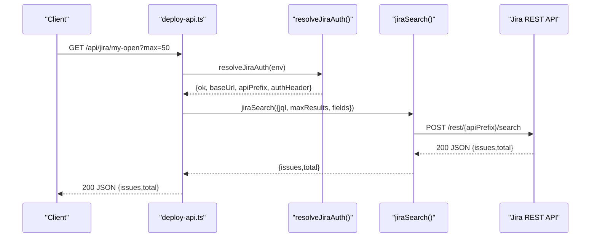
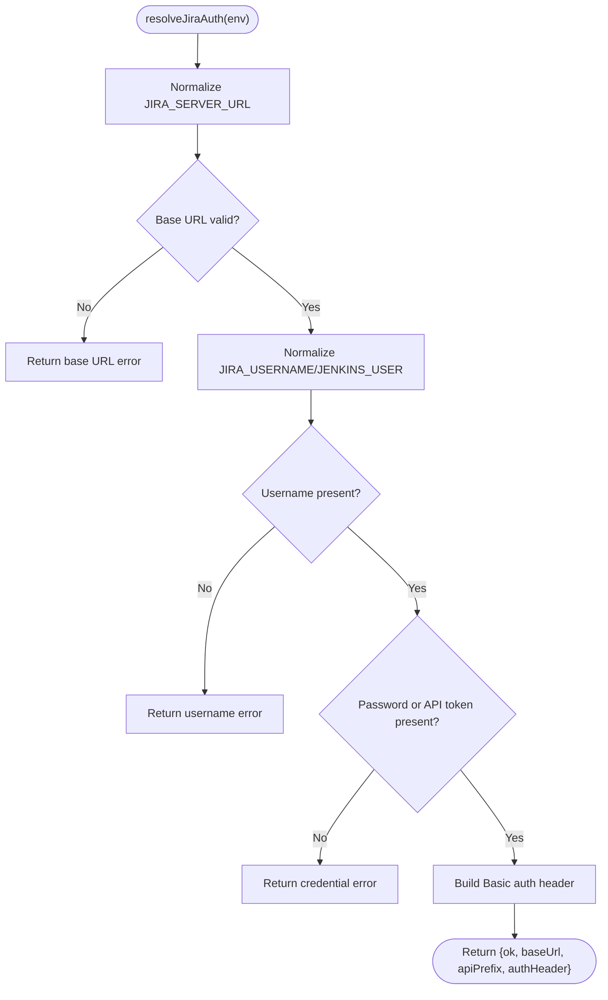
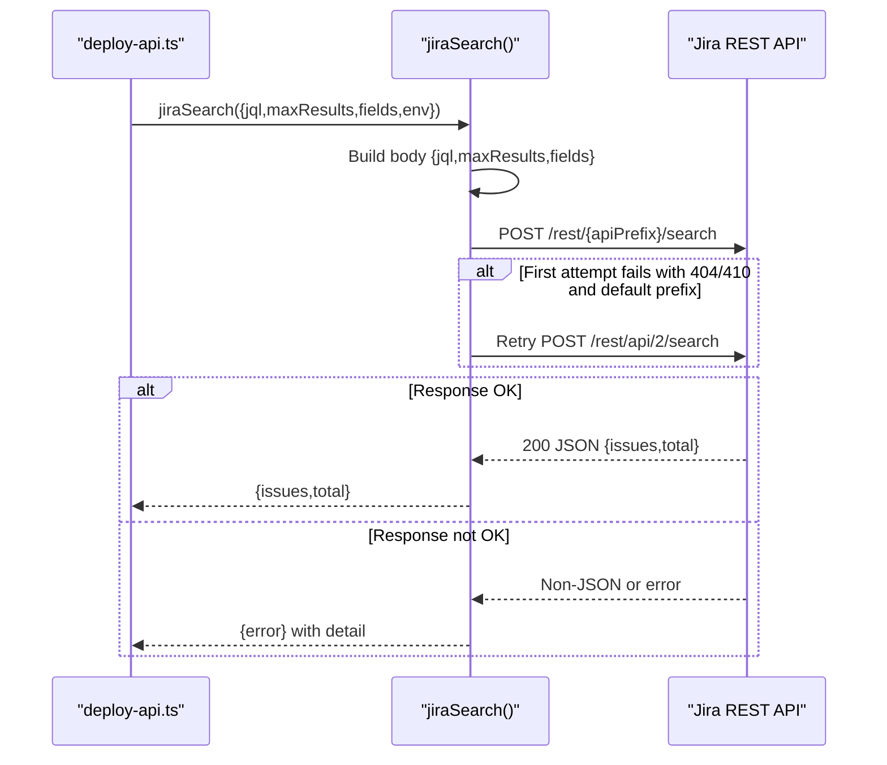
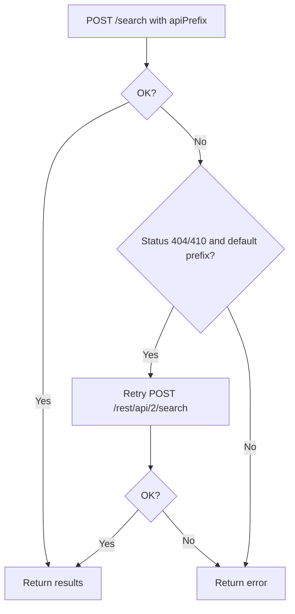
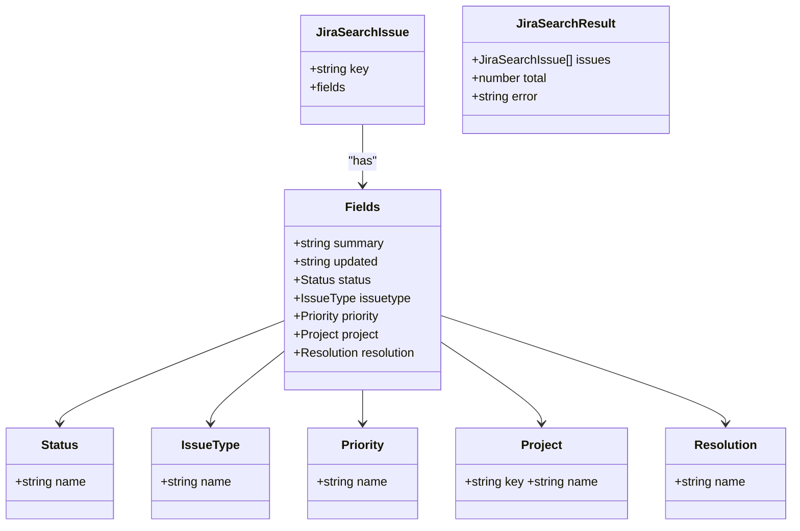
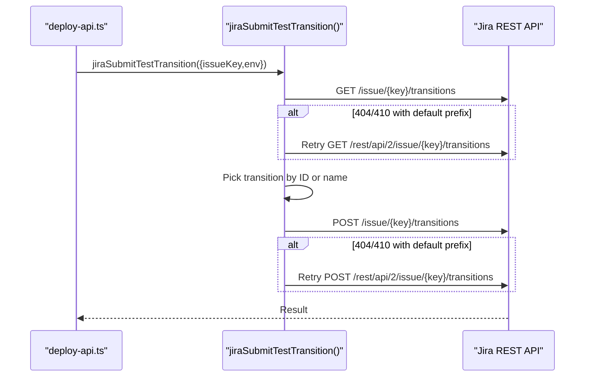
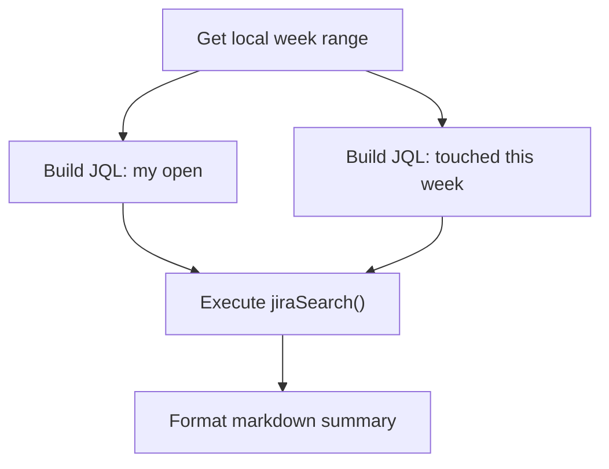
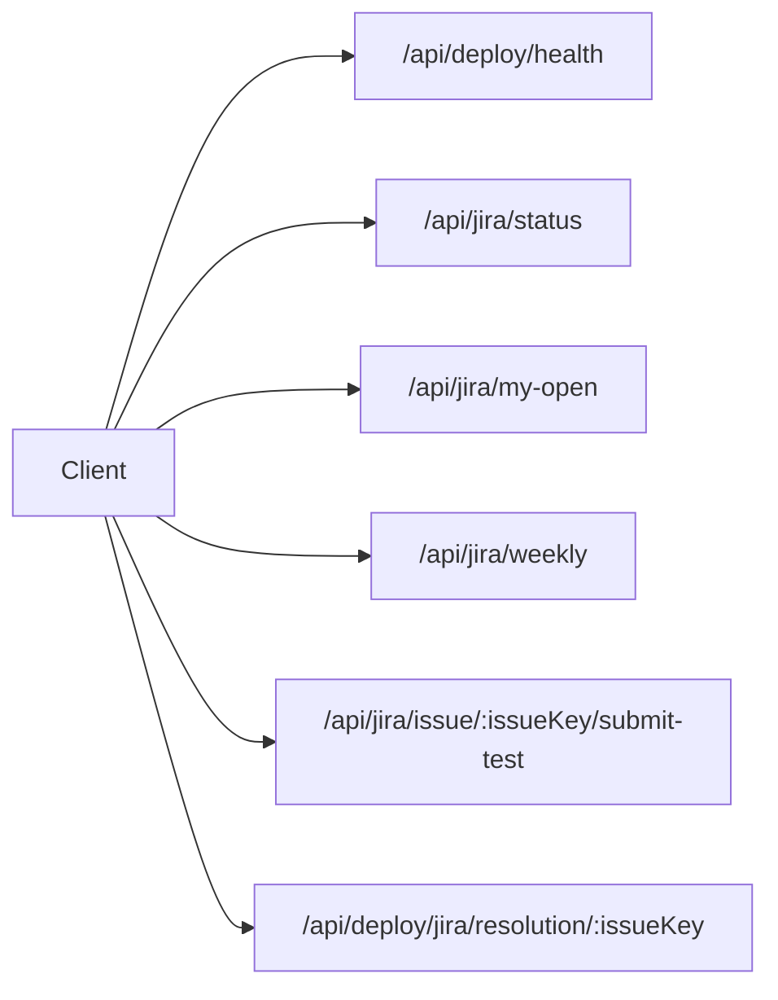
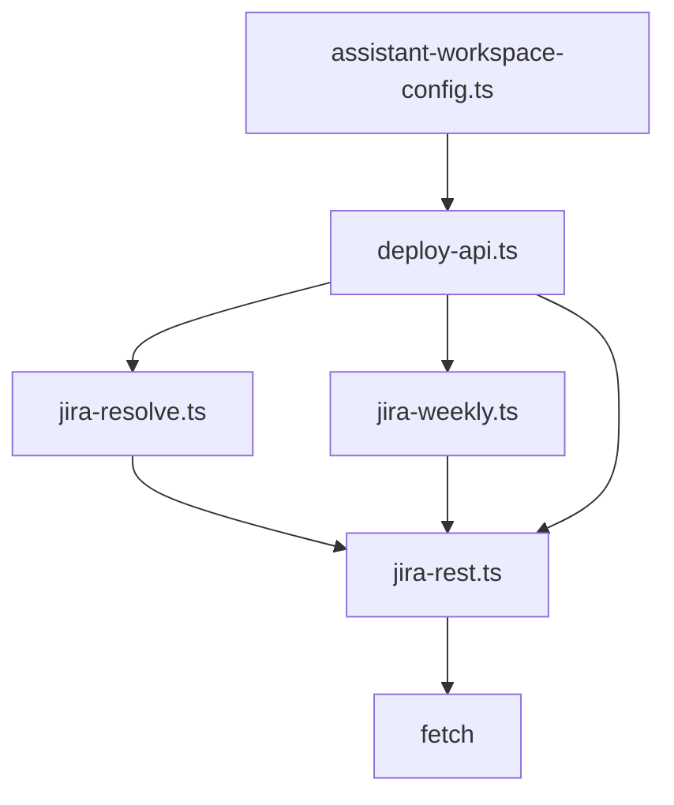

# Jira REST API Client

<cite>
**Referenced Files in This Document**
- [jira-rest.ts](file://server/jira-rest.ts)
- [jira-resolve.ts](file://server/jira-resolve.ts)
- [jira-weekly.ts](file://server/jira-weekly.ts)
- [deploy-api.ts](file://server/deploy-api.ts)
- [assistant-workspace-config.ts](file://server/assistant-workspace-config.ts)
- [jira-rest.test.ts](file://test/server/jira-rest.test.ts)
</cite>

## Table of Contents
1. [Introduction](#introduction)
2. [Project Structure](#project-structure)
3. [Core Components](#core-components)
4. [Architecture Overview](#architecture-overview)
5. [Detailed Component Analysis](#detailed-component-analysis)
6. [Dependency Analysis](#dependency-analysis)
7. [Performance Considerations](#performance-considerations)
8. [Troubleshooting Guide](#troubleshooting-guide)
9. [Conclusion](#conclusion)
10. [Appendices](#appendices)

## Introduction
This document describes the Jira REST API client implementation used by the application. It covers authentication configuration, credential normalization, Basic authentication setup, JQL search functionality, result processing, dual API path support with automatic fallback detection, search result structure, pagination handling, data transformation, and integration patterns with the broader application. It also includes troubleshooting guidance for common authentication issues, network failures, and malformed responses.

## Project Structure
The Jira integration spans several modules:
- Authentication and search core: server/jira-rest.ts
- Issue resolution mapping: server/jira-resolve.ts
- Weekly report helpers: server/jira-weekly.ts
- HTTP endpoints and integration: server/deploy-api.ts
- Environment variable handling: server/assistant-workspace-config.ts
- Tests: test/server/jira-rest.test.ts

**Diagram sources**
- [jira-rest.ts:1-483](file://server/jira-rest.ts#L1-L483)
- [jira-resolve.ts:1-130](file://server/jira-resolve.ts#L1-L130)
- [jira-weekly.ts:1-113](file://server/jira-weekly.ts#L1-L113)
- [deploy-api.ts:1-1735](file://server/deploy-api.ts#L1-L1735)
- [assistant-workspace-config.ts:80-202](file://server/assistant-workspace-config.ts#L80-L202)

**Section sources**
- [jira-rest.ts:1-483](file://server/jira-rest.ts#L1-L483)
- [jira-resolve.ts:1-130](file://server/jira-resolve.ts#L1-L130)
- [jira-weekly.ts:1-113](file://server/jira-weekly.ts#L1-L113)
- [deploy-api.ts:1-1735](file://server/deploy-api.ts#L1-L1735)
- [assistant-workspace-config.ts:80-202](file://server/assistant-workspace-config.ts#L80-L202)

## Core Components
- Authentication resolver: Normalizes credentials and constructs Basic auth header, detects API path prefix, and validates environment variables.
- JQL search: Sends POST /rest/{apiPrefix}/search with configurable fields and maxResults, handles dual API path fallback.
- Result processing: Parses JSON, extracts issues and total, logs and surfaces errors.
- Workflow transitions: Retrieves and executes transitions with fallback and name matching.
- Weekly report helpers: Builds date ranges and JQL for weekly summaries, formats markdown output.
- Integration endpoints: Exposes health, status, personal open issues, weekly reports, and submit-test transitions via HTTP routes.

**Section sources**
- [jira-rest.ts:34-85](file://server/jira-rest.ts#L34-L85)
- [jira-rest.ts:181-278](file://server/jira-rest.ts#L181-L278)
- [jira-rest.ts:292-482](file://server/jira-rest.ts#L292-L482)
- [jira-weekly.ts:38-112](file://server/jira-weekly.ts#L38-L112)
- [deploy-api.ts:1165-1283](file://server/deploy-api.ts#L1165-L1283)

## Architecture Overview
The client integrates with Express endpoints to expose Jira capabilities:
- Health endpoint checks Jira configuration readiness.
- Status endpoint reports configured mode (password vs API token).
- Personal open issues and weekly reports endpoints execute JQL searches and return structured results.
- Submit-test transition endpoint automates workflow transitions with fallback and name matching.

**Diagram sources**
- [deploy-api.ts:1181-1202](file://server/deploy-api.ts#L1181-L1202)
- [jira-rest.ts:34-85](file://server/jira-rest.ts#L34-L85)
- [jira-rest.ts:181-278](file://server/jira-rest.ts#L181-L278)

## Detailed Component Analysis

### Authentication System
- Credential normalization:
  - Removes leading/trailing whitespace and surrounding quotes.
  - Strips trailing commas and extra quotes to prevent malformed URLs or Basic auth.
- Environment variables:
  - JIRA_SERVER_URL: Base URL of the Jira instance.
  - JIRA_USERNAME: Jira username; optional if JENKINS_USER is present and either JIRA_PASSWORD or JIRA_API_TOKEN is set.
  - JIRA_PASSWORD or JIRA_API_TOKEN: Password or REST API token for Basic authentication.
  - JIRA_REST_PATH_PREFIX: Optional API path prefix; defaults to rest/api/3.
- Basic authentication:
  - Constructs Authorization header using user:password or user:token.
- Error reporting:
  - Returns detailed reasons for missing or invalid configuration.

**Diagram sources**
- [jira-rest.ts:34-85](file://server/jira-rest.ts#L34-L85)

**Section sources**
- [jira-rest.ts:11-32](file://server/jira-rest.ts#L11-L32)
- [jira-rest.ts:34-85](file://server/jira-rest.ts#L34-L85)
- [assistant-workspace-config.ts:80-105](file://server/assistant-workspace-config.ts#L80-L105)

### JQL Search Functionality
- Query building:
  - Supports custom JQL strings and optional fields list.
  - Defaults to a curated set of fields if not provided.
  - Limits maxResults between 1 and 100.
- Execution:
  - Sends POST to /rest/{apiPrefix}/search with JSON body.
  - Handles dual API path fallback when 404/410 occurs and user did not set a custom prefix.
- Result processing:
  - Parses JSON and extracts issues and total.
  - Logs request/response previews for diagnostics.
- Error handling:
  - Detects HTML responses (commonly 401/403) and provides actionable guidance.
  - Attempts to parse JSON error messages and returns a human-readable detail.

**Diagram sources**
- [jira-rest.ts:181-278](file://server/jira-rest.ts#L181-L278)
- [deploy-api.ts:1181-1202](file://server/deploy-api.ts#L1181-L1202)

**Section sources**
- [jira-rest.ts:181-278](file://server/jira-rest.ts#L181-L278)
- [jira-weekly.ts:56-65](file://server/jira-weekly.ts#L56-L65)

### Dual API Path Support and Fallback Detection
- Default prefix: rest/api/3.
- Automatic fallback:
  - If initial request returns 404/410 and user did not set a custom prefix, retries with rest/api/2.
- Applies to both search and transitions endpoints.

**Diagram sources**
- [jira-rest.ts:223-236](file://server/jira-rest.ts#L223-L236)
- [jira-rest.ts:388-403](file://server/jira-rest.ts#L388-L403)

**Section sources**
- [jira-rest.ts:223-236](file://server/jira-rest.ts#L223-L236)
- [jira-rest.ts:388-403](file://server/jira-rest.ts#L388-L403)

### Search Result Structure and Pagination
- Data model:
  - issues: array of JiraSearchIssue with key and fields.
  - total: integer count of matched issues.
  - error: optional error message on failure.
- Fields:
  - summary, status, updated, issuetype, priority, project, resolution.
- Pagination:
  - maxResults clamped to 1..100.
  - total indicates overall count; client-side pagination can be implemented by iterating requests with offset-like strategies if needed.

**Diagram sources**
- [jira-rest.ts:87-104](file://server/jira-rest.ts#L87-L104)

**Section sources**
- [jira-rest.ts:87-104](file://server/jira-rest.ts#L87-L104)
- [jira-rest.ts:202-205](file://server/jira-rest.ts#L202-L205)

### Workflow Transition Execution
- Reads available transitions and selects one by ID or by name matching.
- Supports explicit transition ID or a list of candidate names.
- Executes transition via POST and applies the same dual API path fallback.

**Diagram sources**
- [jira-rest.ts:357-482](file://server/jira-rest.ts#L357-L482)
- [deploy-api.ts:1205-1234](file://server/deploy-api.ts#L1205-L1234)

**Section sources**
- [jira-rest.ts:357-482](file://server/jira-rest.ts#L357-L482)

### Weekly Report Helpers
- Date range calculation aligned to local week boundaries.
- JQL builders for “my open” and “touched this week” queries.
- Markdown generator for weekly summaries grouped by status.

**Diagram sources**
- [jira-weekly.ts:38-112](file://server/jira-weekly.ts#L38-L112)
- [deploy-api.ts:1236-1283](file://server/deploy-api.ts#L1236-L1283)

**Section sources**
- [jira-weekly.ts:38-112](file://server/jira-weekly.ts#L38-L112)
- [deploy-api.ts:1236-1283](file://server/deploy-api.ts#L1236-L1283)

### Integration Patterns with the Application
- Health and status:
  - /api/deploy/health exposes Jira configuration readiness.
  - /api/jira/status reports configured mode and server URL.
- Personal and weekly views:
  - /api/jira/my-open returns personal open issues.
  - /api/jira/weekly returns weekly summary with markdown.
- Workflow automation:
  - /api/jira/issue/:issueKey/submit-test triggers transition.
- Issue-to-job resolution:
  - /api/deploy/jira/resolution/:issueKey maps components to job paths.

**Diagram sources**
- [deploy-api.ts:887-908](file://server/deploy-api.ts#L887-L908)
- [deploy-api.ts:1165-1179](file://server/deploy-api.ts#L1165-L1179)
- [deploy-api.ts:1181-1202](file://server/deploy-api.ts#L1181-L1202)
- [deploy-api.ts:1236-1283](file://server/deploy-api.ts#L1236-L1283)
- [deploy-api.ts:1205-1234](file://server/deploy-api.ts#L1205-L1234)
- [deploy-api.ts:1285-1303](file://server/deploy-api.ts#L1285-L1303)

**Section sources**
- [deploy-api.ts:887-908](file://server/deploy-api.ts#L887-L908)
- [deploy-api.ts:1165-1179](file://server/deploy-api.ts#L1165-L1179)
- [deploy-api.ts:1181-1202](file://server/deploy-api.ts#L1181-L1202)
- [deploy-api.ts:1205-1234](file://server/deploy-api.ts#L1205-L1234)
- [deploy-api.ts:1236-1283](file://server/deploy-api.ts#L1236-L1283)
- [deploy-api.ts:1285-1303](file://server/deploy-api.ts#L1285-L1303)

## Dependency Analysis
- jira-rest.ts depends on:
  - Node fetch for HTTP requests.
  - resolveJiraAuth for authentication and API prefix selection.
- jira-resolve.ts depends on:
  - resolveJiraAuth for authentication.
  - fetch to retrieve issue fields.
- jira-weekly.ts depends on:
  - JiraSearchIssue type from jira-rest.ts.
- deploy-api.ts depends on:
  - resolveJiraAuth, jiraSearch, jiraSubmitTestTransition, jql builders, and resolveIssueToJobPaths.
  - assistant-workspace-config.ts for environment keys and parsing.

**Diagram sources**
- [jira-rest.ts:1-483](file://server/jira-rest.ts#L1-L483)
- [jira-resolve.ts:1-130](file://server/jira-resolve.ts#L1-L130)
- [jira-weekly.ts:1-113](file://server/jira-weekly.ts#L1-L113)
- [deploy-api.ts:1-1735](file://server/deploy-api.ts#L1-L1735)
- [assistant-workspace-config.ts:80-202](file://server/assistant-workspace-config.ts#L80-L202)

**Section sources**
- [jira-rest.ts:1-483](file://server/jira-rest.ts#L1-L483)
- [jira-resolve.ts:1-130](file://server/jira-resolve.ts#L1-L130)
- [jira-weekly.ts:1-113](file://server/jira-weekly.ts#L1-L113)
- [deploy-api.ts:1-1735](file://server/deploy-api.ts#L1-L1735)
- [assistant-workspace-config.ts:80-202](file://server/assistant-workspace-config.ts#L80-L202)

## Performance Considerations
- Request limits:
  - maxResults is bounded to 1..100 to avoid excessive payloads.
- Logging:
  - Response previews are truncated to reduce overhead.
- Fallback:
  - Automatic fallback reduces repeated failures when API path differs.

[No sources needed since this section provides general guidance]

## Troubleshooting Guide
Common issues and resolutions:
- Authentication failures (401/403):
  - Verify JIRA_SERVER_URL correctness and absence of extra quotes/commas.
  - Ensure JIRA_USERNAME is set; if not, JENKINS_USER can be used only when JIRA_PASSWORD or JIRA_API_TOKEN is present.
  - Confirm JIRA_PASSWORD or JIRA_API_TOKEN is correct and free of extraneous spaces or quotes.
  - For SSO environments, use a Jira REST API Token and set JIRA_API_TOKEN.
- HTML responses instead of JSON:
  - Indicates Basic auth failure; review credentials and server URL normalization.
- API path mismatch (404/410):
  - The client automatically retries with rest/api/2 when default is rest/api/3 and user did not set a custom prefix.
  - Manually set JIRA_REST_PATH_PREFIX to force a specific path.
- Malformed responses:
  - The client attempts to parse JSON error messages; otherwise returns a truncated preview.
- Network failures:
  - Check connectivity to JIRA_SERVER_URL and firewall/proxy settings.

**Section sources**
- [jira-rest.ts:106-148](file://server/jira-rest.ts#L106-L148)
- [jira-rest.ts:223-242](file://server/jira-rest.ts#L223-L242)
- [jira-rest.ts:268-277](file://server/jira-rest.ts#L268-L277)

## Conclusion
The Jira REST API client provides a robust, normalized authentication system, flexible JQL search with dual API path fallback, and structured result processing. It integrates cleanly with Express endpoints to power personal dashboards, weekly summaries, and workflow automation. Proper environment configuration and adherence to credential normalization rules ensure reliable operation across different Jira deployments.

[No sources needed since this section summarizes without analyzing specific files]

## Appendices

### Authentication Configuration Reference
- Required environment variables:
  - JIRA_SERVER_URL: Base URL of the Jira instance.
  - JIRA_USERNAME: Jira username; optional if JENKINS_USER is present and either JIRA_PASSWORD or JIRA_API_TOKEN is set.
  - JIRA_PASSWORD or JIRA_API_TOKEN: Password or REST API token for Basic authentication.
- Optional environment variables:
  - JIRA_REST_PATH_PREFIX: Force API path prefix (default: rest/api/3).
  - JIRA_SUBMIT_TEST_TRANSITION_ID: Explicit transition ID for submit-test.
  - JIRA_SUBMIT_TEST_TRANSITION_NAMES: Comma-separated candidate names for transition matching.
  - JIRA_COMPONENT_JOB_MAP: JSON mapping of component names to job path segments.
  - JIRA_RESOLUTION_FALLBACK_NODES: CSV fallback job nodes when mapping is unavailable.

**Section sources**
- [jira-rest.ts:34-85](file://server/jira-rest.ts#L34-L85)
- [jira-resolve.ts:47-56](file://server/jira-resolve.ts#L47-L56)
- [assistant-workspace-config.ts:80-95](file://server/assistant-workspace-config.ts#L80-L95)

### Example JQL Queries
- Personal open issues:
  - resolution = Unresolved AND assignee in (currentUser()) ORDER BY updated DESC
- Issues touched in a week:
  - assignee in (currentUser()) AND updated >= "<YYYY-MM-DD>" AND updated < "<YYYY-MM-DD>" ORDER BY updated DESC

**Section sources**
- [jira-weekly.ts:56-65](file://server/jira-weekly.ts#L56-L65)

### Test Coverage Highlights
- Credential normalization for username and password.
- Acceptance of JIRA_USERNAME with JIRA_API_TOKEN without JIRA_PASSWORD.

**Section sources**
- [jira-rest.test.ts:5-29](file://test/server/jira-rest.test.ts#L5-L29)