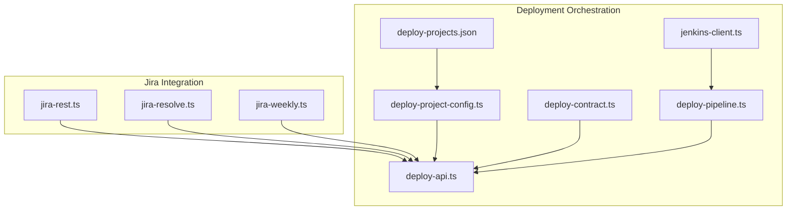
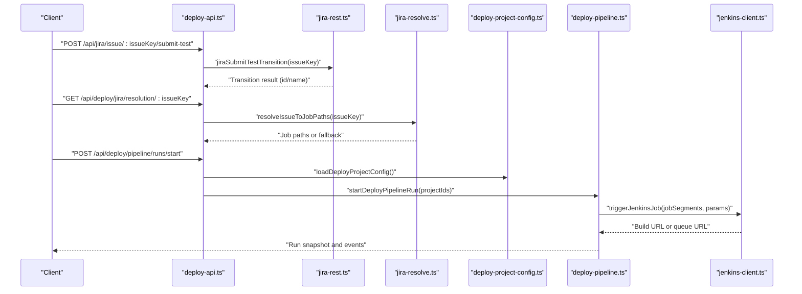
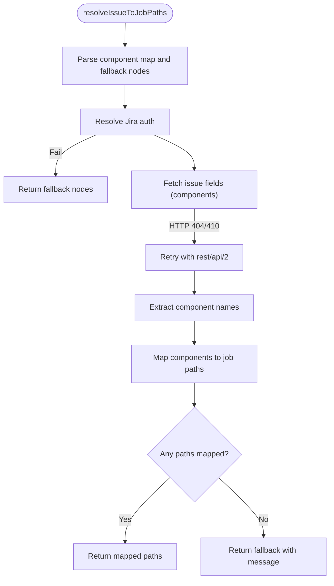
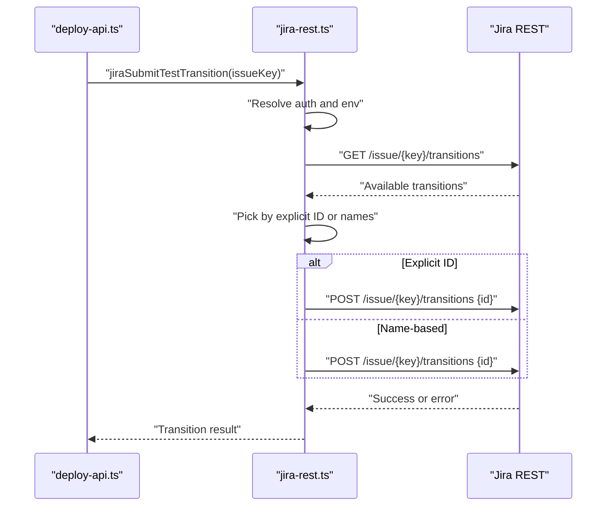
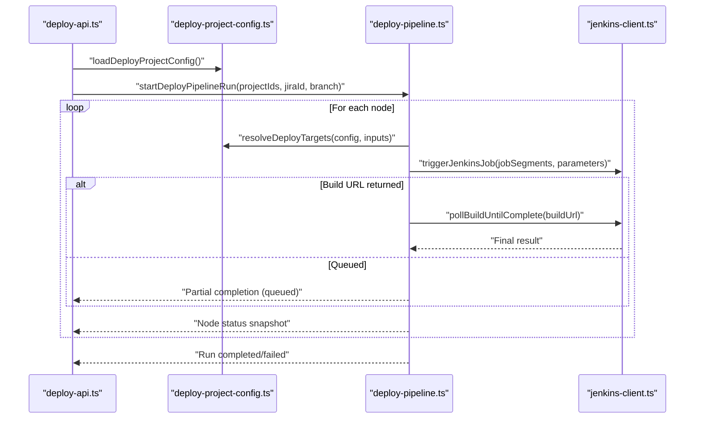
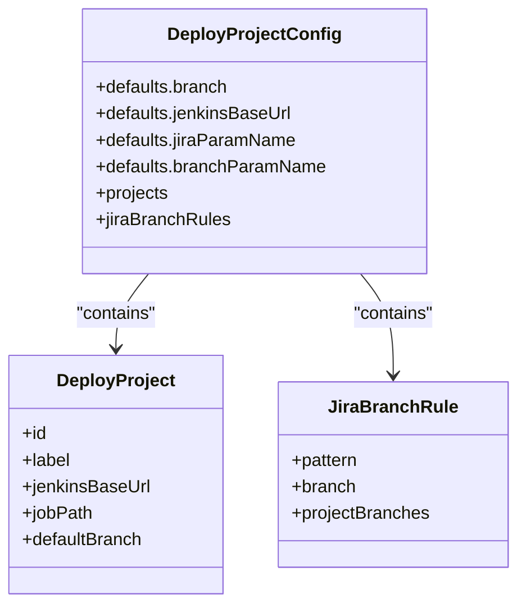
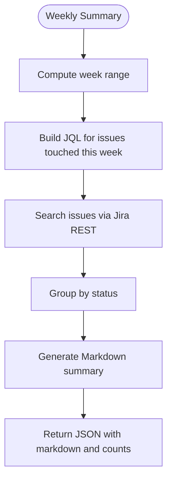
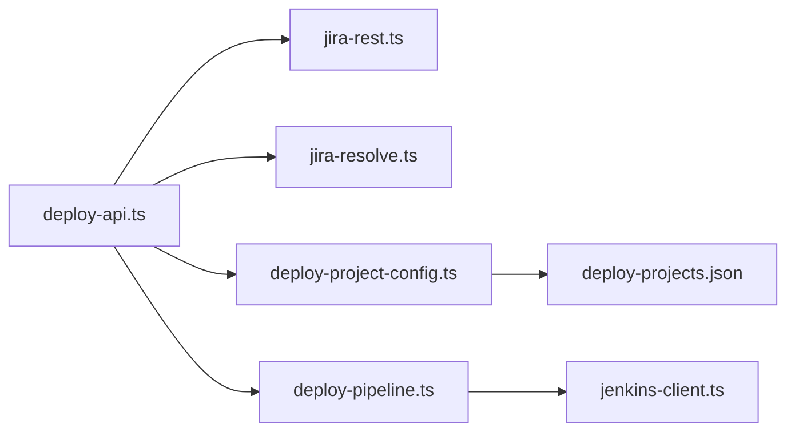

# Resolution Tracking and Workflow Transitions

<cite>
**Referenced Files in This Document**
- [jira-resolve.ts](file://server/jira-resolve.ts)
- [jira-rest.ts](file://server/jira-rest.ts)
- [deploy-api.ts](file://server/deploy-api.ts)
- [deploy-contract.ts](file://server/deploy-contract.ts)
- [deploy-pipeline.ts](file://server/deploy-pipeline.ts)
- [deploy-project-config.ts](file://server/deploy-project-config.ts)
- [jenkins-client.ts](file://server/jenkins-client.ts)
- [deploy-projects.json](file://config/deploy-projects.json)
- [jira-weekly.ts](file://server/jira-weekly.ts)
</cite>

## Table of Contents
1. [Introduction](#introduction)
2. [Project Structure](#project-structure)
3. [Core Components](#core-components)
4. [Architecture Overview](#architecture-overview)
5. [Detailed Component Analysis](#detailed-component-analysis)
6. [Dependency Analysis](#dependency-analysis)
7. [Performance Considerations](#performance-considerations)
8. [Troubleshooting Guide](#troubleshooting-guide)
9. [Conclusion](#conclusion)

## Introduction
This document explains the resolution tracking and workflow transition system that integrates Jira issue resolution with deployment automation. It covers:
- How issue resolution mapping detects status changes and maps Jira components to Jenkins job paths
- How workflow transitions are detected and executed, including custom transition name matching and explicit ID-based selection
- Configuration of transition names, custom workflow states, and automated triggers
- Integration with deployment processes for automatic issue state updates during release cycles
- Error handling for failed transitions, unavailable transitions, and permission issues
- Practical examples of common workflow patterns and troubleshooting steps

## Project Structure
The system is implemented in a modular backend service with clear separation of concerns:
- Jira integration for authentication, search, and transitions
- Deployment orchestration for Jenkins jobs and pipeline runs
- Configuration-driven mapping of projects, branches, and job paths
- Weekly summary utilities for resolution metrics and status tracking

**Diagram sources**
- [jira-rest.ts:1-483](file://server/jira-rest.ts#L1-L483)
- [jira-resolve.ts:1-130](file://server/jira-resolve.ts#L1-L130)
- [jira-weekly.ts:1-113](file://server/jira-weekly.ts#L1-L113)
- [deploy-api.ts:1-1735](file://server/deploy-api.ts#L1-L1735)
- [deploy-contract.ts:1-169](file://server/deploy-contract.ts#L1-L169)
- [deploy-pipeline.ts:1-419](file://server/deploy-pipeline.ts#L1-L419)
- [deploy-project-config.ts:1-237](file://server/deploy-project-config.ts#L1-L237)
- [jenkins-client.ts:1-191](file://server/jenkins-client.ts#L1-L191)
- [deploy-projects.json:1-78](file://config/deploy-projects.json#L1-L78)

**Section sources**
- [deploy-api.ts:1-1735](file://server/deploy-api.ts#L1-L1735)
- [deploy-projects.json:1-78](file://config/deploy-projects.json#L1-L78)

## Core Components
- Jira resolution mapping: resolves Jira issue components to Jenkins job paths and provides fallbacks when components are missing or API fails.
- Workflow transition management: retrieves available transitions, matches against configured names, and executes transitions via explicit ID or name matching.
- Deployment orchestration: triggers Jenkins jobs, polls builds, and manages pipeline runs with status snapshots and event streaming.
- Configuration system: defines project mappings, branch rules, parameter names, and environment-based credential resolution.

**Section sources**
- [jira-resolve.ts:47-129](file://server/jira-resolve.ts#L47-L129)
- [jira-rest.ts:357-482](file://server/jira-rest.ts#L357-L482)
- [deploy-pipeline.ts:182-223](file://server/deploy-pipeline.ts#L182-L223)
- [deploy-project-config.ts:18-41](file://server/deploy-project-config.ts#L18-L41)

## Architecture Overview
The system orchestrates resolution tracking and workflow transitions across Jira and Jenkins:
- Jira resolution mapping determines which Jenkins jobs to trigger based on issue components.
- Workflow transitions are executed against Jira issues using either explicit IDs or configurable names.
- Deployment pipeline triggers Jenkins jobs, polls build results, and streams progress to clients.

**Diagram sources**
- [deploy-api.ts:1204-1303](file://server/deploy-api.ts#L1204-L1303)
- [jira-rest.ts:357-482](file://server/jira-rest.ts#L357-L482)
- [jira-resolve.ts:47-129](file://server/jira-resolve.ts#L47-L129)
- [deploy-project-config.ts:176-180](file://server/deploy-project-config.ts#L176-L180)
- [deploy-pipeline.ts:225-418](file://server/deploy-pipeline.ts#L225-L418)
- [jenkins-client.ts:89-142](file://server/jenkins-client.ts#L89-L142)

## Detailed Component Analysis

### Jira Resolution Mapping
Purpose:
- Map Jira issue components to Jenkins job paths.
- Provide fallback behavior when components are missing or Jira API is unavailable.

Key behaviors:
- Parses component-to-job-path mappings from environment configuration.
- Falls back to configured fallback nodes when no mapping is found.
- Handles Jira API version differences (rest/api/3 vs rest/api/2) automatically.

**Diagram sources**
- [jira-resolve.ts:15-129](file://server/jira-resolve.ts#L15-L129)

**Section sources**
- [jira-resolve.ts:47-129](file://server/jira-resolve.ts#L47-L129)

### Workflow Transition Management
Purpose:
- Detect available transitions for a Jira issue and select the appropriate transition to move the issue into testing or QA states.

Key behaviors:
- Retrieve available transitions from Jira REST API.
- Match transitions by configured names (supports localized names and partial matches).
- Allow explicit ID-based selection via environment variable.
- Retry with legacy API path when needed.

**Diagram sources**
- [jira-rest.ts:357-482](file://server/jira-rest.ts#L357-L482)
- [deploy-api.ts:1204-1234](file://server/deploy-api.ts#L1204-L1234)

**Section sources**
- [jira-rest.ts:319-482](file://server/jira-rest.ts#L319-L482)
- [deploy-api.ts:1204-1234](file://server/deploy-api.ts#L1204-L1234)

### Deployment Pipeline Orchestration
Purpose:
- Trigger Jenkins jobs for selected projects, poll build results, and manage pipeline runs with status snapshots and event streaming.

Key behaviors:
- Load project configuration and resolve targets (job segments, branch, parameter names).
- Trigger Jenkins jobs with parameters (JIRA_ID, BRANCH_NAME).
- Poll queue and build completion, updating node statuses accordingly.
- Stream run events via Server-Sent Events.

**Diagram sources**
- [deploy-api.ts:1440-1470](file://server/deploy-api.ts#L1440-L1470)
- [deploy-project-config.ts:212-236](file://server/deploy-project-config.ts#L212-L236)
- [deploy-pipeline.ts:225-418](file://server/deploy-pipeline.ts#L225-L418)
- [jenkins-client.ts:89-191](file://server/jenkins-client.ts#L89-L191)

**Section sources**
- [deploy-pipeline.ts:182-223](file://server/deploy-pipeline.ts#L182-L223)
- [deploy-pipeline.ts:225-418](file://server/deploy-pipeline.ts#L225-L418)
- [deploy-api.ts:1440-1470](file://server/deploy-api.ts#L1440-L1470)

### Configuration System
Purpose:
- Define project mappings, branch rules, parameter names, and environment-based credentials.

Key behaviors:
- Defaults for branch, Jenkins base URL, and parameter names.
- Validation of project IDs, job paths, and parameter names.
- Jira branch rules support pattern-based branch selection per project.

**Diagram sources**
- [deploy-project-config.ts:18-41](file://server/deploy-project-config.ts#L18-L41)

**Section sources**
- [deploy-project-config.ts:96-174](file://server/deploy-project-config.ts#L96-L174)
- [deploy-projects.json:1-78](file://config/deploy-projects.json#L1-L78)

### Weekly Summary and Resolution Metrics
Purpose:
- Generate weekly summaries of issues touched by the current user, including status distribution and resolution insights.

Key behaviors:
- Compute week boundaries and JQL date ranges.
- Build Markdown summaries grouped by status.
- Expose endpoints to fetch summaries and open issues.

**Diagram sources**
- [jira-weekly.ts:3-112](file://server/jira-weekly.ts#L3-L112)
- [deploy-api.ts:1236-1283](file://server/deploy-api.ts#L1236-L1283)

**Section sources**
- [jira-weekly.ts:67-112](file://server/jira-weekly.ts#L67-L112)
- [deploy-api.ts:1236-1283](file://server/deploy-api.ts#L1236-L1283)

## Dependency Analysis
The system exhibits clear layering:
- Presentation and routing live in the API server.
- Jira integration encapsulated in dedicated modules.
- Deployment orchestration abstracted behind pipeline and contract utilities.
- Configuration centralized in a JSON file and validated by a configuration module.

**Diagram sources**
- [deploy-api.ts:1-1735](file://server/deploy-api.ts#L1-L1735)
- [jira-rest.ts:1-483](file://server/jira-rest.ts#L1-L483)
- [jira-resolve.ts:1-130](file://server/jira-resolve.ts#L1-L130)
- [deploy-project-config.ts:1-237](file://server/deploy-project-config.ts#L1-L237)
- [deploy-pipeline.ts:1-419](file://server/deploy-pipeline.ts#L1-L419)
- [jenkins-client.ts:1-191](file://server/jenkins-client.ts#L1-L191)
- [deploy-projects.json:1-78](file://config/deploy-projects.json#L1-L78)

**Section sources**
- [deploy-api.ts:1-1735](file://server/deploy-api.ts#L1-L1735)

## Performance Considerations
- API retries: Automatic fallback between API versions reduces transient failures.
- Event streaming: Pipeline and automation runs stream events to clients to minimize polling overhead.
- Rate limiting: Jenkins polling intervals and timeouts prevent excessive requests.
- Memory management: Pipeline run snapshots cap event counts and prune old runs to control memory usage.

[No sources needed since this section provides general guidance]

## Troubleshooting Guide

Common issues and resolutions:
- Authentication failures
  - Symptoms: HTTP 401/403 from Jira or Jenkins; HTML responses instead of JSON.
  - Causes: Incorrect credentials, missing API token, wrong API path prefix.
  - Actions: Verify Jira credentials and API token; confirm JIRA_REST_PATH_PREFIX; check Jenkins credentials and crumb settings.
  - References:
    - [jira-rest.ts:106-148](file://server/jira-rest.ts#L106-L148)
    - [jenkins-client.ts:71-87](file://server/jenkins-client.ts#L71-L87)

- Transition not found
  - Symptoms: Error indicating no matching transition by name or ID.
  - Causes: Transition name mismatch or invalid explicit ID.
  - Actions: Adjust JIRA_SUBMIT_TEST_TRANSITION_NAMES or set JIRA_SUBMIT_TEST_TRANSITION_ID to a valid transition ID.
  - References:
    - [jira-rest.ts:319-443](file://server/jira-rest.ts#L319-L443)

- Component mapping failure
  - Symptoms: No job paths returned; fallback used.
  - Causes: Issue has no components or component not mapped.
  - Actions: Add component-to-job-path mapping; verify JIRA_COMPONENT_JOB_MAP and fallback nodes.
  - References:
    - [jira-resolve.ts:15-41](file://server/jira-resolve.ts#L15-L41)
    - [jira-resolve.ts:112-128](file://server/jira-resolve.ts#L112-L128)

- Jenkins build timeout or queue issues
  - Symptoms: Build does not complete within timeout; queue URL not resolved.
  - Causes: Long-running builds or Jenkins misconfiguration.
  - Actions: Increase poll timeout; verify Jenkins permissions and crumb; check job configuration.
  - References:
    - [deploy-pipeline.ts:344-396](file://server/deploy-pipeline.ts#L344-L396)
    - [jenkins-client.ts:148-191](file://server/jenkins-client.ts#L148-L191)

- Permission denied
  - Symptoms: Jenkins returns HTML with authentication or permission errors.
  - Causes: Insufficient permissions for build or crumb access.
  - Actions: Confirm Jenkins user has required permissions; ensure crumb issuer is accessible.
  - References:
    - [jenkins-client.ts:71-87](file://server/jenkins-client.ts#L71-L87)

## Conclusion
The system provides a robust foundation for connecting Jira issue resolution with automated deployment workflows. It supports flexible transition management, reliable resolution mapping, and comprehensive error handling. By leveraging configuration-driven project mappings and environment-based credentials, teams can streamline release cycles and maintain visibility into status changes and deployment outcomes.