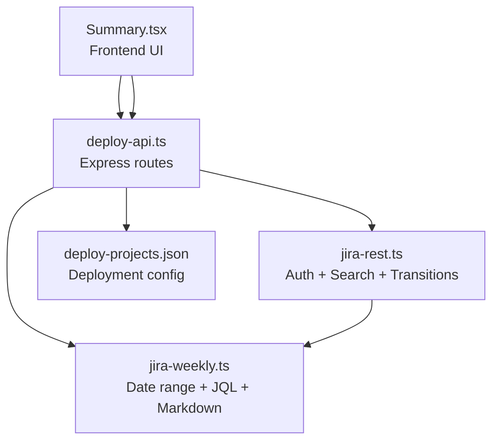
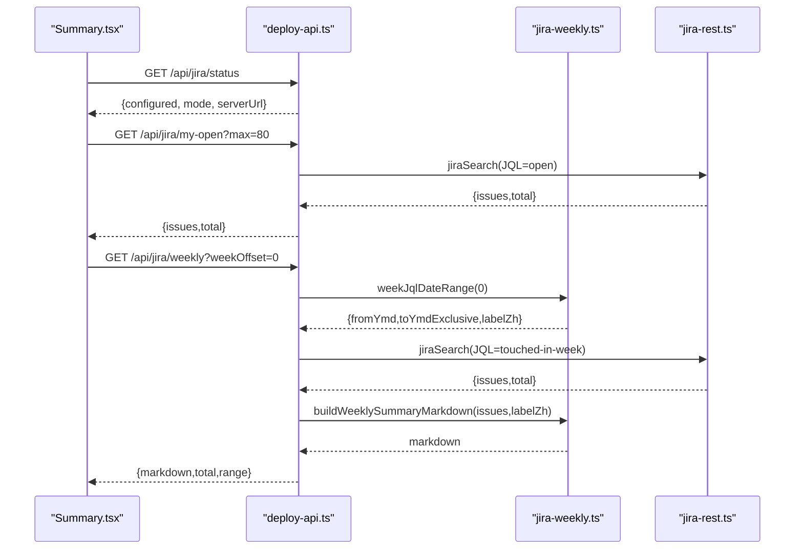
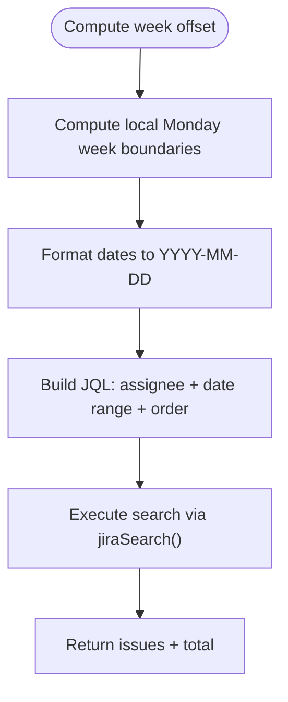
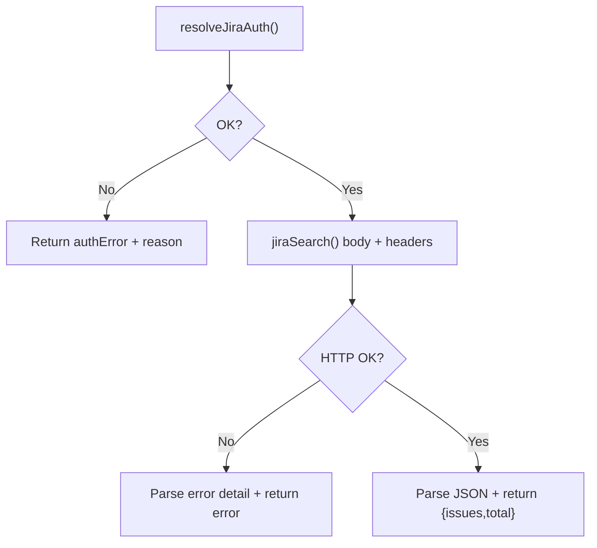
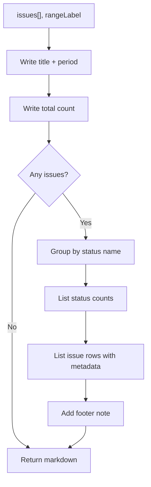
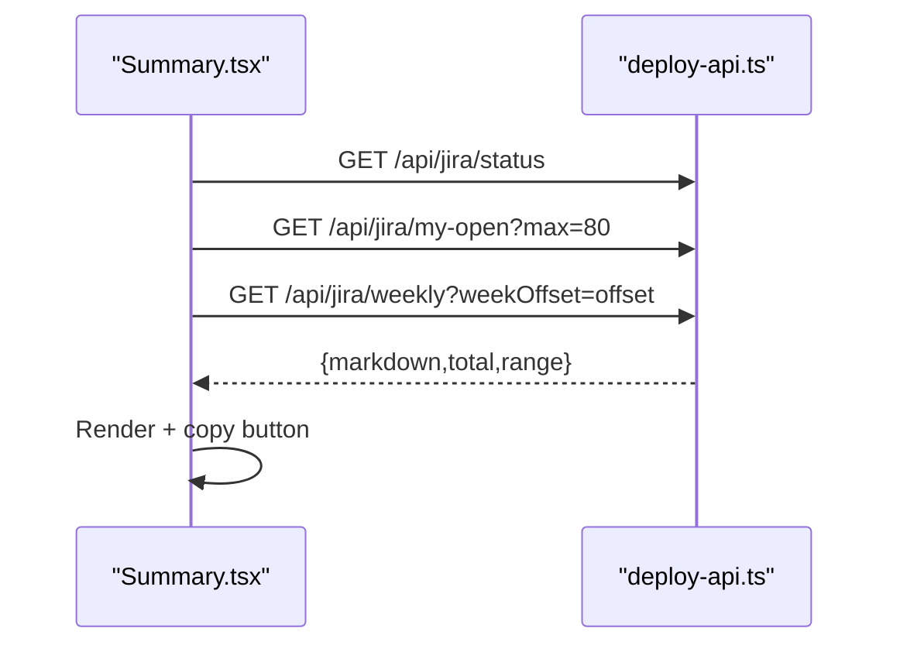
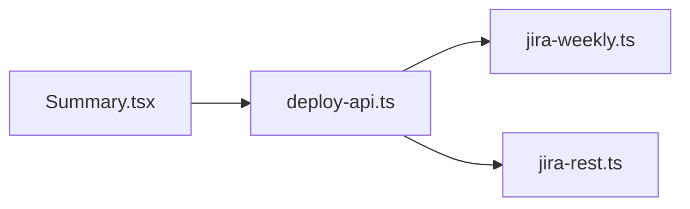

# Weekly Report Generation

<cite>
**Referenced Files in This Document**
- [jira-weekly.ts](file://server/jira-weekly.ts)
- [jira-rest.ts](file://server/jira-rest.ts)
- [deploy-api.ts](file://server/deploy-api.ts)
- [Summary.tsx](file://src/pages/Summary.tsx)
- [jira-weekly.test.ts](file://test/server/jira-weekly.test.ts)
- [deploy-projects.json](file://config/deploy-projects.json)
- [README.md](file://README.md)
</cite>

## Table of Contents
1. [Introduction](#introduction)
2. [Project Structure](#project-structure)
3. [Core Components](#core-components)
4. [Architecture Overview](#architecture-overview)
5. [Detailed Component Analysis](#detailed-component-analysis)
6. [Dependency Analysis](#dependency-analysis)
7. [Performance Considerations](#performance-considerations)
8. [Troubleshooting Guide](#troubleshooting-guide)
9. [Conclusion](#conclusion)
10. [Appendices](#appendices)

## Introduction
This document explains the weekly report generation system that collects Jira issues touched during a natural week, formats them into a Markdown draft, and integrates with the task management system for synchronized issue tracking and progress reporting. It covers data collection (date range filtering, status tracking, and categorization), report formatting (Markdown generation, table structures, and summary statistics), configuration options (templates, date ranges, and filters), aggregation algorithms (counting issues and generating progress summaries), and performance considerations for large datasets.

## Project Structure
The weekly report feature spans three layers:
- Frontend React page that triggers and displays weekly reports and open issues.
- Express backend that exposes Jira endpoints and orchestrates data retrieval and formatting.
- Jira utilities that compute date ranges, build JQL queries, and render Markdown.

**Diagram sources**
- [Summary.tsx:135-265](file://src/pages/Summary.tsx#L135-L265)
- [deploy-api.ts:1166-1283](file://server/deploy-api.ts#L1166-L1283)
- [jira-weekly.ts:3-112](file://server/jira-weekly.ts#L3-L112)
- [jira-rest.ts:34-278](file://server/jira-rest.ts#L34-L278)
- [deploy-projects.json:1-78](file://config/deploy-projects.json#L1-L78)

**Section sources**
- [Summary.tsx:135-265](file://src/pages/Summary.tsx#L135-L265)
- [deploy-api.ts:1166-1283](file://server/deploy-api.ts#L1166-L1283)
- [jira-weekly.ts:3-112](file://server/jira-weekly.ts#L3-L112)
- [jira-rest.ts:34-278](file://server/jira-rest.ts#L34-L278)
- [deploy-projects.json:1-78](file://config/deploy-projects.json#L1-L78)

## Core Components
- Natural week calculation and JQL date range builder: computes left-closed-right-open week boundaries aligned to local Monday and produces bracket-safe date literals for JQL.
- JQL builders: constructs “my open issues” and “issues touched in week” queries.
- Jira search: authenticates, normalizes credentials, executes search, and parses responses.
- Markdown generator: builds a human-friendly weekly summary with categorized counts and a detail list.
- Frontend integration: loads status, open issues, and weekly report; supports copying Markdown.

**Section sources**
- [jira-weekly.ts:3-112](file://server/jira-weekly.ts#L3-L112)
- [jira-rest.ts:34-278](file://server/jira-rest.ts#L34-L278)
- [Summary.tsx:135-265](file://src/pages/Summary.tsx#L135-L265)

## Architecture Overview
The weekly report flow connects the frontend to the backend and Jira:

**Diagram sources**
- [Summary.tsx:135-265](file://src/pages/Summary.tsx#L135-L265)
- [deploy-api.ts:1166-1283](file://server/deploy-api.ts#L1166-L1283)
- [jira-weekly.ts:39-112](file://server/jira-weekly.ts#L39-L112)
- [jira-rest.ts:181-278](file://server/jira-rest.ts#L181-L278)

## Detailed Component Analysis

### Date Range and JQL Builders
- Natural week boundary computation:
  - Starts on local Monday 00:00:00.000 and ends on the next Monday 00:00:00.000 (left-closed, right-open).
  - Produces a localized label for display.
- Bracket-safe JQL date range:
  - Converts boundaries to YYYY-MM-DD strings suitable for JQL date comparisons.
- JQL builders:
  - “My open issues”: unresolved and assigned to current user.
  - “Issues touched in week”: updated within the computed range for the current user.

**Diagram sources**
- [jira-weekly.ts:4-50](file://server/jira-weekly.ts#L4-L50)
- [jira-weekly.ts:56-65](file://server/jira-weekly.ts#L56-L65)
- [jira-rest.ts:181-278](file://server/jira-rest.ts#L181-L278)

**Section sources**
- [jira-weekly.ts:4-50](file://server/jira-weekly.ts#L4-L50)
- [jira-weekly.ts:56-65](file://server/jira-weekly.ts#L56-L65)
- [jira-weekly.test.ts:12-36](file://test/server/jira-weekly.test.ts#L12-L36)

### Jira Authentication and Search
- Authentication:
  - Supports JIRA_SERVER_URL, JIRA_USERNAME, and either JIRA_PASSWORD or JIRA_API_TOKEN.
  - Normalizes inputs and constructs Basic auth header.
- Search:
  - Enforces maxResults clamping (1..100).
  - Defaults fields to commonly needed ones.
  - Handles API path fallback between rest/api/3 and rest/api/2.
  - Parses JSON or returns detailed error messages for non-JSON responses.

**Diagram sources**
- [jira-rest.ts:34-85](file://server/jira-rest.ts#L34-L85)
- [jira-rest.ts:181-278](file://server/jira-rest.ts#L181-L278)

**Section sources**
- [jira-rest.ts:34-85](file://server/jira-rest.ts#L34-L85)
- [jira-rest.ts:181-278](file://server/jira-rest.ts#L181-L278)

### Markdown Report Generation
- Generates a Markdown document with:
  - Title and period label.
  - Total count of issues touched in the week.
  - Status-based grouping and counts.
  - A detail list of issues with project/type/status/summary.
  - Footer note indicating auto-generation.

**Diagram sources**
- [jira-weekly.ts:67-112](file://server/jira-weekly.ts#L67-L112)

**Section sources**
- [jira-weekly.ts:67-112](file://server/jira-weekly.ts#L67-L112)
- [jira-weekly.test.ts:38-58](file://test/server/jira-weekly.test.ts#L38-L58)

### Frontend Integration and Workflow
- Loads Jira status and shows configuration hints when missing.
- Fetches “my open” issues and total.
- Fetches weekly report with optional weekOffset.
- Provides copy-to-clipboard for Markdown.

**Diagram sources**
- [Summary.tsx:135-265](file://src/pages/Summary.tsx#L135-L265)
- [deploy-api.ts:1166-1283](file://server/deploy-api.ts#L1166-L1283)

**Section sources**
- [Summary.tsx:135-265](file://src/pages/Summary.tsx#L135-L265)
- [deploy-api.ts:1166-1283](file://server/deploy-api.ts#L1166-L1283)

## Dependency Analysis
- Frontend depends on deploy-api endpoints for Jira status, open issues, and weekly report.
- Backend routes depend on jira-weekly for date range and JQL construction, and on jira-rest for authentication and search.
- The weekly report endpoint composes the Markdown using jira-weekly’s generator.

**Diagram sources**
- [Summary.tsx:135-265](file://src/pages/Summary.tsx#L135-L265)
- [deploy-api.ts:1166-1283](file://server/deploy-api.ts#L1166-L1283)
- [jira-weekly.ts:39-112](file://server/jira-weekly.ts#L39-L112)
- [jira-rest.ts:34-278](file://server/jira-rest.ts#L34-L278)

**Section sources**
- [Summary.tsx:135-265](file://src/pages/Summary.tsx#L135-L265)
- [deploy-api.ts:1166-1283](file://server/deploy-api.ts#L1166-L1283)
- [jira-weekly.ts:39-112](file://server/jira-weekly.ts#L39-L112)
- [jira-rest.ts:34-278](file://server/jira-rest.ts#L34-L278)

## Performance Considerations
- Request limits:
  - Search results are capped between 1 and 100 to avoid heavy payloads.
- API path fallback:
  - Automatically retries rest/api/2 when rest/api/3 fails with 404/410 and no user override.
- Response parsing:
  - Non-JSON responses are handled gracefully with previews and structured error messages.
- Frontend throttling:
  - The UI loads open issues and weekly report independently; consider debouncing rapid navigation between weeks to reduce repeated requests.

[No sources needed since this section provides general guidance]

## Troubleshooting Guide
- Authentication failures:
  - Verify JIRA_SERVER_URL, JIRA_USERNAME, and either JIRA_PASSWORD or JIRA_API_TOKEN.
  - The resolver normalizes inputs and returns a detailed reason when configuration is invalid.
- Search errors:
  - The search function logs context and returns actionable messages for 401/403 HTML pages, JSON errors, or non-JSON responses.
- Weekly endpoint errors:
  - Returns 503 on auth error and 502 on search error, including the computed range and label for debugging.

**Section sources**
- [jira-rest.ts:34-85](file://server/jira-rest.ts#L34-L85)
- [jira-rest.ts:106-148](file://server/jira-rest.ts#L106-L148)
- [jira-rest.ts:238-255](file://server/jira-rest.ts#L238-L255)
- [deploy-api.ts:1248-1268](file://server/deploy-api.ts#L1248-L1268)

## Conclusion
The weekly report system cleanly separates concerns: date range computation and JQL building in jira-weekly, robust authentication and search in jira-rest, and a concise Markdown generator. The frontend integrates seamlessly with the backend to present a ready-to-use weekly draft, enabling synchronized tracking and progress reporting with minimal friction.

[No sources needed since this section summarizes without analyzing specific files]

## Appendices

### Configuration Options
- Environment variables for Jira:
  - JIRA_SERVER_URL, JIRA_USERNAME, JIRA_PASSWORD or JIRA_API_TOKEN.
  - Optional JIRA_REST_PATH_PREFIX to override REST path.
- Frontend behavior:
  - Week offset navigation allows moving backward/forward in time.
  - Copy-to-clipboard for Markdown simplifies sharing.

**Section sources**
- [jira-rest.ts:34-85](file://server/jira-rest.ts#L34-L85)
- [Summary.tsx:57-62](file://src/pages/Summary.tsx#L57-L62)
- [Summary.tsx:602-616](file://src/pages/Summary.tsx#L602-L616)

### Data Aggregation Algorithms
- Status grouping:
  - Issues are grouped by status name; counts are derived per group.
- Velocity-like summary:
  - The report provides a total count of issues touched in the week; velocity metrics can be derived by comparing totals across consecutive weeks.
- Progress summary:
  - The Markdown includes a concise summary and a detailed list; further aggregation can compute completion rates by status.

**Section sources**
- [jira-weekly.ts:84-96](file://server/jira-weekly.ts#L84-L96)
- [jira-weekly.ts:67-112](file://server/jira-weekly.ts#L67-L112)

### Example Output Formats
- Markdown structure:
  - Title, period label, total count, status counts, detail list, and footer note.
- Frontend rendering:
  - Displays the Markdown in a preformatted block with copy support.

**Section sources**
- [jira-weekly.ts:67-112](file://server/jira-weekly.ts#L67-L112)
- [Summary.tsx:618-644](file://src/pages/Summary.tsx#L618-L644)

### Integration with Deployment Workflows
- The repository includes deployment configuration and endpoints; while the weekly report focuses on Jira, the same backend infrastructure supports Jenkins triggers and pipeline monitoring.

**Section sources**
- [deploy-projects.json:1-78](file://config/deploy-projects.json#L1-L78)
- [README.md:39-72](file://README.md#L39-L72)
- [deploy-api.ts:1285-1303](file://server/deploy-api.ts#L1285-L1303)