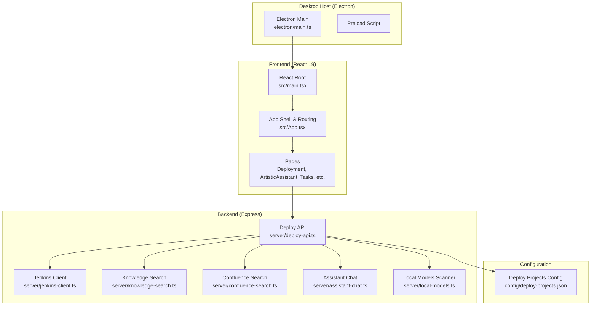
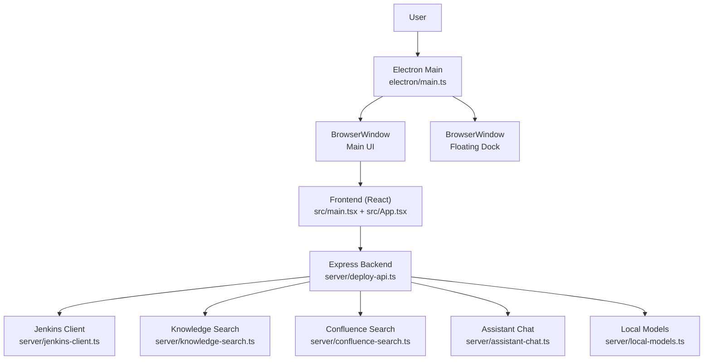
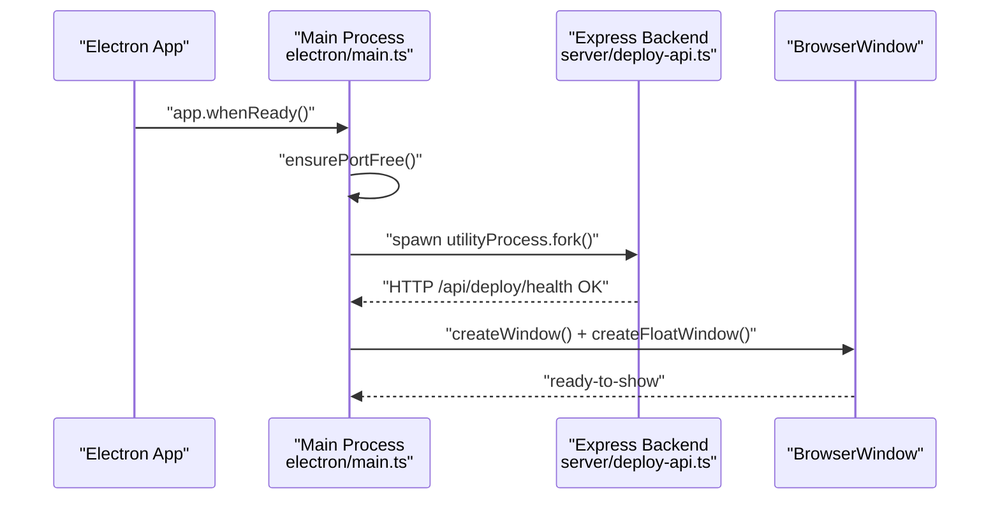
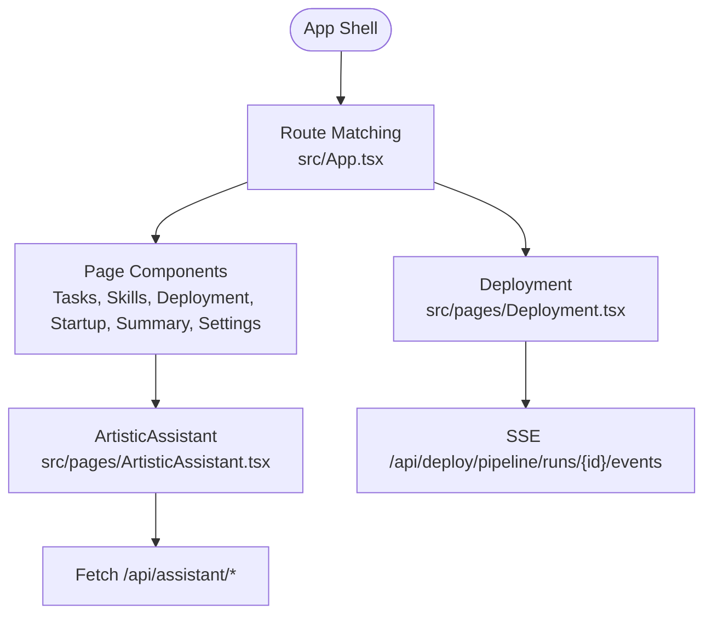
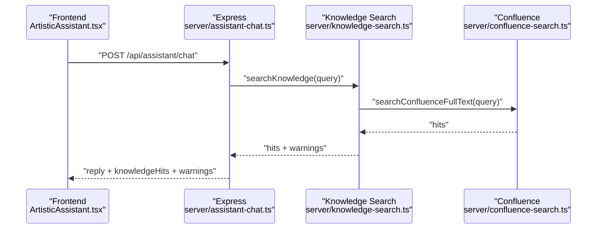
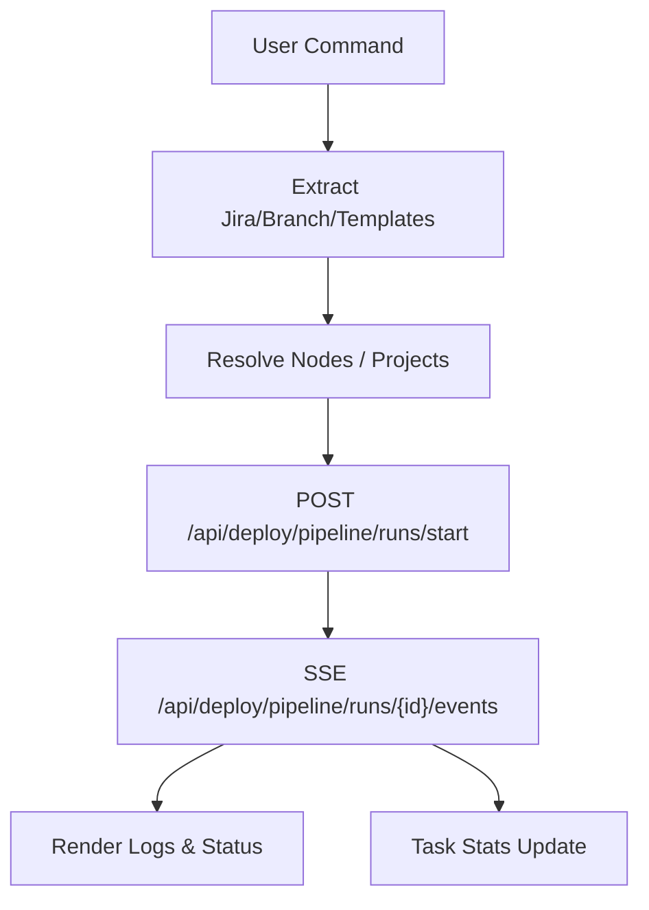
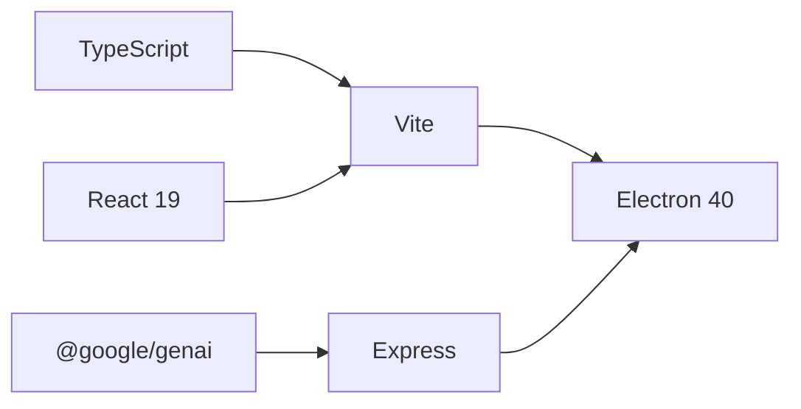

# Project Overview

<cite>
**Referenced Files in This Document**
- [package.json](file://package.json)
- [metadata.json](file://metadata.json)
- [vite.config.ts](file://vite.config.ts)
- [tsconfig.json](file://tsconfig.json)
- [electron/main.ts](file://electron/main.ts)
- [src/main.tsx](file://src/main.tsx)
- [src/App.tsx](file://src/App.tsx)
- [src/pages/Deployment.tsx](file://src/pages/Deployment.tsx)
- [src/pages/ArtisticAssistant.tsx](file://src/pages/ArtisticAssistant.tsx)
- [server/deploy-api.ts](file://server/deploy-api.ts)
- [server/jenkins-client.ts](file://server/jenkins-client.ts)
- [server/assistant-chat.ts](file://server/assistant-chat.ts)
- [server/knowledge-search.ts](file://server/knowledge-search.ts)
- [server/confluence-search.ts](file://server/confluence-search.ts)
- [server/local-models.ts](file://server/local-models.ts)
- [config/deploy-projects.json](file://config/deploy-projects.json)
</cite>

## Table of Contents
1. [Introduction](#introduction)
2. [Project Structure](#project-structure)
3. [Core Components](#core-components)
4. [Architecture Overview](#architecture-overview)
5. [Detailed Component Analysis](#detailed-component-analysis)
6. [Dependency Analysis](#dependency-analysis)
7. [Performance Considerations](#performance-considerations)
8. [Troubleshooting Guide](#troubleshooting-guide)
9. [Conclusion](#conclusion)

## Introduction
Work Helper is a desktop application designed to streamline development workflows by automating repetitive tasks, orchestrating deployments, and offering an intelligent AI assistant. It targets developers and DevOps engineers who need efficient, reliable automation and a unified interface for deployment orchestration, project startup, task management, and knowledge-driven assistance.

The application’s mission aligns with the project description: “工作助手（部署 / 启动 / 自动化 / 待办）” — a personal assistant workbench for managing trivial tasks in the development process, including deployment, startup, cleanup, daily summaries, and to-do task management.

**Section sources**
- [metadata.json:1-6](file://metadata.json#L1-L6)

## Project Structure
The project combines:
- An Electron-based desktop host (main process and preload)
- A React 19 frontend served via Vite
- An Express backend (deploy-api) exposing automation, deployment, and AI assistant endpoints
- AI integration layers supporting multiple providers (Google GenAI, OpenAI, Ollama)
- Configuration for Jenkins and Jira integrations, plus local knowledge search and Confluence support

**Diagram sources**
- [electron/main.ts:1-434](file://electron/main.ts#L1-L434)
- [src/main.tsx:1-11](file://src/main.tsx#L1-L11)
- [src/App.tsx:1-136](file://src/App.tsx#L1-L136)
- [server/deploy-api.ts:1-800](file://server/deploy-api.ts#L1-L800)
- [server/jenkins-client.ts:1-191](file://server/jenkins-client.ts#L1-L191)
- [server/knowledge-search.ts:1-333](file://server/knowledge-search.ts#L1-L333)
- [server/confluence-search.ts:1-208](file://server/confluence-search.ts#L1-L208)
- [server/assistant-chat.ts:1-214](file://server/assistant-chat.ts#L1-L214)
- [server/local-models.ts:1-178](file://server/local-models.ts#L1-L178)
- [config/deploy-projects.json:1-78](file://config/deploy-projects.json#L1-L78)

**Section sources**
- [package.json:1-99](file://package.json#L1-L99)
- [vite.config.ts:1-111](file://vite.config.ts#L1-L111)
- [tsconfig.json:1-28](file://tsconfig.json#L1-L28)

## Core Components
- Desktop Host (Electron)
  - Manages the main and floating windows, lifecycle, and IPC channels for UI navigation and resizing.
  - Bundles and launches the Express backend as a child process and connects the frontend to it.
- Frontend (React 19 + Vite)
  - Single-page application with routing and lazy-loaded pages for tasks, skills, deployment, startup, automation, summary, and settings.
  - Provides a dedicated AI assistant page integrating with the backend chat API and knowledge search.
- Backend (Express)
  - Exposes endpoints for deployment orchestration (Jenkins), project configuration, startup automation, knowledge retrieval, and AI chat.
  - Implements SSE-based streaming for long-running deployment pipelines and real-time logs.
- AI Integration
  - Supports Gemini, OpenAI, and Ollama providers.
  - Integrates local knowledge search (files, Confluence, and HTTP bridges) to enrich assistant responses.
- Configuration
  - Centralized deployment project definitions and defaults for Jenkins jobs and parameters.

**Section sources**
- [electron/main.ts:1-434](file://electron/main.ts#L1-L434)
- [src/App.tsx:1-136](file://src/App.tsx#L1-L136)
- [src/pages/ArtisticAssistant.tsx:1-349](file://src/pages/ArtisticAssistant.tsx#L1-L349)
- [server/deploy-api.ts:1-800](file://server/deploy-api.ts#L1-L800)
- [server/assistant-chat.ts:1-214](file://server/assistant-chat.ts#L1-L214)
- [server/knowledge-search.ts:1-333](file://server/knowledge-search.ts#L1-L333)
- [config/deploy-projects.json:1-78](file://config/deploy-projects.json#L1-L78)

## Architecture Overview
The system follows a layered architecture:
- Electron main process controls the desktop shell and spawns the Express backend.
- The React frontend communicates with the backend via HTTP and SSE for live updates.
- AI assistant integrates with cloud providers and local models, optionally retrieving contextual knowledge from local files, Confluence, and HTTP bridges.
- Deployment orchestration leverages Jenkins via secure server-side APIs, avoiding exposure of credentials to the client.

**Diagram sources**
- [electron/main.ts:1-434](file://electron/main.ts#L1-L434)
- [src/main.tsx:1-11](file://src/main.tsx#L1-L11)
- [src/App.tsx:1-136](file://src/App.tsx#L1-L136)
- [server/deploy-api.ts:1-800](file://server/deploy-api.ts#L1-L800)
- [server/jenkins-client.ts:1-191](file://server/jenkins-client.ts#L1-L191)
- [server/knowledge-search.ts:1-333](file://server/knowledge-search.ts#L1-L333)
- [server/confluence-search.ts:1-208](file://server/confluence-search.ts#L1-L208)
- [server/assistant-chat.ts:1-214](file://server/assistant-chat.ts#L1-L214)
- [server/local-models.ts:1-178](file://server/local-models.ts#L1-L178)

## Detailed Component Analysis

### Electron Desktop Host
- Lifecycle management: Ensures ports are free, starts the bundled backend, waits for health checks, and loads the SPA.
- Window management: Creates main and floating windows, handles resize/drag IPC, and opens external links in the system browser.
- Security: Uses context isolation and controlled preload; sets always-on-top and visibility behaviors for the floating dock.

**Diagram sources**
- [electron/main.ts:180-257](file://electron/main.ts#L180-L257)
- [server/deploy-api.ts:1-800](file://server/deploy-api.ts#L1-L800)

**Section sources**
- [electron/main.ts:1-434](file://electron/main.ts#L1-L434)

### React Frontend (SPA)
- Routing and navigation: Defines top-level routes and a bottom navigation bar for quick access to tasks, skills, deployment, startup, automation, summary, and settings.
- Lazy loading: The AI assistant page is lazily imported to optimize initial load.
- Floating dock: Dedicated route for the always-on-top floating dock UI.

**Diagram sources**
- [src/App.tsx:78-108](file://src/App.tsx#L78-L108)
- [src/pages/ArtisticAssistant.tsx:115-174](file://src/pages/ArtisticAssistant.tsx#L115-L174)
- [src/pages/Deployment.tsx:155-202](file://src/pages/Deployment.tsx#L155-L202)

**Section sources**
- [src/App.tsx:1-136](file://src/App.tsx#L1-L136)
- [src/main.tsx:1-11](file://src/main.tsx#L1-L11)

### AI Assistant and Knowledge Retrieval
- Provider selection: Supports Gemini, OpenAI, and Ollama with model discovery and local scanning.
- Knowledge fusion: Retrieves relevant snippets from local directories, Confluence, and HTTP bridges, then injects them into prompts.
- Streaming and warnings: Returns structured knowledge hits and warnings for transparency.

**Diagram sources**
- [src/pages/ArtisticAssistant.tsx:136-174](file://src/pages/ArtisticAssistant.tsx#L136-L174)
- [server/assistant-chat.ts:160-202](file://server/assistant-chat.ts#L160-L202)
- [server/knowledge-search.ts:260-332](file://server/knowledge-search.ts#L260-L332)
- [server/confluence-search.ts:135-203](file://server/confluence-search.ts#L135-L203)

**Section sources**
- [server/assistant-chat.ts:1-214](file://server/assistant-chat.ts#L1-L214)
- [server/knowledge-search.ts:1-333](file://server/knowledge-search.ts#L1-L333)
- [server/confluence-search.ts:1-208](file://server/confluence-search.ts#L1-L208)
- [server/local-models.ts:124-177](file://server/local-models.ts#L124-L177)

### Deployment Pipeline Management
- Orchestration: Parses natural language commands, resolves Jira tickets and branches, applies templates, and executes a DAG of Jenkins jobs.
- SSE streaming: Real-time logs and node status updates via Server-Sent Events.
- Health checks: Reports Jenkins and Jira configuration status and project availability.

**Diagram sources**
- [src/pages/Deployment.tsx:351-432](file://src/pages/Deployment.tsx#L351-L432)
- [src/pages/Deployment.tsx:511-532](file://src/pages/Deployment.tsx#L511-L532)
- [src/pages/Deployment.tsx:155-202](file://src/pages/Deployment.tsx#L155-L202)

**Section sources**
- [src/pages/Deployment.tsx:1-800](file://src/pages/Deployment.tsx#L1-L800)
- [server/jenkins-client.ts:1-191](file://server/jenkins-client.ts#L1-L191)
- [config/deploy-projects.json:1-78](file://config/deploy-projects.json#L1-L78)

## Dependency Analysis
- Technology stack
  - Electron 40 for desktop host
  - React 19 with Vite for the frontend
  - Express for the backend
  - TypeScript for type safety
  - Google GenAI SDK for Gemini integration
- Build and packaging
  - Vite config supports dynamic proxying to the backend and PWA generation (disabled for Electron builds)
  - Electron Builder configuration packages the app with embedded resources and extra metadata

**Diagram sources**
- [package.json:31-42](file://package.json#L31-L42)
- [vite.config.ts:1-111](file://vite.config.ts#L1-L111)
- [tsconfig.json:1-28](file://tsconfig.json#L1-L28)

**Section sources**
- [package.json:1-99](file://package.json#L1-L99)
- [vite.config.ts:1-111](file://vite.config.ts#L1-L111)
- [tsconfig.json:1-28](file://tsconfig.json#L1-L28)

## Performance Considerations
- SSE streaming for deployment logs avoids polling and reduces latency.
- Frontend lazy-loading improves initial load performance.
- PWA caching is disabled for Electron builds to reduce bundle size and avoid caching API responses.
- Local model scanning and knowledge search limit file counts and excerpt lengths to maintain responsiveness.

[No sources needed since this section provides general guidance]

## Troubleshooting Guide
- Desktop host fails to start backend
  - Verify port availability and ensure the backend process exits cleanly on failure.
  - Confirm environment variables for backend paths and ports.
- Deployment pipeline stalls
  - Check Jenkins configuration and credentials; ensure job paths and parameters are correct.
  - Inspect SSE connection and event stream health.
- AI assistant errors
  - Validate provider keys and model availability; confirm local model scanning and knowledge search roots.
  - Review warnings returned by the assistant API for actionable hints.

**Section sources**
- [electron/main.ts:224-256](file://electron/main.ts#L224-L256)
- [server/deploy-api.ts:65-73](file://server/deploy-api.ts#L65-L73)
- [server/jenkins-client.ts:71-87](file://server/jenkins-client.ts#L71-L87)
- [server/assistant-chat.ts:74-115](file://server/assistant-chat.ts#L74-L115)

## Conclusion
Work Helper delivers a cohesive desktop experience that unifies automation, deployment orchestration, and intelligent assistance. Its Electron-hosted React frontend, Express backend, and AI integration layers address common development challenges by reducing manual steps, centralizing configuration, and providing contextual insights powered by local and remote knowledge sources.

[No sources needed since this section summarizes without analyzing specific files]