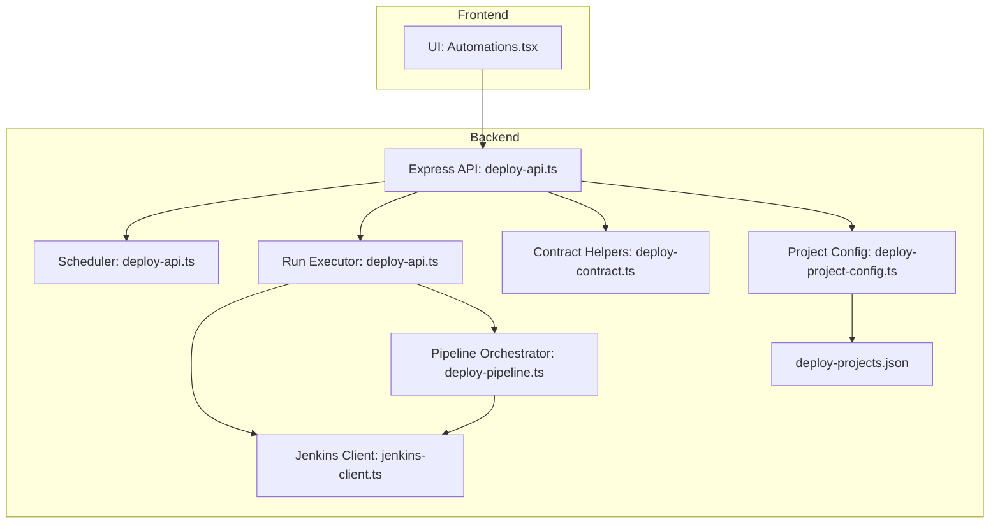
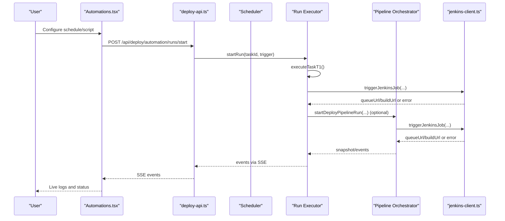
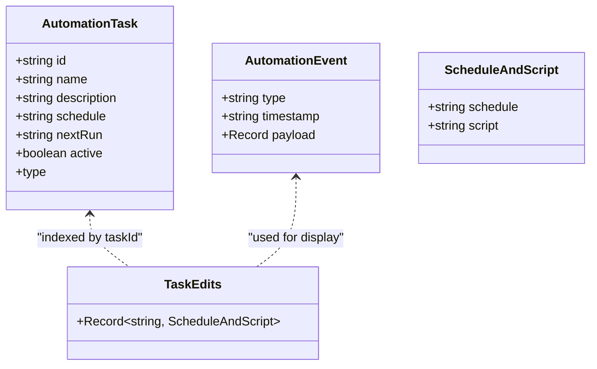
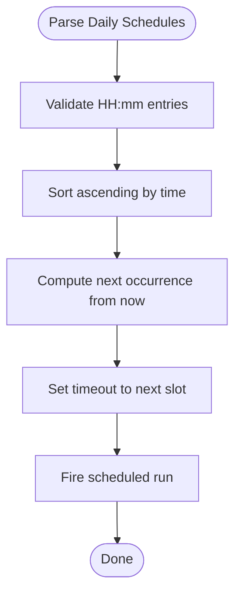
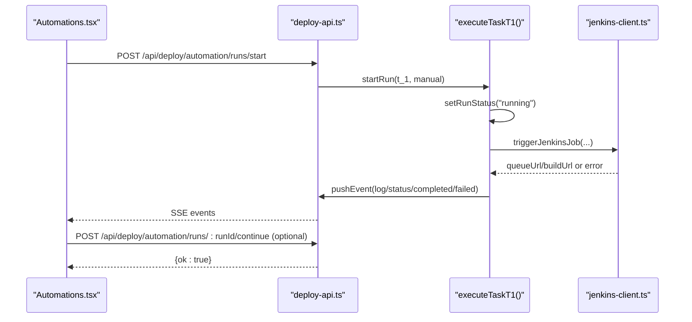
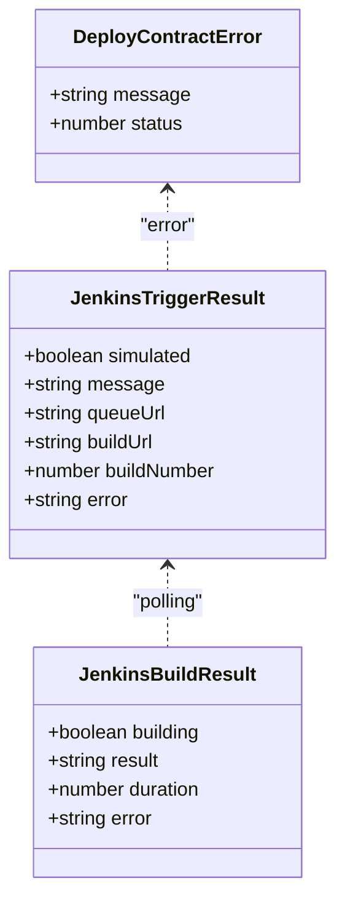
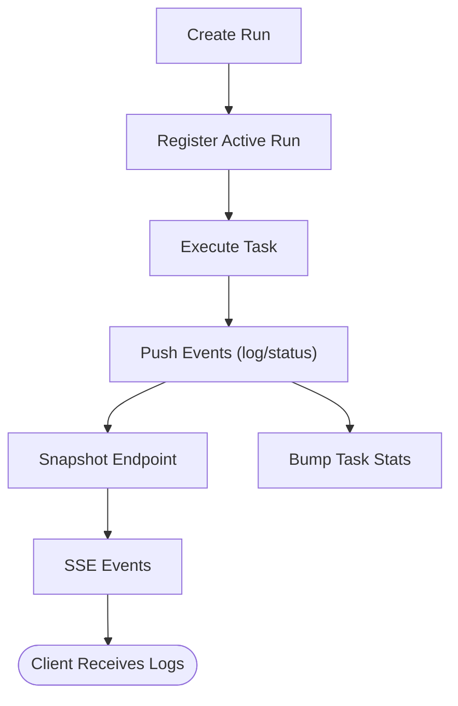
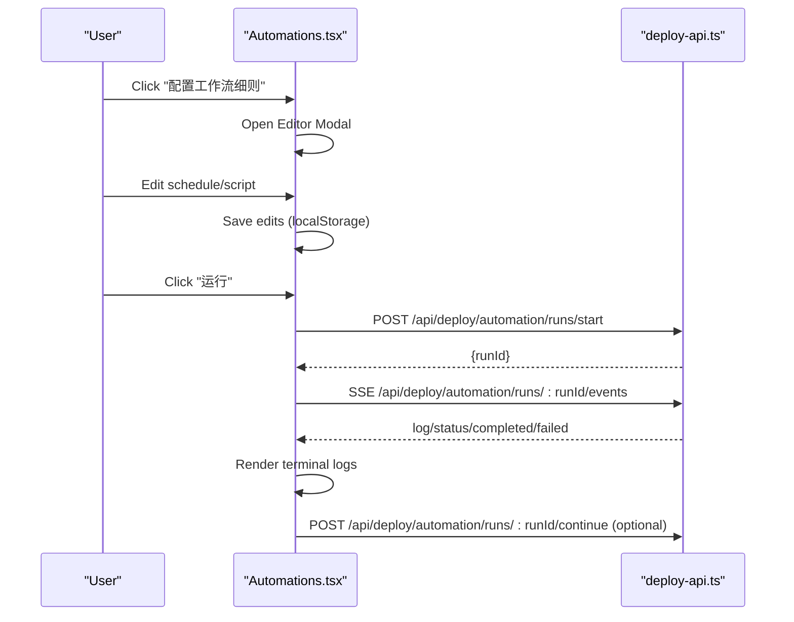
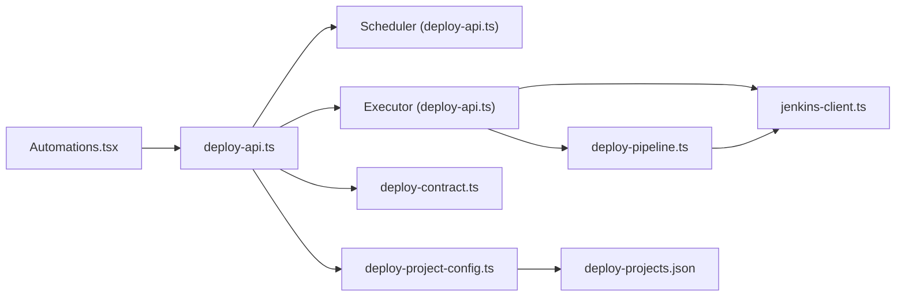

# Automation Scheduling

<cite>
**Referenced Files in This Document**
- [Automations.tsx](file://src/pages/Automations.tsx)
- [deploy-api.ts](file://server/deploy-api.ts)
- [deploy-pipeline.ts](file://server/deploy-pipeline.ts)
- [jenkins-client.ts](file://server/jenkins-client.ts)
- [deploy-contract.ts](file://server/deploy-contract.ts)
- [deploy-project-config.ts](file://server/deploy-project-config.ts)
- [deploy-projects.json](file://config/deploy-projects.json)
- [README.md](file://README.md)
- [2026-05-03-real-jenkins-deployment.md](file://docs/superpowers/plans/2026-05-03-real-jenkins-deployment.md)
- [2026-05-03-real-jenkins-deployment-design.md](file://docs/superpowers/specs/2026-05-03-real-jenkins-deployment-design.md)
</cite>

## Table of Contents
1. [Introduction](#introduction)
2. [Project Structure](#project-structure)
3. [Core Components](#core-components)
4. [Architecture Overview](#architecture-overview)
5. [Detailed Component Analysis](#detailed-component-analysis)
6. [Dependency Analysis](#dependency-analysis)
7. [Performance Considerations](#performance-considerations)
8. [Troubleshooting Guide](#troubleshooting-guide)
9. [Conclusion](#conclusion)
10. [Appendices](#appendices)

## Introduction
This document explains the automation scheduling system that powers recurring tasks and scheduled operations in the project. It covers:
- How users configure automation rules and timing patterns
- The execution engine that schedules, monitors, and tracks runs
- Integration with deployment pipeline automation and Jenkins
- History/logging of automation runs
- The user interface for managing automation rules (creation, modification, deletion, enable/disable)
- Example scenarios and error handling/retry/notification behavior

## Project Structure
The automation system spans the frontend UI and the backend Express service:
- Frontend: Automation management UI and live terminal for run logs
- Backend: Automation scheduler, run executor, Jenkins integration, and deployment pipeline orchestration

**Diagram sources**
- [Automations.tsx:109-661](file://src/pages/Automations.tsx#L109-L661)
- [deploy-api.ts:1516-1590](file://server/deploy-api.ts#L1516-L1590)
- [deploy-api.ts:831-885](file://server/deploy-api.ts#L831-L885)
- [deploy-pipeline.ts:225-419](file://server/deploy-pipeline.ts#L225-L419)
- [jenkins-client.ts:89-142](file://server/jenkins-client.ts#L89-L142)
- [deploy-contract.ts:33-81](file://server/deploy-contract.ts#L33-L81)
- [deploy-project-config.ts:176-236](file://server/deploy-project-config.ts#L176-L236)
- [deploy-projects.json:1-78](file://config/deploy-projects.json#L1-L78)

**Section sources**
- [README.md:1-91](file://README.md#L1-L91)
- [Automations.tsx:109-661](file://src/pages/Automations.tsx#L109-L661)
- [deploy-api.ts:1516-1590](file://server/deploy-api.ts#L1516-L1590)

## Core Components
- Automation UI: Manages automation tasks, schedules, and live execution logs
- Automation scheduler: Schedules recurring tasks based on configured daily slots
- Automation run executor: Executes tasks and streams logs via Server-Sent Events (SSE)
- Jenkins integration: Triggers real Jenkins jobs and polls build status
- Deployment pipeline orchestrator: Manages multi-project DAG runs and snapshots
- Configuration: Project-to-Jenkins mapping and parameter contracts

**Section sources**
- [Automations.tsx:5-107](file://src/pages/Automations.tsx#L5-L107)
- [deploy-api.ts:831-885](file://server/deploy-api.ts#L831-L885)
- [deploy-api.ts:790-806](file://server/deploy-api.ts#L790-L806)
- [jenkins-client.ts:89-142](file://server/jenkins-client.ts#L89-L142)
- [deploy-pipeline.ts:18-46](file://server/deploy-pipeline.ts#L18-L46)

## Architecture Overview
The automation lifecycle:
- Users configure a task’s schedule and script in the UI
- The backend scheduler starts a run at the configured time
- The run executor executes the script and streams logs via SSE
- For deployment tasks, the executor triggers Jenkins jobs and optionally waits for completion
- Pipeline orchestrator coordinates multi-project runs and snapshots

**Diagram sources**
- [Automations.tsx:173-234](file://src/pages/Automations.tsx#L173-L234)
- [deploy-api.ts:1516-1535](file://server/deploy-api.ts#L1516-L1535)
- [deploy-api.ts:808-829](file://server/deploy-api.ts#L808-L829)
- [jenkins-client.ts:89-142](file://server/jenkins-client.ts#L89-L142)
- [deploy-pipeline.ts:182-223](file://server/deploy-pipeline.ts#L182-L223)

## Detailed Component Analysis

### Automation Configuration Interface
- Task model includes id, name, description, schedule, nextRun, active flag, and type
- Initial tasks demonstrate typical automation patterns (daily code baseline upgrade, weekly report, Jira bottleneck analysis)
- Users can edit schedule and script locally in the UI; edits persist in browser storage and are shown in the editor modal
- The UI supports toggling active state and starting a manual run

**Diagram sources**
- [Automations.tsx:5-13](file://src/pages/Automations.tsx#L5-L13)
- [Automations.tsx:29-41](file://src/pages/Automations.tsx#L29-L41)
- [Automations.tsx:63-67](file://src/pages/Automations.tsx#L63-L67)

**Section sources**
- [Automations.tsx:79-107](file://src/pages/Automations.tsx#L79-L107)
- [Automations.tsx:125-154](file://src/pages/Automations.tsx#L125-L154)

### Automation Rule Definition System
- Timing patterns: Daily schedules are parsed from a comma-separated string of HH:mm slots
- Next occurrence calculation determines the next scheduled run
- Environment-driven configuration controls whether a task is enabled and what command to run
- Script editing supports saving custom scripts per task in browser storage

**Diagram sources**
- [deploy-api.ts:627-651](file://server/deploy-api.ts#L627-L651)
- [deploy-api.ts:653-671](file://server/deploy-api.ts#L653-L671)
- [deploy-api.ts:831-885](file://server/deploy-api.ts#L831-L885)

**Section sources**
- [deploy-api.ts:84-94](file://server/deploy-api.ts#L84-L94)
- [deploy-api.ts:627-671](file://server/deploy-api.ts#L627-L671)

### Automation Execution Engine
- Run lifecycle: create run, register active run, execute task, update status, push events, finalize
- Logging: structured events with timestamps and levels (info, warn, error, success, system)
- SSE streaming: clients subscribe to run events via dedicated SSE endpoints
- Manual intervention: runs can wait for user input and resume via a continuation endpoint

**Diagram sources**
- [deploy-api.ts:1516-1535](file://server/deploy-api.ts#L1516-L1535)
- [deploy-api.ts:808-829](file://server/deploy-api.ts#L808-L829)
- [deploy-api.ts:790-806](file://server/deploy-api.ts#L790-L806)
- [jenkins-client.ts:89-142](file://server/jenkins-client.ts#L89-L142)
- [Automations.tsx:173-234](file://src/pages/Automations.tsx#L173-L234)
- [Automations.tsx:1565-1589](file://src/pages/Automations.tsx#L1565-L1589)

**Section sources**
- [deploy-api.ts:598-621](file://server/deploy-api.ts#L598-L621)
- [deploy-api.ts:1537-1564](file://server/deploy-api.ts#L1537-L1564)
- [Automations.tsx:173-234](file://src/pages/Automations.tsx#L173-L234)

### Integration with Deployment Pipeline Automation and Jenkins
- Jenkins client handles authentication, CSRF crumb, and build polling
- Contract helpers validate parameter names and build Jenkins parameters from Jira ID and branch
- Project configuration maps project IDs to Jenkins base URLs and job paths
- Pipeline orchestrator coordinates multi-project runs, snapshots, and completion/failure events

**Diagram sources**
- [jenkins-client.ts:5-19](file://server/jenkins-client.ts#L5-L19)
- [deploy-contract.ts:1-8](file://server/deploy-contract.ts#L1-L8)

**Section sources**
- [jenkins-client.ts:89-142](file://server/jenkins-client.ts#L89-L142)
- [jenkins-client.ts:148-190](file://server/jenkins-client.ts#L148-L190)
- [deploy-contract.ts:91-120](file://server/deploy-contract.ts#L91-L120)
- [deploy-project-config.ts:212-236](file://server/deploy-project-config.ts#L212-L236)
- [deploy-pipeline.ts:225-419](file://server/deploy-pipeline.ts#L225-L419)

### Automation History and Logging System
- Runs are stored in memory with bounded event history
- Snapshot endpoints expose run status, nodes, and recent events
- Stats file tracks task execution counts and last run time
- SSE endpoints stream live logs and status transitions

**Diagram sources**
- [deploy-api.ts:122-124](file://server/deploy-api.ts#L122-L124)
- [deploy-api.ts:723-728](file://server/deploy-api.ts#L723-L728)
- [deploy-api.ts:598-621](file://server/deploy-api.ts#L598-L621)
- [deploy-pipeline.ts:114-137](file://server/deploy-pipeline.ts#L114-L137)
- [deploy-pipeline.ts:149-180](file://server/deploy-pipeline.ts#L149-L180)

**Section sources**
- [deploy-api.ts:114-121](file://server/deploy-api.ts#L114-L121)
- [deploy-pipeline.ts:114-137](file://server/deploy-pipeline.ts#L114-L137)
- [deploy-pipeline.ts:149-180](file://server/deploy-pipeline.ts#L149-L180)

### User Interface for Managing Automation Rules
- Task grid with search, toggle active, and run buttons
- Workflow editor modal to edit schedule and script
- Creation modal to generate new tasks from prompts
- Live terminal overlay for run logs and manual input prompts

**Diagram sources**
- [Automations.tsx:125-154](file://src/pages/Automations.tsx#L125-L154)
- [Automations.tsx:173-234](file://src/pages/Automations.tsx#L173-L234)
- [Automations.tsx:1565-1589](file://src/pages/Automations.tsx#L1565-L1589)
- [deploy-api.ts:1516-1535](file://server/deploy-api.ts#L1516-L1535)
- [deploy-api.ts:1537-1564](file://server/deploy-api.ts#L1537-L1564)

**Section sources**
- [Automations.tsx:273-465](file://src/pages/Automations.tsx#L273-L465)
- [Automations.tsx:469-657](file://src/pages/Automations.tsx#L469-L657)

### Example Scenarios
- Daily cleanup tasks: Configure a daily schedule and a script that cleans temporary files or resets environments
- Periodic environment startups: Use the startup launcher to synchronize repositories, install dependencies, and start development servers
- Scheduled deployment triggers: Use the deployment pipeline to trigger Jenkins jobs for multiple projects in order, with branch resolution from Jira or explicit branch

**Section sources**
- [Automations.tsx:15-27](file://src/pages/Automations.tsx#L15-L27)
- [deploy-api.ts:790-806](file://server/deploy-api.ts#L790-L806)
- [deploy-pipeline.ts:225-419](file://server/deploy-pipeline.ts#L225-L419)

## Dependency Analysis
- Frontend depends on backend endpoints for automation runs and deployment pipeline
- Backend depends on Jenkins client and project configuration for deployment automation
- Scheduler and executor depend on environment variables for task configuration
- Pipeline orchestrator depends on Jenkins client and project configuration

**Diagram sources**
- [Automations.tsx:109-661](file://src/pages/Automations.tsx#L109-L661)
- [deploy-api.ts:831-885](file://server/deploy-api.ts#L831-L885)
- [deploy-api.ts:1516-1590](file://server/deploy-api.ts#L1516-L1590)
- [jenkins-client.ts:89-142](file://server/jenkins-client.ts#L89-L142)
- [deploy-pipeline.ts:225-419](file://server/deploy-pipeline.ts#L225-L419)
- [deploy-contract.ts:33-81](file://server/deploy-contract.ts#L33-L81)
- [deploy-project-config.ts:176-236](file://server/deploy-project-config.ts#L176-L236)
- [deploy-projects.json:1-78](file://config/deploy-projects.json#L1-L78)

**Section sources**
- [deploy-api.ts:1516-1590](file://server/deploy-api.ts#L1516-L1590)
- [deploy-pipeline.ts:225-419](file://server/deploy-pipeline.ts#L225-L419)

## Performance Considerations
- SSE streaming batches events and closes connections when runs complete
- Run history is pruned to a bounded size to prevent memory growth
- Jenkins polling intervals and timeouts are configurable to balance responsiveness and resource usage
- Command execution streams output incrementally to avoid large buffers

[No sources needed since this section provides general guidance]

## Troubleshooting Guide
Common issues and resolutions:
- Jenkins not configured: The backend returns a blocking error when credentials are missing; ensure environment variables are set and the health endpoint reflects configuration status
- Invalid schedule format: The scheduler validates HH:mm entries; ensure the schedule string follows the expected format
- Run conflicts: Starting a run for a task already running returns a conflict; wait for the active run to finish
- Manual intervention required: If a run waits for input, submit the solution via the continuation endpoint
- Pipeline failures: The pipeline orchestrator records failure reasons and stops subsequent nodes; inspect the run snapshot for details

**Section sources**
- [deploy-contract.ts:33-81](file://server/deploy-contract.ts#L33-L81)
- [deploy-api.ts:831-885](file://server/deploy-api.ts#L831-L885)
- [Automations.tsx:1565-1589](file://src/pages/Automations.tsx#L1565-L1589)
- [deploy-pipeline.ts:225-419](file://server/deploy-pipeline.ts#L225-L419)

## Conclusion
The automation scheduling system combines a user-friendly UI with a robust backend execution engine. It supports recurring tasks, manual runs, live logging, and deep integration with Jenkins for deployment automation. The design emphasizes safety (credentials remain server-side), observability (SSE and snapshots), and reliability (bounded history and pruning).

## Appendices

### API Reference: Automation Endpoints
- POST /api/deploy/automation/runs/start: Start a manual automation run
- GET /api/deploy/automation/runs/:runId/events: Subscribe to run events via SSE
- POST /api/deploy/automation/runs/:runId/continue: Submit manual input to resume a waiting run

**Section sources**
- [deploy-api.ts:1516-1535](file://server/deploy-api.ts#L1516-L1535)
- [deploy-api.ts:1537-1564](file://server/deploy-api.ts#L1537-L1564)
- [Automations.tsx:1565-1589](file://src/pages/Automations.tsx#L1565-L1589)

### Configuration Reference
- Environment variables for automation task T1:
  - AUTOMATION_T1_ENABLED: Enable/disable the scheduler
  - AUTOMATION_T1_SCHEDULES: Comma-separated HH:mm slots
  - AUTOMATION_T1_COMMAND: Override command to run
  - AUTOMATION_T1_CLI_BIN, AUTOMATION_T1_CLI_ENTRY, AUTOMATION_T1_CLI_CWD, AUTOMATION_T1_ENV, AUTOMATION_T1_EXTRA_ARGS: Defaults for CLI-based tasks

**Section sources**
- [deploy-api.ts:84-94](file://server/deploy-api.ts#L84-L94)
- [deploy-api.ts:673-711](file://server/deploy-api.ts#L673-L711)