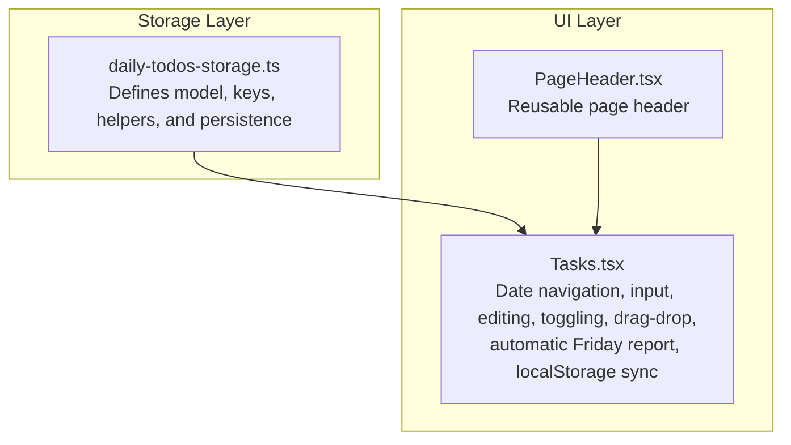
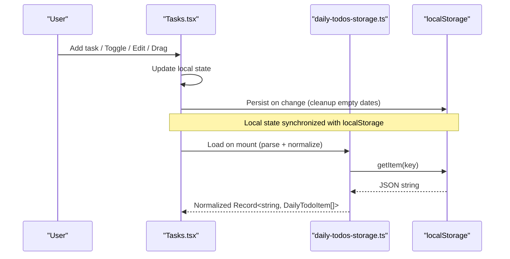
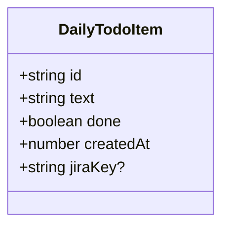
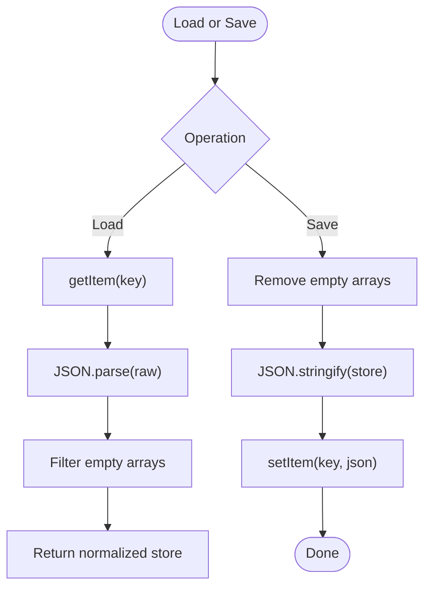
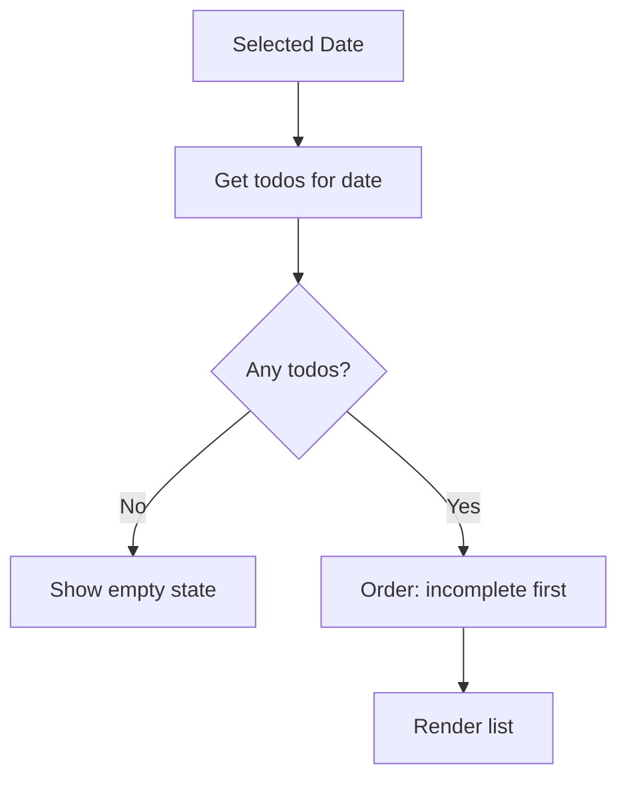
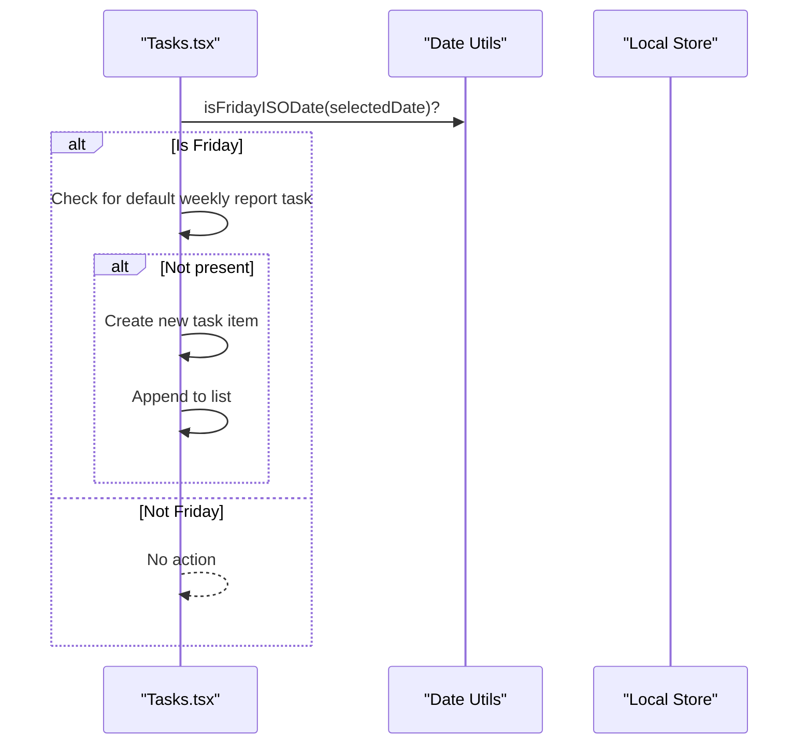
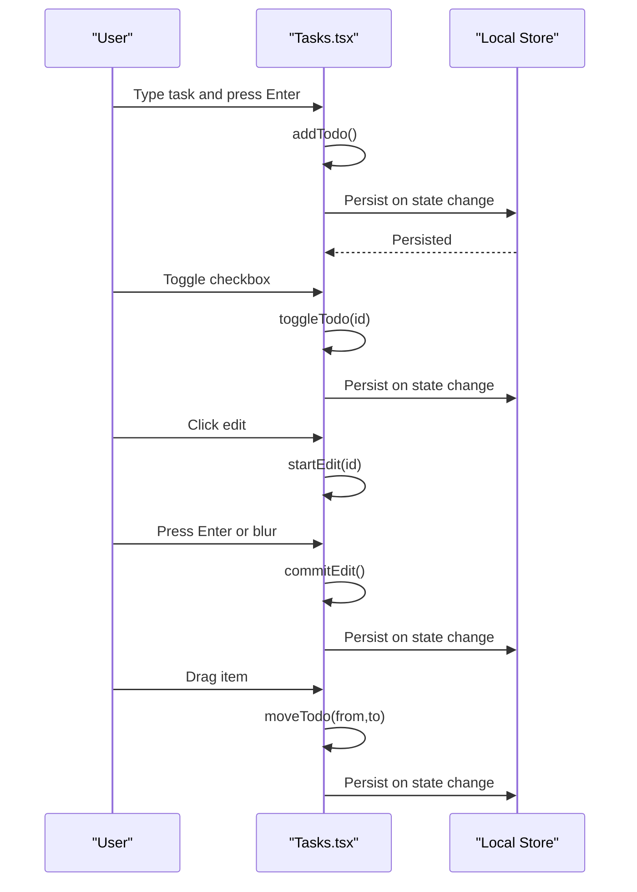
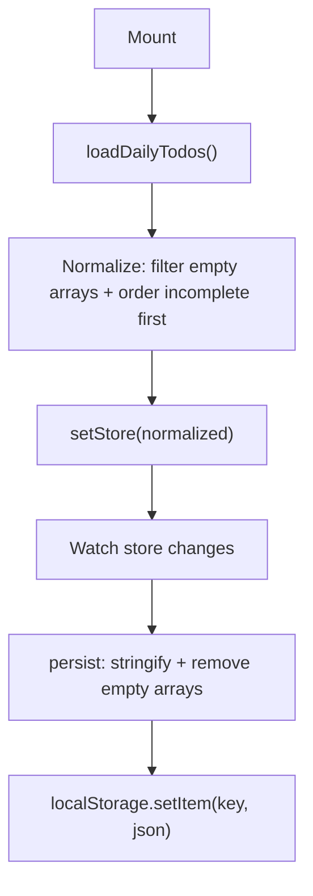
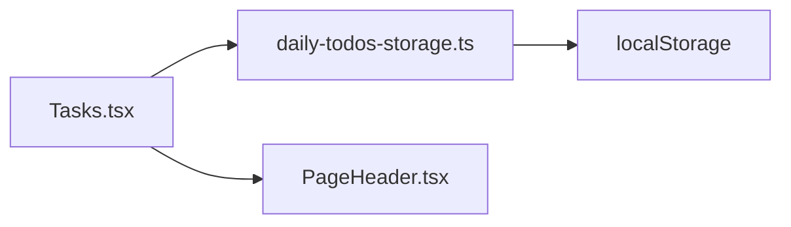

# Daily Todo Tracking

<cite>
**Referenced Files in This Document**
- [daily-todos-storage.ts](file://src/lib/daily-todos-storage.ts)
- [Tasks.tsx](file://src/pages/Tasks.tsx)
- [PageHeader.tsx](file://src/components/PageHeader.tsx)
</cite>

## Table of Contents
1. [Introduction](#introduction)
2. [Project Structure](#project-structure)
3. [Core Components](#core-components)
4. [Architecture Overview](#architecture-overview)
5. [Detailed Component Analysis](#detailed-component-analysis)
6. [Dependency Analysis](#dependency-analysis)
7. [Performance Considerations](#performance-considerations)
8. [Troubleshooting Guide](#troubleshooting-guide)
9. [Conclusion](#conclusion)

## Introduction
This document explains the daily todo tracking system implemented in the project. It covers how todos are modeled, persisted locally using the browser’s localStorage API, organized by date, and presented in a React UI with editing, completion toggling, and drag-and-drop reordering. It also documents the automatic Friday weekly report injection and the storage key management and normalization strategies used to keep data clean.

## Project Structure
The daily todo system spans a small set of focused modules:
- A typed storage library that encapsulates localStorage reads, writes, and normalization.
- A React page that renders the todo UI, manages state, and persists changes.
- A shared header component used for page layout.

**Diagram sources**
- [daily-todos-storage.ts:1-133](file://src/lib/daily-todos-storage.ts#L1-L133)
- [Tasks.tsx:136-542](file://src/pages/Tasks.tsx#L136-L542)
- [PageHeader.tsx:14-63](file://src/components/PageHeader.tsx#L14-L63)

**Section sources**
- [daily-todos-storage.ts:1-133](file://src/lib/daily-todos-storage.ts#L1-L133)
- [Tasks.tsx:136-542](file://src/pages/Tasks.tsx#L136-L542)
- [PageHeader.tsx:14-63](file://src/components/PageHeader.tsx#L14-L63)

## Core Components
- DailyTodoItem model: id, text, done, createdAt, and optional jiraKey for deduplication and automation.
- Storage key: a single localStorage key for all dates and todos.
- Persistence: automatic save on state changes and cleanup of empty date entries.
- UI: task input, completion toggles, inline editing, drag-and-drop reordering, and date navigation.

**Section sources**
- [daily-todos-storage.ts:10-17](file://src/lib/daily-todos-storage.ts#L10-L17)
- [daily-todos-storage.ts:5](file://src/lib/daily-todos-storage.ts#L5-L5)
- [Tasks.tsx:203-210](file://src/pages/Tasks.tsx#L203-L210)
- [Tasks.tsx:230-273](file://src/pages/Tasks.tsx#L230-L273)

## Architecture Overview
The system follows a simple layered architecture:
- UI layer (React) manages user interactions and state.
- Storage layer (localStorage) persists todos keyed by ISO date strings.
- Utilities provide date helpers and normalization.

**Diagram sources**
- [Tasks.tsx:147-155](file://src/pages/Tasks.tsx#L147-L155)
- [Tasks.tsx:203-210](file://src/pages/Tasks.tsx#L203-L210)
- [daily-todos-storage.ts:44-56](file://src/lib/daily-todos-storage.ts#L44-L56)

## Detailed Component Analysis

### Data Model: DailyTodoItem
- Fields:
  - id: unique identifier
  - text: task content
  - done: completion flag
  - createdAt: timestamp
  - jiraKey: optional, used for deduplication and automation
- Purpose: standardized representation for all todos across the app.

**Diagram sources**
- [daily-todos-storage.ts:10-17](file://src/lib/daily-todos-storage.ts#L10-L17)

**Section sources**
- [daily-todos-storage.ts:10-17](file://src/lib/daily-todos-storage.ts#L10-L17)

### Storage Key Management and Normalization
- Storage key: a single key stores a map from ISO date strings to arrays of DailyTodoItem.
- Normalization:
  - On load: empty arrays are filtered out during hydration.
  - On save: empty arrays are removed before persisting.
  - Parsing: malformed JSON is handled gracefully by returning an empty object.

**Diagram sources**
- [daily-todos-storage.ts:44-56](file://src/lib/daily-todos-storage.ts#L44-L56)
- [daily-todos-storage.ts:27-33](file://src/lib/daily-todos-storage.ts#L27-L33)
- [daily-todos-storage.ts:35-42](file://src/lib/daily-todos-storage.ts#L35-L42)

**Section sources**
- [daily-todos-storage.ts:5](file://src/lib/daily-todos-storage.ts#L5-L5)
- [daily-todos-storage.ts:27-33](file://src/lib/daily-todos-storage.ts#L27-L33)
- [daily-todos-storage.ts:35-42](file://src/lib/daily-todos-storage.ts#L35-L42)
- [daily-todos-storage.ts:44-56](file://src/lib/daily-todos-storage.ts#L44-L56)

### Date-Based Organization and Chronological Ordering
- Todos are grouped by ISO date strings (YYYY-MM-DD).
- Within a date, todos are ordered so that incomplete items appear before completed ones, preserving relative order within each group.
- Navigation supports moving forward/backward by days and selecting a date directly.

**Diagram sources**
- [Tasks.tsx:212-218](file://src/pages/Tasks.tsx#L212-L218)
- [Tasks.tsx:54-56](file://src/pages/Tasks.tsx#L54-L56)
- [Tasks.tsx:27-34](file://src/pages/Tasks.tsx#L27-L34)

**Section sources**
- [Tasks.tsx:212-218](file://src/pages/Tasks.tsx#L212-L218)
- [Tasks.tsx:54-56](file://src/pages/Tasks.tsx#L54-L56)
- [Tasks.tsx:27-34](file://src/pages/Tasks.tsx#L27-L34)

### Automatic Friday Weekly Report Injection
- On mount and when the selected date becomes a Friday, the UI checks whether a default “write weekly report” task exists for that date.
- If missing, it injects a new task with a fixed text and marks it incomplete.
- The injected task is appended last among the current day’s todos.

**Diagram sources**
- [Tasks.tsx:157-172](file://src/pages/Tasks.tsx#L157-L172)
- [Tasks.tsx:48-51](file://src/pages/Tasks.tsx#L48-L51)
- [daily-todos-storage.ts:8](file://src/lib/daily-todos-storage.ts#L8-L8)

**Section sources**
- [Tasks.tsx:157-172](file://src/pages/Tasks.tsx#L157-L172)
- [Tasks.tsx:48-51](file://src/pages/Tasks.tsx#L48-L51)
- [daily-todos-storage.ts:8](file://src/lib/daily-todos-storage.ts#L8-L8)

### UI Components and Interactions
- Task input: adds a new task for the selected date; prevents empty submissions.
- Completion toggles: flips done flag for a given task.
- Inline editing: click to edit text; Enter to commit, Escape to cancel; blur also commits.
- Drag-and-drop reordering: drag handle allows reordering within the list; preserves incomplete-first ordering.
- Date navigation: previous/next buttons, calendar input, and “back to today” shortcut.
- History sidebar: lists dates with non-empty todo lists, sorted newest first.

**Diagram sources**
- [Tasks.tsx:230-241](file://src/pages/Tasks.tsx#L230-L241)
- [Tasks.tsx:243-248](file://src/pages/Tasks.tsx#L243-L248)
- [Tasks.tsx:275-294](file://src/pages/Tasks.tsx#L275-L294)
- [Tasks.tsx:264-273](file://src/pages/Tasks.tsx#L264-L273)
- [Tasks.tsx:203-210](file://src/pages/Tasks.tsx#L203-L210)

**Section sources**
- [Tasks.tsx:230-241](file://src/pages/Tasks.tsx#L230-L241)
- [Tasks.tsx:243-248](file://src/pages/Tasks.tsx#L243-L248)
- [Tasks.tsx:250-255](file://src/pages/Tasks.tsx#L250-L255)
- [Tasks.tsx:257-262](file://src/pages/Tasks.tsx#L257-L262)
- [Tasks.tsx:264-273](file://src/pages/Tasks.tsx#L264-L273)
- [Tasks.tsx:275-294](file://src/pages/Tasks.tsx#L275-L294)
- [Tasks.tsx:374-399](file://src/pages/Tasks.tsx#L374-L399)
- [Tasks.tsx:314-353](file://src/pages/Tasks.tsx#L314-L353)

### Persistence Mechanism
- Hydration: on mount, loads stored data, filters empty arrays, and orders incomplete items first.
- Auto-save: whenever the in-memory store changes, it is serialized and saved to localStorage, excluding empty arrays.
- Cleanup: empty arrays are removed before saving to keep the store compact.

**Diagram sources**
- [Tasks.tsx:147-155](file://src/pages/Tasks.tsx#L147-L155)
- [Tasks.tsx:203-210](file://src/pages/Tasks.tsx#L203-L210)
- [daily-todos-storage.ts:27-33](file://src/lib/daily-todos-storage.ts#L27-L33)
- [daily-todos-storage.ts:54-56](file://src/lib/daily-todos-storage.ts#L54-L56)

**Section sources**
- [Tasks.tsx:147-155](file://src/pages/Tasks.tsx#L147-L155)
- [Tasks.tsx:203-210](file://src/pages/Tasks.tsx#L203-L210)
- [daily-todos-storage.ts:27-33](file://src/lib/daily-todos-storage.ts#L27-L33)
- [daily-todos-storage.ts:54-56](file://src/lib/daily-todos-storage.ts#L54-L56)

### Common Usage Patterns
- Adding tasks:
  - Type in the input field and press Enter or click Add.
  - The task is appended to the selected date’s list and immediately persisted.
- Marking completion:
  - Toggle the checkbox next to a task to switch done state.
  - Completed tasks visually appear lighter and are grouped at the bottom of the list.
- Editing existing tasks:
  - Click the task body to enter edit mode; press Enter or blur to save; press Escape to cancel.
- Navigating between dates:
  - Use Previous/Next buttons, the calendar input, or the “Back to today” link.
  - The history sidebar lists dates with non-empty lists, sorted newest first.

**Section sources**
- [Tasks.tsx:230-241](file://src/pages/Tasks.tsx#L230-L241)
- [Tasks.tsx:243-248](file://src/pages/Tasks.tsx#L243-L248)
- [Tasks.tsx:275-294](file://src/pages/Tasks.tsx#L275-L294)
- [Tasks.tsx:374-399](file://src/pages/Tasks.tsx#L374-L399)
- [Tasks.tsx:314-353](file://src/pages/Tasks.tsx#L314-L353)

## Dependency Analysis
- Tasks.tsx depends on:
  - daily-todos-storage.ts for model, constants, and date helpers.
  - PageHeader.tsx for consistent page layout.
- daily-todos-storage.ts depends on:
  - localStorage API for persistence.
  - Date utilities for ISO date computation.

**Diagram sources**
- [Tasks.tsx:14-20](file://src/pages/Tasks.tsx#L14-L20)
- [daily-todos-storage.ts:44-56](file://src/lib/daily-todos-storage.ts#L44-L56)

**Section sources**
- [Tasks.tsx:14-20](file://src/pages/Tasks.tsx#L14-L20)
- [daily-todos-storage.ts:44-56](file://src/lib/daily-todos-storage.ts#L44-L56)

## Performance Considerations
- Local state updates are fast; persistence occurs only on state changes, minimizing IO.
- Normalization removes empty arrays before save, keeping the payload small.
- Ordering is O(n) per date; with typical daily todo counts, this is negligible.
- Consider debouncing edits if users frequently re-type content to reduce frequent saves.

## Troubleshooting Guide
- Data not loading:
  - Verify the localStorage key exists and contains valid JSON.
  - The loader returns an empty object on parse errors, so malformed data is ignored safely.
- Tasks not persisting:
  - Ensure the auto-save effect runs by confirming hydrated state is true.
  - Confirm that empty arrays are not being written by checking the cleanup step.
- Duplicate tasks:
  - Adding plain text tasks is deduplicated by trimmed text equality on the same date.
  - Jira tasks are deduplicated by uppercase jiraKey equality.
- Friday report missing:
  - The injection runs when the selected date is a Friday and no default weekly report task exists.
  - It appends the task last among the current day’s todos.

**Section sources**
- [daily-todos-storage.ts:44-56](file://src/lib/daily-todos-storage.ts#L44-L56)
- [Tasks.tsx:147-155](file://src/pages/Tasks.tsx#L147-L155)
- [Tasks.tsx:203-210](file://src/pages/Tasks.tsx#L203-L210)
- [Tasks.tsx:59-77](file://src/pages/Tasks.tsx#L59-L77)
- [Tasks.tsx:157-172](file://src/pages/Tasks.tsx#L157-L172)

## Conclusion
The daily todo tracking system provides a robust, lightweight solution for organizing tasks by date with strong local persistence. Its design emphasizes simplicity: a single localStorage key, normalized data, and straightforward UI interactions. The automatic Friday weekly report injection and deduplication logic enhance usability without complicating the core model. Together, these features deliver a reliable, user-friendly daily todo experience.