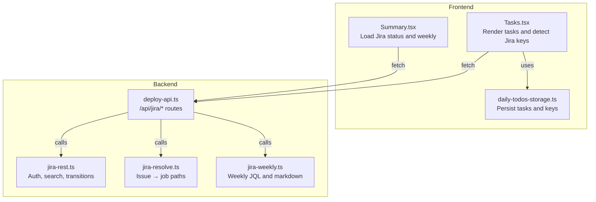
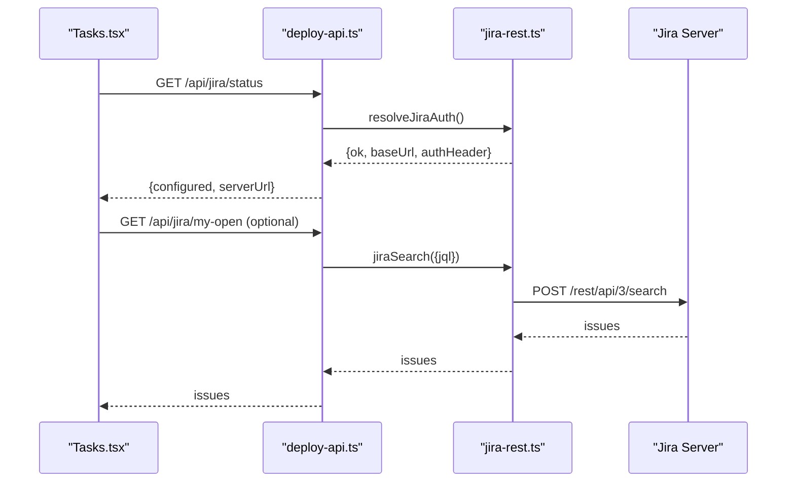
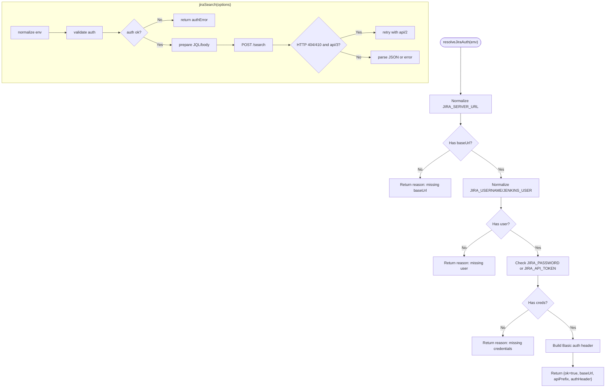
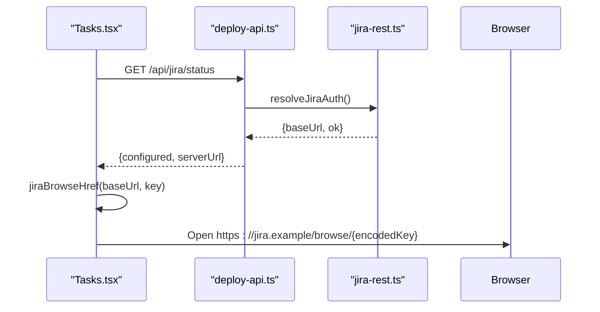
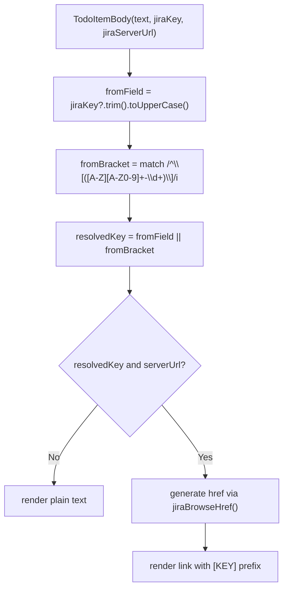
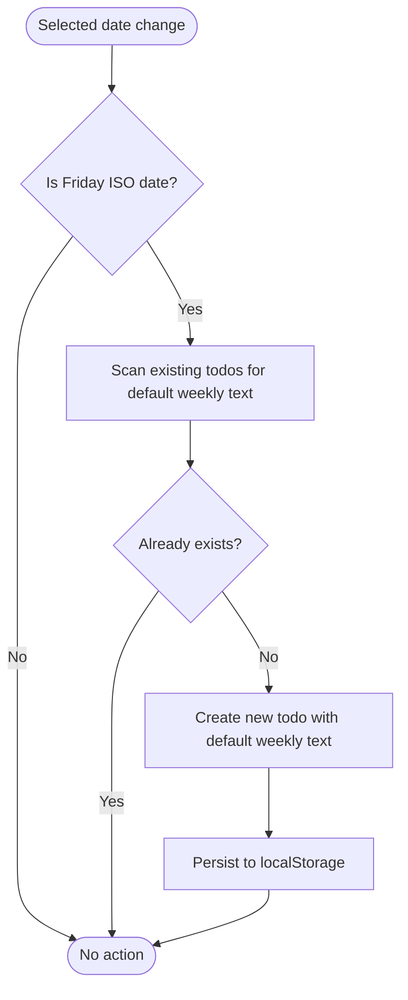
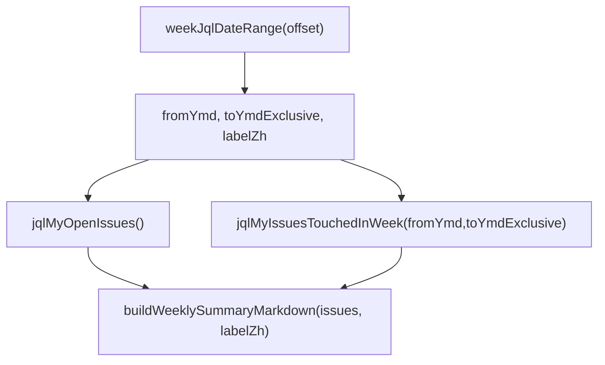
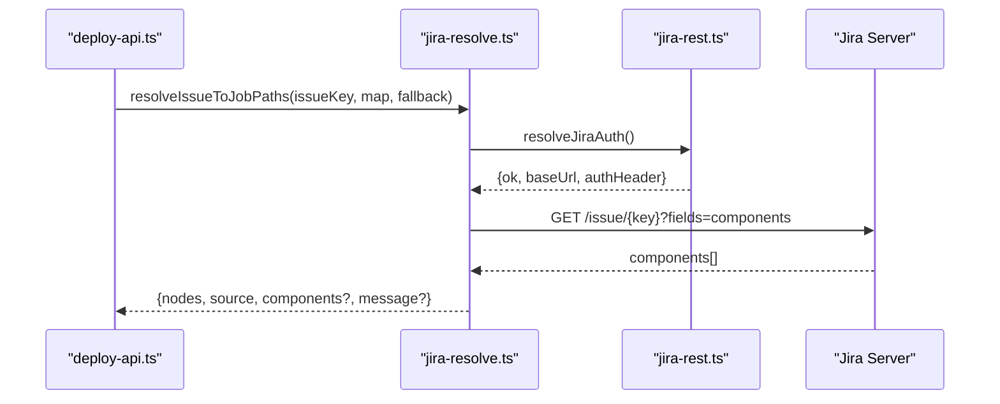
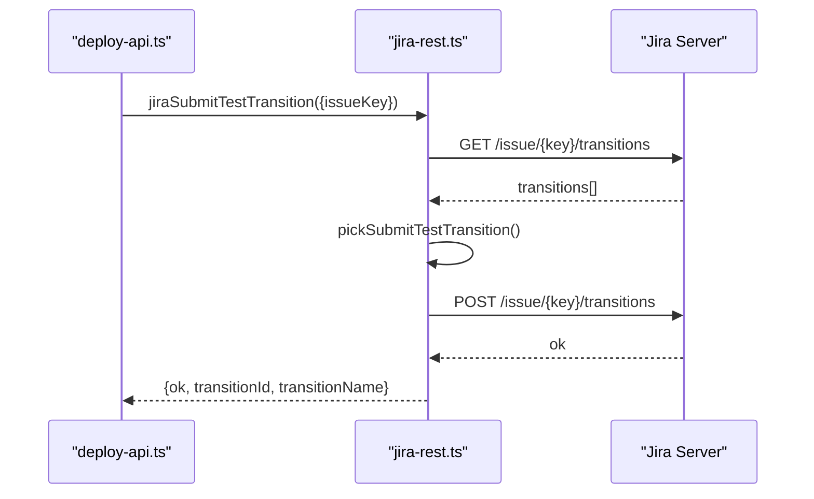
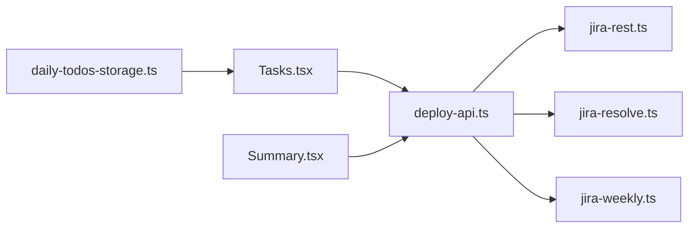

# Jira Integration

<cite>
**Referenced Files in This Document**
- [jira-rest.ts](file://server/jira-rest.ts)
- [jira-resolve.ts](file://server/jira-resolve.ts)
- [jira-weekly.ts](file://server/jira-weekly.ts)
- [deploy-api.ts](file://server/deploy-api.ts)
- [Tasks.tsx](file://src/pages/Tasks.tsx)
- [daily-todos-storage.ts](file://src/lib/daily-todos-storage.ts)
- [Summary.tsx](file://src/pages/Summary.tsx)
</cite>

## Table of Contents
1. [Introduction](#introduction)
2. [Project Structure](#project-structure)
3. [Core Components](#core-components)
4. [Architecture Overview](#architecture-overview)
5. [Detailed Component Analysis](#detailed-component-analysis)
6. [Dependency Analysis](#dependency-analysis)
7. [Performance Considerations](#performance-considerations)
8. [Troubleshooting Guide](#troubleshooting-guide)
9. [Conclusion](#conclusion)

## Introduction
This document explains the Jira integration within the task management system. It covers how Jira issue keys are extracted from task descriptions using regex and bracket notation, how the system validates Jira server configuration and retrieves server URLs for task linking, how dynamic links are generated with proper URL encoding, and how weekly report automation creates Friday tasks referencing team weekly reports. It also documents the Jira API integration for status checks and search, and outlines fallback behavior when Jira is not configured.

## Project Structure
The Jira integration spans both the frontend and backend:
- Frontend renders tasks, detects Jira keys, and generates clickable links.
- Backend exposes REST endpoints for status, search, weekly summaries, and workflow transitions.
- Shared utilities parse date ranges and build weekly markdown.

**Diagram sources**
- [deploy-api.ts:1165-1283](file://server/deploy-api.ts#L1165-L1283)
- [jira-rest.ts:34-85](file://server/jira-rest.ts#L34-L85)
- [jira-resolve.ts:47-129](file://server/jira-resolve.ts#L47-L129)
- [jira-weekly.ts:38-112](file://server/jira-weekly.ts#L38-L112)
- [Tasks.tsx:136-201](file://src/pages/Tasks.tsx#L136-L201)
- [Summary.tsx:135-251](file://src/pages/Summary.tsx#L135-L251)
- [daily-todos-storage.ts:58-100](file://src/lib/daily-todos-storage.ts#L58-L100)

**Section sources**
- [deploy-api.ts:1165-1283](file://server/deploy-api.ts#L1165-L1283)
- [jira-rest.ts:34-85](file://server/jira-rest.ts#L34-L85)
- [jira-resolve.ts:47-129](file://server/jira-resolve.ts#L47-L129)
- [jira-weekly.ts:38-112](file://server/jira-weekly.ts#L38-L112)
- [Tasks.tsx:136-201](file://src/pages/Tasks.tsx#L136-L201)
- [Summary.tsx:135-251](file://src/pages/Summary.tsx#L135-L251)
- [daily-todos-storage.ts:58-100](file://src/lib/daily-todos-storage.ts#L58-L100)

## Core Components
- Jira authentication and search utilities
- Jira status endpoint and weekly report generator
- Frontend task rendering with Jira key detection and link generation
- Daily todos persistence supporting jiraKey and bracket notation

**Section sources**
- [jira-rest.ts:34-85](file://server/jira-rest.ts#L34-L85)
- [jira-rest.ts:181-278](file://server/jira-rest.ts#L181-L278)
- [deploy-api.ts:1165-1283](file://server/deploy-api.ts#L1165-L1283)
- [jira-weekly.ts:38-112](file://server/jira-weekly.ts#L38-L112)
- [Tasks.tsx:66-134](file://src/pages/Tasks.tsx#L66-L134)
- [daily-todos-storage.ts:58-100](file://src/lib/daily-todos-storage.ts#L58-L100)

## Architecture Overview
The integration consists of:
- Authentication: Environment-driven configuration normalization and Basic auth header construction.
- Status: Exposes whether Jira is configured and the server URL.
- Search: Executes JQL queries against Jira REST API with robust fallbacks.
- Weekly Reports: Builds natural week ranges and markdown summaries.
- Frontend Linking: Detects keys from explicit fields or bracket notation and opens browser links.

**Diagram sources**
- [deploy-api.ts:1165-1202](file://server/deploy-api.ts#L1165-L1202)
- [jira-rest.ts:34-85](file://server/jira-rest.ts#L34-L85)
- [jira-rest.ts:181-278](file://server/jira-rest.ts#L181-L278)

## Detailed Component Analysis

### Jira Authentication and Search
- Authentication normalization ensures clean URL, API prefix, and credentials.
- Returns either a successful config with an Authorization header or a detailed reason for failure.
- Search executes JQL with configurable fields and maxResults, with automatic fallback from rest/api/3 to rest/api/2 when appropriate.

**Diagram sources**
- [jira-rest.ts:34-85](file://server/jira-rest.ts#L34-L85)
- [jira-rest.ts:181-278](file://server/jira-rest.ts#L181-L278)

**Section sources**
- [jira-rest.ts:34-85](file://server/jira-rest.ts#L34-L85)
- [jira-rest.ts:181-278](file://server/jira-rest.ts#L181-L278)

### Jira Status Checking and Dynamic Link Generation
- Status endpoint returns configured flag, mode, and server URL.
- Frontend fetches status and stores server URL for generating browse links.
- Link generation encodes the issue key and opens the browser to the Jira issue page.

**Diagram sources**
- [deploy-api.ts:1165-1179](file://server/deploy-api.ts#L1165-L1179)
- [Tasks.tsx:60-64](file://src/pages/Tasks.tsx#L60-L64)
- [Tasks.tsx:136-201](file://src/pages/Tasks.tsx#L136-L201)

**Section sources**
- [deploy-api.ts:1165-1179](file://server/deploy-api.ts#L1165-L1179)
- [Tasks.tsx:60-64](file://src/pages/Tasks.tsx#L60-L64)
- [Tasks.tsx:136-201](file://src/pages/Tasks.tsx#L136-L201)

### Automatic Jira Key Extraction from Task Text
- Supports two sources:
  - Explicit jiraKey field on the task item.
  - Bracket notation at the start of the task text: [PROJECT-123].
- The resolver prioritizes the explicit field; otherwise parses the bracket notation.
- If a key is found and a server URL exists, the task body is rendered as a clickable link.

**Diagram sources**
- [Tasks.tsx:66-134](file://src/pages/Tasks.tsx#L66-L134)

**Section sources**
- [Tasks.tsx:66-134](file://src/pages/Tasks.tsx#L66-L134)

### Weekly Report Automation
- On Fridays, the system automatically adds a “write weekly report” task to the day’s todo list if none exists.
- The default text is standardized and deduplicated across the day.
- Weekly report generation builds a markdown summary for the selected week offset.

**Diagram sources**
- [Tasks.tsx:157-172](file://src/pages/Tasks.tsx#L157-L172)
- [daily-todos-storage.ts:7-8](file://src/lib/daily-todos-storage.ts#L7-L8)

**Section sources**
- [Tasks.tsx:157-172](file://src/pages/Tasks.tsx#L157-L172)
- [daily-todos-storage.ts:7-8](file://src/lib/daily-todos-storage.ts#L7-L8)

### Weekly Report JQL and Markdown
- Computes natural week boundaries and formats JQL for “my open issues” and “issues touched this week.”
- Generates a markdown summary grouped by status and includes metadata for each issue.

**Diagram sources**
- [jira-weekly.ts:38-112](file://server/jira-weekly.ts#L38-L112)

**Section sources**
- [jira-weekly.ts:38-112](file://server/jira-weekly.ts#L38-L112)

### Jira API Integration for Issue Resolution Mapping
- Resolves an issue to suggested job path segments using component mapping and fallback nodes.
- Falls back to defaults when credentials are missing or the API returns non-OK responses.

**Diagram sources**
- [deploy-api.ts:1285-1303](file://server/deploy-api.ts#L1285-L1303)
- [jira-resolve.ts:47-129](file://server/jira-resolve.ts#L47-L129)
- [jira-rest.ts:34-85](file://server/jira-rest.ts#L34-L85)

**Section sources**
- [deploy-api.ts:1285-1303](file://server/deploy-api.ts#L1285-L1303)
- [jira-resolve.ts:47-129](file://server/jira-resolve.ts#L47-L129)

### Jira Submit Test Transition
- Retrieves available transitions and selects a suitable “submit for test” transition by ID or name matching.
- Executes the transition and retries with rest/api/2 if needed.

**Diagram sources**
- [deploy-api.ts:1204-1234](file://server/deploy-api.ts#L1204-L1234)
- [jira-rest.ts:282-482](file://server/jira-rest.ts#L282-L482)

**Section sources**
- [deploy-api.ts:1204-1234](file://server/deploy-api.ts#L1204-L1234)
- [jira-rest.ts:282-482](file://server/jira-rest.ts#L282-L482)

## Dependency Analysis
- Frontend depends on:
  - Status endpoint for Jira configuration and server URL.
  - Local storage for persisted tasks and keys.
- Backend depends on:
  - Environment variables for authentication and API path prefix.
  - Jira REST API for search, transitions, and issue resolution.

**Diagram sources**
- [Tasks.tsx:136-201](file://src/pages/Tasks.tsx#L136-L201)
- [Summary.tsx:135-251](file://src/pages/Summary.tsx#L135-L251)
- [deploy-api.ts:1165-1283](file://server/deploy-api.ts#L1165-L1283)
- [jira-rest.ts:34-85](file://server/jira-rest.ts#L34-L85)
- [jira-resolve.ts:47-129](file://server/jira-resolve.ts#L47-L129)
- [jira-weekly.ts:38-112](file://server/jira-weekly.ts#L38-L112)
- [daily-todos-storage.ts:58-100](file://src/lib/daily-todos-storage.ts#L58-L100)

**Section sources**
- [Tasks.tsx:136-201](file://src/pages/Tasks.tsx#L136-L201)
- [Summary.tsx:135-251](file://src/pages/Summary.tsx#L135-L251)
- [deploy-api.ts:1165-1283](file://server/deploy-api.ts#L1165-L1283)
- [jira-rest.ts:34-85](file://server/jira-rest.ts#L34-L85)
- [jira-resolve.ts:47-129](file://server/jira-resolve.ts#L47-L129)
- [jira-weekly.ts:38-112](file://server/jira-weekly.ts#L38-L112)
- [daily-todos-storage.ts:58-100](file://src/lib/daily-todos-storage.ts#L58-L100)

## Performance Considerations
- Search results are capped to a reasonable maxResults to limit payload size.
- Automatic fallback from rest/api/3 to rest/api/2 reduces repeated failures for older Jira Server instances.
- Frontend link generation is client-side and lightweight, relying on pre-fetched server URL.

## Troubleshooting Guide
Common scenarios and behaviors:
- Missing or invalid Jira configuration:
  - Status endpoint returns configured=false with a reason detailing missing environment variables or malformed values.
  - Frontend falls back to rendering task text as plain text without links.
- Authentication failures:
  - jiraSearch detects HTML responses and returns actionable hints for 401/403, including suggestions for API tokens and correct prefixes.
- API path mismatches:
  - Automatic retry from rest/api/3 to rest/api/2 when encountering 404/410 and no user-specified prefix.
- Connectivity issues:
  - Summary page distinguishes deployment API connectivity errors from Jira-specific errors and surfaces hints.

**Section sources**
- [deploy-api.ts:1165-1179](file://server/deploy-api.ts#L1165-L1179)
- [jira-rest.ts:106-148](file://server/jira-rest.ts#L106-L148)
- [jira-rest.ts:223-242](file://server/jira-rest.ts#L223-L242)
- [Summary.tsx:135-171](file://src/pages/Summary.tsx#L135-L171)

## Conclusion
The Jira integration provides seamless task-to-issue linking, automated weekly report creation on Fridays, and robust Jira API interactions with clear fallbacks and error messaging. When Jira is not configured, the system gracefully degrades to plain text rendering while preserving all task data and functionality.