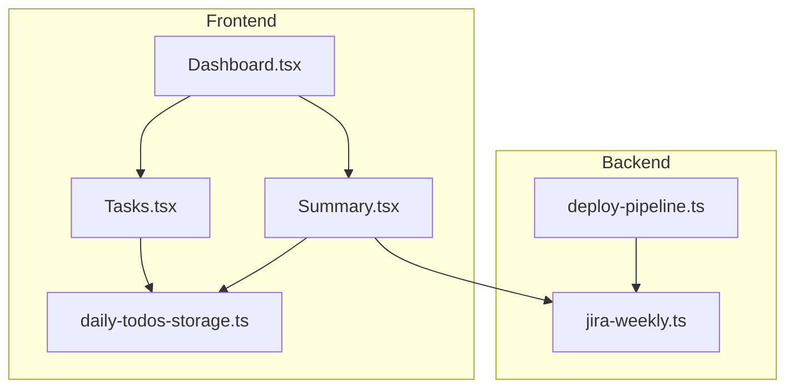
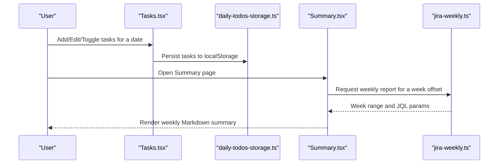
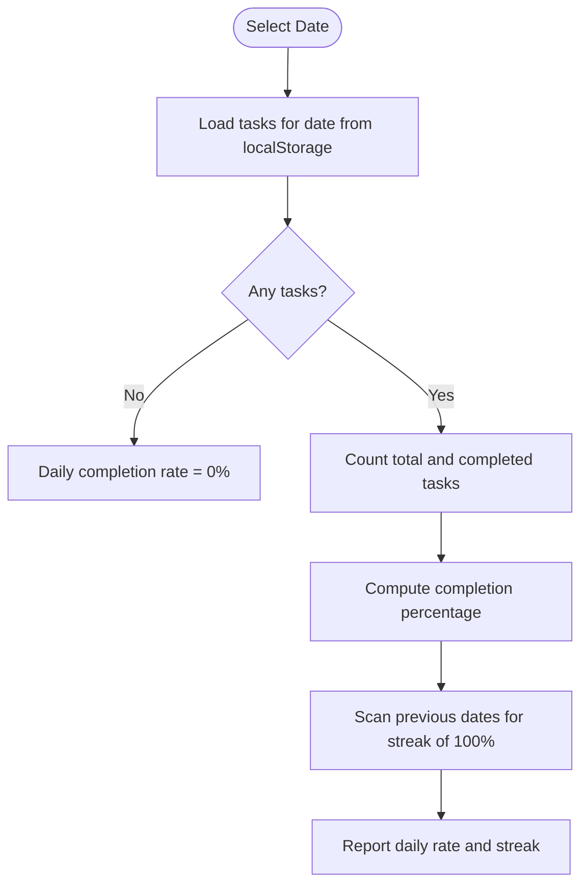
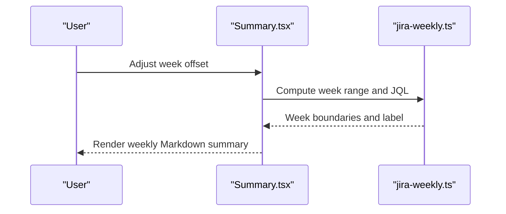
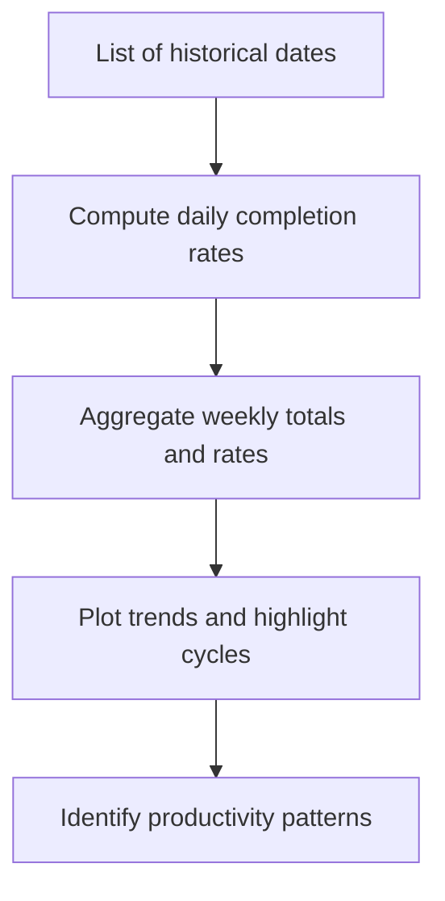
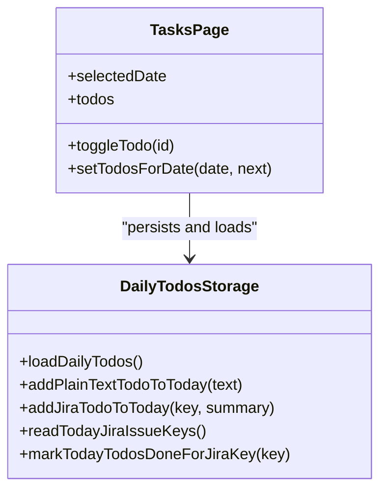
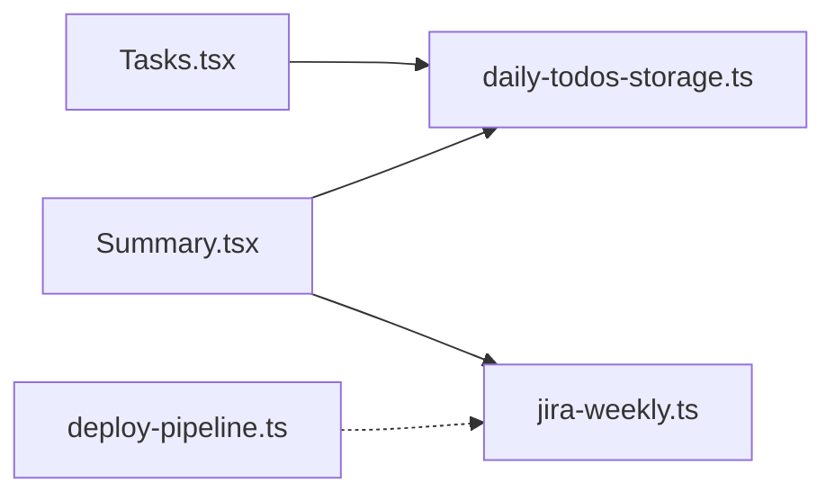

# Progress Monitoring

<cite>
**Referenced Files in This Document**
- [Dashboard.tsx](file://src/pages/Dashboard.tsx)
- [Tasks.tsx](file://src/pages/Tasks.tsx)
- [Summary.tsx](file://src/pages/Summary.tsx)
- [daily-todos-storage.ts](file://src/lib/daily-todos-storage.ts)
- [jira-weekly.ts](file://server/jira-weekly.ts)
- [deploy-pipeline.ts](file://server/deploy-pipeline.ts)
- [README.md](file://README.md)
</cite>

## Table of Contents
1. [Introduction](#introduction)
2. [Project Structure](#project-structure)
3. [Core Components](#core-components)
4. [Architecture Overview](#architecture-overview)
5. [Detailed Component Analysis](#detailed-component-analysis)
6. [Dependency Analysis](#dependency-analysis)
7. [Performance Considerations](#performance-considerations)
8. [Troubleshooting Guide](#troubleshooting-guide)
9. [Conclusion](#conclusion)
10. [Appendices](#appendices)

## Introduction
This document explains the progress monitoring and reporting system centered around daily task tracking and Jira integration. It covers how the application monitors task completion across days, aggregates completion statistics, and surfaces dashboards and reports for daily completion rates, weekly productivity summaries, and long-term trend analysis. It also documents the data storage model, calculation algorithms for completion percentages and streaks, and the integration with the daily todo tracking system to provide aggregated views across multiple dates.

## Project Structure
The progress monitoring system spans three primary areas:
- Frontend pages for task management and reporting
- Local storage for daily todo persistence
- Backend utilities for date-range calculations and pipeline statistics

**Diagram sources**
- [Dashboard.tsx:1-114](file://src/pages/Dashboard.tsx#L1-L114)
- [Tasks.tsx:1-542](file://src/pages/Tasks.tsx#L1-L542)
- [Summary.tsx:1-653](file://src/pages/Summary.tsx#L1-L653)
- [daily-todos-storage.ts:1-133](file://src/lib/daily-todos-storage.ts#L1-L133)
- [jira-weekly.ts:1-113](file://server/jira-weekly.ts#L1-L113)
- [deploy-pipeline.ts:92-137](file://server/deploy-pipeline.ts#L92-L137)

**Section sources**
- [Dashboard.tsx:1-114](file://src/pages/Dashboard.tsx#L1-L114)
- [Tasks.tsx:1-542](file://src/pages/Tasks.tsx#L1-L542)
- [Summary.tsx:1-653](file://src/pages/Summary.tsx#L1-L653)
- [daily-todos-storage.ts:1-133](file://src/lib/daily-todos-storage.ts#L1-L133)
- [jira-weekly.ts:1-113](file://server/jira-weekly.ts#L1-L113)
- [deploy-pipeline.ts:92-137](file://server/deploy-pipeline.ts#L92-L137)
- [README.md:1-91](file://README.md#L1-L91)

## Core Components
- Daily Todo Storage: Provides local persistence for daily tasks with helpers to add, deduplicate, and mark tasks as done. See [daily-todos-storage.ts:1-133](file://src/lib/daily-todos-storage.ts#L1-L133).
- Task Management Page: Renders daily lists, supports editing, reordering, and toggling completion. See [Tasks.tsx:1-542](file://src/pages/Tasks.tsx#L1-L542).
- Summary and Weekly Report: Loads Jira status, pulls open issues, and generates weekly Markdown summaries. See [Summary.tsx:1-653](file://src/pages/Summary.tsx#L1-L653).
- Date Range Utilities: Calculates natural week boundaries and builds JQL queries for weekly reports. See [jira-weekly.ts:1-113](file://server/jira-weekly.ts#L1-L113).
- Pipeline Statistics: Tracks deployment pipeline task usage counts and timestamps. See [deploy-pipeline.ts:92-137](file://server/deploy-pipeline.ts#L92-L137).

**Section sources**
- [daily-todos-storage.ts:1-133](file://src/lib/daily-todos-storage.ts#L1-L133)
- [Tasks.tsx:1-542](file://src/pages/Tasks.tsx#L1-L542)
- [Summary.tsx:1-653](file://src/pages/Summary.tsx#L1-L653)
- [jira-weekly.ts:1-113](file://server/jira-weekly.ts#L1-L113)
- [deploy-pipeline.ts:92-137](file://server/deploy-pipeline.ts#L92-L137)

## Architecture Overview
The system integrates local daily todos with optional Jira connectivity to produce progress insights. The Tasks page reads from local storage, while the Summary page optionally connects to Jira via a backend proxy to generate weekly summaries. Date-range logic ensures consistent weekly boundaries aligned to local time.

**Diagram sources**
- [Tasks.tsx:136-210](file://src/pages/Tasks.tsx#L136-L210)
- [daily-todos-storage.ts:44-56](file://src/lib/daily-todos-storage.ts#L44-L56)
- [Summary.tsx:209-251](file://src/pages/Summary.tsx#L209-L251)
- [jira-weekly.ts:3-29](file://server/jira-weekly.ts#L3-L29)

## Detailed Component Analysis

### Daily Todo Tracking and Completion Calculation
The daily todo system persists tasks per ISO date and exposes helpers to:
- Load all saved dates and normalize ordering (incomplete first).
- Add plain-text or Jira-linked tasks for today.
- Deduplicate entries by trimming and full-text match for plain tasks, and by Jira key for Jira-linked tasks.
- Mark tasks as done and return counts for batch updates.

Completion metrics derived from this model:
- Daily completion rate: completed / total for a selected date.
- Streaks: longest consecutive days with 100% completion, computed by scanning recent dates sorted descending by date.
- Pending workload: total incomplete tasks across selected dates.

**Diagram sources**
- [daily-todos-storage.ts:44-56](file://src/lib/daily-todos-storage.ts#L44-L56)
- [Tasks.tsx:212-228](file://src/pages/Tasks.tsx#L212-L228)

**Section sources**
- [daily-todos-storage.ts:44-133](file://src/lib/daily-todos-storage.ts#L44-L133)
- [Tasks.tsx:136-210](file://src/pages/Tasks.tsx#L136-L210)

### Summary Dashboard and Weekly Productivity
The Summary page provides:
- Jira connection status and refresh controls.
- Open issues list with “in today’s todo” indicators.
- Weekly report generation with a configurable week offset, rendering Markdown summaries grouped by status.

Weekly productivity insights:
- Total issues touched in the week.
- Status breakdown.
- Per-issue details for quick review.

**Diagram sources**
- [Summary.tsx:209-251](file://src/pages/Summary.tsx#L209-L251)
- [jira-weekly.ts:3-29](file://server/jira-weekly.ts#L3-L29)

**Section sources**
- [Summary.tsx:1-653](file://src/pages/Summary.tsx#L1-L653)
- [jira-weekly.ts:1-113](file://server/jira-weekly.ts#L1-L113)

### Historical Data Visualization and Trend Analysis
Historical views:
- Tasks page maintains a sidebar of past dates with counts of incomplete tasks.
- Users can navigate across dates to observe completion trends visually.

Aggregated insights:
- Long-term trend analysis: compute weekly completion rates by aggregating daily completion percentages across multiple weeks.
- Overdue/pending identification: leverage Jira open issues and pending tasks from daily todos.

**Diagram sources**
- [Tasks.tsx:214-218](file://src/pages/Tasks.tsx#L214-L218)
- [daily-todos-storage.ts:113-133](file://src/lib/daily-todos-storage.ts#L113-L133)

**Section sources**
- [Tasks.tsx:214-218](file://src/pages/Tasks.tsx#L214-L218)
- [daily-todos-storage.ts:113-133](file://src/lib/daily-todos-storage.ts#L113-L133)

### Reporting Features
Reporting capabilities include:
- Daily completion rates per date.
- Weekly productivity scores derived from Jira updates and daily completion.
- Long-term trend analysis across multiple weeks.
- Overdue and pending work identification using Jira open issues and daily todo counts.

These outputs are surfaced via:
- The Tasks page for daily and historical views.
- The Summary page for weekly Markdown reports.

**Section sources**
- [Summary.tsx:209-251](file://src/pages/Summary.tsx#L209-L251)
- [Tasks.tsx:214-218](file://src/pages/Tasks.tsx#L214-L218)

### Integration with Daily Todo Tracking
The Tasks page and daily-todos-storage form the backbone of progress tracking:
- Unified storage key for both manual entries and Jira-linked entries.
- Automatic insertion of weekly report tasks on Fridays.
- Real-time persistence on edits and toggles.

**Diagram sources**
- [daily-todos-storage.ts:44-133](file://src/lib/daily-todos-storage.ts#L44-L133)
- [Tasks.tsx:136-210](file://src/pages/Tasks.tsx#L136-L210)

**Section sources**
- [daily-todos-storage.ts:1-133](file://src/lib/daily-todos-storage.ts#L1-L133)
- [Tasks.tsx:136-210](file://src/pages/Tasks.tsx#L136-L210)

## Dependency Analysis
- Tasks.tsx depends on daily-todos-storage.ts for persistence and on Jira status endpoint for linking tasks to Jira issues.
- Summary.tsx depends on jira-weekly.ts for week boundary computation and on Jira endpoints for open issues and weekly summaries.
- deploy-pipeline.ts provides auxiliary statistics unrelated to daily tasks but useful for operational insights.

**Diagram sources**
- [Tasks.tsx:1-542](file://src/pages/Tasks.tsx#L1-L542)
- [daily-todos-storage.ts:1-133](file://src/lib/daily-todos-storage.ts#L1-L133)
- [Summary.tsx:1-653](file://src/pages/Summary.tsx#L1-L653)
- [jira-weekly.ts:1-113](file://server/jira-weekly.ts#L1-L113)
- [deploy-pipeline.ts:92-137](file://server/deploy-pipeline.ts#L92-L137)

**Section sources**
- [Tasks.tsx:1-542](file://src/pages/Tasks.tsx#L1-L542)
- [Summary.tsx:1-653](file://src/pages/Summary.tsx#L1-L653)
- [daily-todos-storage.ts:1-133](file://src/lib/daily-todos-storage.ts#L1-L133)
- [jira-weekly.ts:1-113](file://server/jira-weekly.ts#L1-L113)
- [deploy-pipeline.ts:92-137](file://server/deploy-pipeline.ts#L92-L137)

## Performance Considerations
- Local storage operations are synchronous; keep daily todo lists reasonably sized to avoid large JSON payloads.
- Sorting and filtering of historical dates occur client-side; limit the number of stored dates to maintain responsiveness.
- Weekly report generation relies on Jira APIs; handle network latency and errors gracefully with loading states and retry prompts.

## Troubleshooting Guide
Common issues and resolutions:
- Jira configuration errors: The Summary page distinguishes between connectivity errors and missing credentials, guiding users to check environment variables and API base URLs.
- Empty or corrupted storage: The daily-todos-storage module sanitizes empty dates and parses storage defensively.
- Streak calculation anomalies: Ensure dates are contiguous and that 100% completion is consistently recorded for accurate streak detection.

**Section sources**
- [Summary.tsx:135-172](file://src/pages/Summary.tsx#L135-L172)
- [daily-todos-storage.ts:27-56](file://src/lib/daily-todos-storage.ts#L27-L56)

## Conclusion
The progress monitoring system combines a robust daily todo tracker with optional Jira integration to deliver actionable insights. Users can track daily completion rates, identify streaks, and analyze weekly productivity trends. The architecture cleanly separates concerns between local persistence, UI rendering, and backend utilities, enabling maintainable enhancements and extensions.

## Appendices

### Example Metrics and How to Derive Them
- Daily completion rate: completed_tasks / total_tasks for a selected date.
- Weekly productivity score: weighted average of daily completion rates within the week boundary.
- Long-term trend: compute weekly completion rates across N recent weeks and plot over time.
- Overdue/pending work: union of Jira open issues and incomplete daily todos.

[No sources needed since this section provides general guidance]