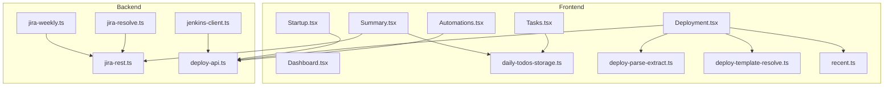
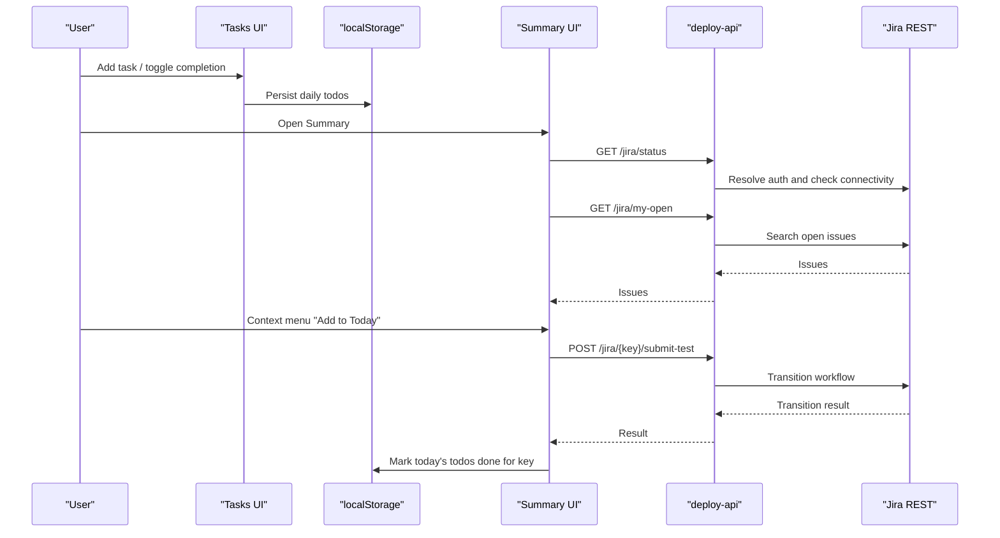
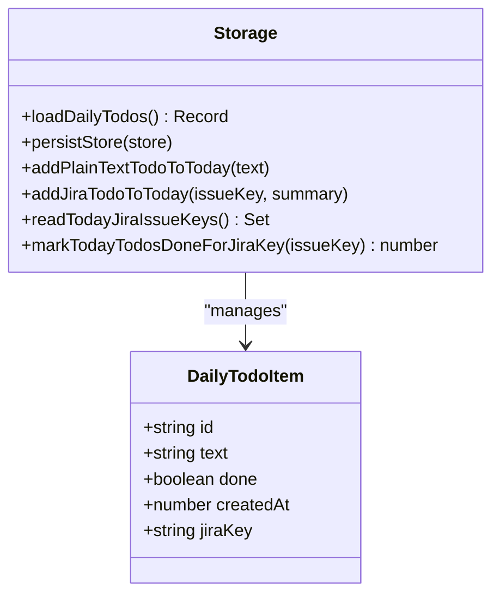
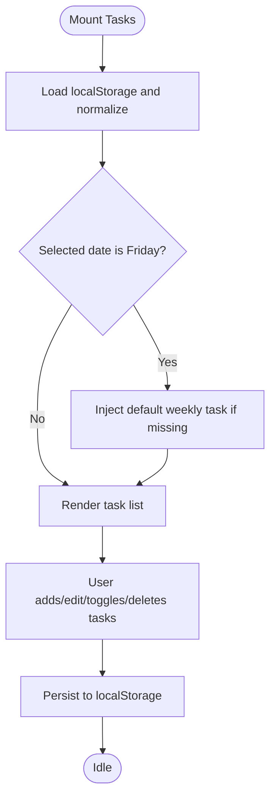
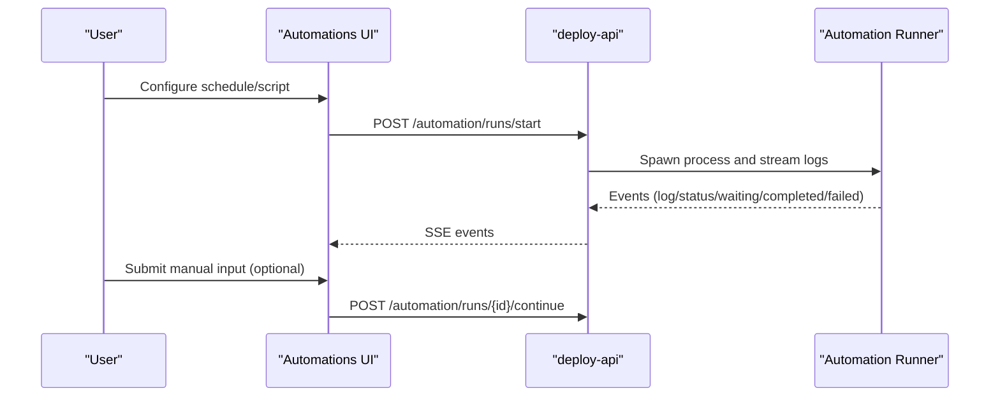
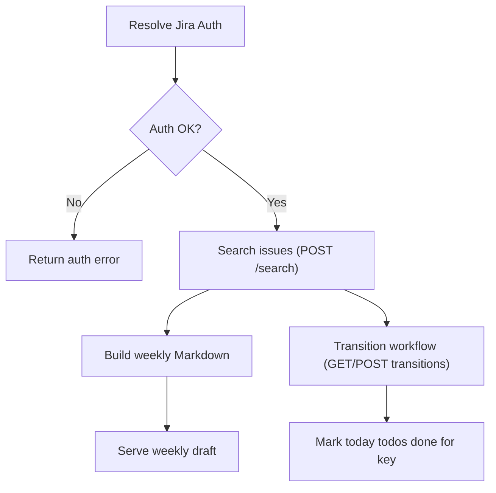
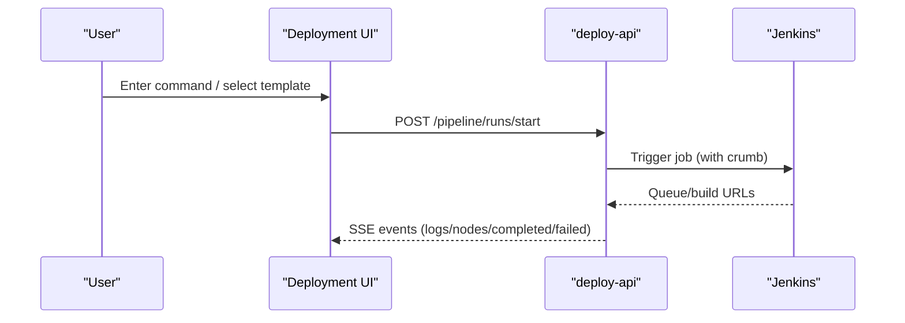
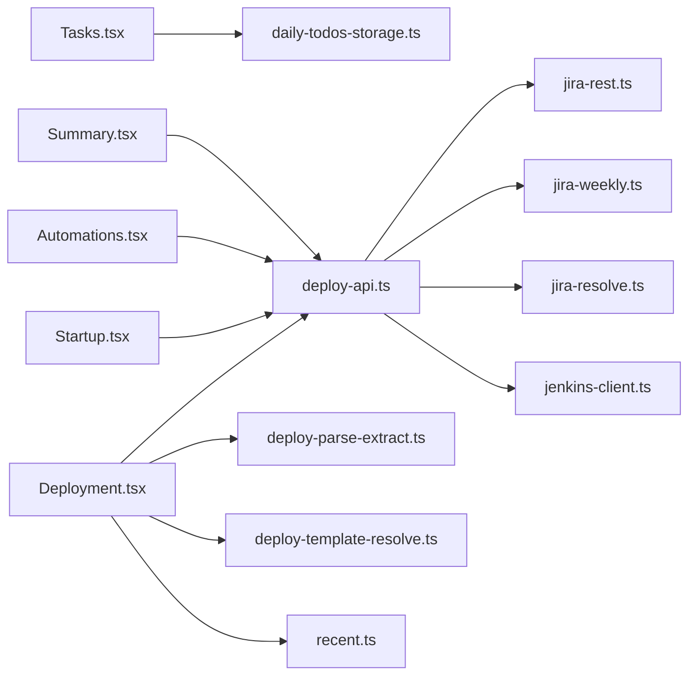

# Task Management System

<cite>
**Referenced Files in This Document**
- [daily-todos-storage.ts](file://src/lib/daily-todos-storage.ts)
- [Tasks.tsx](file://src/pages/Tasks.tsx)
- [Automations.tsx](file://src/pages/Automations.tsx)
- [jira-rest.ts](file://server/jira-rest.ts)
- [jira-weekly.ts](file://server/jira-weekly.ts)
- [jira-resolve.ts](file://server/jira-resolve.ts)
- [deploy-api.ts](file://server/deploy-api.ts)
- [jenkins-client.ts](file://server/jenkins-client.ts)
- [Deployment.tsx](file://src/pages/Deployment.tsx)
- [Startup.tsx](file://src/pages/Startup.tsx)
- [Summary.tsx](file://src/pages/Summary.tsx)
- [Dashboard.tsx](file://src/pages/Dashboard.tsx)
- [deploy-parse-extract.ts](file://src/lib/float-command/deploy-parse-extract.ts)
- [deploy-template-resolve.ts](file://src/lib/float-command/deploy-template-resolve.ts)
- [recent.ts](file://src/lib/float-command/recent.ts)
</cite>

## Table of Contents
1. [Introduction](#introduction)
2. [Project Structure](#project-structure)
3. [Core Components](#core-components)
4. [Architecture Overview](#architecture-overview)
5. [Detailed Component Analysis](#detailed-component-analysis)
6. [Dependency Analysis](#dependency-analysis)
7. [Performance Considerations](#performance-considerations)
8. [Troubleshooting Guide](#troubleshooting-guide)
9. [Conclusion](#conclusion)
10. [Appendices](#appendices)

## Introduction
This document explains the task management system, focusing on:
- Daily todo tracking with local persistence and Jira integration
- Automation scheduling and execution with a local timer and server-side orchestration
- Jira integration for task synchronization, status updates, and weekly report generation
- Task completion tracking, progress monitoring, and reporting
- UI components for task lists, completion indicators, and automation controls
- Storage abstraction and persistence strategies
- Task categorization, priority management, and filtering
- Integration with deployment automation and startup coordination

## Project Structure
The system spans a React frontend and a Node.js backend service:
- Frontend pages: Tasks, Automations, Deployment, Startup, Summary, Dashboard
- Backend APIs: Jira REST, weekly report builder, Jenkins client, automation scheduler, deployment pipeline
- Shared libraries: daily todos storage, deployment command parsing and templating, recent usage tracking

**Diagram sources**
- [Tasks.tsx:136-542](file://src/pages/Tasks.tsx#L136-L542)
- [Automations.tsx:109-661](file://src/pages/Automations.tsx#L109-L661)
- [Deployment.tsx:88-1068](file://src/pages/Deployment.tsx#L88-L1068)
- [Startup.tsx:126-661](file://src/pages/Startup.tsx#L126-L661)
- [Summary.tsx:49-653](file://src/pages/Summary.tsx#L49-L653)
- [daily-todos-storage.ts:1-133](file://src/lib/daily-todos-storage.ts#L1-L133)
- [deploy-parse-extract.ts:1-11](file://src/lib/float-command/deploy-parse-extract.ts#L1-L11)
- [deploy-template-resolve.ts:1-91](file://src/lib/float-command/deploy-template-resolve.ts#L1-L91)
- [recent.ts:1-84](file://src/lib/float-command/recent.ts#L1-L84)
- [jira-rest.ts:1-483](file://server/jira-rest.ts#L1-L483)
- [jira-weekly.ts:1-113](file://server/jira-weekly.ts#L1-L113)
- [jira-resolve.ts:1-130](file://server/jira-resolve.ts#L1-L130)
- [jenkins-client.ts:1-191](file://server/jenkins-client.ts#L1-L191)
- [deploy-api.ts:1-800](file://server/deploy-api.ts#L1-L800)

**Section sources**
- [Tasks.tsx:136-542](file://src/pages/Tasks.tsx#L136-L542)
- [Automations.tsx:109-661](file://src/pages/Automations.tsx#L109-L661)
- [Deployment.tsx:88-1068](file://src/pages/Deployment.tsx#L88-L1068)
- [Startup.tsx:126-661](file://src/pages/Startup.tsx#L126-L661)
- [Summary.tsx:49-653](file://src/pages/Summary.tsx#L49-L653)
- [daily-todos-storage.ts:1-133](file://src/lib/daily-todos-storage.ts#L1-L133)
- [jira-rest.ts:1-483](file://server/jira-rest.ts#L1-L483)
- [jira-weekly.ts:1-113](file://server/jira-weekly.ts#L1-L113)
- [jira-resolve.ts:1-130](file://server/jira-resolve.ts#L1-L130)
- [jenkins-client.ts:1-191](file://server/jenkins-client.ts#L1-L191)
- [deploy-api.ts:1-800](file://server/deploy-api.ts#L1-L800)

## Core Components
- Daily Todos Storage: Local-first persistence for daily tasks with deduplication and Jira-key association
- Tasks Page: Interactive UI for adding, editing, reordering, completing, and deleting tasks per date
- Automations Page: Scheduling, editing, and running automation tasks with a local timer and server-side orchestration
- Jira Integration: Authentication resolution, search, weekly report generation, and workflow transitions
- Deployment and Startup: Orchestration of Jenkins jobs and local development environments with persistent logs and templates
- Summary Page: Jira status, open issues, weekly report draft, and “add to today” actions

**Section sources**
- [daily-todos-storage.ts:1-133](file://src/lib/daily-todos-storage.ts#L1-L133)
- [Tasks.tsx:136-542](file://src/pages/Tasks.tsx#L136-L542)
- [Automations.tsx:109-661](file://src/pages/Automations.tsx#L109-L661)
- [jira-rest.ts:1-483](file://server/jira-rest.ts#L1-L483)
- [jira-weekly.ts:1-113](file://server/jira-weekly.ts#L1-L113)
- [jira-resolve.ts:1-130](file://server/jira-resolve.ts#L1-L130)
- [deploy-api.ts:1-800](file://server/deploy-api.ts#L1-L800)
- [jenkins-client.ts:1-191](file://server/jenkins-client.ts#L1-L191)
- [Deployment.tsx:88-1068](file://src/pages/Deployment.tsx#L88-L1068)
- [Startup.tsx:126-661](file://src/pages/Startup.tsx#L126-L661)
- [Summary.tsx:49-653](file://src/pages/Summary.tsx#L49-L653)

## Architecture Overview
The system integrates a browser-based task manager with a Node.js service that orchestrates automation, deployment, and Jira operations. The frontend persists daily todos locally, while the backend manages schedules, Jenkins triggers, and Jira queries.

**Diagram sources**
- [Tasks.tsx:136-542](file://src/pages/Tasks.tsx#L136-L542)
- [daily-todos-storage.ts:1-133](file://src/lib/daily-todos-storage.ts#L1-L133)
- [Summary.tsx:49-653](file://src/pages/Summary.tsx#L49-L653)
- [jira-rest.ts:1-483](file://server/jira-rest.ts#L1-L483)
- [jira-resolve.ts:1-130](file://server/jira-resolve.ts#L1-L130)
- [deploy-api.ts:1-800](file://server/deploy-api.ts#L1-L800)

## Detailed Component Analysis

### Daily Todo Tracking and Persistence
- Data model: Each daily list is a date-keyed array of items with id, text, done flag, creation timestamp, and optional Jira key
- Persistence: Uses localStorage keyed by a constant; empty dates are cleaned before persisting
- Deduplication: Text-based dedupe per day; Jira key-based dedupe across days
- Jira integration: Adds tasks from Jira summaries and marks them done when a transition completes

**Diagram sources**
- [daily-todos-storage.ts:10-133](file://src/lib/daily-todos-storage.ts#L10-L133)

**Section sources**
- [daily-todos-storage.ts:1-133](file://src/lib/daily-todos-storage.ts#L1-L133)
- [Tasks.tsx:136-542](file://src/pages/Tasks.tsx#L136-L542)
- [Summary.tsx:49-653](file://src/pages/Summary.tsx#L49-L653)

### UI: Task Lists, Completion Indicators, and Controls
- Task list per selected date with drag-to-reorder, inline edit, and delete
- Completion toggles and strikethrough for done items
- Jira link rendering for items with embedded keys
- Automatic Friday “write weekly report” insertion
- Local persistence on change and hydration on mount

**Diagram sources**
- [Tasks.tsx:136-542](file://src/pages/Tasks.tsx#L136-L542)

**Section sources**
- [Tasks.tsx:136-542](file://src/pages/Tasks.tsx#L136-L542)

### Automation Scheduling and Execution
- Local scheduler: Parses daily cron-like schedules and computes next occurrence
- Run lifecycle: Running, waiting for input, completed, failed
- Manual vs scheduled triggers; SSE-based live terminal UI
- Workflow editor: Stores custom scripts and schedules in localStorage; server validates and executes

**Diagram sources**
- [Automations.tsx:109-661](file://src/pages/Automations.tsx#L109-L661)
- [deploy-api.ts:1-800](file://server/deploy-api.ts#L1-L800)

**Section sources**
- [Automations.tsx:109-661](file://src/pages/Automations.tsx#L109-L661)
- [deploy-api.ts:1-800](file://server/deploy-api.ts#L1-L800)

### Jira Integration: Synchronization and Workflows
- Authentication resolution: Reads environment variables and normalizes credentials
- Search and weekly report: Builds JQL for open and weekly touched issues; generates Markdown
- Workflow transitions: Picks transition by configured names or ID; supports fallbacks
- Summary page: Displays open issues, weekly draft, and “add to today” actions

**Diagram sources**
- [jira-rest.ts:34-85](file://server/jira-rest.ts#L34-L85)
- [jira-rest.ts:181-278](file://server/jira-rest.ts#L181-L278)
- [jira-rest.ts:357-482](file://server/jira-rest.ts#L357-L482)
- [jira-weekly.ts:67-112](file://server/jira-weekly.ts#L67-L112)
- [jira-resolve.ts:52-129](file://server/jira-resolve.ts#L52-L129)

**Section sources**
- [jira-rest.ts:1-483](file://server/jira-rest.ts#L1-L483)
- [jira-weekly.ts:1-113](file://server/jira-weekly.ts#L1-L113)
- [jira-resolve.ts:1-130](file://server/jira-resolve.ts#L1-L130)
- [Summary.tsx:49-653](file://src/pages/Summary.tsx#L49-L653)

### Deployment Automation and Startup Coordination
- Deployment pipeline: Parses commands, resolves Jira-based targets, applies templates, streams logs via SSE
- Startup orchestration: Launches IDE, syncs repos, installs dependencies, optionally opens dev terminals
- Both persist state in localStorage/sessionStorage and stream logs to the UI

**Diagram sources**
- [Deployment.tsx:88-1068](file://src/pages/Deployment.tsx#L88-L1068)
- [deploy-api.ts:1-800](file://server/deploy-api.ts#L1-L800)
- [jenkins-client.ts:89-191](file://server/jenkins-client.ts#L89-L191)

**Section sources**
- [Deployment.tsx:88-1068](file://src/pages/Deployment.tsx#L88-L1068)
- [Startup.tsx:126-661](file://src/pages/Startup.tsx#L126-L661)
- [deploy-api.ts:1-800](file://server/deploy-api.ts#L1-L800)
- [jenkins-client.ts:1-191](file://server/jenkins-client.ts#L1-L191)

### Task Completion Tracking, Progress Monitoring, and Reporting
- Completion tracking: Marks all uncompleted tasks for a given Jira key as done
- Progress monitoring: SSE-based logs and node status in deployment; automation run status
- Reporting: Weekly Markdown report generated from Jira issues touched during the week

**Section sources**
- [daily-todos-storage.ts:113-133](file://src/lib/daily-todos-storage.ts#L113-L133)
- [jira-weekly.ts:67-112](file://server/jira-weekly.ts#L67-L112)
- [Summary.tsx:49-653](file://src/pages/Summary.tsx#L49-L653)
- [Deployment.tsx:88-1068](file://src/pages/Deployment.tsx#L88-L1068)
- [Automations.tsx:109-661](file://src/pages/Automations.tsx#L109-L661)

### Storage Abstraction and Persistence Strategies
- Browser storage:
  - Daily todos: localStorage with a single key for all dates
  - Automation edits: localStorage for custom schedules/scripts
  - Deployment templates and recent usage: localStorage/sessionStorage
- Backend orchestration:
  - Automation runs tracked in-memory with optional persistence hooks
  - Deployment pipeline snapshots persisted in session storage for recovery
  - Jenkins credentials and crumb handling for secure server-side requests

**Section sources**
- [daily-todos-storage.ts:44-56](file://src/lib/daily-todos-storage.ts#L44-L56)
- [Automations.tsx:29-41](file://src/pages/Automations.tsx#L29-L41)
- [Deployment.tsx:101-114](file://src/pages/Deployment.tsx#L101-L114)
- [deploy-api.ts:122-125](file://server/deploy-api.ts#L122-L125)

### Task Categorization, Priority Management, and Filtering
- Categorization: Jira-based grouping by status, type, and project
- Priority: Jira priority included in weekly reports
- Filtering: Status-based grouping and sorting in weekly report; UI filters in automations

**Section sources**
- [jira-weekly.ts:67-112](file://server/jira-weekly.ts#L67-L112)
- [jira-rest.ts:87-104](file://server/jira-rest.ts#L87-L104)
- [Automations.tsx:167](file://src/pages/Automations.tsx#L167)

### Integration with Deployment Automation and Startup
- Deployment page integrates Jira resolution and Jenkins triggers; supports templates and favorites
- Startup page orchestrates IDE launches, repo sync, dependency installation, and dev processes; streams logs via SSE

**Section sources**
- [Deployment.tsx:88-1068](file://src/pages/Deployment.tsx#L88-L1068)
- [Startup.tsx:126-661](file://src/pages/Startup.tsx#L126-L661)
- [jira-resolve.ts:1-130](file://server/jira-resolve.ts#L1-L130)
- [jenkins-client.ts:1-191](file://server/jenkins-client.ts#L1-L191)

### Common Workflows and Configuration Options
- Daily todo workflow:
  - Add tasks manually or from Jira
  - Toggle completion; tasks auto-clean when empty
  - On Friday, inject weekly report task automatically
- Automation workflow:
  - Define schedule and script; run manually or rely on local timer
  - Monitor live terminal; submit manual input when prompted
- Jira integration workflow:
  - Configure credentials; fetch open issues; generate weekly draft
  - Add issues to today’s tasks; submit test transitions to update status and mark tasks done
- Deployment workflow:
  - Natural language or template selection; resolve targets; start pipeline; monitor logs
- Startup workflow:
  - Select profile; launch IDE and dev servers; monitor logs; stop on demand

**Section sources**
- [Tasks.tsx:136-542](file://src/pages/Tasks.tsx#L136-L542)
- [Automations.tsx:109-661](file://src/pages/Automations.tsx#L109-L661)
- [Summary.tsx:49-653](file://src/pages/Summary.tsx#L49-L653)
- [Deployment.tsx:88-1068](file://src/pages/Deployment.tsx#L88-L1068)
- [Startup.tsx:126-661](file://src/pages/Startup.tsx#L126-L661)

## Dependency Analysis
- Frontend-to-backend:
  - Tasks and Summary communicate with deploy-api endpoints for Jira status and operations
  - Automations and Deployment use deploy-api for automation and pipeline runs
- Backend-to-external systems:
  - Jira REST and weekly report builders depend on Jira credentials and endpoints
  - Jenkins client handles authentication, crumb issuance, and polling
- Internal dependencies:
  - Deployment page uses shared parsing and templating utilities
  - Startup and Deployment share SSE-based logging and run state management

**Diagram sources**
- [Tasks.tsx:136-542](file://src/pages/Tasks.tsx#L136-L542)
- [Summary.tsx:49-653](file://src/pages/Summary.tsx#L49-L653)
- [Automations.tsx:109-661](file://src/pages/Automations.tsx#L109-L661)
- [Deployment.tsx:88-1068](file://src/pages/Deployment.tsx#L88-L1068)
- [Startup.tsx:126-661](file://src/pages/Startup.tsx#L126-L661)
- [daily-todos-storage.ts:1-133](file://src/lib/daily-todos-storage.ts#L1-L133)
- [deploy-api.ts:1-800](file://server/deploy-api.ts#L1-L800)
- [jira-rest.ts:1-483](file://server/jira-rest.ts#L1-L483)
- [jira-weekly.ts:1-113](file://server/jira-weekly.ts#L1-L113)
- [jira-resolve.ts:1-130](file://server/jira-resolve.ts#L1-L130)
- [jenkins-client.ts:1-191](file://server/jenkins-client.ts#L1-L191)
- [deploy-parse-extract.ts:1-11](file://src/lib/float-command/deploy-parse-extract.ts#L1-L11)
- [deploy-template-resolve.ts:1-91](file://src/lib/float-command/deploy-template-resolve.ts#L1-L91)
- [recent.ts:1-84](file://src/lib/float-command/recent.ts#L1-L84)

**Section sources**
- [Dashboard.tsx:1-114](file://src/pages/Dashboard.tsx#L1-L114)

## Performance Considerations
- Local storage operations are synchronous and bounded by DOM constraints; batch updates and avoid frequent writes
- SSE streaming for logs and automation runs scales better than polling
- Jenkins polling intervals and timeouts are configurable to balance responsiveness and resource usage
- Template matching and recent prioritization are O(n) per query; cache results where appropriate

[No sources needed since this section provides general guidance]

## Troubleshooting Guide
- Jira configuration issues:
  - Verify environment variables and credential normalization
  - Check API path prefixes and fallbacks between REST API versions
- Automation failures:
  - Inspect SSE terminal logs; submit manual input when prompted
  - Validate schedule format and command availability
- Deployment problems:
  - Confirm Jenkins credentials, crumb access, and job permissions
  - Review pipeline logs and node statuses
- Startup issues:
  - Ensure IDE paths and commands are executable; check dependency installation and dev process logs

**Section sources**
- [jira-rest.ts:11-85](file://server/jira-rest.ts#L11-L85)
- [jira-rest.ts:106-148](file://server/jira-rest.ts#L106-L148)
- [Automations.tsx:173-234](file://src/pages/Automations.tsx#L173-L234)
- [jenkins-client.ts:71-191](file://server/jenkins-client.ts#L71-L191)
- [deploy-api.ts:598-788](file://server/deploy-api.ts#L598-L788)

## Conclusion
The task management system combines local-first persistence with robust backend orchestration to support daily task tracking, automation scheduling, and Jira-driven workflows. Its modular design enables seamless integration with deployment and startup processes, while the UI provides intuitive controls for managing tasks, automations, and reports.

[No sources needed since this section summarizes without analyzing specific files]

## Appendices
- Configuration keys and environment variables are documented in the backend modules for Jira and Jenkins integration
- Templates and recent usage are stored in localStorage for quick reuse across pages

[No sources needed since this section provides general guidance]