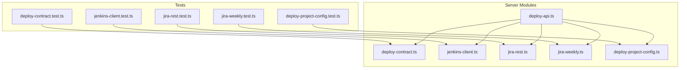
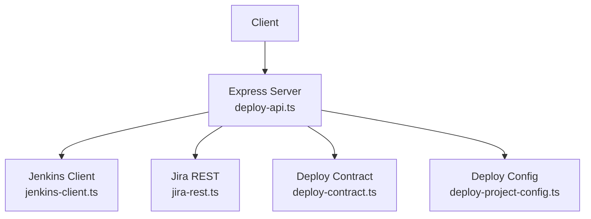
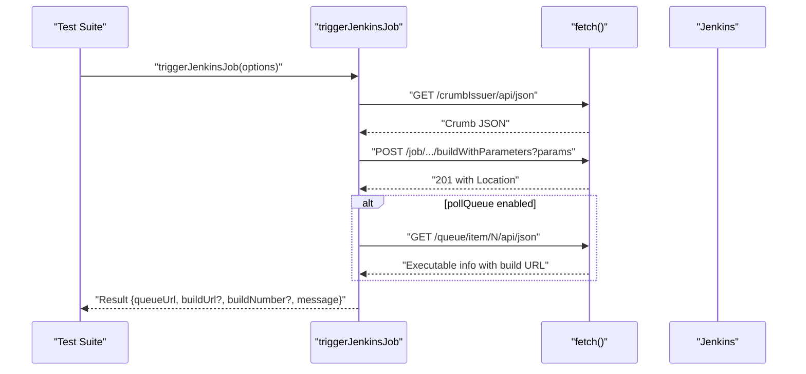
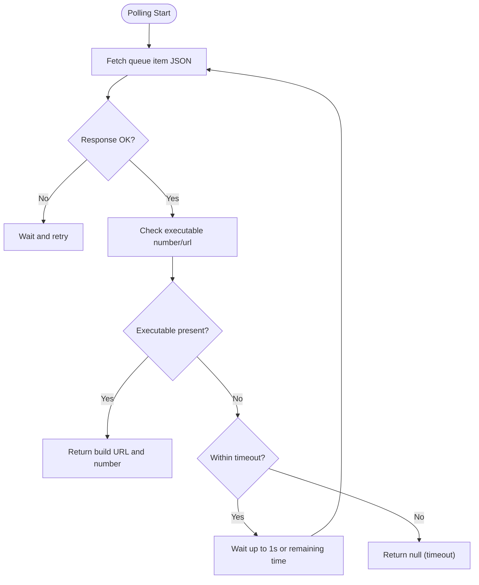
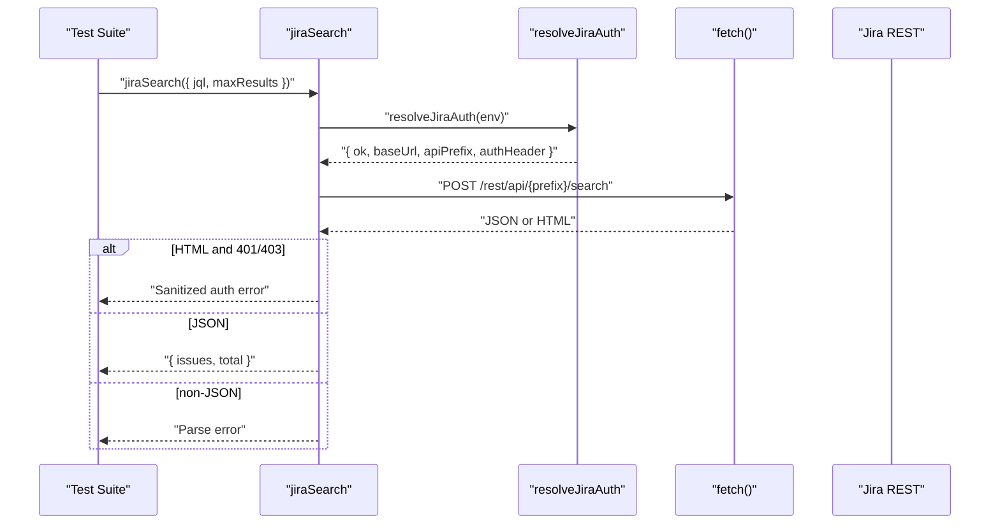
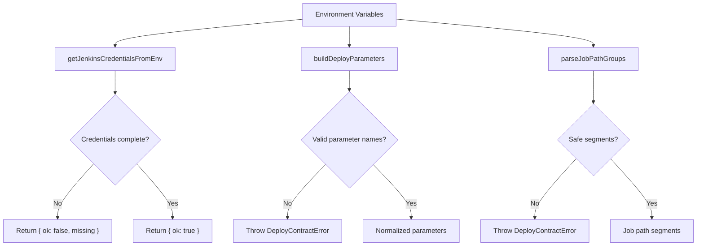
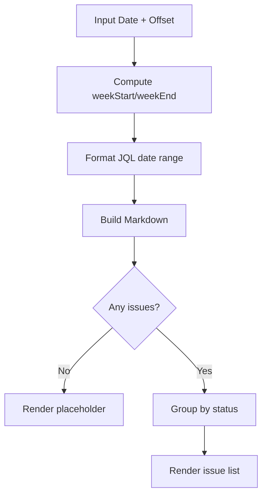
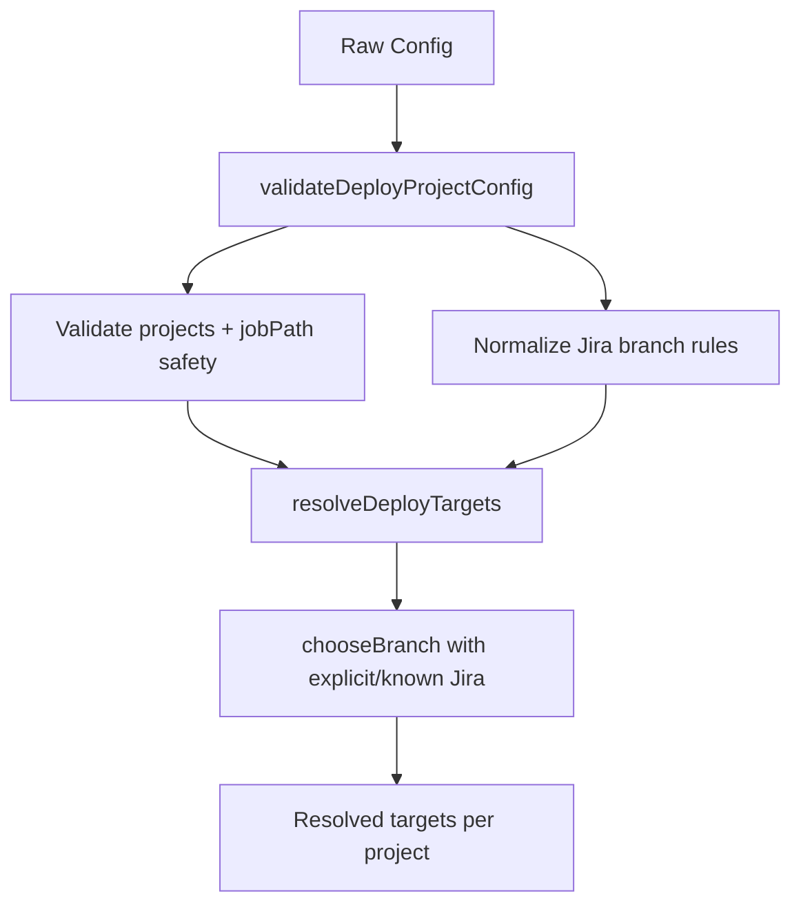
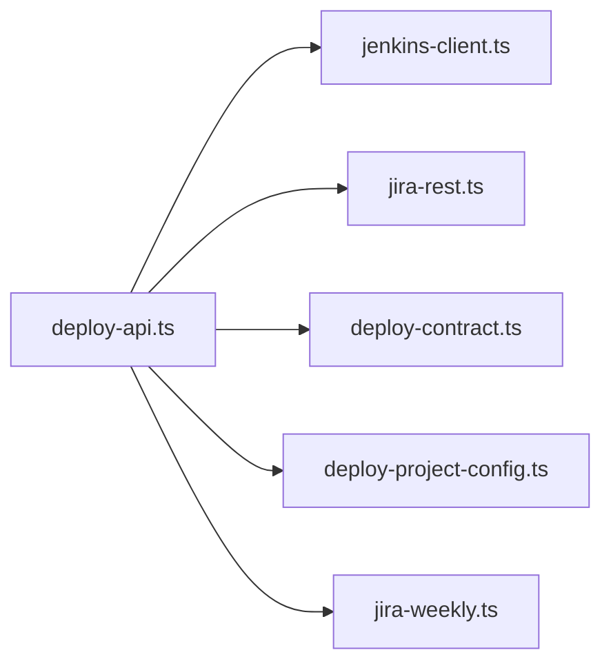

# Backend Testing

<cite>
**Referenced Files in This Document**
- [deploy-contract.test.ts](file://test/server/deploy-contract.test.ts)
- [jenkins-client.test.ts](file://test/server/jenkins-client.test.ts)
- [jira-rest.test.ts](file://test/server/jira-rest.test.ts)
- [jira-weekly.test.ts](file://test/server/jira-weekly.test.ts)
- [deploy-project-config.test.ts](file://test/server/deploy-project-config.test.ts)
- [deploy-contract.ts](file://server/deploy-contract.ts)
- [jenkins-client.ts](file://server/jenkins-client.ts)
- [jira-rest.ts](file://server/jira-rest.ts)
- [jira-weekly.ts](file://server/jira-weekly.ts)
- [deploy-project-config.ts](file://server/deploy-project-config.ts)
- [deploy-api.ts](file://server/deploy-api.ts)
- [package.json](file://package.json)
</cite>

## Table of Contents
1. [Introduction](#introduction)
2. [Project Structure](#project-structure)
3. [Core Components](#core-components)
4. [Architecture Overview](#architecture-overview)
5. [Detailed Component Analysis](#detailed-component-analysis)
6. [Dependency Analysis](#dependency-analysis)
7. [Performance Considerations](#performance-considerations)
8. [Troubleshooting Guide](#troubleshooting-guide)
9. [Conclusion](#conclusion)
10. [Appendices](#appendices)

## Introduction
This document describes the backend API testing implementation for the project’s server-side modules. It focuses on:
- Testing Express server endpoints and API contract validation
- Service integration testing for Jenkins and Jira
- Mock strategies for external services and test data management
- Error handling, response validation, and integration patterns
- Authentication, authorization, and security considerations
- Asynchronous operations, timeouts, and error propagation
- Guidelines for organizing and maintaining backend tests

## Project Structure
The backend testing is organized under the test/server directory and mirrors the server-side modules. The test runner is configured via the project’s package.json script to execute all server and frontend tests using Node’s native test runner with TypeScript support.

**Diagram sources**
- [deploy-contract.test.ts:1-66](file://test/server/deploy-contract.test.ts#L1-L66)
- [jenkins-client.test.ts:1-162](file://test/server/jenkins-client.test.ts#L1-L162)
- [jira-rest.test.ts:1-30](file://test/server/jira-rest.test.ts#L1-L30)
- [jira-weekly.test.ts:1-59](file://test/server/jira-weekly.test.ts#L1-L59)
- [deploy-project-config.test.ts:1-117](file://test/server/deploy-project-config.test.ts#L1-L117)
- [deploy-contract.ts:1-169](file://server/deploy-contract.ts#L1-L169)
- [jenkins-client.ts:1-191](file://server/jenkins-client.ts#L1-L191)
- [jira-rest.ts:1-483](file://server/jira-rest.ts#L1-L483)
- [jira-weekly.ts:1-113](file://server/jira-weekly.ts#L1-L113)
- [deploy-project-config.ts:1-237](file://server/deploy-project-config.ts#L1-L237)
- [deploy-api.ts:1-1200](file://server/deploy-api.ts#L1-L1200)

**Section sources**
- [package.json:28-28](file://package.json#L28-L28)

## Core Components
This section outlines the primary backend modules under test and their roles in API testing.

- Jenkins client integration
  - Validates Jenkins job triggering, queue polling, and error sanitization
  - Tests timeout handling and asynchronous polling behavior
- Jira REST integration
  - Validates authentication header normalization and error reporting
  - Tests search and workflow transition APIs with fallback logic
- Deployment contract and configuration
  - Validates environment-driven Jenkins configuration and parameter building
  - Validates project configuration and branch selection rules
- Weekly report generation
  - Validates date range computation and Markdown summary building

**Section sources**
- [jenkins-client.test.ts:1-162](file://test/server/jenkins-client.test.ts#L1-L162)
- [jira-rest.test.ts:1-30](file://test/server/jira-rest.test.ts#L1-L30)
- [deploy-contract.test.ts:1-66](file://test/server/deploy-contract.test.ts#L1-L66)
- [deploy-project-config.test.ts:1-117](file://test/server/deploy-project-config.test.ts#L1-L117)
- [jira-weekly.test.ts:1-59](file://test/server/jira-weekly.test.ts#L1-L59)

## Architecture Overview
The Express server integrates Jenkins and Jira services behind a set of endpoints. Tests validate:
- Endpoint behavior and response shape
- Contract compliance for parameters and job paths
- External service integration patterns and error propagation
- Security posture around credentials and authentication

**Diagram sources**
- [deploy-api.ts:887-1200](file://server/deploy-api.ts#L887-L1200)
- [jenkins-client.ts:1-191](file://server/jenkins-client.ts#L1-L191)
- [jira-rest.ts:1-483](file://server/jira-rest.ts#L1-L483)
- [deploy-contract.ts:1-169](file://server/deploy-contract.ts#L1-L169)
- [deploy-project-config.ts:1-237](file://server/deploy-project-config.ts#L1-L237)

## Detailed Component Analysis

### Jenkins Client Testing
This suite validates Jenkins job triggering and queue/build polling, including:
- Crumb retrieval and Basic authentication header construction
- Parameterized build URL composition and POST semantics
- Queue polling until build URL exposure with timeout handling
- Sanitized error reporting for HTML-based authentication failures
- Timeout behavior when builds do not start within the polling window

**Diagram sources**
- [jenkins-client.test.ts:38-104](file://test/server/jenkins-client.test.ts#L38-L104)
- [jenkins-client.ts:89-142](file://server/jenkins-client.ts#L89-L142)

**Section sources**
- [jenkins-client.test.ts:1-162](file://test/server/jenkins-client.test.ts#L1-L162)
- [jenkins-client.ts:1-191](file://server/jenkins-client.ts#L1-L191)

### Jenkins Client Polling Flow
Asynchronous polling is validated for:
- Correct queue URL resolution and absolute URL handling
- Build completion detection and timeout reporting
- Graceful handling of transient network errors during polling

**Diagram sources**
- [jenkins-client.ts:43-69](file://server/jenkins-client.ts#L43-L69)

**Section sources**
- [jenkins-client.test.ts:67-136](file://test/server/jenkins-client.test.ts#L67-L136)
- [jenkins-client.ts:148-190](file://server/jenkins-client.ts#L148-L190)

### Jira REST Authentication and Search Testing
Authentication normalization and error handling are validated for:
- Username/password and API token combinations
- HTML-based authentication failures sanitized into actionable messages
- Search API fallback from REST API v3 to v2 when appropriate
- JSON parsing robustness and error surfacing

**Diagram sources**
- [jira-rest.test.ts:1-30](file://test/server/jira-rest.test.ts#L1-L30)
- [jira-rest.ts:181-278](file://server/jira-rest.ts#L181-L278)

**Section sources**
- [jira-rest.test.ts:1-30](file://test/server/jira-rest.test.ts#L1-L30)
- [jira-rest.ts:1-483](file://server/jira-rest.ts#L1-L483)

### Deployment Contract and Configuration Testing
Contract validation and configuration resolution are covered by:
- Jenkins environment credential checks and error responses
- Parameter name validation and branch/Jira ID normalization
- Job path parsing with safety checks against unsafe segments
- Project configuration loading, validation, and target resolution across Jira rules

**Diagram sources**
- [deploy-contract.test.ts:10-65](file://test/server/deploy-contract.test.ts#L10-L65)
- [deploy-contract.ts:33-168](file://server/deploy-contract.ts#L33-L168)

**Section sources**
- [deploy-contract.test.ts:1-66](file://test/server/deploy-contract.test.ts#L1-L66)
- [deploy-contract.ts:1-169](file://server/deploy-contract.ts#L1-L169)

### Weekly Report Generation Testing
Date range calculation and Markdown generation are validated for:
- Local week boundaries aligned to Monday
- Bracket-safe JQL date formatting
- Empty and populated issue lists rendering

**Diagram sources**
- [jira-weekly.test.ts:12-59](file://test/server/jira-weekly.test.ts#L12-L59)
- [jira-weekly.ts:3-113](file://server/jira-weekly.ts#L3-L113)

**Section sources**
- [jira-weekly.test.ts:1-59](file://test/server/jira-weekly.test.ts#L1-L59)
- [jira-weekly.ts:1-113](file://server/jira-weekly.ts#L1-L113)

### Deployment Project Configuration Testing
Project configuration validation and target resolution are verified for:
- Defaults enforcement and parameter name validation
- Project-level and global Jenkins base URLs
- Jira branch rules precedence and fallback logic

**Diagram sources**
- [deploy-project-config.test.ts:9-117](file://test/server/deploy-project-config.test.ts#L9-L117)
- [deploy-project-config.ts:96-237](file://server/deploy-project-config.ts#L96-L237)

**Section sources**
- [deploy-project-config.test.ts:1-117](file://test/server/deploy-project-config.test.ts#L1-L117)
- [deploy-project-config.ts:1-237](file://server/deploy-project-config.ts#L1-L237)

## Dependency Analysis
The Express server composes multiple modules to serve endpoints. Tests exercise these dependencies to ensure:
- Contract compliance for environment variables and parameters
- Robust integration with Jenkins and Jira
- Proper error propagation and sanitization

**Diagram sources**
- [deploy-api.ts:1-30](file://server/deploy-api.ts#L1-L30)
- [jenkins-client.ts:1-191](file://server/jenkins-client.ts#L1-L191)
- [jira-rest.ts:1-483](file://server/jira-rest.ts#L1-L483)
- [deploy-contract.ts:1-169](file://server/deploy-contract.ts#L1-L169)
- [deploy-project-config.ts:1-237](file://server/deploy-project-config.ts#L1-L237)
- [jira-weekly.ts:1-113](file://server/jira-weekly.ts#L1-L113)

**Section sources**
- [deploy-api.ts:1-1200](file://server/deploy-api.ts#L1-L1200)

## Performance Considerations
- Polling intervals and timeouts
  - Jenkins queue polling uses bounded waits and respects remaining time to avoid excessive retries
  - Build polling uses conservative intervals and a long default timeout suitable for CI environments
- Network resilience
  - Transient network errors during polling are tolerated and retried
- Response shaping
  - Jira search normalizes HTML responses into concise, actionable messages to reduce noise and improve observability

[No sources needed since this section provides general guidance]

## Troubleshooting Guide
Common issues and how tests validate mitigations:
- Jenkins authentication failures
  - Tests confirm sanitized error messages and absence of sensitive HTML/script content
- Jenkins job path safety
  - Tests enforce rejection of unsafe segments and full URLs
- Jira authentication and API version fallback
  - Tests validate fallback from REST API v3 to v2 when encountering 404/410 responses
- Parameter validation
  - Tests ensure invalid parameter names and branch names raise appropriate errors

**Section sources**
- [jenkins-client.test.ts:138-161](file://test/server/jenkins-client.test.ts#L138-L161)
- [deploy-contract.test.ts:48-65](file://test/server/deploy-contract.test.ts#L48-L65)
- [jira-rest.test.ts:1-30](file://test/server/jira-rest.test.ts#L1-L30)
- [jira-rest.ts:223-242](file://server/jira-rest.ts#L223-L242)

## Conclusion
The backend testing strategy emphasizes:
- Contract-first validation for Jenkins and deployment configuration
- Robust integration testing for Jenkins and Jira with realistic error scenarios
- Clear separation of concerns across modules and strong test coverage for edge cases
- Practical guidance for asynchronous operations, timeouts, and error propagation

[No sources needed since this section summarizes without analyzing specific files]

## Appendices

### Testing Approach and Patterns
- Mocking external services
  - Global fetch replacement enables deterministic responses for Jenkins and Jira endpoints
  - Assertions capture request URLs, methods, and headers (e.g., Basic auth, crumb)
- Test data management
  - Use minimal fixtures and inline mocks; avoid external test fixtures for server-side tests
- External service mocking strategies
  - Simulate Jenkins crumb issuer, queue, and build APIs
  - Simulate Jira search and transitions endpoints with varied responses (HTML, JSON, 401/403)
- Error handling and response validation
  - Validate status codes and sanitized error messages
  - Ensure non-sensitive information is returned to clients
- Authentication, authorization, and security
  - Normalize credentials and strip extraneous quotes/whitespace
  - Sanitize HTML responses to prevent credential leakage
- Asynchronous operations, timeouts, and error propagation
  - Verify polling loops and timeout behavior
  - Confirm graceful degradation when upstream services are unavailable

[No sources needed since this section provides general guidance]