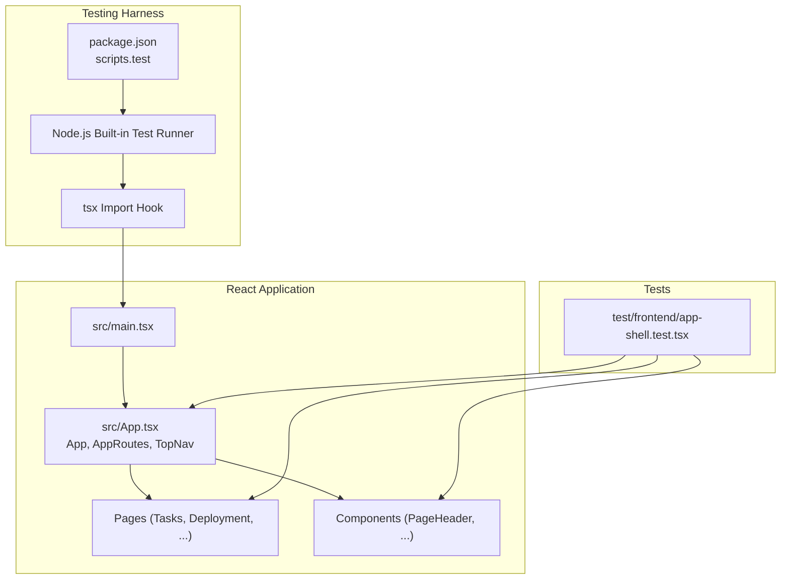
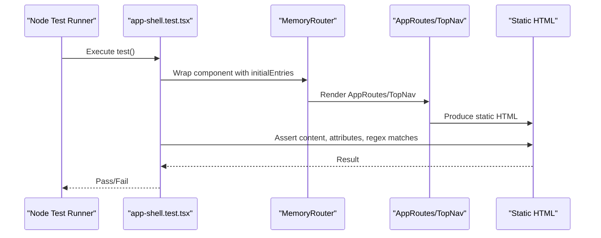
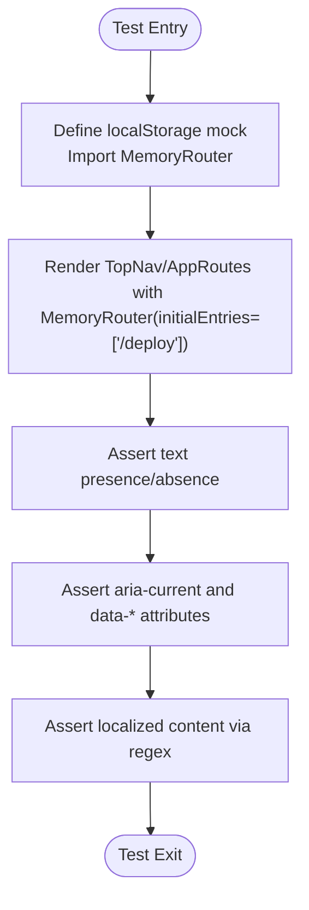
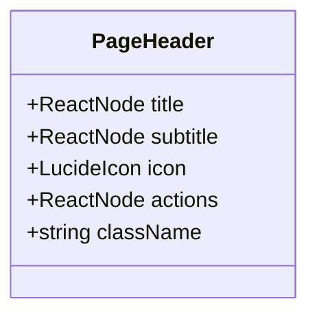
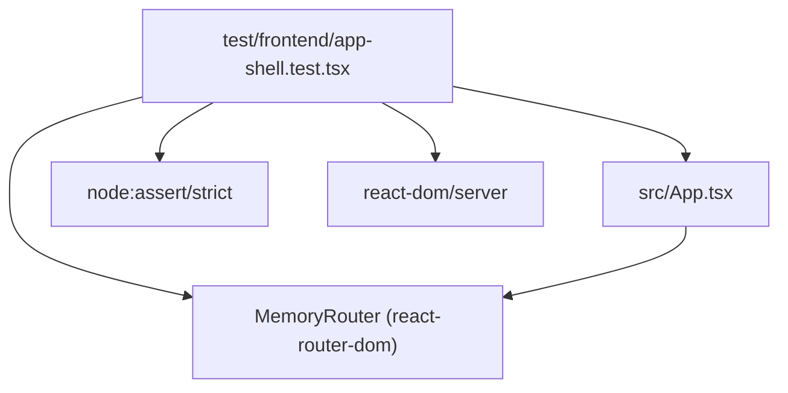

# Frontend Testing

<cite>
**Referenced Files in This Document**
- [package.json](file://package.json)
- [vite.config.ts](file://vite.config.ts)
- [src/main.tsx](file://src/main.tsx)
- [src/App.tsx](file://src/App.tsx)
- [src/components/PageHeader.tsx](file://src/components/PageHeader.tsx)
- [src/pages/Tasks.tsx](file://src/pages/Tasks.tsx)
- [src/pages/Deployment.tsx](file://src/pages/Deployment.tsx)
- [test/frontend/app-shell.test.tsx](file://test/frontend/app-shell.test.tsx)
- [src/index.css](file://src/index.css)
</cite>

## Table of Contents
1. [Introduction](#introduction)
2. [Project Structure](#project-structure)
3. [Core Components](#core-components)
4. [Architecture Overview](#architecture-overview)
5. [Detailed Component Analysis](#detailed-component-analysis)
6. [Dependency Analysis](#dependency-analysis)
7. [Performance Considerations](#performance-considerations)
8. [Troubleshooting Guide](#troubleshooting-guide)
9. [Conclusion](#conclusion)
10. [Appendices](#appendices)

## Introduction
This document explains the frontend testing implementation for the project, focusing on React component testing with the Node.js built-in test runner and Jest-like syntax. It covers the testing setup, including localStorage mocking, MemoryRouter configuration, and component rendering strategies. It also documents how navigation components, route handling, and UI rendering are tested, along with assertion patterns for DOM validation, attribute checking, and content matching. Examples demonstrate testing React components under different route contexts and state conditions, including component props, events, and user interaction simulation. Finally, it provides guidelines for writing effective frontend tests and maintaining test reliability.

## Project Structure
The frontend testing approach centers around:
- Node.js built-in test runner with Jest-like assertions
- React component rendering via static markup for deterministic DOM checks
- MemoryRouter for route-driven tests without a real browser
- localStorage mocking to isolate persistence-dependent logic
- Assertions validating presence/absence of text, attributes, and accessibility markers

**Diagram sources**
- [package.json:28](file://package.json#L28)
- [src/main.tsx:1-11](file://src/main.tsx#L1-L11)
- [src/App.tsx:1-136](file://src/App.tsx#L1-L136)
- [test/frontend/app-shell.test.tsx:1-55](file://test/frontend/app-shell.test.tsx#L1-L55)

**Section sources**
- [package.json:28](file://package.json#L28)
- [src/main.tsx:1-11](file://src/main.tsx#L1-L11)
- [src/App.tsx:1-136](file://src/App.tsx#L1-L136)
- [test/frontend/app-shell.test.tsx:1-55](file://test/frontend/app-shell.test.tsx#L1-L55)

## Core Components
This section outlines the core testing components and patterns used in the repository.

- Node.js built-in test runner and Jest-like assertions
  - Tests use the strict assertion module and the Node test runner.
  - Assertions validate DOM content and attributes.

- Static rendering strategy
  - Components are rendered to static HTML using a server renderer to avoid browser dependencies.
  - This enables deterministic checks of rendered output.

- MemoryRouter for routing tests
  - MemoryRouter initializes routes with specific initial entries to simulate navigation contexts.
  - This allows testing route-driven behavior without a live browser.

- localStorage mocking
  - A mock Map-backed localStorage is defined globally to isolate persistence-dependent logic.
  - This ensures tests remain deterministic and independent of prior state.

- Assertion patterns
  - Presence/absence checks for text content
  - Attribute checks (e.g., aria-current)
  - Regular expression matching for localized or dynamic content

Examples of these patterns appear in the frontend test suite.

**Section sources**
- [test/frontend/app-shell.test.tsx:1-55](file://test/frontend/app-shell.test.tsx#L1-L55)
- [package.json:28](file://package.json#L28)

## Architecture Overview
The testing architecture integrates the Node.js test runner with React components and routing to validate UI behavior deterministically.

**Diagram sources**
- [test/frontend/app-shell.test.tsx:27-54](file://test/frontend/app-shell.test.tsx#L27-L54)
- [src/App.tsx:78-108](file://src/App.tsx#L78-L108)

## Detailed Component Analysis

### Navigation and Routing Tests
This section analyzes how navigation and routing are tested using MemoryRouter and static rendering.

- Top navigation rendering and active state
  - The test renders TopNav inside MemoryRouter with a specific initial route.
  - Assertions check that the current page link has an accessibility attribute indicating the active state and that non-relevant links are omitted.

- Default route behavior
  - The test verifies the default route path constant resolves to the expected route.

- Route shell rendering
  - The test renders AppRoutes with an initial route and asserts that the corresponding page content appears in the static HTML.

**Diagram sources**
- [test/frontend/app-shell.test.tsx:27-54](file://test/frontend/app-shell.test.tsx#L27-L54)
- [src/App.tsx:49-76](file://src/App.tsx#L49-L76)
- [src/App.tsx:78-108](file://src/App.tsx#L78-L108)

**Section sources**
- [test/frontend/app-shell.test.tsx:27-54](file://test/frontend/app-shell.test.tsx#L27-L54)
- [src/App.tsx:35-108](file://src/App.tsx#L35-L108)

### Component Props and UI Rendering
This section demonstrates testing component props and UI rendering using a reusable component.

- PageHeader props and layout
  - The PageHeader component accepts props for title, subtitle, icon, actions, and className.
  - Tests can validate that provided props render into the DOM and that optional sections appear conditionally.

- Practical testing approach
  - Render PageHeader with various prop combinations.
  - Assert presence of title text, optional subtitle, icon rendering, and action buttons.
  - Validate CSS class composition and conditional layout.

**Diagram sources**
- [src/components/PageHeader.tsx:4-10](file://src/components/PageHeader.tsx#L4-L10)

**Section sources**
- [src/components/PageHeader.tsx:14-62](file://src/components/PageHeader.tsx#L14-L62)

### Stateful Components and Interaction Simulation
This section explains how to test stateful components and simulate interactions.

- Tasks page state and interactions
  - The Tasks page manages local state for todo items, date selection, editing, and persistence.
  - Tests can validate UI updates for adding, toggling, editing, and removing items.
  - Simulate keyboard events and button clicks to trigger state transitions.

- Deployment page state and interactions
  - The Deployment page manages pipeline state, logs, templates, and SSE-based updates.
  - Tests can validate UI rendering for different phases (idle, draft, executing, completed).
  - Simulate form submissions and button clicks to verify state transitions and UI updates.

- Interaction simulation guidelines
  - Use controlled props and event handlers to simulate user interactions.
  - Validate DOM updates immediately after interactions occur.
  - For asynchronous effects, assert eventual UI states after promises resolve.

Note: While the existing tests rely on static rendering, stateful components can be complemented with shallow rendering or by asserting side effects (e.g., localStorage writes) to maintain determinism.

**Section sources**
- [src/pages/Tasks.tsx:136-541](file://src/pages/Tasks.tsx#L136-L541)
- [src/pages/Deployment.tsx:88-1068](file://src/pages/Deployment.tsx#L88-L1068)

### Accessibility and Localization Assertions
This section covers accessibility and localization-specific assertions used in tests.

- Accessibility attributes
  - Tests assert aria-current on active navigation links.
  - Tests assert presence of localized text content and accessibility labels.

- Localization checks
  - Tests use regular expressions to match localized strings, ensuring robustness across minor content changes.

**Section sources**
- [test/frontend/app-shell.test.tsx:34-39](file://test/frontend/app-shell.test.tsx#L34-L39)
- [src/index.css:253-256](file://src/index.css#L253-L256)

## Dependency Analysis
This section analyzes dependencies among testing components and their impact on test reliability.

**Diagram sources**
- [test/frontend/app-shell.test.tsx:1-5](file://test/frontend/app-shell.test.tsx#L1-L5)
- [src/App.tsx:15](file://src/App.tsx#L15)

**Section sources**
- [test/frontend/app-shell.test.tsx:1-5](file://test/frontend/app-shell.test.tsx#L1-L5)
- [src/App.tsx:15](file://src/App.tsx#L15)

## Performance Considerations
- Prefer static rendering for UI tests to avoid browser overhead and ensure deterministic results.
- Keep tests focused on small component units to minimize re-rendering costs.
- Mock external dependencies (e.g., localStorage, APIs) to eliminate flakiness and speed up tests.
- Use targeted assertions to reduce unnecessary DOM traversal and matching.

## Troubleshooting Guide
Common issues and resolutions when writing frontend tests:

- MemoryRouter initialization
  - Ensure initialEntries includes the desired route for the test.
  - Verify that nested routes are correctly represented in initialEntries.

- localStorage isolation
  - Define a mock localStorage before importing components under test.
  - Reset or clear the mock between tests to avoid cross-test contamination.

- Static rendering limitations
  - Static rendering does not execute client-side effects (e.g., useEffect).
  - For effect-driven behavior, assert side effects (e.g., localStorage writes) or refactor to test pure logic.

- Accessibility and localization
  - Use regex assertions for localized strings to improve resilience against minor content changes.
  - Validate aria attributes to ensure accessibility compliance.

**Section sources**
- [test/frontend/app-shell.test.tsx:7-25](file://test/frontend/app-shell.test.tsx#L7-L25)
- [test/frontend/app-shell.test.tsx:27-54](file://test/frontend/app-shell.test.tsx#L27-L54)

## Conclusion
The project’s frontend testing strategy leverages the Node.js built-in test runner with Jest-like assertions, static rendering, MemoryRouter, and localStorage mocking. This combination yields reliable, fast, and deterministic tests for navigation, routing, and UI rendering. By following the patterns outlined here—focusing on component props, state transitions, accessibility attributes, and localization—teams can write effective frontend tests that remain maintainable and resilient.

## Appendices

### Appendix A: Test Execution Script
- The test script runs both server and frontend tests using the Node test runner with TypeScript support.

**Section sources**
- [package.json:28](file://package.json#L28)

### Appendix B: PWA and Build Context
- The build configuration affects how assets are served and how development vs. production environments behave. While not directly part of frontend tests, understanding the build context helps interpret test outcomes in different modes.

**Section sources**
- [vite.config.ts:21-78](file://vite.config.ts#L21-L78)