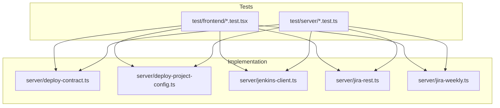
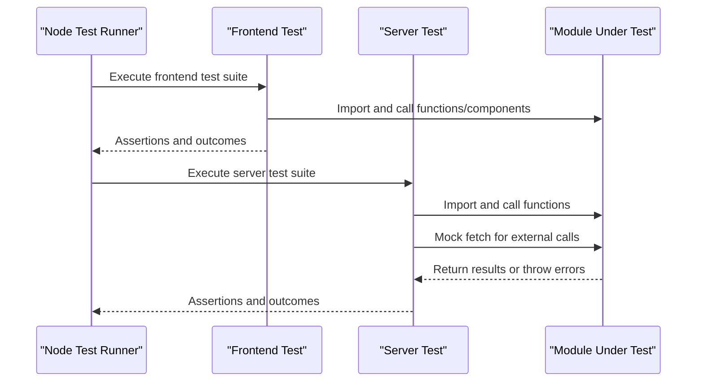
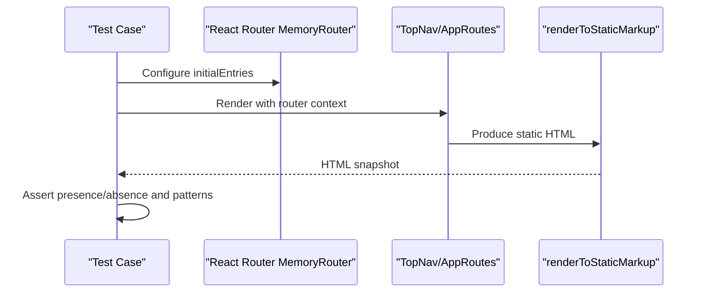
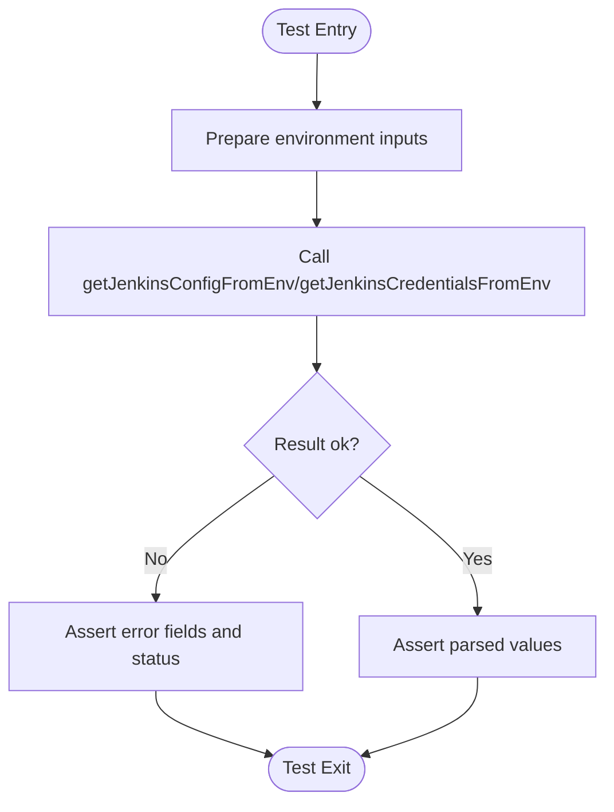
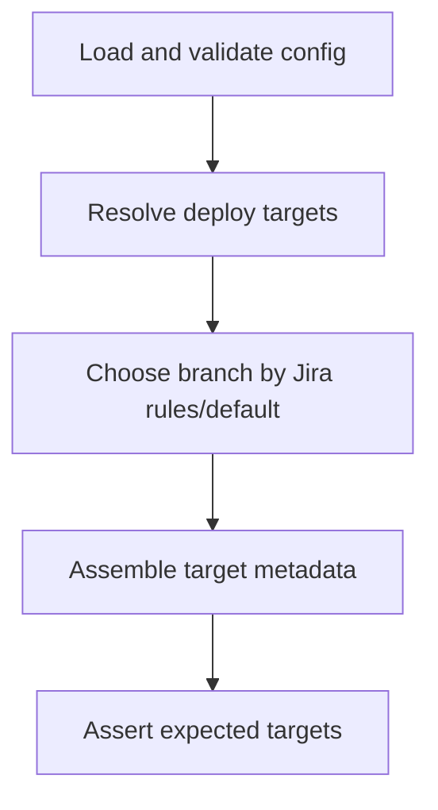
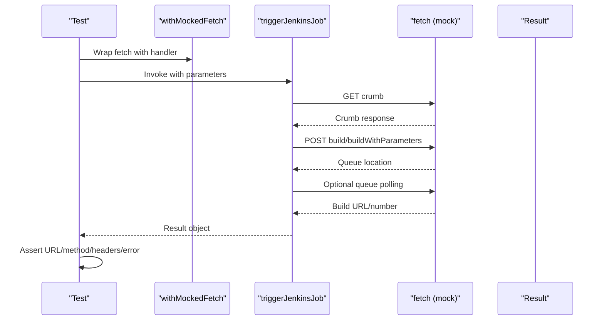
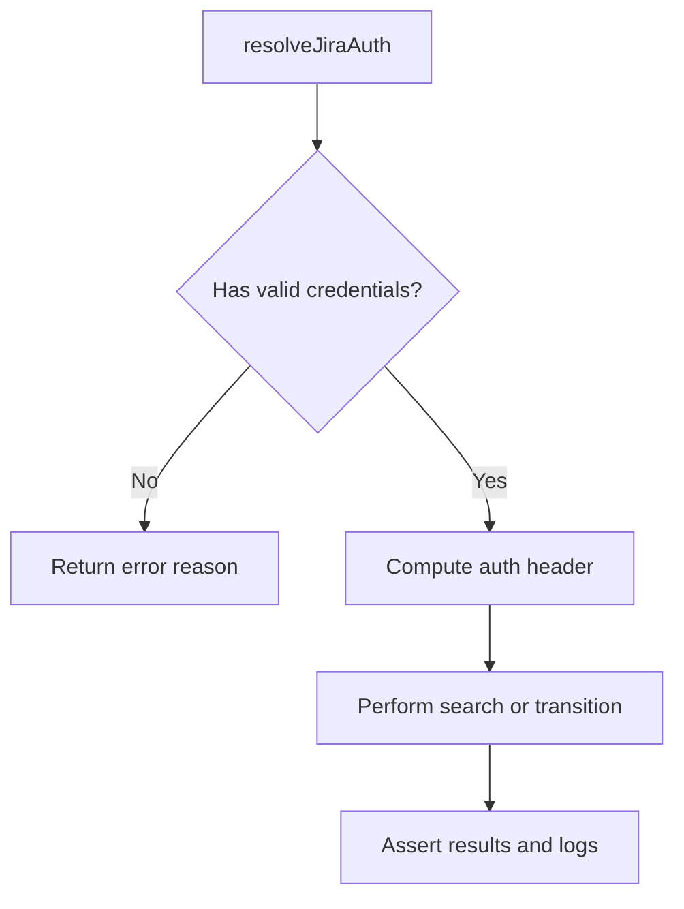
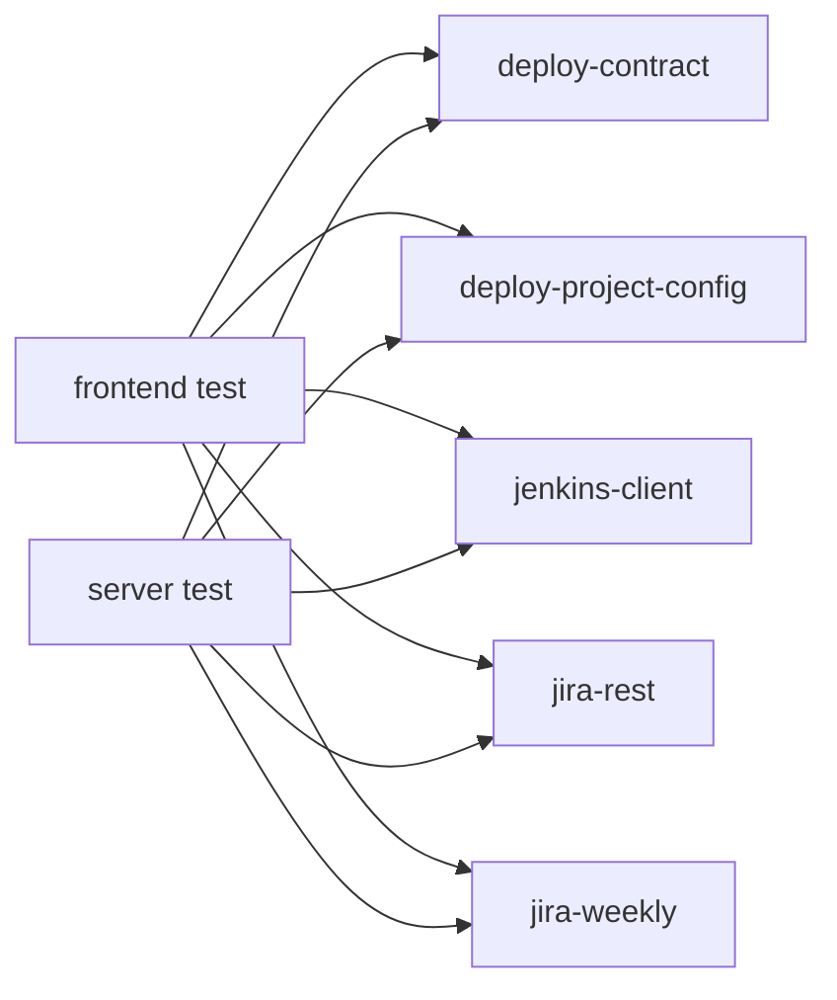

# Test Organization and Best Practices

<cite>
**Referenced Files in This Document**
- [package.json](file://package.json)
- [vite.config.ts](file://vite.config.ts)
- [test/frontend/app-shell.test.tsx](file://test/frontend/app-shell.test.tsx)
- [test/server/deploy-contract.test.ts](file://test/server/deploy-contract.test.ts)
- [test/server/deploy-project-config.test.ts](file://test/server/deploy-project-config.test.ts)
- [test/server/jenkins-client.test.ts](file://test/server/jenkins-client.test.ts)
- [test/server/jira-rest.test.ts](file://test/server/jira-rest.test.ts)
- [test/server/jira-weekly.test.ts](file://test/server/jira-weekly.test.ts)
- [server/deploy-contract.ts](file://server/deploy-contract.ts)
- [server/deploy-project-config.ts](file://server/deploy-project-config.ts)
- [server/jenkins-client.ts](file://server/jenkins-client.ts)
- [server/jira-rest.ts](file://server/jira-rest.ts)
- [server/jira-weekly.ts](file://server/jira-weekly.ts)
</cite>

## Table of Contents
1. [Introduction](#introduction)
2. [Project Structure](#project-structure)
3. [Core Components](#core-components)
4. [Architecture Overview](#architecture-overview)
5. [Detailed Component Analysis](#detailed-component-analysis)
6. [Dependency Analysis](#dependency-analysis)
7. [Performance Considerations](#performance-considerations)
8. [Troubleshooting Guide](#troubleshooting-guide)
9. [Conclusion](#conclusion)
10. [Appendices](#appendices)

## Introduction
This document provides comprehensive guidance for organizing tests and adopting best practices in this project. It covers test file structure, naming conventions, categorization strategies, setup and teardown procedures, isolation techniques, shared utilities, test data and fixtures, mock strategies, assertion approaches, error handling, reporting, maintainability/readability, performance optimization, CI and automation, and Electron/desktop integration testing patterns. The content is grounded in the existing test suite and server modules.

## Project Structure
The repository organizes tests under a clear two-tier structure:
- Frontend tests: located under test/frontend and validated with React components and routing.
- Server tests: located under test/server and validated against server-side modules such as Jenkins and Jira integrations.

The test runner invocation is defined in the package.json script, which executes all server and frontend test files using Node’s native test runner with TypeScript support.

**Diagram sources**
- [package.json:28](file://package.json#L28)
- [test/frontend/app-shell.test.tsx:1-55](file://test/frontend/app-shell.test.tsx#L1-L55)
- [test/server/deploy-contract.test.ts:1-66](file://test/server/deploy-contract.test.ts#L1-L66)
- [test/server/deploy-project-config.test.ts:1-117](file://test/server/deploy-project-config.test.ts#L1-L117)
- [test/server/jenkins-client.test.ts:1-162](file://test/server/jenkins-client.test.ts#L1-L162)
- [test/server/jira-rest.test.ts:1-30](file://test/server/jira-rest.test.ts#L1-L30)
- [test/server/jira-weekly.test.ts:1-59](file://test/server/jira-weekly.test.ts#L1-L59)
- [server/deploy-contract.ts:1-169](file://server/deploy-contract.ts#L1-L169)
- [server/deploy-project-config.ts:1-237](file://server/deploy-project-config.ts#L1-L237)
- [server/jenkins-client.ts:1-191](file://server/jenkins-client.ts#L1-L191)
- [server/jira-rest.ts:1-483](file://server/jira-rest.ts#L1-L483)
- [server/jira-weekly.ts:1-113](file://server/jira-weekly.ts#L1-L113)

**Section sources**
- [package.json:28](file://package.json#L28)
- [test/frontend/app-shell.test.tsx:1-55](file://test/frontend/app-shell.test.tsx#L1-L55)
- [test/server/deploy-contract.test.ts:1-66](file://test/server/deploy-contract.test.ts#L1-L66)
- [test/server/deploy-project-config.test.ts:1-117](file://test/server/deploy-project-config.test.ts#L1-L117)
- [test/server/jenkins-client.test.ts:1-162](file://test/server/jenkins-client.test.ts#L1-L162)
- [test/server/jira-rest.test.ts:1-30](file://test/server/jira-rest.test.ts#L1-L30)
- [test/server/jira-weekly.test.ts:1-59](file://test/server/jira-weekly.test.ts#L1-L59)

## Core Components
- Test runner and invocation: Node’s native test runner with TypeScript support is invoked via a single script that globs all test files.
- Test categories:
  - Frontend tests: DOM rendering, routing, and UI behavior using React and React Router.
  - Server tests: Unit and integration tests for environment parsing, parameter building, configuration validation, Jenkins job triggering, and Jira REST interactions.
- Shared utilities:
  - Frontend tests rely on localStorage mocks and React rendering utilities.
  - Server tests use a lightweight fetch mocking helper to simulate HTTP responses and capture requests.

Key test execution command:
- [package.json:28](file://package.json#L28)

**Section sources**
- [package.json:28](file://package.json#L28)
- [test/frontend/app-shell.test.tsx:1-55](file://test/frontend/app-shell.test.tsx#L1-L55)
- [test/server/jenkins-client.test.ts:1-162](file://test/server/jenkins-client.test.ts#L1-L162)

## Architecture Overview
The testing architecture centers on:
- Isolation: Each test file focuses on a single module or small cohesive unit.
- Mocking: Server tests mock fetch globally to simulate external service behavior.
- Assertions: Strict equality and matchers are used for deterministic checks.
- Environment-driven behavior: Many tests validate environment variable parsing and error signaling.

**Diagram sources**
- [package.json:28](file://package.json#L28)
- [test/frontend/app-shell.test.tsx:1-55](file://test/frontend/app-shell.test.tsx#L1-L55)
- [test/server/jenkins-client.test.ts:1-162](file://test/server/jenkins-client.test.ts#L1-L162)
- [server/jenkins-client.ts:1-191](file://server/jenkins-client.ts#L1-L191)

## Detailed Component Analysis

### Frontend Testing: App Shell and Routing
- Purpose: Validate top navigation behavior, default routes, and route rendering for a given path.
- Techniques:
  - Uses React Server Rendering to produce static HTML snapshots for assertions.
  - Uses MemoryRouter to simulate routing contexts.
  - Provides a minimal localStorage mock to avoid DOM dependencies.
- Assertions:
  - Equality checks for presence/absence of text.
  - Pattern matching for aria attributes and localized labels.
- Isolation:
  - Each test is self-contained with its own setup and assertions.

**Diagram sources**
- [test/frontend/app-shell.test.tsx:27-54](file://test/frontend/app-shell.test.tsx#L27-L54)

**Section sources**
- [test/frontend/app-shell.test.tsx:1-55](file://test/frontend/app-shell.test.tsx#L1-L55)

### Server Testing: Jenkins Contract Utilities
- Purpose: Validate Jenkins configuration extraction, credential parsing, parameter building, and job path validation.
- Techniques:
  - Tests environment-driven behavior and error signaling.
  - Validates parameter normalization and safety checks.
- Assertions:
  - Equality checks for booleans and structured results.
  - Throws assertions for invalid inputs.
- Error handling:
  - Tests cover missing credentials and malformed inputs.

**Diagram sources**
- [test/server/deploy-contract.test.ts:10-34](file://test/server/deploy-contract.test.ts#L10-L34)
- [server/deploy-contract.ts:33-81](file://server/deploy-contract.ts#L33-L81)

**Section sources**
- [test/server/deploy-contract.test.ts:1-66](file://test/server/deploy-contract.test.ts#L1-L66)
- [server/deploy-contract.ts:1-169](file://server/deploy-contract.ts#L1-L169)

### Server Testing: Deploy Project Configuration
- Purpose: Validate configuration loading, project metadata extraction, branch resolution rules, and error conditions.
- Techniques:
  - Loads and validates a configuration object from a JSON source.
  - Resolves deploy targets per project and Jira rules.
- Assertions:
  - Equality checks for resolved branches and job segments.
  - Throws assertions for invalid configurations.

**Diagram sources**
- [test/server/deploy-project-config.test.ts:43-117](file://test/server/deploy-project-config.test.ts#L43-L117)
- [server/deploy-project-config.ts:96-236](file://server/deploy-project-config.ts#L96-L236)

**Section sources**
- [test/server/deploy-project-config.test.ts:1-117](file://test/server/deploy-project-config.test.ts#L1-L117)
- [server/deploy-project-config.ts:1-237](file://server/deploy-project-config.ts#L1-L237)

### Server Testing: Jenkins Client Integration
- Purpose: Validate Jenkins job triggering, queue polling, and error sanitization.
- Techniques:
  - Global fetch mocking to simulate Jenkins responses.
  - Captures request URLs, methods, and headers to assert correctness.
- Assertions:
  - Equality checks for queue/build URLs and headers.
  - Pattern matching for sanitized error messages.
- Error handling:
  - Tests authentication failures and HTML error bodies.

**Diagram sources**
- [test/server/jenkins-client.test.ts:26-162](file://test/server/jenkins-client.test.ts#L26-L162)
- [server/jenkins-client.ts:89-142](file://server/jenkins-client.ts#L89-L142)

**Section sources**
- [test/server/jenkins-client.test.ts:1-162](file://test/server/jenkins-client.test.ts#L1-L162)
- [server/jenkins-client.ts:1-191](file://server/jenkins-client.ts#L1-L191)

### Server Testing: Jira REST Authentication and Search
- Purpose: Validate Jira authentication header construction, URL normalization, and search error handling.
- Techniques:
  - Tests environment normalization for username/password/token.
  - Validates JQL generation and markdown summary building.
- Assertions:
  - Equality checks for normalized credentials and generated JQL.
  - Pattern matching for markdown content.

**Diagram sources**
- [test/server/jira-rest.test.ts:5-30](file://test/server/jira-rest.test.ts#L5-L30)
- [server/jira-rest.ts:34-85](file://server/jira-rest.ts#L34-L85)

**Section sources**
- [test/server/jira-rest.test.ts:1-30](file://test/server/jira-rest.test.ts#L1-L30)
- [server/jira-rest.ts:1-483](file://server/jira-rest.ts#L1-L483)

### Server Testing: Weekly Jira Utilities
- Purpose: Validate weekly date range computation, JQL generation, and markdown summary formatting.
- Techniques:
  - Uses fixed dates to assert week boundaries and labels.
  - Builds markdown summaries from issue arrays.
- Assertions:
  - Equality checks for date strings and counts.
  - Presence checks for localized strings and issue keys.

**Section sources**
- [test/server/jira-weekly.test.ts:1-59](file://test/server/jira-weekly.test.ts#L1-L59)
- [server/jira-weekly.ts:1-113](file://server/jira-weekly.ts#L1-L113)

## Dependency Analysis
- Test-to-module dependencies are explicit and focused:
  - Frontend tests depend on UI components and routing.
  - Server tests depend on server modules and mock external services.
- No circular dependencies observed among test files.
- External dependencies used for testing:
  - Node test runner and TypeScript loader.
  - Minimal fetch mocking via global override.

**Diagram sources**
- [test/frontend/app-shell.test.tsx:1-55](file://test/frontend/app-shell.test.tsx#L1-L55)
- [test/server/deploy-contract.test.ts:1-66](file://test/server/deploy-contract.test.ts#L1-L66)
- [test/server/deploy-project-config.test.ts:1-117](file://test/server/deploy-project-config.test.ts#L1-L117)
- [test/server/jenkins-client.test.ts:1-162](file://test/server/jenkins-client.test.ts#L1-L162)
- [test/server/jira-rest.test.ts:1-30](file://test/server/jira-rest.test.ts#L1-L30)
- [test/server/jira-weekly.test.ts:1-59](file://test/server/jira-weekly.test.ts#L1-L59)
- [server/deploy-contract.ts:1-169](file://server/deploy-contract.ts#L1-L169)
- [server/deploy-project-config.ts:1-237](file://server/deploy-project-config.ts#L1-L237)
- [server/jenkins-client.ts:1-191](file://server/jenkins-client.ts#L1-L191)
- [server/jira-rest.ts:1-483](file://server/jira-rest.ts#L1-L483)
- [server/jira-weekly.ts:1-113](file://server/jira-weekly.ts#L1-L113)

**Section sources**
- [package.json:28](file://package.json#L28)
- [test/frontend/app-shell.test.tsx:1-55](file://test/frontend/app-shell.test.tsx#L1-L55)
- [test/server/jenkins-client.test.ts:1-162](file://test/server/jenkins-client.test.ts#L1-L162)

## Performance Considerations
- Keep tests synchronous where possible to reduce overhead.
- Minimize global mocks and restore state after tests to avoid cross-test interference.
- Prefer targeted assertions to reduce computation in test bodies.
- Avoid unnecessary network calls by mocking external services (as already done).
- Group related tests to reduce repeated setup costs.

## Troubleshooting Guide
Common issues and resolutions:
- Environment variable parsing failures:
  - Validate trimming and normalization logic in authentication and contract modules.
  - Ensure tests cover missing or malformed values to surface configuration errors.
- Jenkins authentication and permission errors:
  - Verify crumb fetching and Basic auth header composition.
  - Sanitized error messages help diagnose HTML-based failures.
- Jira search and transition failures:
  - Confirm API path prefixes and authentication headers.
  - Log context aids in diagnosing HTTP statuses and response previews.

**Section sources**
- [server/deploy-contract.ts:29-81](file://server/deploy-contract.ts#L29-L81)
- [server/jenkins-client.ts:71-87](file://server/jenkins-client.ts#L71-L87)
- [server/jira-rest.ts:106-278](file://server/jira-rest.ts#L106-L278)

## Conclusion
The project demonstrates a clean separation of concerns between frontend and server tests, with strong emphasis on environment-driven behavior, deterministic assertions, and minimal mocking. Adopting the patterns and guidelines outlined here will improve maintainability, readability, and reliability of the test suite.

## Appendices

### Test File Naming Conventions
- Use descriptive suffixes:
  - Frontend: *.test.tsx
  - Server: *.test.ts
- Name files after the module they test (e.g., jenkins-client.test.ts).

### Test Categorization Strategies
- Frontend:
  - UI rendering and routing behavior.
  - Component interaction and accessibility attributes.
- Server:
  - Unit tests for pure functions and validation.
  - Integration tests for external service interactions with mocks.

### Setup and Teardown Procedures
- Frontend:
  - Provide minimal globals (e.g., localStorage mock) per test file.
- Server:
  - Use a lightweight fetch wrapper to record calls and return controlled responses.
  - Restore original fetch after tests if needed.

### Test Isolation Techniques
- Avoid shared mutable state between tests.
- Use isolated environment objects for each test case.
- Limit reliance on global mocks; scope them to the test file.

### Shared Test Utilities
- Frontend:
  - React Server Rendering and MemoryRouter for routing.
  - localStorage mock for persistence-related tests.
- Server:
  - Fetch mocking helper to simulate HTTP responses and capture requests.

### Test Data Management and Fixtures
- Centralize fixture data in test files for readability.
- Use small, focused datasets for assertions.
- Parameterize tests to cover boundary conditions.

### Mock Object Strategies
- Replace global fetch with a thin wrapper that records calls and returns predefined responses.
- Mock only what is necessary; avoid over-mocking.

### Assertion Strategies
- Prefer equality and matchers for deterministic checks.
- Use throws assertions for error conditions.
- Validate both positive and negative cases.

### Error Handling in Tests
- Assert error fields and status codes for invalid inputs.
- Sanitized error messages improve debugging without leaking secrets.

### Test Reporting Mechanisms
- Use Node’s built-in test runner for concise, fast reporting.
- Keep tests focused to minimize flakiness and improve signal.

### Continuous Integration and Automated Execution
- Run the test command defined in the package.json script as part of CI.
- Ensure environment variables are configured in CI for server-side tests.

**Section sources**
- [package.json:28](file://package.json#L28)

### Electron/Desktop Integration Testing
- Desktop builds and development scripts are defined in package.json.
- Frontend tests can validate UI behavior in a desktop-like environment.
- For deeper integration, consider:
  - Headless browser or Electron-specific test harnesses.
  - Fixture-based data to avoid live network calls.
  - Environment-driven toggles to switch between web and desktop modes.

**Section sources**
- [package.json:15-28](file://package.json#L15-L28)
- [vite.config.ts:17-19](file://vite.config.ts#L17-L19)

### Effective Test Patterns
- One assertion per expectation where practical.
- Use descriptive test names that state the condition being tested.
- Group related tests and order them from simple to complex.

### Common Anti-Patterns to Avoid
- Overuse of global mocks leading to brittle tests.
- Testing implementation details instead of behavior.
- Ignoring environment-driven configuration in tests.
- Using external services without mocks in unit tests.