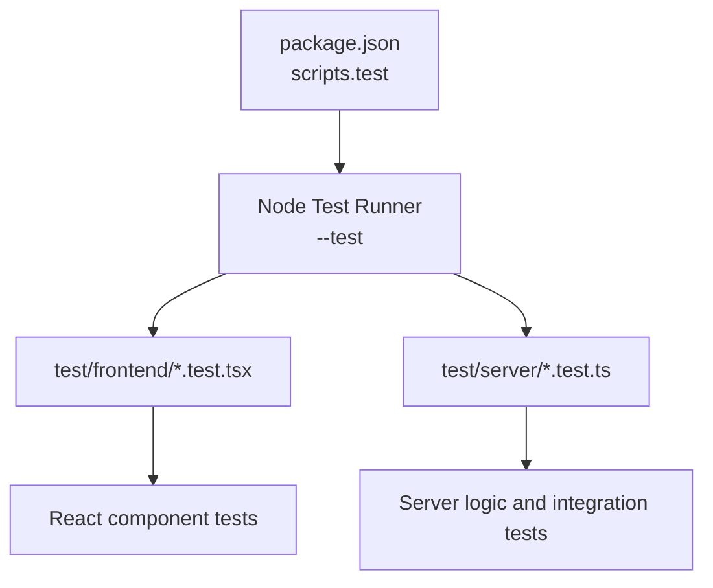
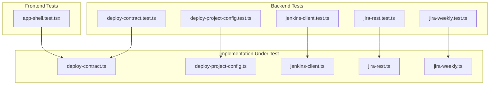
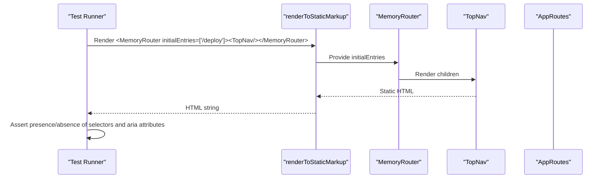
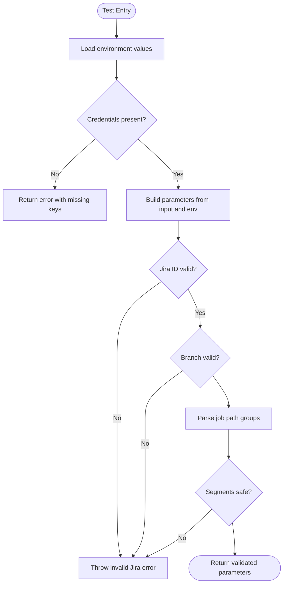
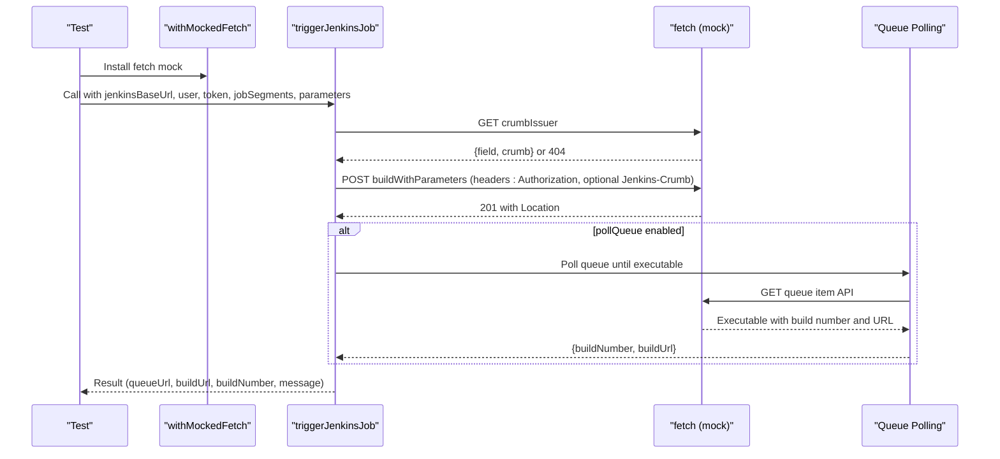
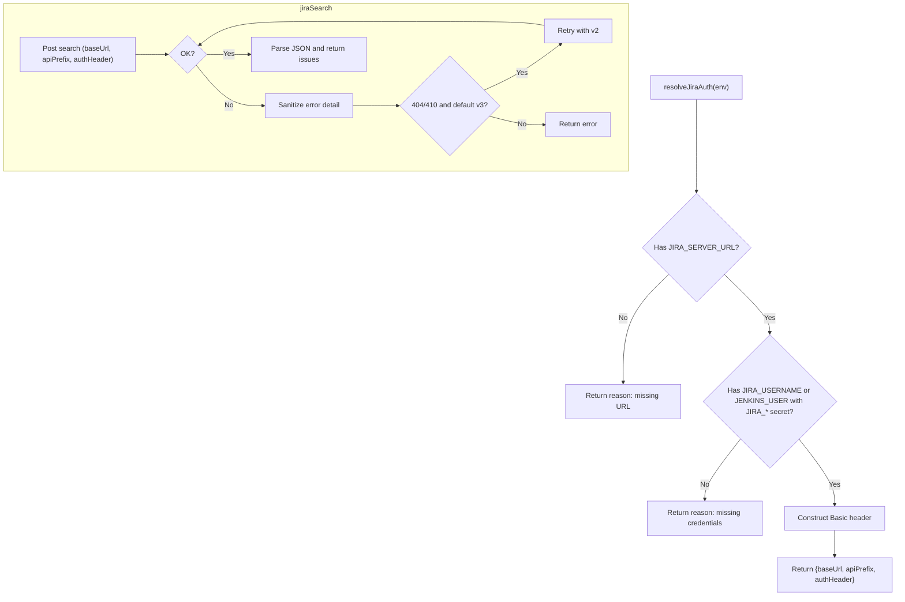
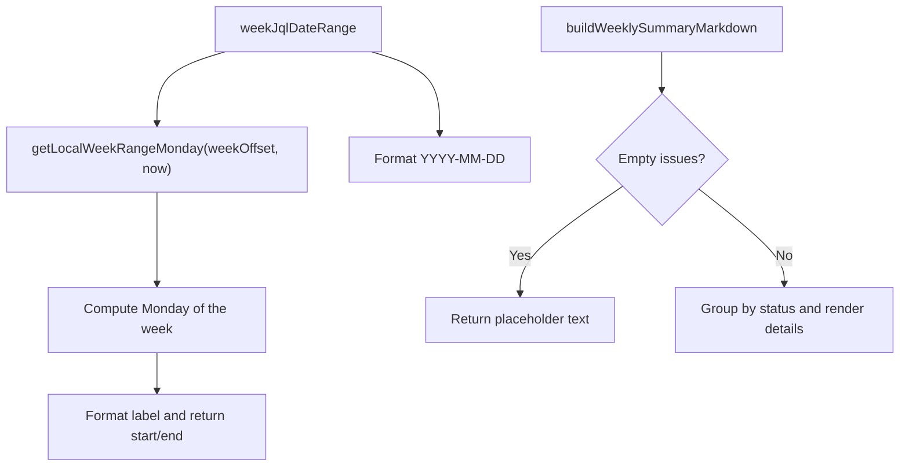
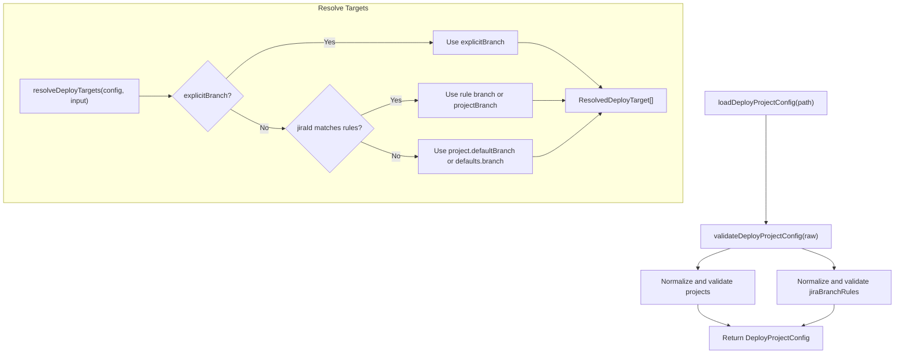
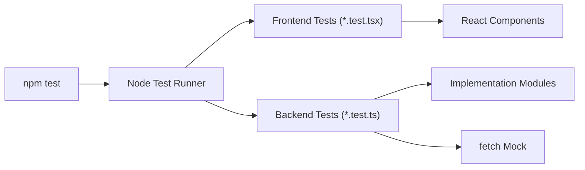

# Testing Strategy

<cite>
**Referenced Files in This Document**
- [package.json](file://package.json)
- [vite.config.ts](file://vite.config.ts)
- [tsconfig.json](file://tsconfig.json)
- [test/frontend/app-shell.test.tsx](file://test/frontend/app-shell.test.tsx)
- [test/server/deploy-contract.test.ts](file://test/server/deploy-contract.test.ts)
- [test/server/deploy-project-config.test.ts](file://test/server/deploy-project-config.test.ts)
- [test/server/jenkins-client.test.ts](file://test/server/jenkins-client.test.ts)
- [test/server/jira-rest.test.ts](file://test/server/jira-rest.test.ts)
- [test/server/jira-weekly.test.ts](file://test/server/jira-weekly.test.ts)
- [server/deploy-contract.ts](file://server/deploy-contract.ts)
- [server/deploy-project-config.ts](file://server/deploy-project-config.ts)
- [server/jenkins-client.ts](file://server/jenkins-client.ts)
- [server/jira-rest.ts](file://server/jira-rest.ts)
- [server/jira-weekly.ts](file://server/jira-weekly.ts)
</cite>

## Table of Contents
1. [Introduction](#introduction)
2. [Project Structure](#project-structure)
3. [Core Components](#core-components)
4. [Architecture Overview](#architecture-overview)
5. [Detailed Component Analysis](#detailed-component-analysis)
6. [Dependency Analysis](#dependency-analysis)
7. [Performance Considerations](#performance-considerations)
8. [Troubleshooting Guide](#troubleshooting-guide)
9. [Conclusion](#conclusion)
10. [Appendices](#appendices)

## Introduction
This document explains the testing strategy and implementation for the project. It covers the unit testing framework setup using Node’s native test runner, frontend component testing, backend API and integration testing, test organization, best practices, CI execution, Electron-specific testing considerations, and mocking strategies for external services such as Jenkins and Jira.

## Project Structure
The repository organizes tests under a dedicated test directory with two primary categories:
- Frontend tests under test/frontend
- Backend tests under test/server

The test runner is invoked via the project script that runs all test files matching the specified patterns.

**Diagram sources**
- [package.json:28](file://package.json#L28)

**Section sources**
- [package.json:28](file://package.json#L28)
- [test/frontend/app-shell.test.tsx:1-55](file://test/frontend/app-shell.test.tsx#L1-L55)
- [test/server/deploy-contract.test.ts:1-66](file://test/server/deploy-contract.test.ts#L1-L66)
- [test/server/deploy-project-config.test.ts:1-117](file://test/server/deploy-project-config.test.ts#L1-L117)
- [test/server/jenkins-client.test.ts:1-162](file://test/server/jenkins-client.test.ts#L1-L162)
- [test/server/jira-rest.test.ts:1-30](file://test/server/jira-rest.test.ts#L1-L30)
- [test/server/jira-weekly.test.ts:1-59](file://test/server/jira-weekly.test.ts#L1-L59)

## Core Components
- Unit testing framework: Node’s built-in test runner with TypeScript support via tsx.
- Test runner invocation: npm test executes the Node test runner against frontend and server test files.
- Frontend testing: React component rendering and routing assertions using static markup rendering and in-memory router.
- Backend testing: Pure function tests, environment-driven validation, and integration-style tests with mocked HTTP responses.
- Mocking strategy: Global fetch replacement with a typed call recorder to simulate HTTP responses and assert request details.
- Coverage reporting: Not configured in the repository; tests run without coverage collection.

Best practices observed:
- Isolation: Tests are self-contained and avoid shared mutable state.
- Setup/teardown: Minimal; tests rely on pure functions and controlled mocks.
- Assertions: Strict equality, regular expression matching, and thrown error verification.

**Section sources**
- [package.json:28](file://package.json#L28)
- [test/frontend/app-shell.test.tsx:1-55](file://test/frontend/app-shell.test.tsx#L1-L55)
- [test/server/jenkins-client.test.ts:1-162](file://test/server/jenkins-client.test.ts#L1-L162)

## Architecture Overview
The testing architecture separates concerns between frontend and backend:
- Frontend tests validate UI rendering and routing behavior without mounting interactive components.
- Backend tests validate environment parsing, parameter building, configuration loading, and Jenkins/Jira integrations using deterministic mocks.

**Diagram sources**
- [test/frontend/app-shell.test.tsx:1-55](file://test/frontend/app-shell.test.tsx#L1-L55)
- [test/server/deploy-contract.test.ts:1-66](file://test/server/deploy-contract.test.ts#L1-L66)
- [test/server/deploy-project-config.test.ts:1-117](file://test/server/deploy-project-config.test.ts#L1-L117)
- [test/server/jenkins-client.test.ts:1-162](file://test/server/jenkins-client.test.ts#L1-L162)
- [test/server/jira-rest.test.ts:1-30](file://test/server/jira-rest.test.ts#L1-L30)
- [test/server/jira-weekly.test.ts:1-59](file://test/server/jira-weekly.test.ts#L1-L59)
- [server/deploy-contract.ts:1-169](file://server/deploy-contract.ts#L1-L169)
- [server/deploy-project-config.ts:1-237](file://server/deploy-project-config.ts#L1-L237)
- [server/jenkins-client.ts:1-191](file://server/jenkins-client.ts#L1-L191)
- [server/jira-rest.ts:1-483](file://server/jira-rest.ts#L1-L483)
- [server/jira-weekly.ts:1-113](file://server/jira-weekly.ts#L1-L113)

## Detailed Component Analysis

### Frontend Testing: React Component Rendering and Routing
Approach:
- Render components to static markup using a server renderer.
- Wrap routes with an in-memory router to simulate navigation and verify active page indicators and labels.

Key validations:
- Navigation excludes specific entries and marks the current page.
- Default route resolves to the expected path.
- Route shell renders the correct page content for a given path.

**Diagram sources**
- [test/frontend/app-shell.test.tsx:27-40](file://test/frontend/app-shell.test.tsx#L27-L40)

**Section sources**
- [test/frontend/app-shell.test.tsx:1-55](file://test/frontend/app-shell.test.tsx#L1-L55)

### Backend API Testing: Environment Parsing and Parameter Building
Approach:
- Validate environment-driven configuration extraction and credential normalization.
- Assert parameter construction rules and safety checks for Jenkins job paths.

Key validations:
- Missing Jenkins credentials produce appropriate error responses.
- Credentials are accepted with minimal required fields.
- Default parameter names are applied when not provided.
- Job path parsing enforces safe segments and rejects unsafe inputs.

**Diagram sources**
- [server/deploy-contract.ts:33-168](file://server/deploy-contract.ts#L33-L168)

**Section sources**
- [test/server/deploy-contract.test.ts:1-66](file://test/server/deploy-contract.test.ts#L1-L66)
- [server/deploy-contract.ts:1-169](file://server/deploy-contract.ts#L1-L169)

### Backend Integration Testing: Jenkins Client
Approach:
- Replace global fetch with a typed recorder to simulate Jenkins responses.
- Verify requests include crumb headers, authorization, and properly encoded parameters.
- Validate queue polling behavior and sanitized error messages.

Key validations:
- Crumb issuance and inclusion in headers.
- Queue polling until build URL exposure.
- Timeout reporting without claiming builds started.
- Sanitized HTML-based authentication/permission errors.

**Diagram sources**
- [test/server/jenkins-client.test.ts:26-104](file://test/server/jenkins-client.test.ts#L26-L104)
- [server/jenkins-client.ts:89-142](file://server/jenkins-client.ts#L89-L142)

**Section sources**
- [test/server/jenkins-client.test.ts:1-162](file://test/server/jenkins-client.test.ts#L1-L162)
- [server/jenkins-client.ts:1-191](file://server/jenkins-client.ts#L1-L191)

### Backend Integration Testing: Jira Authentication and Search
Approach:
- Normalize and validate Jira site URLs, API prefixes, and credentials.
- Simulate authentication and search responses, including fallbacks between API versions.
- Assert error sanitization for HTML responses and JSON parsing failures.

Key validations:
- Username/password normalization trims quotes and extra characters.
- Accepts username plus API token without password.
- Search requests honor configured API prefix and fields.
- Fallback from API v3 to v2 on specific HTTP statuses.
- Error messages are sanitized and free of sensitive content.

**Diagram sources**
- [server/jira-rest.ts:34-85](file://server/jira-rest.ts#L34-L85)
- [server/jira-rest.ts:181-278](file://server/jira-rest.ts#L181-L278)

**Section sources**
- [test/server/jira-rest.test.ts:1-30](file://test/server/jira-rest.test.ts#L1-L30)
- [server/jira-rest.ts:1-483](file://server/jira-rest.ts#L1-L483)

### Backend Logic Testing: Weekly Jira Utilities
Approach:
- Validate week boundary calculations in local time.
- Construct JQL queries for open and touched issues.
- Generate Markdown summaries for weekly reports.

Key validations:
- Week boundaries align to Monday and produce expected labels.
- JQL includes expected clauses and date ranges.
- Empty and populated issue sets produce expected Markdown output.

**Diagram sources**
- [server/jira-weekly.ts:3-29](file://server/jira-weekly.ts#L3-L29)
- [server/jira-weekly.ts:38-50](file://server/jira-weekly.ts#L38-L50)
- [server/jira-weekly.ts:67-112](file://server/jira-weekly.ts#L67-L112)

**Section sources**
- [test/server/jira-weekly.test.ts:1-59](file://test/server/jira-weekly.test.ts#L1-L59)
- [server/jira-weekly.ts:1-113](file://server/jira-weekly.ts#L1-L113)

### Backend Configuration Testing: Deploy Project Config
Approach:
- Load and validate deploy project configuration from JSON.
- Resolve deploy targets considering explicit branches, Jira rules, and defaults.

Key validations:
- Projects require a valid ID and jobPath; jobPath segments must be safe.
- Defaults enforce parameter naming and base URL trimming.
- Target resolution prefers explicit branch, Jira rules, project defaults, and global defaults.

**Diagram sources**
- [server/deploy-project-config.ts:96-174](file://server/deploy-project-config.ts#L96-L174)
- [server/deploy-project-config.ts:212-236](file://server/deploy-project-config.ts#L212-L236)

**Section sources**
- [test/server/deploy-project-config.test.ts:1-117](file://test/server/deploy-project-config.test.ts#L1-L117)
- [server/deploy-project-config.ts:1-237](file://server/deploy-project-config.ts#L1-L237)

## Dependency Analysis
- Test runner: Invoked via npm test, which passes test file globs to Node’s test runner.
- Frontend tests depend on React and React Router’s in-memory router for rendering and routing assertions.
- Backend tests depend on implementation modules and use global fetch mocks to isolate HTTP interactions.
- No external testing framework is configured; tests rely on Node’s built-in APIs.

**Diagram sources**
- [package.json:28](file://package.json#L28)

**Section sources**
- [package.json:28](file://package.json#L28)

## Performance Considerations
- Tests are synchronous and lightweight; no special performance tuning is evident.
- Mocked fetch avoids real network latency, keeping tests fast.
- Consider adding concurrency limits or parallelization flags if the test suite grows substantially.

## Troubleshooting Guide
Common issues and resolutions:
- Jenkins authentication failures: The implementation sanitizes HTML-based errors and returns actionable messages. Ensure credentials and crumb access are correct.
- Jira API version mismatches: The implementation retries with a fallback API prefix when encountering specific HTTP statuses.
- Parameter validation errors: Invalid Jira IDs or branch names trigger explicit errors; confirm environment variable naming and values.

**Section sources**
- [server/jenkins-client.ts:71-87](file://server/jenkins-client.ts#L71-L87)
- [server/jira-rest.ts:223-242](file://server/jira-rest.ts#L223-L242)
- [server/deploy-contract.ts:103-117](file://server/deploy-contract.ts#L103-L117)

## Conclusion
The project employs a pragmatic, minimal testing setup using Node’s built-in test runner with targeted mocks. Frontend tests focus on rendering and routing, while backend tests validate environment parsing, configuration resolution, and integration flows with Jenkins and Jira. There is no coverage configuration in place; tests are executed via the npm test script.

## Appendices

### Test Organization and Naming Conventions
- Directory layout: test/frontend and test/server mirror the implementation structure.
- File naming: *.test.ts for backend logic and *.test.tsx for frontend components.
- Test file discovery: npm test runs all matching files under the test directory.

**Section sources**
- [package.json:28](file://package.json#L28)
- [test/frontend/app-shell.test.tsx:1-55](file://test/frontend/app-shell.test.tsx#L1-L55)
- [test/server/deploy-contract.test.ts:1-66](file://test/server/deploy-contract.test.ts#L1-L66)
- [test/server/deploy-project-config.test.ts:1-117](file://test/server/deploy-project-config.test.ts#L1-L117)
- [test/server/jenkins-client.test.ts:1-162](file://test/server/jenkins-client.test.ts#L1-L162)
- [test/server/jira-rest.test.ts:1-30](file://test/server/jira-rest.test.ts#L1-L30)
- [test/server/jira-weekly.test.ts:1-59](file://test/server/jira-weekly.test.ts#L1-L59)

### Continuous Integration and Automated Execution
- The repository does not include CI configuration files.
- Automated execution can be integrated by invoking the npm test script in CI environments.

**Section sources**
- [package.json:28](file://package.json#L28)

### Electron-Specific Testing Notes
- The test suite targets web and server logic; Electron-specific integration tests are not included in the repository.
- Desktop packaging and development scripts exist but are separate from the test runner.

**Section sources**
- [package.json:15-28](file://package.json#L15-L28)

### Mocking Strategies for External Services
- Jenkins: Replace global fetch with a recorder to simulate crumb issuance, build triggers, queue polling, and error responses.
- Jira: Normalize credentials and URLs, then simulate search and transition endpoints with controlled responses and fallbacks.

**Section sources**
- [test/server/jenkins-client.test.ts:26-161](file://test/server/jenkins-client.test.ts#L26-L161)
- [server/jenkins-client.ts:31-142](file://server/jenkins-client.ts#L31-L142)
- [server/jira-rest.ts:34-85](file://server/jira-rest.ts#L34-L85)
- [server/jira-rest.ts:161-278](file://server/jira-rest.ts#L161-L278)

### Best Practices Checklist
- Keep tests isolated and deterministic.
- Prefer pure functions and injectable dependencies for easier testing.
- Use strict assertions and meaningful error messages.
- Mock external services to avoid flaky network-dependent tests.
- Validate error paths and edge cases explicitly.