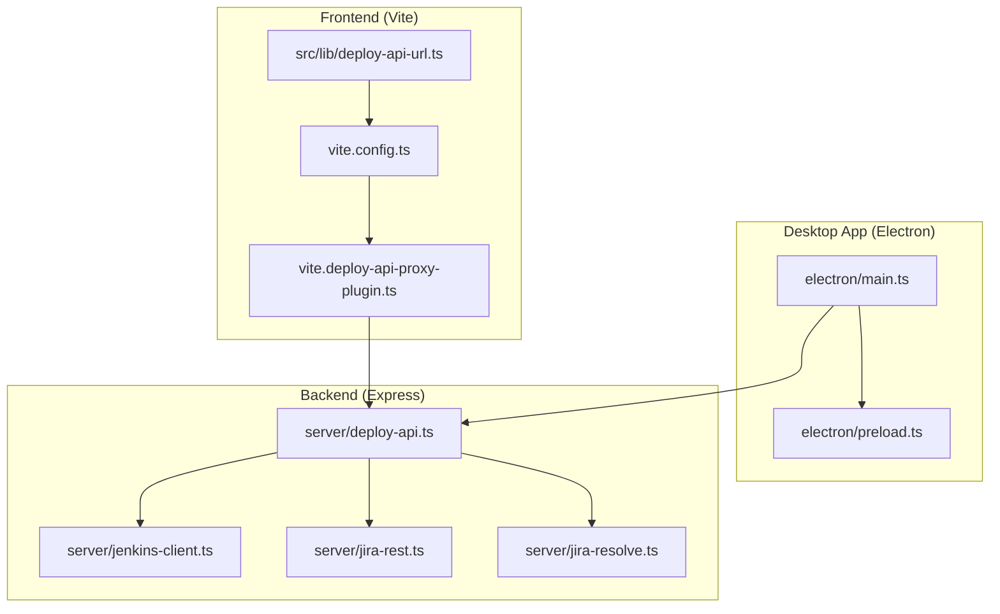
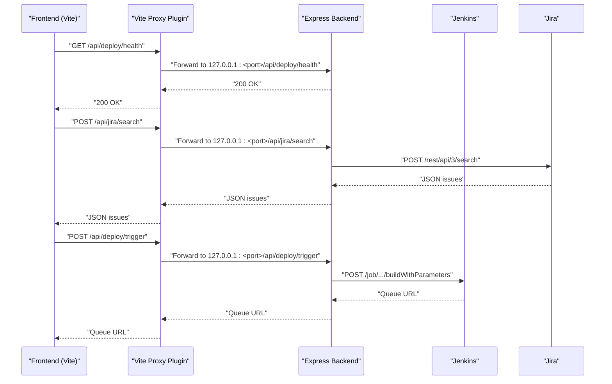
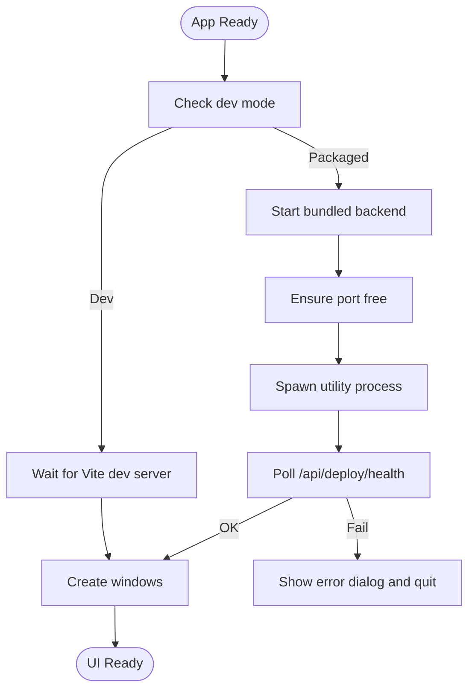
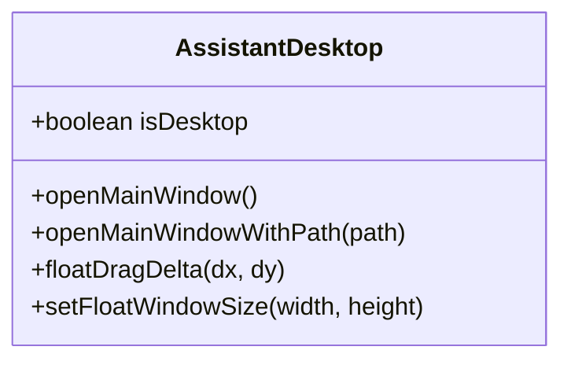
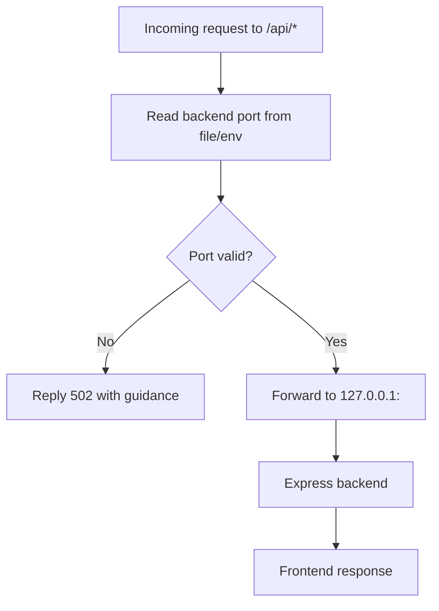
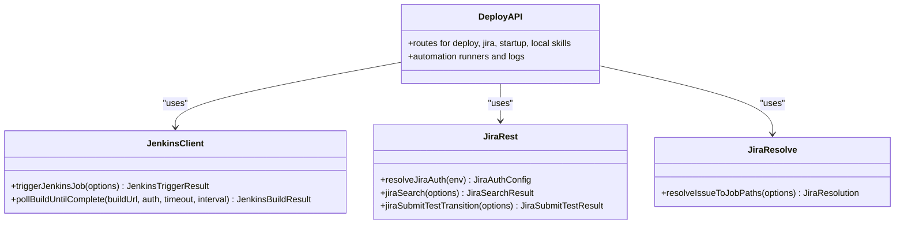
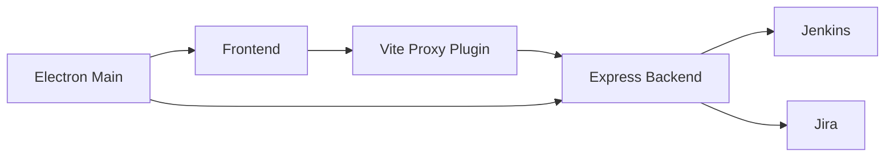

# Troubleshooting and FAQ

<cite>
**Referenced Files in This Document**
- [package.json](file://package.json)
- [README.md](file://README.md)
- [electron/main.ts](file://electron/main.ts)
- [electron/preload.ts](file://electron/preload.ts)
- [vite.config.ts](file://vite.config.ts)
- [scripts/build-electron.mjs](file://scripts/build-electron.mjs)
- [vite.deploy-api-proxy-plugin.ts](file://vite.deploy-api-proxy-plugin.ts)
- [server/deploy-api.ts](file://server/deploy-api.ts)
- [server/jenkins-client.ts](file://server/jenkins-client.ts)
- [server/jira-rest.ts](file://server/jira-rest.ts)
- [server/jira-resolve.ts](file://server/jira-resolve.ts)
- [src/lib/deploy-api-url.ts](file://src/lib/deploy-api-url.ts)
- [config/deploy-projects.json](file://config/deploy-projects.json)
- [test/server/jenkins-client.test.ts](file://test/server/jenkins-client.test.ts)
- [test/server/jira-rest.test.ts](file://test/server/jira-rest.test.ts)
</cite>

## Table of Contents
1. [Introduction](#introduction)
2. [Project Structure](#project-structure)
3. [Core Components](#core-components)
4. [Architecture Overview](#architecture-overview)
5. [Detailed Component Analysis](#detailed-component-analysis)
6. [Dependency Analysis](#dependency-analysis)
7. [Performance Considerations](#performance-considerations)
8. [Troubleshooting Guide](#troubleshooting-guide)
9. [Conclusion](#conclusion)
10. [Appendices](#appendices)

## Introduction
This document provides comprehensive troubleshooting guidance and frequently asked questions for the Work Helper application. It covers installation and build issues, runtime errors, debugging techniques for Electron main/renderer processes and IPC, API connectivity problems, Jenkins integration failures, Jira synchronization issues, performance optimization strategies, logging and monitoring approaches, platform-specific pitfalls, error handling patterns, diagnostic tools, and community/support resources.

## Project Structure
The application is a React + Vite web app packaged as an Electron desktop app. The backend Express server (deploy-api) handles Jenkins and Jira integrations and is embedded into the desktop app distribution. Development uses Vite’s dev server and a separate deploy-api server, with a dynamic proxy plugin to route /api/* requests to the backend.

**Diagram sources**
- [electron/main.ts:1-434](file://electron/main.ts#L1-L434)
- [electron/preload.ts:1-21](file://electron/preload.ts#L1-L21)
- [vite.config.ts:1-111](file://vite.config.ts#L1-L111)
- [vite.deploy-api-proxy-plugin.ts:1-166](file://vite.deploy-api-proxy-plugin.ts#L1-L166)
- [server/deploy-api.ts:1-800](file://server/deploy-api.ts#L1-L800)
- [server/jenkins-client.ts:1-191](file://server/jenkins-client.ts#L1-L191)
- [server/jira-rest.ts:1-483](file://server/jira-rest.ts#L1-L483)
- [server/jira-resolve.ts:1-130](file://server/jira-resolve.ts#L1-L130)
- [src/lib/deploy-api-url.ts:1-28](file://src/lib/deploy-api-url.ts#L1-L28)

**Section sources**
- [README.md:1-91](file://README.md#L1-L91)
- [package.json:1-99](file://package.json#L1-L99)

## Core Components
- Electron main process manages windows, lifecycle, and spawns the bundled backend. It ensures the backend port is free, waits for health checks, and surfaces meaningful errors to the user.
- Preload bridge exposes safe IPC APIs to the renderer for window control and floating dock interactions.
- Vite dev server proxies /api/* to the backend using a dynamic port file. PWA caching is tuned for development vs production.
- Backend Express routes handle Jenkins triggers, Jira searches/transitions, automation runs, and local model skills discovery.
- Tests validate Jenkins client behavior and Jira auth normalization.

**Section sources**
- [electron/main.ts:1-434](file://electron/main.ts#L1-L434)
- [electron/preload.ts:1-21](file://electron/preload.ts#L1-L21)
- [vite.config.ts:1-111](file://vite.config.ts#L1-L111)
- [vite.deploy-api-proxy-plugin.ts:1-166](file://vite.deploy-api-proxy-plugin.ts#L1-L166)
- [server/deploy-api.ts:1-800](file://server/deploy-api.ts#L1-L800)
- [test/server/jenkins-client.test.ts:1-162](file://test/server/jenkins-client.test.ts#L1-L162)
- [test/server/jira-rest.test.ts:1-30](file://test/server/jira-rest.test.ts#L1-L30)

## Architecture Overview
The desktop app embeds the backend and serves the frontend via Vite in development. In production, the backend is packaged inside the app and served locally. API calls from the frontend are proxied to the backend using a Vite plugin that reads the current backend port from a file.

**Diagram sources**
- [vite.deploy-api-proxy-plugin.ts:72-149](file://vite.deploy-api-proxy-plugin.ts#L72-L149)
- [server/deploy-api.ts:1-800](file://server/deploy-api.ts#L1-L800)
- [server/jenkins-client.ts:89-142](file://server/jenkins-client.ts#L89-L142)
- [server/jira-rest.ts:181-278](file://server/jira-rest.ts#L181-L278)

## Detailed Component Analysis

### Electron Main Process and Window Lifecycle
Key behaviors:
- Ensures backend port is free by killing conflicting processes and waiting.
- Waits for backend health endpoints with timeouts.
- Spawns the backend as a utility process with isolated environment variables.
- Exposes graceful dialogs on startup failure and on backend exit.
- Creates main and floating windows with secure web preferences.

**Diagram sources**
- [electron/main.ts:389-406](file://electron/main.ts#L389-L406)
- [electron/main.ts:180-257](file://electron/main.ts#L180-L257)
- [electron/main.ts:112-148](file://electron/main.ts#L112-L148)

**Section sources**
- [electron/main.ts:112-148](file://electron/main.ts#L112-L148)
- [electron/main.ts:180-257](file://electron/main.ts#L180-L257)
- [electron/main.ts:389-406](file://electron/main.ts#L389-L406)

### IPC Bridge (Preload)
The preload script exposes a typed bridge to the renderer:
- Open main window or navigate to a path.
- Control floating dock size and drag position.
- Uses contextBridge to safely expose APIs.

**Diagram sources**
- [electron/preload.ts:3-20](file://electron/preload.ts#L3-L20)

**Section sources**
- [electron/preload.ts:1-21](file://electron/preload.ts#L1-L21)

### Vite Proxy and API Base Resolution
- Dynamic proxy reads the backend port from a file and forwards /api/* prefixes.
- Frontend resolves API base from environment and supports absolute URLs.
- PWA caching is disabled for /api/ in development and tuned in production.

**Diagram sources**
- [vite.deploy-api-proxy-plugin.ts:43-55](file://vite.deploy-api-proxy-plugin.ts#L43-L55)
- [vite.deploy-api-proxy-plugin.ts:72-149](file://vite.deploy-api-proxy-plugin.ts#L72-L149)
- [src/lib/deploy-api-url.ts:6-27](file://src/lib/deploy-api-url.ts#L6-L27)

**Section sources**
- [vite.deploy-api-proxy-plugin.ts:1-166](file://vite.deploy-api-proxy-plugin.ts#L1-L166)
- [src/lib/deploy-api-url.ts:1-28](file://src/lib/deploy-api-url.ts#L1-L28)
- [vite.config.ts:21-78](file://vite.config.ts#L21-L78)

### Backend API Surface and Integrations
- Jenkins: builds with parameters, crumb handling, queue polling, and sanitized error messages.
- Jira: search, transitions, and component-to-job-path resolution with fallbacks.
- Automation runs, startup orchestration, and logging utilities.

**Diagram sources**
- [server/jenkins-client.ts:89-191](file://server/jenkins-client.ts#L89-L191)
- [server/jira-rest.ts:34-85](file://server/jira-rest.ts#L34-L85)
- [server/jira-resolve.ts:47-129](file://server/jira-resolve.ts#L47-L129)
- [server/deploy-api.ts:1-800](file://server/deploy-api.ts#L1-L800)

**Section sources**
- [server/jenkins-client.ts:1-191](file://server/jenkins-client.ts#L1-L191)
- [server/jira-rest.ts:1-483](file://server/jira-rest.ts#L1-L483)
- [server/jira-resolve.ts:1-130](file://server/jira-resolve.ts#L1-L130)
- [server/deploy-api.ts:1-800](file://server/deploy-api.ts#L1-L800)

## Dependency Analysis
- Electron main depends on:
  - Backend port availability and health.
  - Vite dev server readiness in dev mode.
  - Proper preload wiring for IPC.
- Frontend depends on:
  - Vite proxy plugin for /api/* routing.
  - Environment-driven base URL resolution.
- Backend depends on:
  - Jenkins and Jira credentials and endpoints.
  - Project configuration for job mapping.

**Diagram sources**
- [electron/main.ts:170-257](file://electron/main.ts#L170-L257)
- [vite.deploy-api-proxy-plugin.ts:72-149](file://vite.deploy-api-proxy-plugin.ts#L72-L149)
- [server/deploy-api.ts:1-800](file://server/deploy-api.ts#L1-L800)

**Section sources**
- [electron/main.ts:170-257](file://electron/main.ts#L170-L257)
- [vite.deploy-api-proxy-plugin.ts:1-166](file://vite.deploy-api-proxy-plugin.ts#L1-L166)
- [server/deploy-api.ts:1-800](file://server/deploy-api.ts#L1-L800)

## Performance Considerations
- Startup time
  - Desktop packaging removes large bundled fonts by default to speed up asar/zip creation; keep if needed via an environment variable.
  - Prefer prebuilt binaries and avoid unnecessary re-bundling.
- Memory usage
  - Limit concurrent automation runs and child processes; terminate gracefully on stop.
  - Avoid retaining large buffers in logs; truncate and emit periodically.
- CPU utilization
  - Tune polling intervals for Jenkins builds and reduce verbose logging in production.
  - Minimize heavy regex operations and repeated parsing in hot paths.
- Build performance
  - Use esbuild with minimal sourcemaps for Electron bundles.
  - Disable PWA in Electron builds to reduce bundle size and improve startup.

**Section sources**
- [scripts/build-electron.mjs:57-73](file://scripts/build-electron.mjs#L57-L73)
- [vite.config.ts:21-78](file://vite.config.ts#L21-L78)
- [server/deploy-api.ts:160-189](file://server/deploy-api.ts#L160-L189)

## Troubleshooting Guide

### Installation and Setup
Common issues and resolutions:
- Node.js version mismatch
  - Use Node.js 22 as recommended; scripts switch via nvm automatically in dev.
- OS-specific scripts
  - Current scripts assume macOS (bash + nvm). On Windows/Linux, adjust shell paths or run equivalent commands manually.
- Missing environment variables
  - Ensure .env contains required keys for Gemini, Jenkins, and optional Jira. For desktop builds, place .env in the app’s user data directory or set the dedicated path variable.

**Section sources**
- [README.md:5-9](file://README.md#L5-L9)
- [README.md:18-23](file://README.md#L18-L23)
- [server/deploy-api.ts:65-73](file://server/deploy-api.ts#L65-L73)

### Build Failures
- Desktop build fails to find Vite dist
  - Ensure you ran the client build with the Electron flag before building the desktop app.
- Large font removal unexpectedly reduces app size
  - If you need the bundled font, set the environment variable to keep it; otherwise, it is removed by default to speed packaging.
- esbuild errors or missing externals
  - Verify electron is excluded from bundling and targets are aligned with the runtime.

**Section sources**
- [scripts/build-electron.mjs:49-55](file://scripts/build-electron.mjs#L49-L55)
- [scripts/build-electron.mjs:57-73](file://scripts/build-electron.mjs#L57-L73)
- [package.json:20-21](file://package.json#L20-L21)

### Runtime Errors

#### Electron App Will Not Start
Symptoms:
- Immediate crash or error dialog on startup.
- Backend exits early with diagnostics.

Resolutions:
- Check backend exit diagnostics (last 1200 chars appended to the error).
- Kill lingering processes on the backend port and rerun.
- Confirm dev mode readiness (Vite server) or backend health check.

**Section sources**
- [electron/main.ts:231-247](file://electron/main.ts#L231-L247)
- [electron/main.ts:126-148](file://electron/main.ts#L126-L148)
- [electron/main.ts:396-401](file://electron/main.ts#L396-L401)

#### IPC Communication Issues
Symptoms:
- Floating dock cannot resize or drag.
- Main window does not open from tray menu.

Resolutions:
- Verify preload bridge exposes the expected methods.
- Ensure IPC handlers receive valid payloads and types.

**Section sources**
- [electron/preload.ts:3-20](file://electron/preload.ts#L3-L20)
- [electron/main.ts:47-94](file://electron/main.ts#L47-L94)

#### API Connectivity Problems
Symptoms:
- Frontend receives HTML instead of JSON for /api/*.
- Proxy returns 502 with guidance.

Resolutions:
- Confirm the backend is running on the expected port and the port file exists.
- If port is wrong or busy, update the environment variable or end the conflicting process.
- For absolute base URLs, ensure the origin matches the running backend.

**Section sources**
- [vite.deploy-api-proxy-plugin.ts:92-98](file://vite.deploy-api-proxy-plugin.ts#L92-L98)
- [vite.deploy-api-proxy-plugin.ts:120-129](file://vite.deploy-api-proxy-plugin.ts#L120-L129)
- [src/lib/deploy-api-url.ts:6-27](file://src/lib/deploy-api-url.ts#L6-L27)

#### Jenkins Integration Failures
Symptoms:
- Jenkins returns HTML login or permission page.
- Queue polling does not resolve to a build.

Resolutions:
- Verify Jenkins credentials and CSRF crumb issuance.
- Ensure job path segments are correct and accessible.
- If polling times out, increase timeout or check Jenkins queue.

**Section sources**
- [server/jenkins-client.ts:71-87](file://server/jenkins-client.ts#L71-L87)
- [server/jenkins-client.ts:125-141](file://server/jenkins-client.ts#L125-L141)
- [server/jenkins-client.ts:148-190](file://server/jenkins-client.ts#L148-L190)
- [config/deploy-projects.json:1-78](file://config/deploy-projects.json#L1-L78)

#### Jira Synchronization Issues
Symptoms:
- Search returns HTML unauthorized page.
- Transitions fail with invalid status or missing transitions.

Resolutions:
- Normalize credentials and site URL; remove stray quotes/spaces.
- For Jira Server vs Cloud differences, adjust the REST path prefix if needed.
- Provide explicit transition ID or configure acceptable transition names.

**Section sources**
- [server/jira-rest.ts:34-85](file://server/jira-rest.ts#L34-L85)
- [server/jira-rest.ts:106-148](file://server/jira-rest.ts#L106-L148)
- [server/jira-rest.ts:223-254](file://server/jira-rest.ts#L223-L254)
- [server/jira-resolve.ts:47-129](file://server/jira-resolve.ts#L47-L129)

### Debugging Techniques

#### Main Process Debugging
- Enable devtools for main window in dev mode.
- Use error dialogs and backend exit diagnostics to capture failure context.

**Section sources**
- [electron/main.ts:287-292](file://electron/main.ts#L287-L292)
- [electron/main.ts:231-247](file://electron/main.ts#L231-L247)

#### Renderer Process Debugging
- Open DevTools in the main window or floating window for interactive inspection.
- Inspect network tab to confirm /api/* requests are proxied to the correct backend port.

**Section sources**
- [electron/main.ts:287-292](file://electron/main.ts#L287-L292)
- [vite.config.ts:103-108](file://vite.config.ts#L103-L108)

#### IPC Communication Debugging
- Log IPC payloads in main and renderer to verify shapes and types.
- Add temporary handlers to echo back payloads for testing.

**Section sources**
- [electron/main.ts:47-94](file://electron/main.ts#L47-L94)
- [electron/preload.ts:3-20](file://electron/preload.ts#L3-L20)

#### API Connectivity Debugging
- Temporarily switch API base to an absolute URL pointing to the running backend.
- Check Vite proxy middleware logs and port file contents.

**Section sources**
- [src/lib/deploy-api-url.ts:6-27](file://src/lib/deploy-api-url.ts#L6-L27)
- [vite.deploy-api-proxy-plugin.ts:43-55](file://vite.deploy-api-proxy-plugin.ts#L43-L55)

### Platform-Specific Problems

- macOS
  - Floating window visibility and always-on-top behavior differ; ensure correct flags are applied.
  - Shell integration uses bash -lc to load login shells; ensure PATH is correct.

- Windows
  - Scripts are tailored for bash; adapt commands or run PowerShell equivalents.
  - Ensure Windows-compatible paths and executables for automation tasks.

- Linux
  - Similar to Windows; ensure shell compatibility and correct executable paths.

**Section sources**
- [electron/main.ts:376-382](file://electron/main.ts#L376-L382)
- [server/deploy-api.ts:358-364](file://server/deploy-api.ts#L358-L364)

### Error Handling Patterns and Robust Recovery
- Centralized error surfacing
  - Backend returns sanitized error messages and JSON bodies for frontend consumption.
- Graceful degradation
  - Fallback job path resolution when Jira component mapping is unavailable.
- Idempotent automation runs
  - Track active runs and statuses; avoid overlapping executions.
- Logging and truncation
  - Strip ANSI and collapse dense progress dashboards; emit periodic summaries.

**Section sources**
- [server/jira-rest.ts:106-148](file://server/jira-rest.ts#L106-L148)
- [server/jira-resolve.ts:58-65](file://server/jira-resolve.ts#L58-L65)
- [server/deploy-api.ts:598-621](file://server/deploy-api.ts#L598-L621)
- [server/deploy-api.ts:191-218](file://server/deploy-api.ts#L191-L218)

### Logging and Monitoring Approaches
- Backend logs
  - Use structured logs for automation runs and startup sequences.
  - Emit heartbeat messages for long-running dev processes.
- Frontend logs
  - Capture and forward relevant logs to backend for centralized storage.
- Diagnostics
  - Collect last 1200 characters of backend stdout/stderr on startup failure.

**Section sources**
- [server/deploy-api.ts:145-151](file://server/deploy-api.ts#L145-L151)
- [electron/main.ts:231-247](file://electron/main.ts#L231-L247)

### Diagnostic Tools and Commands
- Check backend port occupancy and kill conflicts
  - Use system tools to find and terminate processes bound to the backend port.
- Verify proxy port file
  - Ensure the port file exists and contains a valid numeric port.
- Validate environment variables
  - Confirm Jenkins and Jira credentials and site URLs are normalized.

**Section sources**
- [electron/main.ts:126-148](file://electron/main.ts#L126-L148)
- [vite.deploy-api-proxy-plugin.ts:43-55](file://vite.deploy-api-proxy-plugin.ts#L43-L55)
- [server/jira-rest.ts:12-32](file://server/jira-rest.ts#L12-L32)

### Community Resources, Support Channels, and Escalation
- For Jenkins/Jira integration questions, consult the project’s documentation and environment variable references.
- For Electron/Vite issues, review the scripts and configuration files for platform-specific adjustments.
- When encountering unhandled edge cases, collect backend logs and reproduction steps, then escalate internally.

**Section sources**
- [README.md:89-91](file://README.md#L89-L91)
- [package.json:9-30](file://package.json#L9-L30)

## Conclusion
This guide consolidates actionable troubleshooting steps for installation, build, runtime, API connectivity, Jenkins, and Jira issues. By leveraging the provided debugging techniques, platform-specific guidance, error handling patterns, and diagnostic commands, most issues can be resolved quickly. For persistent problems, collect backend logs and escalate with precise reproduction steps.

## Appendices

### Quick Reference: Common Commands and Paths
- Desktop dev: starts Vite, deploy-api, and Electron concurrently.
- Desktop prod build: builds client and Electron, then packages with electron-builder.
- Backend port file: used by the proxy to determine the backend port.
- Project configuration: defines Jenkins job paths and defaults.

**Section sources**
- [package.json:15-28](file://package.json#L15-L28)
- [scripts/build-electron.mjs:1-76](file://scripts/build-electron.mjs#L1-L76)
- [vite.deploy-api-proxy-plugin.ts:43-55](file://vite.deploy-api-proxy-plugin.ts#L43-L55)
- [config/deploy-projects.json:1-78](file://config/deploy-projects.json#L1-L78)